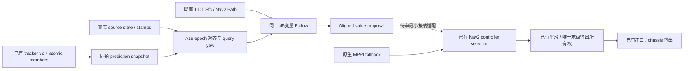

# A19：最小转动源输入适配

阶段：Research。基线：A18@3218fb6c 的受限未来 wz=0 值结果。

假设：将 A18 的 60 变量受限模型收缩为原有 45 变量 Follow，并保留原始转动测量、
源时间与 epoch 派生姿态，可以保留同样的动态消费响应；自由角速度决策不是本阶段的必要实现。

最小实验：重用 A16 的 S1/S2 200 个动态窗口和 A18 合成 stationary hold→clear，
与 A18 受限值结果比较有效率、控制/状态、dynamic cost、free-s 与时间；
原四个固定朝向 probe 检查共享内核没有改变基线。
额外检查上一应用角速度非零会返回不可用，并保留 raw source 与独立输入身份。

实现范围：同一 Follow/QP/OSQP 内核的显式 AlignedFollowAdapter，源状态不重写。
source→epoch 积分复用原 A09 的纯函数；future command wz 固定为零，静态支持和动态场
在派生朝向查询。固定朝向入口保留，失败的自由角速度入口从当前库移除，可由历史提交复现。
没有改变 tracker、public v2、CV、Sfc、目标权重、15/40/75ms、原 controller 或唯一输出 owner。

Go：45 变量适配保留 A18 的有效率和响应，差异落在原数值精度范围内，且未弱化源证据或命令条件；
只推进后续有限 Research。
Modify：响应丢失、差异明显或命令条件依赖虚构证据；针对决定结果的失败继续检查。
Stop：最小适配没有消费价值，或必须重建导航链才有收益。

本阶段不运行新的 Gazebo、ROS/Nav2 接线或实际输出。既有真实命令仅作为只读接纳条件的观测代理，
不得成为虚拟 R4 seed，也不把 cmd receipt 冒充实际 owner 的 send/last-applied 证据。

## 实现与复用边界

`AlignedFollowAdapter` 是现有可选值库的显式输入/结果包装；它与原固定朝向
`FollowSolver` 调用同一 45 变量、168 约束装配与 OSQP 求解实现，没有独立 tracker、
predictor、frontend、worker、controller 或 publisher。删除 A18 当前库中自由 wz 决策、
yaw derivative 与旋转连续包络分支，历史失败实现保留在 `3218fb6c`。

原 `FollowInput.state` 与 body/source receipt 的身份不被重写。先验证全部原时间/帧/几何条件，
再用原 A09 `integrate_held_body_twist`（每段≤50ms）从 pose source 推至 prediction epoch。
模型 position/yaw 与 raw position/yaw 区分，测量和 source stamps 一并进入新的
`r4_follow_aligned_input/v1` 身份；改变测量或其 stamp 会改变身份。
`AlignedFollowResult.source_state` 保留原值，31 个未来 stage 持有派生 yaw，proposal wz 恒为零。
这是 held-measured-twist 模型估计，不是无误差状态重定位或真实未来转动预测。

动态查询复用同一 `TemporalSoftField`，只传入派生 yaw 的原 footprint 支持。
静态查询复用原 `PreparedCorridor::local_free_bounds`，在同一认证 Sfc 矩形内按派生支持侵蚀。
未来 yaw 恒定，因此直线 held-command 段使用原 31 stage 静态界与 reserve 即可；
删除自由转动包络不代表放松静态边界，也不能覆盖实际底盘残余转动。
warm identity 去掉每拍 query yaw、保留真实 geometry/policy/producer/generation，
每拍映射、支持、动态场和输入身份仍重新计算。

新包装不能隐式传给原 host，旧 fingerprint 对非零 measured wz 的拒绝仍保留。
若真实 last-applied wz 非零，新入口在求解前返回 unavailable，保留原非零证据。
A09–A12 没有修改或接纳新入口。

## 有限结果

同一 A16 source 记录、同一虚拟 preceding R4 seed 政策，与 A18 受限未来 wz=0 结果逐行对照。

| 指标 | S1 1..3s | S2 1..9s |
| --- | ---: | ---: |
| 有效值样本 | 40/40 | 160/160 |
| 非零 dynamic cost | 31 | 127 |
| warm 使用 | 37 | 152 |
| solver median / max | 1.283 / 1.998ms | 1.439 / 2.840ms |
| acquire→finish max | 5.149ms | 4.107ms |
| 对 A18 首命令最大绝对差 | 1.06e-15 | 5.74e-15 |
| 对 A18 solved cost 最大绝对差 | 4.17e-16 | 6.11e-15 |
| 对 A18 progress endpoint 最大差 | 1.12e-15 | 1.67e-15 |

有效性、warm、非零 cost 数量和预测支持重叠结果均保留；yaw 差异为 0。
nominal cost 最大差 6.24e-14。30 个 running stage 查询没有预测 observed-support 重叠，
不是物理净空或真实 collision 判断。与 A18 同口径的 soft cost 上升样本仍为 7/24，
局部 QP 会权衡多个目标，不承诺单独动态项每次下降。
单次离线运行观察到较小的计算耗时；不是配对性能基准、最坏实时保证或 runtime lease PASS。

stationary hold→clear 60/60 有效，对 A18 首命令最大差 1.45e-14，
solved cost 最大差 7.24e-14；hold/clear 的虚拟世界前向命令中位数
-0.00544 / 0.29079m/s，最后 proposal 的 free-s endpoint
1.213857 → 1.532396。源 pose 固定，虚拟历史仅取上次 R4 proposal，
没有 plant 积分或实际应用命令。前 6 个 hold proposal 的预测支持重叠原样保留。
原四个 fixed probe 的全部 controls/stages/cost 差异为 0；zero-age/zero-measured-wz
切片与旧入口差异为 0，两个输入身份仍不同。
63 个有效合成值和 1 个非零 applied 拒绝均保留 source state；后者 solver `not_run`。
30ms、measured wz=0.6rad/s 的派生 yaw 是 0.368rad，与原 held-twist 位置积分一致。

首次 probe 构建因共享 replay 的条件编译换行失败，修正后完成上述一次有限实验。
日志保留于 ignored build 输出，没有改求解状态接纳、迭代数或预算来获得有效结果。

## 实际命令条件与判决

只读 A16 `actual_output` 的原 `/cmd_vel` receipt，在每个上述 cycle epoch
选择此前最近 receipt；这仅是命令观测代理，没有 owner send/last-applied grant 证据。

| 接纳条件观测代理 | S1 | S2 |
| --- | ---: | ---: |
| 最近 receipt ≤100ms 且 wz 非零 | 40/40 | 160/160 |
| 最近 receipt ≤100ms 且 wz 精确为零 | 0/40 | 0/160 |
| receipt age median / max | 14 / 15ms | 32 / 32ms |
| abs(wz) median / max | 0.3344 / 0.7479rad/s | 0.2255 / 0.7238rad/s |

因此所有这些窗口的命令观测代理均不符合当前受限模型的零上一角速度条件。
如果它代表真实 owner 的上一应用命令，则这些输入必须 unavailable。
这没有建立真实接纳率，但明确排除了把离线 200/200 解释成可直接切换的依据。
未将实际 MPPI/receipt 当作虚拟 R4 seed，也未把虚拟零写回真实状态。

**Go：最小 45 变量消费适配的 Research 假设成立。Modify：实际接纳/转动过渡仍待研究；
Integration 与 closed-loop 仍 NOT_ELIGIBLE。** 本轮停在此判决处，不启动更多场景或生产接线。
下一步优先只读审阅已有 controller/owner 的真实 last-sent、平滑/限速和角命令过渡条件，
明确何时能进入受限消费，以及 terminal yaw/实际转动时延是否要求最小模型扩展。
不为了制造零历史加入第二个输出 owner、不伪造实际零，也不自动重启 60 变量自由角速度研究。
早期 overlap 的行为问题仍需单独最小实验，本轮数值等价并没有改善它。

## 拟议接线（当前未接线）

实际 source/apply、current occupancy、grant/lease 的检查应复用已有 owner/adapters 的责任，
不会由 A19 绕过。图中虚线不是已实现接口；其接纳条件是当前阻碍。

[有限证据与复现](../../experiments/r4_aligned_follow/README.md)，
[逐样本结果](../../experiments/r4_aligned_follow/evidence/summary.json)，
[A18 历史基线与限制](r4_rotation_value_experiment.md)。
