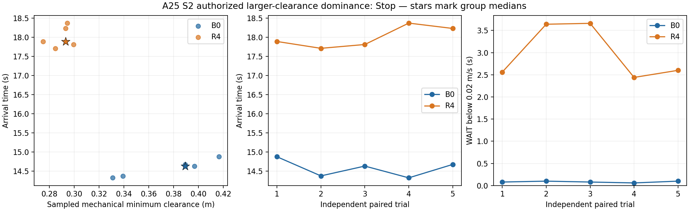

# A25 S2 安全—效率：校准及授权支配验证

Research / Minimum Decisive Experiment。唯一问题：当 STVL+native MPPI 与 A24 R4 的动态最小净空中位相近时，谁更高效？R4及运行二进制完整保持 [A24](r4_matched_closed_loop_comparison.md)，不调R4、不新增solver/cost/prediction/owner/fallback/ROS生产接口，不改main，不push。

**最终判决：Stop 当前 A24 R4 配置的生产化。** 用户授权的更大净空点在5对新S2样本中得到验证：baseline净空中位.38927m、到达14.628s，R4为.29294m、17.889s；baseline耗时少18.23%，5/5配对更快且净空更大，零回退。两组均5/5成功、零contact。停止ROS/Nav2生产化接线，不补样本、不调R4。

**原严格匹配校准仍为Modify，目标未达。** 20次baseline校准均成功/零contact；最后固定候选5次中位仍为.26548m，严格方案未写freeze或启动正式R4对照。最终Stop来自后续显式授权的独立支配验证，不把原校准回写为达标，也不把有限搜索失败解释为native MPPI无法达到目标。

协议在任何本轮trial之前提交。复用A24地图、goal、S2物理轨迹/速度、32边形footprint、原输出链和独立机械投影真值；baseline速度上限仍为A24的.32，R4原native/world limits、cruise/free-s及所有配置保持。唯一baseline可改项为既有 `local_costmap.inflation_layer.inflation_radius/cost_scaling_factor`，不改critics权重或动态预测模型。

校准目标为baseline S2逐次动态最小净空的**中位数进入[.28,.32]m**。固定inflation radius=.80m，首候选cost_scaling_factor=3（A24为radius=.50、factor=6）。factor只在[.75,6]内做至多4个候选的有界一维搜索，每候选3次baseline S2。低于.28则取更小factor，高于.32则更大；更新上下界后取中点，不假设响应严格单调。首次进入目标且3次均成功/零contact即冻结；全部校准结果保留。任何contact/controller failure先保存分类并停止自动校准，不丢弃失败；启动失败单列、分类后才允许补样本。若4候选仍未达到目标，输出Modify，不继续参数搜索。

冻结后只跑S2，每组先5次，交替先后，另设独立finite编号。不得用finite动态结果修改baseline或R4。比较成功率/contact、逐次最小净空及中位/最坏值、到达时间、WAIT/最长停滞、world-forward反向切换及机械回退；复用A24定义和分析器。

预设判决：正式两组净空中位均在[.28,.32]m、成功/contact不劣时，到达中位快≥10%且至少4/5配对同向视为明显效率差异。R4更快，或在没有明显效率损失时显著更稳定，支持Go、考虑Integration；baseline更快且R4无稳定性优势则Stop当前R4配置的生产化。稳定性信号以至少2/5次反向/≥5cm回退或≥1s额外最长停滞的重复差异判断，不把单次微小噪声当优势。最坏净空若相差>.05m，应保留额外安全代价并判Modify，不能仅按中位宣称Pareto优越。

若5次未能判决，仅在有限样本的净空中位处于[.26,.34]m且与目标带相交的实测范围仍有疑问，或时间差<10%/配对方向不一致时，允许固定参数各补5次至10次。10次明显效率条件为快≥10%、至少8/10配对同向；稳定性要求按比例对应。其他无结论情况直接Modify，不增加无助于判决的工程或实验。

原A24无显式MPPI/Gazebo随机种子，故核对实际障碍轨迹与起点，不宣称噪声逐样本相同。校准只服务于目标净空，效率结果不得作为候选选择依据。R4保留native angular委托，两组内部native速度上限差异仍如A24如实记录。整个新证据限约100MiB，无bag/core；现有失败证据/安装依赖不清理。

## 实施与结果

入口 [pareto.py](../../experiments/r4_gazebo_comparison/pareto.py)：`prepare`、`calibrate`、`batch`；证据位于 `build/r4_pareto_comparison_20261006`。R4参数和共享assets复制自A24，复用原插件二进制；只增加host实验编排。校准和finite阶段分开。初始协议为 `5bb148be`。

### 冻结前的一次校准协议修订

初始有界校准按4候选上限结束，factor=3/4.5/5.25/5.625的净空中位分别为.54951/.52184/.55234/.53772m；12次全部成功/零contact，但目标未达。最初选择的.80m范围过大，调衰减的影响不足；不能拿这些过度保守样本的效率与.30m R4对比。原方案在其上限内失败，不隐藏、不把未达标视为冻结。

为完成已授权的净空校准，**在任何冻结或finite trial之前**记录一次有限修订：衰减还原A24的6，新增最多2个radius候选，总计不超过6候选/18次baseline校准。首先radius=.60m；若中位低于.28，最后一个候选为.65，若高于.32则为.55。这是直接安全距离旋钮的调整，不改效率目标、目标带、判决、速度/footprint或R4。每候选仍3次，首达标立即冻结，不成功则Modify并终止校准；不反复修订以求出满意结果。修订在新增trial前本地提交；`protocol.json`保留初始方案，另存`protocol_amendment.json`，两者均归档。

半径候选.60/.55（factor均为6）的3次中位为.36199/.26548m，仍不在目标带；.55的范围为.22752–.28515m，已与目标带相交。按照用户“Modify只增加能改变判决的信息”的授权，仅对此最接近的**固定候选**补2次采样，不增加参数候选或调参；全部5次合并取中位，不能择优丢弃原结果。补样本前提交此记录，另存`sampling_amendment.json`与补样本前的原校准表。若5次仍未达标，结束校准并判Modify，不用非等净空数据强行Go/Stop。参数候选仍最多6个；一次信息补充后总校准样本最多20个。这是采样数的显式修订，初始及半径修订的18次上限记录不被覆盖。

## 校准结果与停止点

| 候选 | local radius m | 衰减factor | 样本 | 成功/contact | 最小净空中位m | 最坏净空m | 到达中位s | WAIT中位s | 有反向切换的次数 | 最大回退m |
| --- | --- | --- | --- | --- | --- | --- | --- | --- | --- | --- |
| 1 | .80 | 3 | 3 | 3/3，0 | .54951 | .53243 | 18.262 | .08 | 3/3 | .14586 |
| 2 | .80 | 4.5 | 3 | 3/3，0 | .52184 | .52112 | 18.018 | .08 | 3/3 | .14596 |
| 3 | .80 | 5.25 | 3 | 3/3，0 | .55234 | .49880 | 17.177 | .08 | 0/3 | .00576 |
| 4 | .80 | 5.625 | 3 | 3/3，0 | .53772 | .49031 | 17.312 | .08 | 0/3 | .00033 |
| 5 | .60 | 6 | 3 | 3/3，0 | .36199 | .36160 | 14.426 | .06 | 0/3 | 0 |
| 6（含固定补样本） | .55 | 6 | 5 | 5/5，0 | .26548 | .22752 | 13.862 | .06 | 0/5 | 0 |

候选6的5个最小净空为.26548/.22752/.28515/.25708/.32902m；新增2次没有改变其中位。这里只说明本轮所测候选未形成目标点，不推断中间设置无解、半径严格单调或只有网格离散性这一原因。R4 A24参数文件逐字节相同；20份实际trial参数逐项检查仅发生允许的local inflation和私有日志/mode变化。

本节到达/WAIT/回退为**校准描述指标**，不用于按效率选择参数，也不能替代冻结后的独立验证。候选5的.362m/14.426s/零回退相对历史A24 R4 .300m/17.922s是值得验证的Pareto支配线索；但不满足原[.28,.32]匹配带，校准阶段没有新R4配对，故该阶段不据此给正式Stop。放宽匹配带所需的用户授权及后续新样本另记于下节。

20次的success/contact、真值、控制、预测、WAIT/停滞/振荡记录完整保留，约56MiB；紧凑汇总/参数/协议修订见[证据目录](../../experiments/r4_gazebo_comparison/evidence_pareto/)。15/20实例结束后的历史Nav2 cleanup exit−11保留，运行中没有controller failure；未为此补生产工程。main、A22/R4本体与原无关dirty不改，不push。

## 用户授权后的更大净空支配验证

校准结果先独立提交；用户对“是否允许固定.60m这一更大净空点，做5对新样本”明确回复：**“允许验证更大净空的支配点”**。这是显式放宽[.28,.32]匹配带，不回写原校准为达标。

baseline固定既有候选5：local inflation radius=.60m、factor=6，其他全部A24设置不变；R4完整保持A24。不再校准，正式S2各5次、新鲜独立实例、交替先后。新判据在任何正式trial前提交：baseline净空中位≥R4，最坏净空不低于R4超过.05m；两组成功/零contact，baseline到达中位快≥10%且≥4/5配对同向；baseline没有更多反向/≥5cm回退实例或重复≥1s额外最长停滞，则Stop当前R4配置的生产化。这比单纯等净空对照更强。不满足支配则Modify，不凭更低净空下的R4速度去判Go。只有样本不确定性会改变判决才固定参数补至10次。

`protocol_dominance_amendment.json`单列授权和判据；`freeze.json`明确标注`authorized_dominance`。原target、协议修订、20次校准与原Modify均保留。正式trial之前的协议提交为`2ccb4573`。

## 冻结后的独立 S2 结果

2026-10-06，共10次新实例，编号101–105；奇数先baseline，偶数先R4。没有启动失败、运行中controller failure、contact或补跑替换，没有根据新结果改参数。

| 指标 | STVL + native MPPI baseline | A24 R4 |
| --- | --- | --- |
| 成功 / contact | 5/5 / 0 | 5/5 / 0 |
| 逐次最小动态净空，中位 / 最坏 m | .38927 / .33082 | .29294 / .27490 |
| 到达时间，中位 / 范围 s | 14.628 / 14.320–14.872 | 17.889 / 17.710–18.370 |
| WAIT累计，中位 / 范围 s | .08 / .06–.10 | 2.60 / 2.44–3.66 |
| 单次最长停滞，中位 / 最大 s | .08 / .10 | 2.10 / 3.58 |
| 有至少2次world-forward反向切换的trial | 0/5 | 3/5 |
| 物理最大回退，跨trial最大 m | 0 | .04062 |
| 实际clear后恢复，中位 / 最大 s | 0 / 0 | 0 / 0 |

WAIT沿用A24：实测XY速度<.02m/s；包含起步短暂停顿。回退由机械真值沿goal方向的最大历史倒退计算，不把正反切换次数等同于大距离回退。实际clear为障碍完整机械投影离开共享圆支持带；两组均在clear时已经前进，所以0s表示当时无需恢复，不能据此说R4提前响应或WAIT没有成本。

| 配对 | baseline / R4 净空 m | baseline / R4 到达 s | baseline / R4 WAIT s |
| --- | --- | --- | --- |
| 101 | .41634 / .27490 | 14.872 / 17.889 | .08 / 2.56 |
| 102 | .33928 / .28478 | 14.371 / 17.710 | .10 / 3.64 |
| 103 | .39682 / .29952 | 14.628 / 17.810 | .08 / 3.66 |
| 104 | .33082 / .29445 | 14.320 / 18.370 | .06 / 2.44 |
| 105 | .38927 / .29294 | 14.671 / 18.230 | .10 / 2.60 |

### 条件核查与消费运行情况

- baseline相对A24的实际配置差异仅为local inflation radius `.50→.60m`，factor仍为6；速度上限.32及critics不变。R4全部A24参数相同，A22算法和A24 runtime harness无代码变化；共用原插件安装，不重编译solver。
- 地图、S2模型/轨迹、bridge与感知profile均沿用A24。5对起点位置差0；按goal接受时刻对齐实际障碍轨迹，在0.1–8.9s的89个位置和速度采样中，跨配对最大位置差.000676m，最大速度差.002753m/s。MPPI/Gazebo随机噪声没有逐样本seed控制，不宣称噪声一致。
- 10份末端endpoint观察均为原`chassis_interface_stub`一个publisher；contact观察器每次均有一个publisher。独立机械真值50Hz、最大采样间隔20ms；真值不反馈给控制器。净空为sampled机械投影距离，真实contact另列。
- R4全部1798/1798消费有效；合并1798次solver P95为1.456ms、最大2.697ms，消费调用P95为2.478ms、最大7.774ms。native angular委托加R4消费的调用P95为33.438ms、最大38.840ms；baseline native调用P95为31.832ms、最大41.646ms。这些为调用墙钟指标，不能替代完整调度延迟。两组末端实测packet间隔中位均50ms，各trial P95不超过53.45ms；最大间隔baseline66ms、R4 62ms。没有solver失效解释此次效率差距。
- 7/10实例在到达后Nav2清理阶段出现既有exit−11（baseline4/5，R4 3/5），运行中没有controller failure。保留原日志，不计为任务中contact或删除失败信息，不为此恢复生产工程。

### 判决与停止边界

预登记的更强支配条件全部满足：baseline最小净空中位高9.63cm，最坏值也高5.59cm；到达中位比R4少3.261s（18.23%），5/5配对更快；baseline无反向/回退，R4有3/5重复反向，且5/5配对R4额外最长停滞均>1s。实际上本轮baseline最小净空的最坏值仍大于所有R4样本的最大值，时间区间也完全分离。

**Stop 当前 A24 R4 配置的生产化。** R4在这个S2条件下没有展示安全—效率Pareto优势；支持停止生产化接线，而不是继续建设owner、fallback、lease或完整Nav2接口。原严格匹配带未达仍为事实；`finite_target_band_pass=false`及原等净空最坏差异检查失败保留在audit中，最终判决使用授权后的有方向支配条件，不冒充等净空结果。

5对已满足预设Stop，不继续补至10对。结论限于A24不变配置、该开放地图S2、平面仿真输入及phase1机械模型；不是全部HWS-style prediction consumption或完整安全—效率前沿的否定，也不是新车/实车部署结论。未来只有新的核心假设和能改变判决的最小对照才重新启动Research，本轮到此结束。

必要协议、授权、freeze、schedule、逐次指标、公平性/参数核查和图保存在[紧凑证据目录](../../experiments/r4_gazebo_comparison/evidence_pareto/)。`summary.json/trials.csv`在那里保留校准停止点快照，新增`validation_summary.json/validation_trials.csv`含全部30次记录，阶段字段区分20次校准与10次正式trial。完整原始证据保留在`build/r4_pareto_comparison_20261006`，约85MiB；无新bag/core。main不变，原无关dirty保留，全部修改本地、不push。
