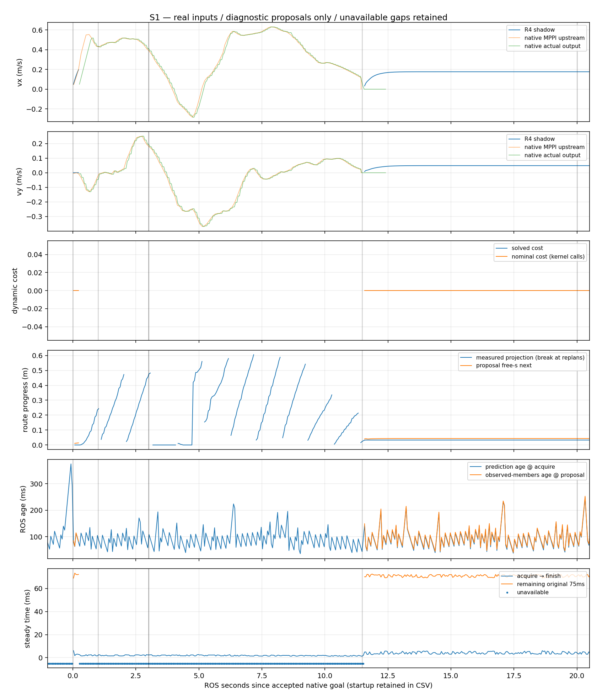

# A16：修正场景生成后的有限runtime shadow复核

2026-10-05，Asia/Shanghai；基线A15 `13b817757fde33315752d600029c1414971f49d8`，A08数学和A09–A12接口固定`e137635ee8c59888ffad853d1cd9ababb8df8ea6`。

**有限复核完成：修正后没有复现原post-zero持续横向漂移；fixed-yaw输入适用性仍FAILED，动态消费行为INCONCLUSIVE，closed-loop NOT_ELIGIBLE。** 本次三场各一次，不调参、不改数学，不继续production输出接线。近期重点转为审阅真实转动下prediction-consumption所需的最小建模范围。

## 运行前范围登记

A15确认原A13生成的DART摩擦参考frame不同，旧数据不代表原world。为完成诊断修复的实际验证，本阶段只将原S0/S1/S2各重跑一次：同goal=(4,0,0)、20ROS秒、原障碍时间表、原MPPI/轮几何/物理数值、15/40/75ms门限；唯一场景修正是保留原namespace prefix，caller已带A14虚拟seed/warm诊断修正。不是新场景或大规模配对，不以原A13作严格同随机种子的因果配对。

新增`run_corrected.sh`仅为原supervisor/launch/库提供独立输出目录与原只读安装前缀；类别是实验启动instrumentation。此前`run.sh`固定A13路径，不允许覆盖旧scene/binary/asset，所以需要此窄入口。不复制tracker/预测/Sfc/solver/controller/lifecycle，不创建第二output owner，不进入R4闭环。native MPPI仍唯一实际控制算法，R4无velocity publisher，A09–A12不激活。

输出仅`build/r4_corrected_runtime_shadow_20261005`，原A13/A14/A15 asset/bag/证据只读保持。默认不自动运行；显式执行build或S0/S1/S2，复用原fixture、`run_scene.py`、`shadow.launch.py`、`scenario.py`、`extract.py`、`report.py`。失败目录不删除/覆盖，若启动失败只解决同范围环境/launch问题并保留原因；不得调参救结果。

验收沿用A13：全部400拍及native navigation/动态窗口分别统计；WAIT只限有效proposal，input unavailable不能算WAIT。另记录修正后native goal后的odom位移/zero输出关系，用于核查原漂移是否复现。动态cost/timing/source-age/75ms只按原report方法，不改lease起点；无observed clearance值保持NA。

判决保持层级分离：场景静态修复PASS不等于停止/输入/动态shadow PASS；只有原动态行为条件满足才可limited closed-loop，本阶段不自动激活实际输出。若fixed-yaw关键动态窗口仍无足够proposal，停在真实转动建模需单独审阅的位置，不删gate、置零wz或扩展producer。

关闭：不执行独立runner/停止其owned子进程；删除此runner即可。无正式launch/输出链变化。

补充instrumentation：原`collect_evidence.py`增加可选evidence目录、stage和base commit参数，默认行为保持；A16显式指定独立目录，复用同一member/public-private解码与证据收集，不复制pipeline或覆盖A13。

## 结果

### 场景与实际停止

三场各400个goal-window控制拍，20ROS秒，启动失败0。native NavigateToPose均返回SUCCEEDED；实车硬件未连接。相同已安装SDFormat检查实际运行的三个asset，12/12轮摩擦方向属性保留`ignition:expressed_in`，没有`ns0`替代属性。原robot的expanded XML与物理数值保持；修复及后端读取来源见[A15](r4_native_stop_audit.md)。

全部goal-window的相邻acquire ROS stamp非递增次数均0；原report全记录中的54/55/55个非递增拍属于启动期，原始行保留，不以它们伪造动态窗口clock reset。

| 场景 | native完成用时（goal后s） | native goal至窗口末实测位移（m） | 永久末级zero recorder区间（ROS s） | zero+1s后Odometry样本数 | 该窗口实测平面速度/绝对wz最大值 |
|---|---:|---:|---:|---:|---:|
| S0 空场 | 11.158 | 0.001159 | 12.284–12.285 | 389 | 0 / 0 |
| S1 横穿 | 11.482 | 0.004686 | 12.737–12.738 | 372 | 0 / 0 |
| S2 停留后离开 | 11.162 | 0.005044 | 12.453–12.454 | 387 | 0 / 0 |

位移从native goal之后第一条source Odometry到20s窗口内最后一条计算，包含短时停止过渡，不能理解成zero后持续漂移。command decoder与caller references逐条值相同，既有stub输入输出序列一致，三场各多一条watchdog zero；source-time odom/TF/caller pose与twist不匹配数均0。Twist无send stamp，表中区间是recorder前后clock receipt，不是Gazebo delivery ACK或生产lease起点。

本次不再出现原S1约-0.222m/s的持续vy和2.44m goal后位移。它支持场景生成修正后的有限停止复核；MPPI随机样本未固定为相同配对，不将A13/A16差异宣称为严格配对因果证明、正式老车安全认证或完整碰撞验收。原A13/A14原始数据与A15来源保留。

### R4可用性：必须分开导航与到达后静止

| 场景 | 全记录拍数 / 有效 | goal窗口有效 / 400 | native导航期间有效 / 拍数 | native完成后有效 / 拍数 | 关键动态窗口有效 / 拍数 |
|---|---:|---:|---:|---:|---:|
| S0 | 524 / 228 | 182（45.50%） | 6 / 223（2.69%） | 176 / 177 | 不适用 |
| S1 | 527 / 220 | 174（43.50%） | 5 / 230（2.17%） | 169 / 170 | 0 / 40 |
| S2 | 527 / 224 | 179（44.75%） | 5 / 223（2.24%） | 174 / 177 | 0 / 160 |

goal窗口全部输入齐备并调用冻结Follow，拒绝218/226/221拍，原因全部为`fixed-yaw coherent control values`；它们未进入OSQP，不是QP求解失败。实际输入保持measured yaw/wz，没有置零、量化或放宽1e-6 gate。S1动态窗口为goal+1..3s，实测|wz|最小0.006592rad/s；S2为goal+1..9s，最小0.003974rad/s，全部不满足原固定yaw合同。三场source状态最大年龄50/52/45ms，TF在同source stamp与Odometry一致，支持真实运动与冻结模型不兼容的分类。

多数有效proposal出现在native完成并停止之后。图中R4长段空白是真实unavailable，之后恢复蓝线是静止状态重新兼容；不能以约44%的全窗口比例或goal后的向前虚拟proposal宣称导航/动态避障可用。虚拟rate seed仍只用前一R4 proposal，原生MPPI command只作reference，不作R4已施加command。

### 动态观测与行为指标

public/private共1050对（352/348/350），public wire与private内嵌值multiset完全相同，receipt sequence严格递增。S0 observed members为空；S1/S2分别348/350行，producer generation均0，track ID均1，没有新增tracker或预测重算。

按observation源时刻相对goal分窗，S1可见表面centroid y中位数从0..1s的-0.819m，到2..3s的+0.461m、9..20s的+0.824m，支持实际横穿观测。S2的3..7s y中位数+0.228m、范围+0.009..+0.269m，9..20s为+0.826m；停留期间可见端点覆盖随视角变化，centroid是观测表面而非完整障碍中心，不拿target或观测centroid当隐藏体oracle。原端点计数/范围/预测速度在[observed_members.csv](../../experiments/r4_corrected_runtime_shadow/evidence/observed_members.csv)。

三场有效proposal的dynamic cost峰值均0，WAIT-like均0；有效相邻vx/vy反转均0，同route测量progress下降、同context下降与proposal stage progress下降均0。goal窗口最大相邻|Δvx|为0.044960m/s，|Δvy|为0.018713/0.007107/0.006365m/s。但关键动态窗口没有有效proposal，不能把这些稀疏/静止结果当作动态稳定性或避障PASS。没有已验证提前响应、WAIT后RESUME、永久WAIT或future soft cost封死路线的证据。

原report的clear-target后首次连续三个forward代理为S1 8.724s、S2 2.494s，均发生在native完成附近/之后，`dynamic_resume_confirmed`保持NA。这不是障碍清除后的因果恢复。free-s从实测位置投影，replan断点保留，不累计虚拟机器人运动；当前值接口不提供predicted observed clearance，保持NA。

### Timing与原75ms离线估计

以下均为goal窗口；solver统计仅含实际OSQP调用，acquire→finish统计400次Follow调用，source→proposal仅含有效proposal。S0没有observed members，其observation→proposal为NA。

| 场景 | OSQP样本数 | solve median / P95 / max（ms） | acquire→finish max（ms） | prediction→proposal median / P95 / max（ms） | observation→proposal median / P95 / max（ms） | 原75ms剩余最小（ms） |
|---|---:|---:|---:|---:|---:|---:|
| S0 | 182 | 3.325 / 4.676 / 4.774 | 5.824 | 65 / 106.95 / 153 | NA | 69.176 |
| S1 | 174 | 3.031 / 4.546 / 4.827 | 6.073 | 93 / 151.05 / 235 | 93 / 151.05 / 235 | 68.927 |
| S2 | 179 | 3.427 / 4.694 / 4.874 | 6.231 | 82 / 139.30 / 333 | 82 / 139.30 / 333 | 68.769 |

已调用OSQP失败0；实测最大值未触发15ms solve或40ms acquire预算，但不提供最坏实时保证。全部goal-window prediction age at acquire median/P95/max为61.5/114.05/185、88/146/232、80/136/330ms；静止期仍有prediction处理年龄波动，不能用解算几毫秒代替源数据年龄。

75ms仍从原snapshot acquire steady时刻计算，没有从proposal完成时刻刷新。next-owner phase仍只用下一条实际`/cmd_vel`receipt作为代理：

| 场景 | 有下一receipt的有效proposal / goal有效proposal | 代理75ms valid / 可估计样本 | next receipt phase median / P95 / max（ms） |
|---|---:|---:|---:|
| S0 | 24 / 182 | 20 / 24（83.33%） | 39.98 / 183.71 / 238.23 |
| S1 | 22 / 174 | 18 / 22（81.82%） | 33.01 / 181.76 / 230.04 |
| S2 | 21 / 179 | 18 / 21（85.71%） | 14.63 / 166.68 / 212.41 |

其余158/152/158个有效proposal没有后续实际output receipt，保持NA，主要处于native已停止且smoother不再持续发消息的窗口。不能把NA算lease失效或有效，代理长phase也不能当正式owner send。此次无A10执行、owner send timestamp或闭环grant，结论既不是lease PASS，也不是75ms结构性不可行。

## 来源、验证与失败记录

- 精确入口、已有安装前缀、解码/收集顺序及隔离输出见[README](../../experiments/r4_corrected_runtime_shadow/README.md)。固定image `sha256:81b325bebf2f631d2f70ca72914873e0fee6df5b87977750cac17228def171c3`，Humble、Nav2 MPPI1.1.20、Gazebo6.18.0；没有下载新runtime依赖。
- [provenance.json](../../experiments/r4_corrected_runtime_shadow/evidence/provenance.json)记录逐run caller/source hash、当前collector/runner hash、生成asset、构建/runner日志及依赖。45个既有linked/installed依赖逐字节与A13相同；caller含A14 bookkeeping修正，数学库冻结。
- [summary.json](../../experiments/r4_corrected_runtime_shadow/evidence/summary.json)与三场cycle/reference/lease/event CSV/JSON/图，及[input_stop_summary.json](../../experiments/r4_corrected_runtime_shadow/evidence/input_stop_summary.json)分开保留原report与额外input/stop统计。[input_stop_provenance.json](../../experiments/r4_corrected_runtime_shadow/evidence/input_stop_provenance.json)绑定源码、旧分析helper与实际bag/hash；额外分析没有ROS node、Follow或prediction调用。
- 三场raw bag/JSONL/log仍在独立`build/r4_corrected_runtime_shadow_20261005`，由[raw_evidence_hashes.json](../../experiments/r4_corrected_runtime_shadow/evidence/raw_evidence_hashes.json)索引。decoder中的`/check`是容器alias；其共同`decode_manifest.json`由最后的command decoder写入，同bag亦承载Odometry/TF。没有两套独立manifest的声明。
- caller Release构建通过，实际S0/S1/S2各一次，startup failures=0；Python语法、runner语法、证据/源码/原bag哈希及文档检查通过。[保留与证据验证](../../experiments/r4_corrected_runtime_shadow/evidence/validation.json)记录96个A12冻结asset、63项来源、92项保护refs、33branch heads、原十个dirty/untracked与R3冻结状态保持；48个既有A13/A14/A15 committed evidence逐字节未改。实际51个A16与114个A13 raw索引文件逐项hash一致，main和正式入口保持。原GTests/R3没有重跑。
- 收集后的摘要打印两次因使用错误字段名报KeyError，只影响终端摘要打印，已改为读取实际schema；最终hash verifier第一次假定空startup failures为list，实际schema为dict，改为核对len=0通过，原因保留`verification_attempts.log`。三场运行和collector均已完成。第一次collection日志重定向会造成读取自身未完成文件的hash，最终无重定向收集后重新核对实际完成日志hash；保留日志，不覆盖原A13证据。没有以重跑scene/调参解决结果。

## 判决与近期最小重点

| 层级 | 判决 | 原因 |
|---|---|---|
| 历史unit/value | A12有限PASS保留，未重跑 | 不能替代runtime动态行为 |
| 场景静态语义 / 有限实际停止复核 | PASS（限定本次三场） | literal frame 12/12；zero+1s后实测速度均0 |
| runtime输入适用性 | FAILED_INPUT_APPLICABILITY | 实际导航约97%–98%拍被fixed-yaw合同拒绝，动态窗口0有效 |
| prediction-consumption动态行为 | INCONCLUSIVE | 无关键窗口提案，无法评估提前响应/WAIT/释放 |
| closed-loop Gazebo | NOT_EVALUATED；NOT_ELIGIBLE | 用户要求的shadow行为验收未通过 |
| deployment | NOT_EVALUATED | 无实际输出/hardware/完整物理验收 |

**当前停止在建模范围边界，production输出接线继续暂停。** 原因已由修正后profile重新确认；不继续沿着旧scene缺陷推断，也不将失效归咎于MPPI/owner/串口。复用审计仍有效：唯一实际命令链保持，R4只提供上游proposal。

后续需单独审阅是否解除A08 fixed-yaw数学冻结：最低问题是如何在同一个Follow消费内表达真实yaw/wz、body/world速度变换、逐stage旋转footprint、rate/history与context一致性。不能仅删wz gate、置零实测转动、扩大容差或只旋转输入坐标；这些操作不建立旋转预测和可执行command合同。

该建模阶段如果获准，应继续复用已有public v2/observed members、Sfc、OSQP和Nav2/唯一owner，仅增加prediction-consumption所需的最小转动表达；先用本次source-stamped记录验证一致性/可用性，再预登记同规模runtime shadow。不开新的tracker、预测pipeline、frontend、MPPI、cost项/硬veto、安全框架或output owner；不扩A10/A12、不恢复R3。新的数学/合同范围应在编码前写清楚，不能用一般“继续”自动撤销当前明确冻结。只有重新完成动态行为shadow验收，才讨论有限闭环。
