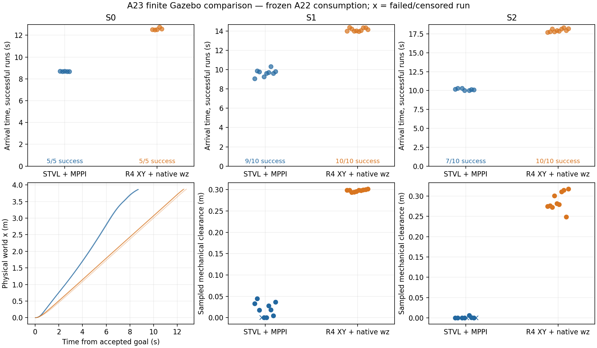
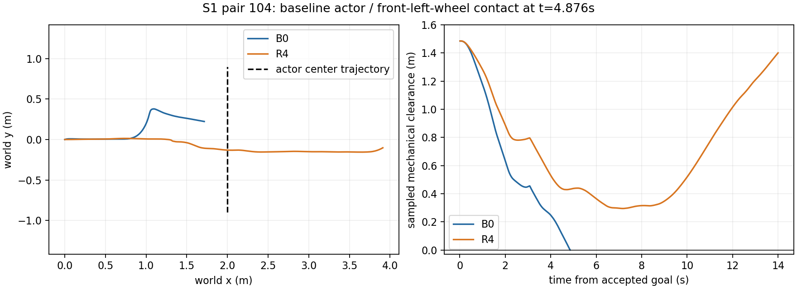

# A23：Gazebo 有限同条件闭环对照

2026-10-06，Research，算法基线 `ccd3eac4`。原 main 派生实验分支，本地不push，main不改。

## 当前判决：Modify，保留 Research，暂停生产化接线

有限同条件闭环已显示当前R4配置的安全价值：动态场景20/20成功、0接触，B0为16/20、4次真实轮端接触；R4全机械sampled净空稳定提高。但R4在空场慢44.4%，S1/S2成功样本到达时间慢45.3%/77.4%，S2有小幅回退，速度与circle支持差异尚未消融，不能宣称prediction consumption本身已唯一胜出。保持本轮算法冻结，不恢复owner/lease/fallback/完整Nav2生产接线。

下一最小判定只需在原baseline旁增加匹配**实测空场速度/到达时间**和有效circle支持的对照，再看动态收益是否保留；保留本轮原baseline结果。当前停止于本次判决，不自动启动下一轮或继续工程化。

## 已完成结果

共50个有效navigation trial（两组各25）：S0各5，S1/S2各10；另有6个pilot与1个有限批次startup失败，全部单列保留。所有已发goal的算法失败都计入分母；startup没有发goal，唯一替代B0_111与R4_110配对。到达时间仅对成功样本统计，失败不填0；接触即结束，失败前缀的净空不代表完成整条任务。

| 场景 | 方法 | 成功 | 真实contact | 最小净空min / p50 (m) | 到达p50及范围(s) | WAIT p50及范围(s) | 最长连续停滞max(s) |
|---|---|---:|---:|---|---|---|---:|
| S0 | STVL+native MPPI | 5/5 | 0 | NA | 8.678 (8.671–8.712) | 0.08 (0.06–0.10) | 0.10 |
| S0 | R4 XY + native angular | 5/5 | 0 | NA | 12.531 (12.490–12.768) | 0.08 (0.06–0.12) | 0.12 |
| S1 | STVL+native MPPI | 9/10 | 1 | 0.0000 / 0.0181 | 9.717 (9.092–10.331) | 0.08 (0.06–0.10) | 0.10 |
| S1 | R4 XY + native angular | 10/10 | 0 | 0.2937 / 0.2987 | 14.118 (13.992–14.410) | 0.09 (0.06–0.10) | 0.10 |
| S2 | STVL+native MPPI | 7/10 | 3 | 0.0000 / 0.0000 | 10.128 (10.012–10.319) | 0.06 (0.04–0.12) | 0.12 |
| S2 | R4 XY + native angular | 10/10 | 0 | 0.2486 / 0.2803 | 17.962 (17.726–18.310) | 3.12 (2.18–3.70) | 3.60 |

WAIT为实际平移速度<.02m/s，包含起步低速；B0通常选择绕行，R4 S2有2.18–3.70s WAIT。R4 S2实际clear后恢复指标10/10为0s：含义是清除时已持续前进，不能解释成零感知时延；B0存活的7个样本也已前进。目标t=9s之后首个连续3帧forward>.05分别约15–19ms/16–17ms，属于50Hz观测采样，不构成R4恢复优势。6/10 R4 S2样本出现2次world-forward符号反转，最大回退2.50cm(p50)/4.06cm(max)；B0为0次/0cm。R4 S0/S1无反向回退，所有trial无30s timeout。

| 场景 | R4 solver p50 / p95 / max(ms) | R4消费调用p95 / max(ms) | 含native角委托的组合调用p95 / max(ms) |
|---|---|---|---|
| S0 | 0.734 / 1.278 / 1.715 | 2.234 / 7.291 | 33.254 / 39.849 |
| S1 | 0.874 / 1.527 / 2.233 | 2.499 / 7.734 | 33.317 / 37.638 |
| S2 | 0.782 / 1.471 / 2.017 | 2.470 / 8.317 | 33.088 / 42.172 |

7679/7679 R4调用有效，无消费输入/solver/delegate失败；原15ms solver、40ms消费时限保持。B0 native调用P95约31.6–31.8ms，R4仍计算native angular，CPU开销没有减少。组合调用为native_ms+R4 elapsed，未包含返回日志开销。共同stub输出的ROS receipt间隔：各run P95最大均为54ms，B0/R4最大间隔63/70ms；这是recorder观测时刻，不能当作物理执行时刻。B0入口epoch与R4委托后的acquisition epoch语义不同，不能直接用control_gap比较抖动。

## 公平条件与解释边界

25个配对起点差0；全部51个有限尝试配置除mode/log路径外一致。同一map/goal/model/障碍指令；goal-relative实际actor位置差max=0.589mm，100ms中央差分速度差max=0.00363m/s。碰撞结束后的差异未作公平轨迹外推。动态真值50Hz、共同帧间隔最大20ms，每run覆盖约99.6%以上；sampled保守机械box净空=0不必有真实接触，所以两项分列，不提供连续碰撞证书。

B0引用当前main left-STVL profile，native MPPI算法/critics未改；共同周期由正式10Hz派生20Hz，STVL同一平面LaserScan输入。因此是该Research profile的同条件结果，不能直接外推正式10Hz、三维MID360、新车或实车。STVL启动日志和多数trial的costmap.csv证实障碍附近有占用（>=99含inflation inscribed）；首对S1在增加纯记录字段前开始，costmap统计NA，不能填0。接触传感器有独立Gazebo发布端，四次均明确报告轮端接触。

R4保留cruise=.4/free-s cap=.5，native上限=.5且空场实测更快；R4使用yaw-invariant circle，native使用原padded polygon，无法仅凭净空提升把速度/footprint影响排除。首S1 contact前native padded polygon也已相交；几何差不是已证实的全部碰撞原因。R4保留native angular计算，世界XY只在20Hz输出时按当前TF转body，两拍间桥接保持body命令；这不是实车下游连续yaw解算验证，也没有重新引入future-yaw/旋转模型。MPPI/Gazebo随机seed没有此次可用的配置，小样本不作统计显著性或部署保证。另有42个run的自有Nav2容器在trial结束后的shutdown记录exit -11（含pilot），日志保留；本轮不把清理阶段异常混成goal/碰撞指标，也不为其扩展生产级清理工程。

## 证据和复现

[最小harness及复现](../../experiments/r4_gazebo_comparison/README.md)、[逐次指标](../../experiments/r4_gazebo_comparison/evidence/trials.csv)、[汇总与latency](../../experiments/r4_gazebo_comparison/evidence/summary.json)、[配对实际轨迹](../../experiments/r4_gazebo_comparison/evidence/fairness.json)。必要汇总/配置/四次碰撞事件及控制已入本地分支；完整输入环、原预测、truth/odom/commands、启动失败及日志留在本worktree的build/r4_finite_comparison_20261006，未删除、未push。main原2849cbe4、A22消费源码、原无关dirty保持。

## 冻结的设计与首失败分类记录

核心假设：不改变A22 prediction consumption、dynamic cost、free-s、solver或旋转模型，R4 XY在真实Gazebo反馈中能比STVL+native MPPI减少碰撞/停滞或提高动态场景完成率。

公平对照仅需要experiment下薄Nav2 controller wrapper：native MPPI通过原pluginlib加载，configure/activate/deactivate/cleanup/setPlan/setSpeedLimit全部委托；B0直接返回原结果，R4以同一源码WorldFollowAdapter替换XY、保留native angular.z。现有Nav2 action/GoalChecker、smoother、chassis stub和唯一Gazebo bridge共享。不恢复A09–A12 owner/lease/fallback，不改正式plugin或启动配置，无硬件/串口。Native angular delegate失败也结束R4试验，单列限制，不能伪造独立角控制。

共同profile来自当前main的 `nav2_old_car_2026_left_stvl.yaml`：保留native MPPI/critics/STVL decay/footprint/padding/limits/smoother；仅两组共用50ms controller周期（匹配A22）、将STVL既有LaserScan callback接同一仿真scan，并把clearing frustum改为该360度平面雷达的几何。原static_layer global map不加入动态union。R4 BodyPolicy按同一footprint circumscribed circle，limits取该profile，cruise=.4、free-s cap=.5保持。原canonical tracker/public-v2/observed sidecar与last_observation_cv参数复用，不加第二tracker、prediction、frontend或solver。

使用原phase1_omni（保留ignition friction namespace）/moving_obstacle物理模型，原A16去center_block空地图，起点(0,0,0)，共同goal(4,0,0)，GoalChecker=.15m/.20rad。独立sim domain/container、仅localhost/network-none。由Gazebo真值PosePublisher和actor contact sensor作独立观察，不把真值喂入控制。

S0空场每组5次，S1/S2每组10次；按同序号交替B0/R4先后，新Gazebo实例；Fortress CLI没有seed选项，实际轨迹配对核查。MPPI内部随机种子没有公开配置，记录这一限制，不能宣称噪声逐样本配对。障碍model固定x=2m，y目标依原A16相对于goal acceptance：S1 t<1为−.9，t=1..3以.9m/s到+.9；S2 t=1..2到0，停至7，t=7..9以.45m/s到+.9。目标轨迹与实际物理轨迹都保存，两组不按机器人位置触发不同障碍。

每次最多30 ROS秒。共同成功准则：NavigateToPose SUCCEEDED，期间无actor contact、无R4/委托失败。碰撞或首次R4 unavailable即保存原日志/输入并结束该试验，不调参、不替换轨迹、不重试旧算法结果。启动/数据采集失败另列，修复纯harness接线后必须保留失败；不能删除坏run或混成算法PASS。全部算法/参数在首个有效run前固定。

指标：成功率、真实contact、独立机械全包络sampled最小净空、到达时间、实际速度WAIT(<.02m/s)及最长停滞、S2 clear目标后连续3拍forward>.05的恢复时间、R4 solver/总调用与native MPPI委托时间、输出/真值采样周期。净空复用冻结R3只读oracle投影/距离函数（包含body与四轮保守包络），不运行R3控制链；包络相交时距离函数返回0，保守包络相交与真实contact分开。缺测为NA，不算0碰撞/WAIT。

Go：至少一个动态场景有一致的完成率/真实contact改善，S0无明显新退化，收益不能仅由不同暴露时机/数据缺失解释；才值得后续Integration讨论。
Modify：有可解释价值但某个现有模型/输入条件阻断或证据不一致，明确最小下一判定，先不生产化。
Stop：没有明显优势、明显更差，或安全/完成劣于B0。停止生产化接线，不以新增保护或调参救本轮数据。

启动排障：安装为直接ament CMake prefix，环境脚本位于包share下；首个S0_B0_01因Fortress不支持--seed未启动，S0_B0_02因预备条件要求output receipt而原stub在首个输入前不发布，未发goal。两次均保留为startup失败，不计算法成功率。共同pre-goal bootstrap只向既有/cmd_vel_nav发零，经原smoother/stub得到实际收到的output history，goal前停止该测试输入；不新增final publisher，不把缺失history伪造成零。

首个有效B0 pilot S0_B0_03成功，8.76s。首个R4 pilot S0_R4_03在首次调用时失败，reason=state/TF/applied stamp age，0个proposal；wrapper在native MPPI之前取epoch，native完成后才读异步odom，出现new source > old epoch。先保存first_failure_inputs/control/events/日志并分类为adapter acquisition ordering，随后仅修正wrapper：native之后取R4 acquisition/epoch，并用最新map->base_link TF完成world/body转换；A22算法库、状态年龄门限、15/40/75ms时限保持。native_ms与R4 total_ms分别记录，组合开销用二者之和近似，control_gap是不同取样位置的epoch间隔，实际输出receipt间隔另列。pilot不混入预定finite样本，有限样本编号从101开始。

S0_R4_04 pilot已连续输出约1.28s后遇到source TF future extrapolation：request=5.280s，map->odom最新=5.279s。保存后分类为异步TF接线阻断；仅把既有Nav2 TF buffer精确source epoch查询的wait从0改为5ms，等待仍计入原40ms消费预算，不使用最新TF冒充source TF，不改main/localization或算法。

进一步只读核查：map_odom_stub默认30Hz，5ms等待无法覆盖其与50Hz odom的独立相位；5ms版本仅构建，未用于新run。最终薄适配直接复用A16 shadow.cpp既有source-time选择方式：30帧队列中选最新且精确源时刻TF已可用的canonical odom，继续原100ms状态年龄门限。无等待、无伪造TF、无修改定位源。

S2同时报告目标轨迹t=9s clear后的恢复与实际几何clear后的恢复：实际actor全投影下缘离开共同直线路径保守圆半径(hypot(.32,.27)+.02)的首个t>=7s样本，此后实际world forward>.05连续3个odom样本；此真值仅离线评分，不进入控制。两者分列，goal前已结束为NA，不能伪造0恢复。

有限样本首次物理失败：S1_B0_104于goal+4.876s接触moving_obstacle/obstacle_collision与front_left_wheel/collision，立即结束；原输入环、事件、真值、控制和first_physical_failure.json保留。分类为native绕行后rejoin时左前轮机械包络接触，不能只凭中心距离判安全。本轮不修改算法/参数。解释时另列共同baseline参数的padded矩形half-extents(.34,.29)与仿真全机械保守box(.325,.300)的侧向1cm差，以及R4更保守圆半径.43869；不能把这一项收益自动归给prediction consumption。

有限启动失败S1_B0_110：research_static_map/configure的middleware response timeout，mapserver未activate；recorder无map/预测，未发goal。原run完整保留且单列startup，不算navigation failure。参数不改，替代B0_111与原R4_110配对；schedule_initial.json及replacement_runs.json记录变更，不重跑或删除已发生的算法碰撞。

S2首次物理失败B0_103于goal+4.275s、持障期，actor/front_right_wheel contact；输入/接触/控制/真值已保留，未调参。该次不是clear后rejoin，分类为持障绕行擦右前轮；仅凭前述1cm侧向包络差无法确定因果，保留critics/真实完整包络与速度的解释边界。

离线碰撞几何核查(collision_geometry_audit.json)：S1首碰撞前19ms，native自身padded polygon也已与actor投影相交，所以不能把全部baseline碰撞归于1cm footprint差。S2首碰撞前17ms，其padded polygon净空约5.05mm，全机械保守包络已相交；此级别与单帧运动/形状差相近，仍不能锁定唯一因果。继续如实分列速度、circle/旋转支持和算法消费贡献。
