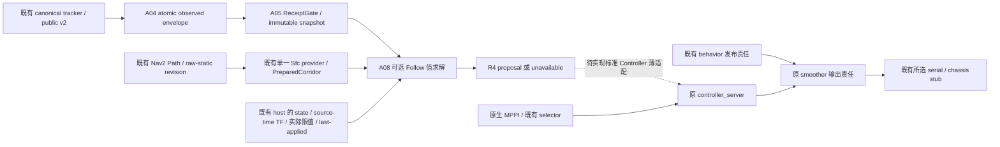

# R4 A08：最小 Follow 值求解接口

2026-10-05，Asia/Shanghai；沿用直接基于 main 的 `experiment/r4-hws-prediction-consumption`。本阶段只在 A05 值库内实现固定 yaw 的 prediction consumption 求解，返回可用提案或明确不可用结果。没有 ROS controller、action、线程、速度发布或执行 owner；A07 的 grant/current admission/端到端 lease 验收仍独立保留。

## 先登记的依赖与边界

复用 T-DT 迁移已经登记的 [OSQP 0.6.3](https://github.com/osqp/osqp/tree/0dd00a578cf1c2691c5c379965d504c75bf6cfad)，提交 `0dd00a578cf1c2691c5c379965d504c75bf6cfad`，Apache-2.0 + NOTICE；QDLDL 为该版本的 gitlink `7d16b70a10a152682204d745d814b6eb63dc5cd2`（Apache-2.0），AMD 为 OSQP 自带文件（BSD-3-Clause）。固定源码归档仅放入忽略的独立 build 目录，源码不修改、不并入仓库，不在 CMake 配置时联网，不安装系统包。安装前缀携带四份许可证/NOTICE。

使用已有 OSQP C API 的最小 Eigen/CSC 适配，无需增加 OsqpEigen 包；这仍是迁移中同一个 solver kernel，不把 A02 Python OSQP 1.0.5 当作 C++ ABI。固定 Humble 镜像不含该 kernel，故在隔离前缀恢复固定依赖。目标明确要求 OSQP 0.6.3、double 和 profiling/time_limit 支持；不能自动选择新版本或退到另一求解器。删除此值求解代码及其可选 build 开关即可回到 A05，不影响正式导航。

算法参考限于固定 A02 `b95a4222` 的 `r4_hws/follow.py`：一次局部 Gauss–Newton QP、15 个 100ms 控制目标、31 个 50ms stage、自由 s、软动态 running residual、零 terminal Follow cost。不导入其 tracker、frontend、execution、brake 或独立输出探针，不导入 HWS 源码。实际速度/加速度、footprint/yaw、cruise 和已发命令必须由调用端显式提供；不得使用 harness 的 .8m/s 上限或 1m/s² rate。

## 验收范围

保持原 40ms acquisition 起算总预算、15ms setup+solve 拒收预算、400 iterations、75ms 原源期限。它们是迟到拒收条件，不能抢占分解/装配/求解，也不形成物理执行保证。输入绑定本地 steady acquisition、同一 ROS epoch 的状态/TF、route/map/body/limits 和 immutable prediction；本库身份不授权动作。失败清 warm、不给正常提案，由既有 host/owner 处理 MPPI 与退化。

先做有限的 Humble C++ 数学/边界验证及同范围 sanitizer 检查；不启动 Nav2/Gazebo/串口，不跑 paired 或大规模实验。结果与源码摘要在完成后补入本文件及来源清单，任何失败不得通过放宽期限/迭代/几何隐藏。

## 实现与实际输入

新增独立可选 target `rm_r4_prediction_consumption_follow`，默认 `RM_R4_BUILD_FOLLOW=OFF`。默认 A05 target 不依赖 OSQP；显式开启时从既有安装前缀查找 kernel，不在配置时下载。C++17 下游链接导出 target 并包含 `follow.hpp`，内部实现使用 Eigen/OSQP C API。与完整 T-DT 同时部署时必须使用同一固定 OSQP 前缀，并继续满足 A06 的单一 Sfc provider 条件；本阶段没有完整 T-DT 共部署验收。

| 输入/结果 | 本阶段合同 |
|---|---|
| `FollowInput` | 拥有 prediction/route/body/limits/state/TF/last-applied 值副本、host/execution/authority/cycle 身份、progress 和本地 steady acquisition。既有 host 负责在其原同步边界复制；库不订阅第二份输入，不验证 active grant |
| 状态/坐标 | state frame 必须等于 route/prediction frame，body frame 必须等于 proposal base frame；全部几何已由 host 变换，body yaw 与 frozen pose yaw 一致，TF stamp 必须等于 pose stamp；pose/velocity/TF/applied stamp 不晚于控制 epoch，年龄最多 100ms。该期限是本值接口的拒收条件，不是现有 getter 已获得原子同步的证明 |
| 实际限值 | lower/upper、`command_rate`、cruise、free-s 上限均显式传入。rate 必须由 host 保守绑定实际 accel/decel 两侧；它约束命令目标变化，不模拟物理 plant。最后已发值须在实际 velocity bounds 内；旋转状态/上一命令拒收，因为此 slice 仅 fixed yaw |
| 单次 QP | 45 variables、168 静态/velocity/rate/progress constraints；31-stage 精确 ZOH rollout。动态只参与 30 个 running-stage soft residual，无未来 lethal/stop-tail veto；terminal 没有 Follow cost 或强制零速度 |
| 独立重验 | 将极小数值误差投影到精确速度/rate/progress-rate bounds 后，重新检查完整约束（误差门限仍为 1e-5），输出精确 rollout/soft cost。约束在当前已认证单个静态 centre box 内，不新增 corridor 搜索或动态 hard gate |
| warm | 同一 host/execution/authority、route/map/generation/body/limits、perception instance/generation/policy 下才可按 ROS epoch 移位，年龄最多 150ms；ReceiptGate reset、任何失败清 warm。相同 execution 中 epoch 或 cycle 不递增则拒收。host acquisition/lifecycle 失败须调用 reset，不复用缓存 proposal |
| `FollowResult` | 有效结果含 `FollowProposal`，无效结果 proposal 为空，保留 reason/status/iterations/timing。没有 brake command、MPPI 实现、health publisher 或最终输出；source_deadline 始终为原 acquisition +75ms |

OSQP 0.6.3 的第一次 `solve` 内部 `time_limit` 包含 `setup_time`；本地适配扣除 setup/warm 的实际墙钟耗时后按该 API 语义设置剩余额度，并在退出后再次按外部 15/40ms 拒收。source 起点不变。装配逐 stage 检查总预算，不能抢占一次 matrix 操作/分解/solve；没有 WCET/实时调度承诺。

测试实际车体为 main 老车 0.64×0.54m、padding .02m、static clearance .05m；velocity 为 vx[-.30,.50]、vy±.50、rate .80。cruise .40/free-s cap .50 是显式测试输入，不是新增 main 配置。observed support/CV 仍未认证隐藏完整体或预测误差。

## 有限验证与失败记录

固定 Humble 镜像、GCC11.4、Eigen3.4、OSQP0.6.3 构建通过。12 个 Follow GTest 通过；原 23 个 A05 GTest 与 canonical CDR/48 点软场参考保持通过。对应五个 CTest 组在 sanitizer 检查通过；最终 TF/时间负例变更另复核 Follow。ASan/UBSan 同模式覆盖本地值库、原 Sfc、OSQP/QDLDL/AMD C 源码；ROS/系统库未重新插桩，`detect_leaks=0`，没有 leak 或全栈安全结论。

四个小型值求解参考（前进、反向、90° fixed yaw、soft obstacle）与固定 A02 数学对照通过：最大 control/stage 差约 `9.84e-7`，nominal dynamic cost 差为零，solved dynamic cost 最大差约 `1.42e-6`。四次 C++ probe 中最大 setup/solve `3.465ms`、总耗时 `3.984ms`；这四个样本不能推断 WCET、性能收益或闭环通过。参考读取冻结 R3 中既有 Python 依赖缓存，只用 NumPy/SciPy/OSQP1.0.5；没有运行 R3 算法或试次。

参考测试明确替换实际 body/limits/cruise，并仅在内存中适配 A02 写死的 reserve、seed rate 与解后 rate 投影；源码 SHA 保持。未导入其 tracker/frontend/execution。首次参考只替换配置中的 rate，漏掉 prototype seed/projection 的单位 rate，soft 场景差约 .03967；补齐显式测试适配后通过，没有放宽误差门限或改变生产算法。

首次静态 infeasible 负例选在一个 box 的边缘，但相邻重叠 box 仍允许通行；改为整个 corridor 最外缘后给出 unavailable。独立下游检查首次在直接 `cmake --install` 后丢失 colcon 额外 environment hooks；改用标准 colcon 安装后，从 install 的 C++17 导出接口链接/运行通过。默认 OFF 配置无需 OSQP 即配置成功。原始失败日志和最终证据摘要均保留在 [来源/验证清单](r4_follow_value_solver_sources.json)，没有用失败检查冒称运行安全证据。

## 最小后续接线与停止点

图中后半链路是复用目标，不表示 A08 已接线。A07 active grant、共用旋转/连续 filled-footprint admission、原始期限的原子 transport 及发送时间上界仍未验收。main mission 的 `cancelSpin/cancelNavigation` 异步取消后立即清本地 handle/generation，没有通用 terminal acknowledgment 屏障；已有动作次序也不能单独证明唯一 active grant。该发现只登记最小适配缺口，不改 mission、不另建 FSM/owner。

A07 的 25ms 时间间隔反例保持；本轮的短样本耗时不能推翻原 50/40/75ms 参数允许的反例。下一步只允许按 A07 在原 host/owner 边界落实这些尚缺接口并有限验证；未完成之前，不将此值求解库宣布为可部署 R4，不启动真实输出或扩大实验。main/冻结 R3/原 dirty、public v2、A02非 Markdown 文件、A04 producer 及五个原 Sfc 资产均保持。
