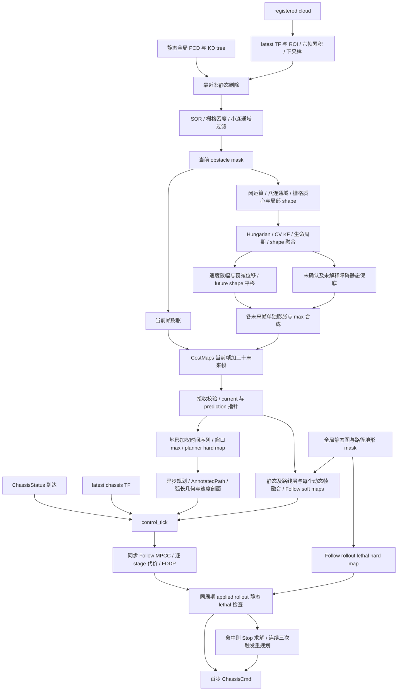
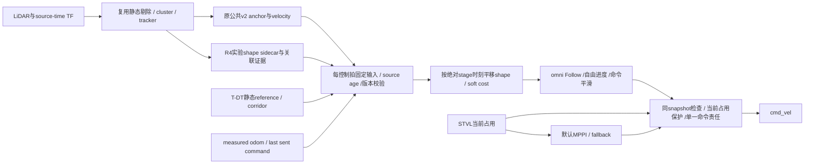

# R4：HWS-style Prediction Consumption 源码审计与最小设计

2026-10-04，Asia/Shanghai。状态：**第一轮审计完成；架构供确认；未开始控制器编码或新物理实验；未接受部署。**

## 1. 结论、范围与证据等级

**“剔除轮腿动力学后，HWS 与冻结 R3 基本相同”不成立。** 两者共有滚动时域、预测、路径参考、warm start 和有界命令，但其预测消费、路径推进及执行时序不同：

1. HWS 平移的是以连通域质心为基准、跨帧融合的**观测局部形状**；冻结 R3 的实际 ROS 消费链主要使用观测锚点加完整名义直径的圆代理。
2. HWS Follow 把每个 stage 对应的障碍地图作为**可权衡的残差代价**；冻结 R3 同时存在优化内硬动态分离约束和发令前全时域硬重验。
3. HWS 优化虚拟弧长进度及进度速度，可以主动落后于名义速度剖面；R3 实时实现主要跟踪按时间给出的参考位置，辅以有限侧移/等待参考和终态停车硬门。
4. HWS 从底盘反馈回调同步执行求解与发令；R3 的跨进程 worker 提案随后被新测量、新预测重锚、移位和停止尾修正，再决定是否执行。
5. HWS 延续实际命令及命令变化率，并对变化率和 jerk 施加代价；它也有 warm start 失效和命令状态重锚，不能概括为“从不重锚”。

**HWS 源码不是其动态避障成功的因果证明。** 本轮未运行 HWS，未获得上游逐周期实测或公平配对结果，不能证明上述机制中的哪一项产生收益，也不能把 HWS 的软动态代价当成碰撞保证。[HWS 项目及设计说明](https://github.com/Polyacetone/HWSentryNav26/blob/main/DESIGN.md)

另有两个必须修正的前提：

- HWS 是**同一回调内固定输入求解**，并非已证明的传感器时间同步 snapshot：底盘反馈、latest TF 和最近收到的预测仍可能属于不同时刻；预测年龄没有在 stage 索引中补偿。
- 原 R1“future occupancy → costmap → MPPI”没有找到已构建、加载和运行的 Nav2 future layer 证据。旧 V1 是时间 critic 路线，不能把其失败记到一个未运行的占用层上。

本文用 **[源码事实]、[冻结记录]、[推断]、[待验证设计]** 区分证据。本轮授权限于审计、差异判断和设计；不修改 R1/R2/R3，不迁入上游整包，不运行旧文档中的续跑命令。

## 2. 分支、版本与复现入口

- 工作分支：`experiment/r4-hws-prediction-consumption`。
- 直接基点：`main@d735ee12bd950dca0e691cdf2f2c61f35cef8ffc`；本地 `origin/main` 缓存相同。本轮没有查询 Gitee 远端主线，因此不把缓存称为远端实时状态。
- 独立工作区：`/home/qihei/rm2027_navigation/build/r4_hws_prediction_consumption`。原 checkout 仍为 `experiment/dynamic-documents-archive-20261004`，已有十个 dirty/untracked 路径保留。
- HWS：[Polyacetone/HWSentryNav26](https://github.com/Polyacetone/HWSentryNav26)，`main@f5f941288197e14c867d711a4c4cd85bfd7a3194`。本轮只读 `ls-remote` 核对上游 HEAD/main 均为该 SHA；本地已有只读 checkout 干净。
- 上游位置：`/home/qihei/rm2027_navigation/build/hws_audit/upstream_main`；许可证 MIT，Copyright 2025 Polyacetone。仅审阅源码、参数和设计说明，**导入代码范围为零，运行依赖新增为零，源码修改为零**。
- R3：`research/temporal-mpc-frozen-20261004^{}` → `04291a410f193c009e043af88e014cf420e1f68b`。只读工作区 `build/temporal_mpc_main_20261004` 的 HEAD 与该提交相同，工作区干净。
- 来源清单：[固定源码、文档与保留核查记录](r4_hws_prediction_consumption_sources.json)。

HWS 网页正文只作交叉核对，结论以固定 SHA 的本地源码为准。冻结 RM 文件可用 `git show <固定SHA>:<仓库相对路径>` 读取，不依赖当前研究分支的未提交内容。只按定位需要读取历史总文档的路线分类和冻结总结；未通读大合订本或复制历史归档。

## 3. R1/R2/R3 冻结状态审计

这里沿用本轮用户的**架构编号**，不把历史文档的“三轮研究”强行映射为 R1/R2/R3。

| 路线 | 已找到的实现/证据 | 冻结结论与本轮处理 |
|---|---|---|
| R1：future occupancy → costmap → MPPI | 历史总文档明确没有已构建加载的 future occupancy Nav2 layer；存在 occupancy 设计、预测可视化及离线 future-union 反事实 | 按用户要求保持冻结。时序空间化/false block 是机制风险；不能声称已有该插件闭环 A/B 证伪 |
| 旧 V1 与 differential-risk | PredictionV1Critic 在 MPPI 每步重算时间占用；有真实试次、排序/采样/聚合/SG 输出审计 | 已冻结、未接受部署。`dynamic-prediction-v1-frozen-20260925` → `f85149e0`；最终 `research/dynamic-differential-risk-frozen-20261001` → `e680b143`。归入时间 critic 资产，保留原编号 |
| R2：原生 DynamicObstacleCritic + guard | 真实 native 消费、公共 v2 observation-anchor、原装 MPPI/smoother、可见/名义几何配对 | 本轮按冻结处理；历史文件部分用“暂停”。visible 有接触，nominal 未完成目标，两试次综合 FAILED；surface 在线成员证据有未提交内容，不能当成已接受 shape 合同 |
| R3：硬 Temporal MPC | T-DT 静态 reference/corridor、实时 OSQP、双 Nav2 插件、selector、真实 tracker/odom/TF、执行重验及共同保护 | `Research Frozen / Not Accepted for Deployment`，标签 `research/temporal-mpc-frozen-20261004`。不增加 buffer、不放宽门、不扩候选、不换 solver、不缩几何、不引入 NMPC 救 R3 |
| B0：现有反应式导航 | 当前占用层 + 标准 MPPI；显式旧车 STVL profile 已存在 | 正式配置保持。用户指定后续 B0 为 STVL + MPPI；历史普通 ObstacleLayer 试次不能冒称 STVL 对照 |

**[冻结记录]** 旧 V1 一个冻结周期有 16/300 条真实安全候选，但保守占用首步使 300/300 共同受罚，安全质量约 3.14%；后续连续评分有局部改善，却有 90 s 未到达的候选。它们证明输入几何和评分/输出都有失败，不能推出“任何软代价必然成功”。来源：`f85149e0:docs/dynamic_navigation/v1_research_freeze_20260925.md` 第 8–12 节；`e680b143:docs/dynamic_navigation/research_stage_conclusion_20261001.md`。

**[冻结记录]** R2 visible 的机械动态净空下界 `-0.006576701 m`，有 contact；nominal `D=1.6970562748477143 m` 的对应下界 `0.909401996 m`，但双方均未成目标。三秒名义 CV 支持也没有全期成立。来源：原研究 HEAD `1229583f:docs/dynamic_obstacle_critic/observation_diameter_consumption_experiment.md` 的固定场景结果表。

**[冻结记录]** R3 最后迎面配对双方 40 s 取消；候选实际仅一个 MPC 通过周期。代表性 native 重验终态 slack `-14.953267 mm`，同 epoch 2×2 反事实主要对新测量重锚敏感。1,998 次 worker 请求均为 current，因此不能把本次失败再次归为旧时钟拒绝。候选最终命令接收最大间隔 `95.474 ms`，B0 controller 接收 gap `82.702 ms`，均有超过原 `75 ms` 观察门的记录。来源：冻结 R3 的 `temporal_mpc_freeze_20261004.md`、`temporal_mpc_timing_results_20261004.md`。

本轮不把历史文档的“下一步”当成旧研究恢复授权，也不更改既有暂停 goal/automation。

## 4. HWS 实际数据流

**[源码事实]** 这是两条不同的消费者，不是“所有 future map 并集后送给 MPC”。



对应调用链：`MapServerNode::local_cloud_callback` → `ObjectTracker::update` → `PredictionCostMapRenderer::render` → `local_cost_maps_callback` → `build_follower_obstacle_view` → `chassis_status_callback/control_tick` → `PathExecutor::execute_follow` → `MPCSolver::solve_follow` → `FollowProblem::running_cost` → `detect_rollout_lethal_obstacle` → publish。

Planner 的动态 union 先乘**地形影响层**；Follow 使用未做此地形乘法的逐帧动态 soft cost。HWS 因而也含局部 future-union 硬语义，主要用于地形通行规划与台阶阻塞检查，不能将整个上游称作“只有软动态障碍”。[障碍语义源码 H4]

## 5. Observed geometry 与速度

### 5.1 动态点如何剔除静态背景

**[源码事实]** registered cloud 用 latest TF 变换到 map，并在 imu_world 相关 ROI 内截取；维护六帧队列，先累积再 `0.02 m` 下采样。有全局 PCD 时，每个点查询静态 KD tree 最近邻，距离超过 `0.2 m` 才保留为动态候选。这是**地图差异**，不是已经识别“正在移动的车辆”；未知静止物同样可能留下。

没有全局 PCD 时，以 `|normal.z|≤0.3` 提取近垂直表面，再用方向场过滤已知地形；该模式默认关闭预测。之后 SOR（12 邻域、2 倍标准差）、投影密度（800 points/m²）、最小连通域面积（0.0075 m²）过滤。地图分辨率从 msgpack 读取，不能把常见 `0.05 m` 写为所有地图强制值。[H1、H3]

### 5.2 位置的实际语义

**[源码事实]** tracker 先对 mask 做半径 `0.10 m` 闭运算，再对八连通域求**栅格面积质心**，按 cell-center 转为米坐标。它不同于 RM 扫描端点算术均值，也不是物理完整车辆中心、最近面位置或类别尺寸推算中心。

质心四维 CV KF 状态为 `[x,y,vx,vy]`；关联使用预测质心到检测质心的欧氏距离和 Hungarian，gate `0.3 m`。renderer 最终使用 KF 后验/外推质心作为 local shape 放置基准。因此“centroid + observed shape”描述成立，但 centroid 不提供隐藏外廓证书。[H2]

### 5.3 shape 跨帧维护

**[源码事实]** 每个连通域取以 rounded centroid 为中心的局部浮点栅格，最小边长 `2.0 m`，按地图分辨率向上变成奇数格。只写入该连通域成员，超出局部格窗口的部分截掉。

匹配后，将旧 shape 和新量测分别对齐到 KF 后验坐标系，旧 shape 乘 `0.8`，逐格 `max(decayed_old,new_observation)`；未匹配时旧 shape 同样衰减。渲染取 `>0.3` 的格子为 footprint mask。连续命中三次后确认，丢失超过三帧删除；confirmed coasting track 在删除前仍可产生预测。

六帧点云累积、close、历史 max 和有限局部窗口可能引起拖尾、合并、裁剪及视角变化。上游没有按物体 yaw 旋转完整 footprint，没有类别标准直径，也没有保证恢复隐藏面。[H2、H3]

### 5.4 velocity 与两种不确定性

**[源码事实]** KF 是恒速状态转移，过程噪声采用离散白加速度形式（std `3.0 m/s²`），质心量测 std `0.08 m`；新航迹速度为零，速度初始方差 `4.0`。tracker 更新 dt 来自 steady-clock 回调间隔，clamp 到 `[0.01,0.5] s`，不是相邻 cloud header 的差。

KF 的 P 更新用于滤波；future renderer 没有把 P 转成概率占据、shape 扩张或 chance constraint。

| 不确定性 | HWS 实际处理 | R4 必须保持的解释 |
|---|---|---|
| 几何：隐藏面、局部裁剪、close/累积拖尾、质心漂移 | 局部观测栅格融合与固定物理 halo；无完整体支持证明 | `observed_shape` 明确是观测支持；隐藏几何 unknown 单列，不能用 motion covariance 代替 |
| 运动：速度误差、转向、减速、association、coasting | CV KF、速度上限、确定性衰减、生命周期 | 不是未来运动误差界；velocity decay 不保证更安全，移动目标可能走得比它远 |

## 6. Prediction、stage alignment 与 dynamic cost

### 6.1 每个 future frame 如何生成

**[源码事实]** 预测 20 帧，`prediction_dt=0.1 s`，覆盖 `0.1…2.0 s`。将 KF 速度按 norm 限到 `2.4 m/s`，渲染位移为：

```text
v_cap = v * min(1, 2.4 / |v|)          （零速度单独处理）
q(t) = q0 + v_cap * τ * (1 - exp(-t/τ)), τ = 1.6 s
τ <= 0 时 q(t) = q0 + v_cap * t
```

该式是对指数衰减速度的积分，并非 `v*t*exp(-t/τ)`；不修改 KF 的估计速度。每个质心量化到 nearest cell，**相同 observed footprint 只作平移**。[H2]

renderer 先将未确认/未解释的当前 obstacle mask 保底膨胀一次，复制到全部未来帧；再将每条 motion shape 膨胀一次，平移到每个 future centroid，与该帧取 max。这个 `static_fallback_mask` 指“没有运动预测的当前障碍”，不等于全局静态墙。

当前 `maps[0]` 来自原始当前 obstacle mask 膨胀；`maps[1..20]` 来自上述 shape/保底渲染。每个 OccupancyGrid header 仍标**同一个 cloud source stamp**，future offset 由索引和 prediction_dt 表达。[H1、H5]

### 6.2 时间帧实际如何进入 stage

**[源码事实]** `MPC_HORIZON=40`、`MPC_DT=0.05 s`，模型时域 2 s。solver 把当前 soft map 插到时间向量第 0 项，然后附加二十个未来 soft map：

```text
frame_index(k) = min(int(k * 0.05 / prediction_dt), last_index)
running stage k = 0…39, position = x[k]
```

默认 stage 0/1 消费当前帧；2/3 消费 `+0.1 s` 帧；38/39 消费 `+1.9 s` 帧。Follow terminal cost 为零，所以 `x[40]` 没有 `+2.0 s` 动态 terminal 代价；`x[40]` 仍参与静态 lethal rollout 检查。以实际浮点索引实现为准，不把预测最后一帧必然进入 Follow 代价作为假设。[H6、H7、H8]

**[源码事实]** 此处没有 `(control_epoch - cloud_source_stamp)` 年龄补偿，没有按执行延迟移位预测。它是**相对 stage 时间对齐**，不是已证明对真实执行世界时刻对齐。

### 6.3 cost 的具体形式

膨胀格代价概念式如下，实际还有 uint8 量化、有限范围和多源 max：

```text
c(d) = 255                         d <= full_cost_radius
     = 255 * exp(-λ*(d-r_full))     r_full < d <= cutoff
     = 0                           d > cutoff
dynamic: r_full=0.2m, cutoff=0.4m, λ=16/m
static:  r_full=0.1m, cutoff=0.3m, λ=24/m
```

**[源码事实]** Follow 的 `cost_map_for_step(k)` 已包含 `max(hard_route_cost,dynamic_frame[k])`，按车体位置中心做 cell-center 双线性采样；残差 `r_obstacle=8*c_k(x,y)/255`，`residual_cost=0.5*sum(r²)`，故障碍项为 `32*(c_k/255)²`。它不是完整 footprint polygon 的精确动态净空函数，也不是 `clearance<threshold` 就否掉全部解。[H3、H4、H6、H9]

空间场是分片双线性，存在满代价平台、截断/量化和 max 拼接；stage 间为分帧选择，没有时间插值。不能根据设计说明的“平滑”概括为处处光滑或总有避障梯度。Follow 导数通过 residual 的有限差分和 Gauss–Newton 构建。[H6、H8、H9]

### 6.4 hard / soft / 最后检查

| 消费位置 | soft / hard / 检查 | 实际内容与限制 |
|---|---|---|
| Follow running obstacle residual | soft | 静态/路线层与逐 stage 动态图融合；包括动态当前与预测帧，代价可与跟踪、进度、平滑权衡 |
| Follow 控制边界 | hard | 命令 envelope、命令变化率、首步 command/actual gap 可行交集、`0≤s≤L` 与非负虚拟进度速度；不是动态 collision constraint |
| Follow 解后的 applied rollout lethal | 最后 hard rejection | 用 `masked_global_map`，来源为 global static + path step cost layer；采样 cost≥250 或出图即 lethal，覆盖初态到终态。**不在此处采样动态预测** |
| Follow lethal 命中后的 Stop | 替代命令 | 在当前 fused soft map 上重新求解 Stop；坏 Follow 解失去 warm start；连续三次 lethal 才请求重规划，首个 lethal 当拍即改 Stop |
| Stop / Hold obstacle residual | soft | 只接收当前 fused map，整个求解时域复用当前帧，有各自 terminal residual；不按 future timeline 消费 |
| Planner 与台阶 route monitor | 有动态 hard 语义 | 动态图乘 terrain influence，规划窗口逐格 max；route monitor 按预计到达时刻采样台阶通行区，可触发阻塞重规划 |
| STEPPING committed | 特例 | 某些阶段关闭 Follow lethal 检查或保持上一命令，属于轮腿动作权限；不迁入普通 omni 避障 |

所以，“HWS 没有任何 hard dynamic 逻辑”不准确；准确结论是**普通 Follow 没有 R3 式逐预测净空硬约束或新预测全 rollout veto**。静态 lethal 同样只是其中心代价阈值和离散采样策略，不构成连续机械净空保证。[H4、H6、H7、H10、H11]

## 7. Follow MPC 的非动力学机制

**[源码事实]** HWS 是带虚拟进度的 Follow/MPCC：

```text
state(12): x,y,theta, x_hidden, v,w,
           v_cmd,w_cmd, v_cmd_rate,w_cmd_rate, s,s_dot
control(3): v_cmd_rate, w_cmd_rate, s_dot_cmd
s_next = s + 0.05*s_dot_cmd
s_dot_next = s_dot_cmd
```

前两个 control 是**指令变化率**，不是物理底盘加速度。名义速度剖面以弧长 `s` 查询，而不是把机器人硬拉到一个由墙钟指定的 reference timestamp。

Follow running objective 包含：路径法向 contour、切向 lag、航向误差；`v_actual*cos(theta-theta_path)-s_dot_cmd` 的有向速度耦合；`w_actual-kappa*s_dot_cmd`；名义路径速度跟踪；进度速度平滑；命令幅值、命令增量和命令变化率差/jerk；侧向加速度超限软项；stage obstacle residual；地形窗口项。另有 `-0.1*s_dot_cmd` 线性进度奖励。残差权重进入平方，不是直接乘 scalar cost 的系数。[H6]

**[推断]** 动态 soft cost 可通过降低 `s_dot_cmd`、增加有限 contour 偏移和有界命令变化率来产生减速/绕行；lag 和实测投影速度耦合抑制虚拟进度空跑。这是“可能自然等待”的机制依据，不是等待恢复已实测通过的证据。

Follow terminal objective 实际为**零**，没有冻结 R3 的全时域末端零速硬约束。warm start 按一个 stage 平移上一帧控制/状态；冷启动沿已认证路径做 pure-pursuit seed。新状态重锚、模式切换、输出间隔、static lethal 和非有限值会使 warm start 失效。[H6、H7、H10]

Stop 是独立停车优化：命令趋零、平滑、当前图 soft obstacle、terminal obstacle，使用允许反向的 capability；不是“瞬间把速度设零”。Hold 是固定点/恢复目标优化，含目标死区和 terminal 位置/障碍残差，服务 FIXED 与 hazard recovery。**Hold 不等于动态等待；Stop 也不是独立 FSM 状态名称。** 没有路径的正常 IDLE 直接发零；等待新规划时也有专用减速衔接。[H11、H10]

轮腿 LPV/隐状态/observer 是 plant 部分；FDDP 是通用优化方法，并非“轮腿专属”，但其当前 Problem、维数和输入绑定不能直接作为 omni 插件。R4 不以换成 FDDP 为前提。[H7、H8、H12]

## 8. 同周期 snapshot、更新与 failure handling

| 问题 | HWS 源码事实 | 审计含义 |
|---|---|---|
| 控制触发 | 有效 `ChassisStatus` callback 更新序号和实测状态，ingest observer，立即 `control_tick`；depth=1，意图为 20 Hz | 无独立求解 timer；模型 dt=50ms 不等于所有实际 callback 间隔恒为50ms |
| prediction 更新 | 单独的 `local_cost_maps_callback` 校验尺寸/几何/dt，整包替换 current/predictions | 预测不触发一次新控制；控制拍使用最近已接收包 |
| 固定输入 | control_tick 组装 ObstacleLayers/FollowerObstacleView/ExecutorInput；MPC 同步调用直至返回，raw map pointers 由该 view 的 shared ownership 保活 | 同拍求解/发令，没有另一个 MPC worker 提案发布者。订阅未配置 reentrant group；默认同节点 callback 串行行为是执行环境假设，不能冒充传感器硬同步证明 |
| state/TF | ChassisStatus 回调字段 + `lookupTransform(map,chassis_link,TimePointZero)` | latest pose 与反馈不按源 stamp 配对；反馈序号是本地递增，不是端到端生产序号 |
| prediction 年龄 | CostMap 类型不保存 grid header 时间，local callback 未见 source-age/TTL 门 | 长期不更新的 map 也可能留用；不是“frozen snapshot 自动新鲜” |
| solver 后的新 prediction veto | 同一 Problem 重 rollout，使用同周期 `masked_global_map`；没有重新读入新 prediction 的硬动态净空门 | 与 R3 消费架构实质不同；内部 ancillary applied rollout 是模型反馈修正，不是新感知 veto |
| execution delay / overrun | max_iters=20；求解超过30ms只 warning；没有 wall-clock deadline 中断或 late-result 丢弃门 | 过时状态/命令排队风险仍存在。不能把实时描述当最坏时延认证 |
| 状态断流 | watchdog 每50ms检查，收到状态后100ms仍无新状态则 notify unavailable，清 warm/observer、记诊断 | 此函数**不发布独立制动命令**；同 callback group 的 watchdog 也不能保证打断长 solve。下位机失联行为不在本轮上游源码范围内证明 |
| 命令历史/间隔 | 命令 gap≥0.4s 或 update interval>75ms 可 invalidate/reanchor；状态序号断裂重置 observer | 有受控重锚和连续性诊断，不是没有状态再初始化 |
| 不收敛 / infeasible | infeasible command bounds 或非有限值返回 unexpected；feasible 但 converged=false 可以继续使用，convergence 仅进 diagnostics | FDDP feasible 不是 dynamic collision feasible，更不是已收敛最优解 |
| 普通求解失败 | execute_follow/stop/hold 返回 invalid；control_tick 仅 `out.valid` 时发令；少数地形取消/释放分支有零命令特例 | 没有通用“任意 solver failure 自动 Stop/MPPI”保证；不把无输出当已停车 |
| Follow/Stop 切换 | static lethal 可在 solve_follow 内当拍调用 Stop；路径/控制权变化由 FSM/task 处理 | 不是另起异步 worker；连续三次阈值只影响重规划，首拍保护不延后 |

**结论：** R4 应借鉴“每拍只优化和执行一个固定版本输入”，同时保留 RM 已有的 source-time、失效门和独立输出责任。不得照搬上游缺少预测 TTL、慢解只 warning、普通失败无命令等空缺。[H7、H10、H13]

## 9. 十八个问题的核对索引

| # | 直接回答 | 证据/正文 |
|---|---|---|
| 1 | 静态 PCD 最近邻差>0.2m；无 PCD 用法向/方向场且默认无预测 | H1/H3；5.1 |
| 2 | 闭运算后连通域栅格质心，经 KF 后验成为 shape 基准；非完整物理中心 | H2；5.2 |
| 3 | centroid-local raster；后验对齐、0.8 decay、max 融合、>0.3 rendering | H2；5.3 |
| 4 | 四维 CV KF + Hungarian；steady callback dt clamp；不是物体中心真速度界 | H1/H2；5.4 |
| 5 | prediction 20×0.1s；Follow 40×0.05s | H3/H8；6.1–6.2 |
| 6 | 速度norm cap2.4，位移为τ(1-exp(-t/τ))，τ1.6；不改KF速度 | H2/H3；6.1 |
| 7 | 保底mask + 每条同一shape的逐时刻平移、膨胀、max | H2/H5；6.1 |
| 8 | current插0；stage按int(k*dt/pred_dt)选帧；没有source-age补偿 | H6/H7；6.2 |
| 9 | bilinear fused cost，residual8*c/255，0.5平方和 | H6/H8/H9；6.3 |
| 10 | 普通Follow没有hard动态collision constraint；地形规划/阻塞另有hard语义 | H4/H6/H11；6.4 |
| 11 | 无solver后更新prediction的全时域动态veto；检查同Problem的静态层 | H7；8 |
| 12 | 是：Follow静态/路线lethal与逐帧动态soft分开；不是所有模式同样处理 | H4/H6/H10；6.4 |
| 13 | Follow弧长路径；Stop有界趋零；Hold固定点/恢复；等待不是Hold同义词 | H6/H11；7 |
| 14 | s,s_dot在状态，s_dot_cmd在控制；contour/lag/投影速度/速度剖面/线性奖励 | H6/H8；7 |
| 15 | 有效ChassisStatus到达事件，不是prediction callback或独立控制timer | H13；8 |
| 16 | 同拍固定对象/同步solve-command；不同源epoch，不能称严格时间同步 | H7/H13；8 |
| 17 | 无硬timeout；slow warning；不收敛可用feasible iterate；infeasible/非有限一般无有效输出 | H7/H8/H10；8 |
| 18 | shape平移、stage cost、进度、指令平滑、warm seed、同步架构可迁移；LPV/腿状态另分 | 10–12 |

## 10. HWS vs 冻结 RM2027 R3

R3 以下描述针对 **04291a41 的 realtime QP + 实际 ROS native chain**；早期 SLSQP/一般六维模型不是最后在线已接受的能力。

| 维度 | HWS（f5f94128） | R3 Frozen（04291a41） | R4 所检验的差异 |
|---|---|---|---|
| obstacle position semantic | 观测连通域面积质心的 KF 后验/预测 | v2最近associated detection端点均值锚点，推进到array source epoch；非完整物体中心 | 保留明确anchor，shape局部原点与其一致；不虚称完整中心 |
| obstacle geometry | 历史local raster，未旋转的observed shape + halo | 最新实际ROS nominal D=1.697056m作为**半径**；visible代理另有实验。离线core也支持polygon，但native最后主要circle | 观测几何作soft引导，机械评估和原物理oracle不缩小 |
| temporal representation | current+20 future grids，各帧保留时间索引 | 公共15 display points；实际consumer从position/velocity重算CV timeline | shape sidecar + source-time stage生成；不把display点当物理支持 |
| soft / hard safety | Follow动态soft；静态/路线lethal后验拒绝；地形有动态hard | QP动态分离hard + 全量check + native新状态新预测hard rollout +共同保护 | 去掉R3长时硬动态提案门；保留静态、当前占用、bounds与故障输出门 |
| horizon | 2s；Follow终态无动态terminal cost | 1.5s实时；早期/其它实验时域另列 | 第一切片1.5s，先复用15帧合同，不通过加长时域争取收益 |
| dt | model50ms、prediction100ms | execution50ms、decision nodes100ms、15节点，30执行控制 | 同R3网格，真实epoch单独记录 |
| snapshot semantics | 同callback固定最新输入对象；source年龄未补偿 | worker causal snapshot固定；native随后对新输入重验 | 在compute中获取固定版本并同步solve；下一拍才用新预测 |
| state update | 每有效反馈重新构造x0，命令历史另存；ancillary默认关 | worker用request state，native用新velocity/pose重锚 | measured状态与last_sent_command分开，不能把测量冒充发送命令 |
| prediction update | 整包替换，下拍消费；未见prediction TTL | source顺序/frame/schema/age门；native最新prediction全量重验 | 保留显式数据门，soft求解中不热换包 |
| solver architecture | 同步C++ FDDP，20 iterations，无硬wall timeout | Python OSQP worker，15ms solver/40ms core；native10ms重验 | 复用已登记OSQP依赖，短时kinematic软目标；C++同步消费边界需重写 |
| revalidation | 同周期model rollout + static lethal；可选ancillary模型修正 | proposal aging移位、new-state reanchor、停止尾、new-prediction动态余量 | 仅同snapshot静态/数值/控制检查；执行近场门独立记原因 |
| command continuity | command/rate/jerk状态和代价，warm shift，gap重锚 | 命令差分界、smoother/guard、fallback及selector；新状态可能触发提案拒绝 | 统一last_sent命令历史、mode转移与实际接收gap |
| STOP behavior | 独立Stop优化，当前map；不是每个Follow末端硬停车 | 每个1.5s rollout terminal velocity≈0 + native stop projection；独立brake/fallback | Follow无强制末端停车；WAIT保留path、低进度；STOP负责失效有界减速 |
| path reference | MINCO弧长几何 +全局速度剖面，优化s与s_dot | T-DT提供时间网格reference；LateralReference/最多3个局部参考 | 复用T-DT几何，改成s自由的Follow目标；不增候选 |
| corridor | planner guide/free-space搜索与路径认证；Follow软跟踪/地图，不消费RM式中心矩形硬走廊 | raw static map认证centre_bounds，corridor hard | 保留静态可行走廊，进入门检查有等待与绕行空间 |
| robot dynamics | 非最小相位LPV、hidden state、腿长调度、无独立vy | 最后实时domain固定yaw,wz=0，body vx/vy command-difference ZOH | 第一切片仍固定yaw，但明确支持全向平移；不冒称旋转工况通过 |
| terminal objective | Follow=0；Stop/Hold各有terminal residual | 跟踪terminal加权+终速hard check | Follow与Stop分责是独立变化，不把其收益都归给shape |
| velocity decay | 确定性cap+指数积分 | v2 consumer CV不clipped、不decayed；旧v1 display可能不同 | 第一版保留公开CV消费；decay暂为HWS差异，不与三机制同时偷偷更换 |
| fallback | Stop/replan/恢复/invalid无输出；没有MPPI | bounded braking、selector切回MPPI、共同ExecutionGuard | MPPI为默认/回退；独立发令责任不能依赖solver成功 |

R3 源码定位：`experiments/temporal_mpc/temporal_mpc/realtime_qp.py:20–35,147–178,216–316`；`contracts.py:155–209`；`integration/worker_node.py:184–251`；`ros2/rm_temporal_mpc_controller/src/controller.cpp:172–193,228–303`。出处均为固定 R3 SHA。[R3 源码阅读入口](/home/qihei/rm2027_navigation/build/temporal_mpc_main_20261004/experiments/temporal_mpc/ros2/rm_temporal_mpc_controller/src/controller.cpp)

**关键判断：** 动力学不同不能解释全部差异。即使换成相同 omni plant，两个系统仍会因代价/约束、自由进度、全时域末端停车、求解/执行输入版本、几何和故障语义而产生不同的可用命令集。需要验证这一组合；源码审计没有资格宣布它能解决 R1–R3 的全部问题。

## 11. 可复用、可迁移、轮腿专属与必须重写

| 分类 | 模块/机制 | 边界 |
|---|---|---|
| RM 可直接复用的已冻结资产 | source-time静态剔除、聚类、Hungarian/KF、公共v2位置/速度合同；T-DT静态前后端/路径与走廊；Nav2双插件/selector基础设施；Gazebo/source-TF/odom采集、物理oracle、配对身份工具；既有OSQP依赖 | 均在研究资产而非main默认中；后续从固定提交显式选取、写来源清单、隔离构建。**复用不等于全部代码原样加载** |
| HWS 可迁移思想 | centroid-local shape融合、逐帧平移/渲染、stage obstacle residual、自由进度、command-rate/jerk代价、参考冷启动、同步每拍solve-command、Follow/Stop分责 | halo、权重、dt、shape窗口、速度衰减均是参数/建模假设；不照搬数值当RM认证 |
| HWS 通用但不必迁入的实现 | FDDP、MINCO、通用地图采样/优化方法 | 不是轮腿独占；首版不更换OSQP、不迁全套规划器，避免求解器/规划同伦同时成为混杂因素 |
| HWS 轮腿/本机专属 | LPV辨识系数、hidden state observer、leg_h/leg_psi调度、非最小相位响应、台阶速度窗/起跳/commit、BLOCKED动作权、SPIN/腿模式协议 | 不映射到四全向轮状态，不复制下位机命令与TF职责 |
| RM 必须新增/重写 | 带关联身份的observed-shape实验sidecar；source-age stage renderer；omni进度/速度投影；同步Nav2 Follow消费；STOP/WAIT输出责任和失效时序；soft/hard用途隔离 | 公开v2消息只有position/velocity/size/prediction，**没有shape成员**；不能用size反推已观测形状，更不能拿未提交surface代码当现成合同 |

冻结 tracker `Detection` 没有成员字段，`TrackerUpdate` 不公开 assignment；但 `cluster_point_indices` 可保留成员索引，association 在 tracker 内部。若后续做 sidecar，需要在**R4隔离副本**里增加明确的 detection→track 身份输出/钩子，再使用同次聚类成员；不事后按最近质心猜关联，不在R2/R3上补丁。KF/关联算法本身尽量保持。

## 12. 最小 R4 prototype 设计（待确认，尚未实现）

### 12.1 待检验假设与范围

> 在目标、静态路径、走廊及观测均有效的基础场景中，observed shape + stage-aligned soft dynamic cost + 每拍固定输入求解，配合自由弧长进度和连续命令，能否产生稳定提前侧移/减速、自然等待和恢复，减少 R3 式 proposal veto 停滞？

该问题不是“通过取消保护让命令更容易被接受”。真实机械几何、footprint/padding、当前占用保护、原 oracle 净空门和失败统计保持。shape 是**优化信息**，不升级为隐藏完整物体支持。

第一版仅替换 `prediction → controller` 和为此必要的 shape sidecar；保留 T-DT 静态 reference/corridor、Nav2 action、STVL、默认 MPPI。新包规划为 `experiments/r4_hws_prediction_consumption/` 并隔离构建，**本轮不创建这些源码/运行配置**。



### 12.2 输入与 per-cycle snapshot 合同

拟定 `CycleSnapshot` 包含：cycle_id、control/source/last_observation epoch、steady acquire/solve/publish 时间、pose/velocity 的源 stamp、TF 查询 epoch、prediction序号/shape摘要、path generation/static map revision/corridor、最后**实际发送**命令及发送时刻。

shape sidecar 使用实验命名空间/显式schema，不改正式公共消息：`track_id + source_sequence + last_observation_stamp + local origin/anchor + grid resolution + observed cells + shape age/validity + association identity + provenance`。位置与格原点必须对应同一个物体坐标基准；coasting 明确推进 epoch，未知关联/成员缺失不可静默生成“小shape”。无可靠shape则退出该研究消费，走既有fallback并计失败/输入无效原因。

source-age 在获取 snapshot 时**补偿一次**：对 stage `t_k=control_epoch+k*Δt`，从 shape/anchor 的真实源时刻用原公开 CV 外推；测量几何与运动误差仍分别记录。求解、模式选择、rollout诊断只用这个 immutable snapshot；预测更新进入下一拍。静态map/path generation发生失效、deadline超出或近场当前占用危险时可中止执行，但不再以新prediction重算整个未来1.5s并一票否掉提案。

同步消费需在 Nav2 compute 边界建立，规划/地图构造和回调IO在周期外完成有界准备。不能把 Python worker 藏到另一个 topic 后就声称同步，也不能只为了同拍取消数据TTL。source/frame/schema/finite/完整性门沿用已冻结输入合同（如预测400ms、状态150ms），在进入门预登记；需要更严格门时单列协议版本，不放宽旧门救结果。

### 12.3 Omni 模型与 Follow formulation

状态基础为 `[x,y,yaw,vx,vy,wz,s]`；`vx/vy/wz` 是 measured plant 状态。控制选择**速度命令目标/命令变化率**，保留 `last_sent_cmd` 作为显式 command memory。为复用 R3 实际执行合同，首个有效切片限定平地、fixed yaw、wz=0、全向 vx/vy；yaw变化、坡地及新车真实响应不冒称已覆盖。

初版采用 `Δt_exec=0.05s`、decision/shape网格 `0.1s`、horizon `1.5s`，兼容公共15帧合同并与冻结R3对齐。HWS的2s及velocity decay先只作差异记录，第一版不同时改变它们。可直接在stage绝对时刻平移shape，避免把future union交回STVL。

拟定优化变量为有界 `vx_cmd/vy_cmd` 的变化率和 `s_dot_cmd`；rate不是已标定物理加速度。用原公共 velocity-ZOH 命令模型得到kinematic rollout，实车响应误差由独立校准/物理oracle检验。后续若实现yaw自由度，需要新的执行模型门，不能自动沿用fixed-yaw结论。

```text
reference = p(s), tangent = dp/ds
e_contour = normal(s) · (robot_xy - p(s))
e_lag = tangent(s) · (robot_xy - p(s))
e_speed = tangent(s) · R(yaw)*[vx,vy] - s_dot_cmd
s_next = s + Δt*s_dot_cmd, 0 <= s_next <= L, s_dot_cmd >= 0
J_follow = tracking + speed_profile(s) + progress_reward
           + command_rate/jerk + stage_dynamic_soft_cost
```

静态 corridor、速度/rate/数值和地图边界保持 hard。动态未来进入距离场/栅格 residual，使用真实机器人 footprint 的 configuration-space 支持构建 soft field，避免照搬HWS仅中心加0.2m halo当机械安全。感知shape、机器人几何膨胀、motion uncertainty 三项分别写入来源，**不把旧名义D改小后继续声称同一hard支持**。

求解策略仅拟定为复用已登记 OSQP 的有界小 QP，以当前warm rollout对soft map残差/路径参考做局部Gauss–Newton近似、共享原15ms solver预算。局部代价非凸与平台梯度可能失败，先做固定snapshot数值诊断；不换solver、不堆候选、不转完整NMPC。此近似是R4实现选择，**不是HWS FDDP的等价复现**。

Follow 不强制每个时域终点零速，改以进度与command平滑运行；Stop 单独负责失效有界减速。terminal项初版保持HWS Follow=0，terminal动态代价/停车约束若另加，必须单列变化，不悄然恢复R3终态门。

### 12.4 WAIT / STOP / fallback 与安全边界

- **Follow**：同一静态path/corridor内优化路径进度、侧移和动态soft代价。减速和等待应优先由低 `s_dot`/低实际速度出现。
- **Wait**：保留path与进度，不把等待等同于path失效；下拍照常消费新snapshot，障碍离开后可恢复Follow。定义进入/恢复条件和迟滞时必须预登记，不能结果出来后临时改门。
- **Stop**：输入失效、静态lethal、bounds/数值失败、deadline或当前占用危险的有界减速与fallback，不是长时未来动态veto。独立输出责任应在solver阻塞/退出时仍工作。
- **Hold**：第一版不搬轮腿平衡/危险恢复Hold；如终点需要位置保持，作为Nav2正常到达行为，不扩成新动态避障机制。
- **MPPI fallback**：保持唯一最终publisher及selector命令连续性，切换记明确原因；所有时延、近场保护和回退占比都纳入结果，不能只展示R4活跃周期。

**ExecutionGuard 不能整套原样复用。** R3 guard也消费长时硬动态合同，直接加载会重新建立R3全时域否决链。可复用其发布责任、失效有界减速、输入完整性及采集基础；R4应在实验副本中明确“当前占用/首个执行区间保护”与“预测引导”边界，并对B0/R4采用相同边界。保护触发、uncertified brake、近场碰撞风险必须原样报告；软代价不提供独立安全证书。

首版仍保留测量bounds、原机器人完整机械/padded模型、当前STVL unknown/lethal语义、有效静态走廊和physical oracle。R4接受前不改main默认、不接实车部署。

## 13. 测试计划与停止条件（计划，未执行）

### 13.1 先过进入门

每个场景单独证明：goal容差区在**真实机械模型**与当前感知/控制合同下有效；静态T-DT path有净空，corridor连通且有足够等待/侧移空间；source-time TF/odom/shape关联有效；动态障碍在需要作出动作前可观测。进入门不得用Gazebo未来真值作为在线输入。

优先独立预登记开阔平地新fixture。旧 `legacy` 场景不作首例；R3 `open_long` 也只作为布局参考，它虽修正过goal region问题，**未证明动态可达/闭环通过**，不能换个名字即当model-valid。

| 场景 | 固定事件 | 核心观察 |
|---|---|---|
| 横穿 | 同观测相位横穿路径，左右方向预先登记 | 首次减速/侧移相对可观测及物理冲突的提前量，是否稳定通过 |
| 迎面 | corridor足够侧向空间，goal不被代理长期覆盖 | 提前侧移/减速、完整体净空、是否反复回退 |
| 等待后通过 | 障碍短时占用横向通道，释放时刻预登记 | 低进度稳定等待、释放后的恢复时延、停滞总时长 |
| 障碍离开道路 | 当前占用清除与shape/coasting有独立证据 | 是否继续false block、是否恢复原path，无future-union墙 |
| 静止障碍sanity | 未确认/静止未知物留在当前位置 | 无运动也不能消失、无穿障、不依赖三次运动确认才保护 |

### 13.2 对照与因果边界

- **B0**：真实STVL + 标准MPPI，使用相同场景/输入采集/当前执行保护；记录实际YAML、插件图、机器人/actor机械模型与预算。
- **R4**：同条件新试次。先预登记五场景各三组固定相位配对（30个run），含固定取消和stop tail，保留所有性能失败；它只构成最小基础验证，不是部署统计证明。
- **R3 Frozen**：只读使用04291a41已有结果、源码和原manifest；**不新跑或修改R3**。场景、保护、模型、随机性不一致时只作历史失败机制对照，不声称公平统计提升。
- 可选三个消融：同中心/halo的简单shape代理替换observed raster；current-only替换stage temporal cost；受控只读回放复现异步新输入消费。第三项先离线，不能在线制造竞态冒充有效消融。Follow进度、terminal政策、decay、guard边界固定；否则无法归因三个目标机制。

建议最小矩阵后至多12个预登记消融run，合计≤42；仅协议损坏/进入门失败的替补另记原因并仍占研究预算。未得到用户架构确认前不启动矩阵，不自动创建续跑安排；确切参数、运行预算和接受阈值应在编码后的首个预登记文档冻结。

### 13.3 观察与接受项

| 层 | 必须报告 | 最小接受方向 |
|---|---|---|
| 感知/几何 | source age、shape来源/成员/关联、缺失/合并/coasting、隐藏面unknown、nominal/support与observed的差异 | 不把“更小shape”的通过率当完整支持成立；每个失败能定位到有效/无效输入 |
| 消费 | cycle输入hash、stage绝对时刻/shape时刻、各stage dynamic cost/gradient、求解返回、实际发送command | stage0不偷用未来；同拍状态/地图版本一致且可复算；无未记录热换输入 |
| 行为 | 首减速/侧移提前量、path进度与真实位移、wait持续/恢复时延、无进展时长、goal完成/取消、detour | 稳定提前避让、等待后恢复；自由s不得空跑换取虚假推进 |
| 安全 | Contact、完整机械body净空、padded净空、静态违规、stop-tail、独立sweep诊断 | 原body≥0.05m、padded>0及原bounds/地图门保留；采样通过与连续证书分开 |
| 保护与fallback | dynamic long-horizon veto次数（R4设计应为0）、current guard次数、static lethal、input/deadline失败、MPPI活跃占比 | “无veto”本身不是成功；碰撞、停滞或几乎全fallback均照实失败 |
| 实时性 | acquire/assemble/solve/validate/publish/receive的P95、P99、max；执行端gap；队列覆盖/丢失unknown | 目标20Hz；原15ms solver、40ms消费总周期与75ms接收gap观察门作初始预算；独立故障输出验证，不能用均值代替最大值 |

先验证身份/单位、source-age一次补偿、geometry/assignment不串线、静止保底、soft场平台/梯度、warm shift与mode命令连续性；再做solver kill/overrun/失效prediction/TF断流的输出门，最后Gazebo配对。所有原始失败、真实配置/二进制/输入摘要及oracle日志保存，未来真值只用于评估。

### 13.4 停止规则

R4 是最后一个架构级新候选。若最小复现及有限预登记验证后，在有效模型/有效输入基础场景中仍不能联合实现稳定提前避让、等待恢复、更少停滞、原物理净空及可接受实时性，**冻结复杂动态预测控制研究**，不转R5/R6。

只允许先定位并修正有确切证据的实现/合同错误；不能无限调权重/halo、缩几何、放宽保护、加候选或换solver救验收。无有效输入导致无法判断也不能记算法成功，应明确未建立并按预算停止。局部拓扑、概率/风险或独立安全过滤的论文增强仅在基础机制成立且有具体失败证据时另议；本轮不实现T-MPC++、Scenario、Chance、CBF或NMPC。

正式默认和fallback继续保留现有MPPI体系，指定B0用STVL；tracker/prediction可作为资产保留，不再无限扩展Rn。架构确认只批准进入隔离最小实现阶段，**不等于动态或部署接受**。

## 14. 源码证据定位

上游以下链接全部固定 `f5f941288197e14c867d711a4c4cd85bfd7a3194`；行号按本轮实际源码读取。

| ID | 文件与重点行 | 支持内容 |
|---|---|---|
| H1 | [map_server_node.cpp](https://github.com/Polyacetone/HWSentryNav26/blob/f5f941288197e14c867d711a4c4cd85bfd7a3194/map_server/src/map_server_node.cpp#L324-L424)，433–515、623–683 | cloud callback、steady dt、current/future包装、latest TF、静态差异/投影 |
| H2 | [object_tracker.cpp](https://github.com/Polyacetone/HWSentryNav26/blob/f5f941288197e14c867d711a4c4cd85bfd7a3194/map_server/src/object_tracker.cpp#L133-L223)，227–302、307–387、392–481 | 连通域centroid/local shape、KF、association、shape维护、decay预测/保底 |
| H3 | [map params](https://github.com/Polyacetone/HWSentryNav26/blob/f5f941288197e14c867d711a4c4cd85bfd7a3194/map_server/config/params.yaml)，[inflation utils](https://github.com/Polyacetone/HWSentryNav26/blob/f5f941288197e14c867d711a4c4cd85bfd7a3194/map_server/src/utils.cpp#L273-L311) | 实际参数、distance transform、物理halo/指数代价 |
| H4 | [obstacle_semantics.cpp](https://github.com/Polyacetone/HWSentryNav26/blob/f5f941288197e14c867d711a4c4cd85bfd7a3194/nav_executor/src/common/environment/obstacle_semantics.cpp#L17-L115) | 地形动态union与Follow soft/hard两种view |
| H5 | [prediction_cost_map_renderer.cpp](https://github.com/Polyacetone/HWSentryNav26/blob/f5f941288197e14c867d711a4c4cd85bfd7a3194/map_server/src/prediction_cost_map_renderer.cpp#L65-L110) | 保底复制、每shape一次膨胀、逐帧平移max |
| H6 | [follow_problem.cpp](https://github.com/Polyacetone/HWSentryNav26/blob/f5f941288197e14c867d711a4c4cd85bfd7a3194/nav_executor/src/path_executor/mpc/follow_problem.cpp#L78-L124)，191–257、294–328 | residual、progress、control bounds、stage索引、零terminal、static lethal |
| H7 | [mpc_solver.cpp](https://github.com/Polyacetone/HWSentryNav26/blob/f5f941288197e14c867d711a4c4cd85bfd7a3194/nav_executor/src/path_executor/mpc/mpc_solver.cpp#L423-L657)，205–219、660–773 | current插0、warm seed/shift、同步FDDP、applied rollout、Stop替代、失败 |
| H8 | [mpc_types.hpp](https://github.com/Polyacetone/HWSentryNav26/blob/f5f941288197e14c867d711a4c4cd85bfd7a3194/nav_executor/include/nav_executor/path_executor/mpc/mpc_types.hpp#L14-L40)，[mpc_utils.hpp](https://github.com/Polyacetone/HWSentryNav26/blob/f5f941288197e14c867d711a4c4cd85bfd7a3194/nav_executor/include/nav_executor/path_executor/mpc/mpc_utils.hpp#L87-L104)，[fddp_solver.hpp](https://github.com/Polyacetone/HWSentryNav26/blob/f5f941288197e14c867d711a4c4cd85bfd7a3194/nav_executor/include/nav_executor/path_executor/mpc/fddp_solver.hpp#L29-L55)，622起 | 维数/dt、0.5残差平方、feasible/converged与迭代终止 |
| H9 | [nav_map.cpp](https://github.com/Polyacetone/HWSentryNav26/blob/f5f941288197e14c867d711a4c4cd85bfd7a3194/nav_executor/src/common/environment/nav_map.cpp#L162-L200) | max融合与cell-center bilinear采样 |
| H10 | [path_executor.cpp](https://github.com/Polyacetone/HWSentryNav26/blob/f5f941288197e14c867d711a4c4cd85bfd7a3194/nav_executor/src/path_executor/path_executor.cpp#L104-L197)，347–448、457–505、555–591、742–765 | command history、gap/reanchor、模式、invalid输出、慢解warning |
| H11 | [stop_problem.cpp](https://github.com/Polyacetone/HWSentryNav26/blob/f5f941288197e14c867d711a4c4cd85bfd7a3194/nav_executor/src/path_executor/mpc/stop_problem.cpp)，[hold_problem.cpp](https://github.com/Polyacetone/HWSentryNav26/blob/f5f941288197e14c867d711a4c4cd85bfd7a3194/nav_executor/src/path_executor/mpc/hold_problem.cpp)，[route_monitor.cpp](https://github.com/Polyacetone/HWSentryNav26/blob/f5f941288197e14c867d711a4c4cd85bfd7a3194/nav_executor/src/task_manager/route_monitor.cpp#L105-L205) | Stop/Hold当前图与terminal；台阶动态阻塞 |
| H12 | [mpc_utils.cpp](https://github.com/Polyacetone/HWSentryNav26/blob/f5f941288197e14c867d711a4c4cd85bfd7a3194/nav_executor/src/path_executor/mpc/mpc_utils.cpp#L112-L193)，[lpv_model.cpp](https://github.com/Polyacetone/HWSentryNav26/blob/f5f941288197e14c867d711a4c4cd85bfd7a3194/nav_executor/src/path_executor/mpc/lpv_model.cpp)，[path_executor params](https://github.com/Polyacetone/HWSentryNav26/blob/f5f941288197e14c867d711a4c4cd85bfd7a3194/nav_executor/config/path_executor.yaml) | LPV/command bounds、capability、Follow/Stop/Hold实际权重与开关 |
| H13 | [nav_executor_node.cpp](https://github.com/Polyacetone/HWSentryNav26/blob/f5f941288197e14c867d711a4c4cd85bfd7a3194/nav_executor/src/nav_executor_node.cpp#L49-L149)，153–199、339–378、408–449；[nav_executor_init.cpp](https://github.com/Polyacetone/HWSentryNav26/blob/f5f941288197e14c867d711a4c4cd85bfd7a3194/nav_executor/src/nav_executor_init.cpp#L233-L287) | 接收更新、feedback触发、同步update-command、watchdog、latest TF、QoS |

本地冻结记录入口：

- [R1/R2/R3编号与完整历史的前段](/home/qihei/rm2027_navigation/docs/dynamic_navigation/dynamic_obstacle_prediction_full_history_20261004.md:13)。
- [R3冻结](/home/qihei/rm2027_navigation/build/temporal_mpc_main_20261004/docs/dynamic_navigation/temporal_mpc_freeze_20261004.md)。
- [R3最新时序/重锚证据](/home/qihei/rm2027_navigation/build/temporal_mpc_main_20261004/docs/dynamic_navigation/temporal_mpc_timing_results_20261004.md)。
- [R2实际消费结果](/home/qihei/rm2027_navigation/docs/dynamic_obstacle_critic/observation_diameter_consumption_experiment.md:141)。
- [项目开发规范](../development_workflow.md)。

后续按 [progress](r4_hws_prediction_consumption_progress.md) 的 hypothesis/change/result/evidence/conclusion/next step 记录，不把本轮设计写成实验结果。
