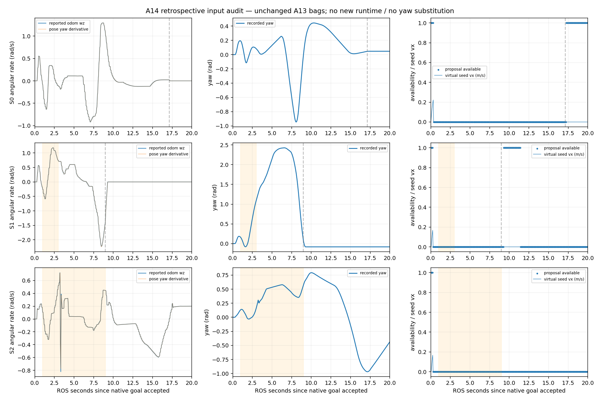
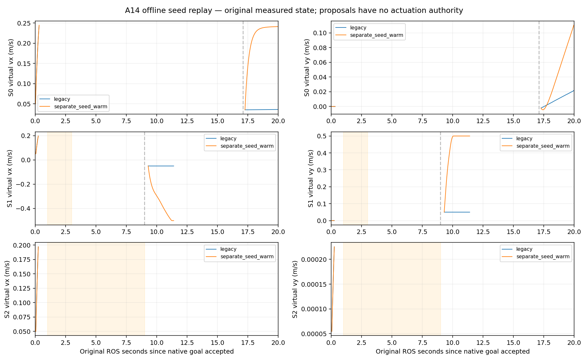

# A14：A13 输入适用性与最小后续范围审计

> A15后续更正：A14逐stamp一致性与回放结果仍成立，但它们只对应A13错误生成的物理场景。原profile代表性和post-goal漂移原因已在[A15](r4_native_stop_audit.md)进一步定位；需要修正scene后复核，不能据旧yaw数据推断正式链路必然同样不兼容。

> [A16](r4_corrected_runtime_shadow.md)已完成修正后的同规模shadow，重新确认关键动态窗口与fixed-yaw合同不兼容。原A14回放/来源保持，下文没有替换为新run。

2026-10-05，Asia/Shanghai；基线`0266f2ba`，A08/A09–A12继续冻结于`e137635e`。用户“继续”后，先完成原始数据和模型适用性核查，不默认解除数学冻结。

## 分析前范围登记

本阶段只读A13三个既有bag、CSV、source/hash。新增`experiments/r4_input_applicability_audit`中的decoder/analysis/README/COLCON_IGNORE和文档，均为离线instrumentation，不创建ROS node、subscriber/publisher、tracker、预测、solver或新运行链。现有summary不足以区分真实旋转、twist错误和重建影响；raw bag中已有Odometry/Path/TF，可直接解码并与caller source stamp对应，无需新场景。停用/删除此独立目录即可移除；生成数据使用新的隔离build目录，A13数据不覆盖。

问题及方法预登记：

1. 原world实际odom来源和canonical转换是否可追溯；记录固定源码、配置和hash。
2. 按原Odometry source stamp差分yaw，与原reported wz及caller选择的数据比较。差分只作诊断，不作为新状态输入，不置零/筛选/平滑wz。
3. 统计全部400拍goal窗口和实际导航/动态事件窗口中的兼容拍、最长连续兼容窗口、可用proposal、warm/seed重置；不改变1e-6合同。
4. 对已有yaw轨迹统计50ms和1.5s内实际变化；明确这只是已记录轨迹的模型差异，不作未来预测/完整体净空证书。
5. 将相邻body/path/receipt变化与seed归零对应；分别指出caller策略与原Follow warm-key合同，避免把冷启动当作动态slowdown。
6. 保留15/40/75ms预算、A13判决及所有原始失败。只交付source/输入诊断和可审阅的最小后续范围；不启用闭环、改原profile或重跑R3。

统计使用原ROS stamp，观测速度差分窗口为连续原odom且0<dt<=100ms；horizon查询取目标时刻最近的原odom，误差<=30ms，否则NA；不跨scene/reset拼接。gate兼容用原|measured_wz|<=1e-6；其他失败保持原reason。事件窗口S1为goal+1..3、S2为goal+1..9，之后为release窗口，native goal result另标记。

## 结果：真实转动与caller seed问题已区分

**已完成原数据审计、最小实验caller修复和有限离线回归；A13输入适用性仍FAILED，动态行为仍INCONCLUSIVE，closed-loop仍NOT_ELIGIBLE。** 未启动新的ROS/Gazebo场景。下表保持全部400拍goal窗口作分母；离线回放缺失的输入不从原运行验收中剔除。

| 场景 | 原runtime有效proposal | 实际native导航期间有效/总拍 | 关键动态窗口兼容/总拍 | 本轮结论 |
|---|---:|---:|---:|---|
| S0 | 62/400 | 7/342 | 不适用 | 55个有效拍在native goal之后；不能称空场连续通过 |
| S1 | 48/400 | 5/179 | 0/40（goal+1..3s） | 43个有效拍在goal之后；未观察到动态冲突中的有效消费 |
| S2 | 5/400 | 5/400 | 0/160（goal+1..9s） | 原400拍包含2个TTL失效；goal未在20s内完成 |

### 1. pose/twist/TF追溯支持实际旋转，没有发现caller单位或符号错误

源码链：既有[world](../../src/rm_simulation/worlds/phase1_omni.sdf)的独立`OdometryPublisher` → 既有[bridge](../../src/rm_simulation/config/ros_gz_bridge.yaml) `/simulation/ground_truth/odom` → [lio_adapter](../../src/rm_localization_adapters/src/lio_adapter.cpp)的canonical `/odometry/lio`及`odom→base_link` TF → shadow同source stamp选择。world中`MecanumDrive`与`OdometryPublisher`为两个系统；当前[配置](../../src/rm_localization_adapters/config/lio_adapter.yaml)是`twist_mode: passthrough`，没有启用finite-difference替换twist。此处是仿真来源审计，不是实车定位精度证明。

S0/S1/S2分别解码1158/1172/1156条Odometry，frame均为`odom/base_link`，source stamp严格递增。三个goal窗口中，caller选择的pose/twist与同stamp原Odometry的数值不匹配数为0；Odometry与同stamp TF pose不匹配数为0（绝对误差阈值1e-10）；记录的`map→odom`平面偏移和yaw均为0。

连续原pose yaw差分与两个端点reported wz均值的绝对误差P95为0.01852/0.01830/0.01195 rad/s；中位数约6.39e-9/3.47e-15/1.99e-8 rad/s。差分是区间平均速度诊断，不能等同瞬时速度证书；S2最大误差0.36694 rad/s也保留。结合原yaw轨迹和逐stamp一致性，当前证据支持真实转动触发固定yaw不兼容，不能通过adapter置零wz来解决。

### 2. fixed-yaw适用窗口与动态事件不重合

原[Follow](../../src/rm_r4_prediction_consumption/src/follow.cpp)保持`|measured_yaw_rate|<=1e-6`、last-applied yaw rate=0及pose/body yaw一致。实际导航期间最长有效连续窗口仅S0的7拍、S1/S2的5拍；按50ms调度分别是0.35/0.25/0.25s（首末采样间距少一拍）。S1动态40拍和S2动态160拍均不兼容，不能据此判断soft cost能否slowdown/WAIT/resume。所有有效回放proposal的dynamic cost仍为0。

原轨迹中“之后1.5s”的实际yaw变化P95/max如下；这是回顾既有pose，不是提供给Follow的future oracle：

| 场景 | 1.5s yaw差 P95/max（rad） | 同一已知矩形顶点仅因旋转的位移 P95/max（m） |
|---|---:|---:|
| S0 | 1.0854 / 1.3148 | 0.4034 / 0.4773 |
| S1 | 1.7845 / 2.2565 | 0.6080 / 0.7058 |
| S2 | 0.7257 / 0.7920 | 0.2772 / 0.3013 |

顶点量使用实际profile矩形半径`hypot(.30,.25)`及`2r sin(|Δyaw|/2)`，没有引入隐藏障碍形状、halo或新的安全余量；也不是完整体净空/接触证书。最近source匹配误差<=30ms，原stamp和匹配stamp逐行保留。50ms实际yaw差P95分别0.03473/0.04707/0.02103 rad。因此仅删fixed-yaw gate或放宽容差会掩盖冻结预测几何的适用范围，不能作为诊断修复。

### 3. 精确body版本变化触发warm重置，原caller又错误清除了虚拟command历史

goal窗口相邻拍中，同path/static且仅body digest变化的corridor重建为377/387/376次；双方wz都<=1e-6而body digest仍改变的相邻拍为54/214/0次。真实yaw的极小变化也会改变精确body digest。原Follow warm key依赖body/path等版本，这个合同继续保持，未quantize yaw或复用不同几何的warm状态。

原A13 caller的`cold`把`rebuild/receipt reset`与`previous proposal missing/expired`合在一起，导致一条50ms前仍有效的虚拟command因优化上下文变化被归零。已有[FollowInput](../../src/rm_r4_prediction_consumption/include/rm_r4_prediction_consumption/follow.hpp)能分别表达`last_applied_body_velocity/stamp`及`reset_warm`，不需要扩展生产API。下节登记的补丁只更正shadow的counterfactual bookkeeping；它不能将虚拟command冒称为实际应用值。

## 定位后、修复前的最小例外登记

原bag核查已确认source pose/twist与caller一致，S1/S2动态窗口没有fixed-yaw兼容拍。另发现caller用同一个cold flag同时控制warm reset和虚拟上一command，body/path重建把100ms内的有效shadow历史清零，错误地将优化上下文变化当成上一command消失。

因此本阶段允许一个诊断性caller修复：`experiments/r4_runtime_shadow/shadow_seed.hpp`纯函数区分virtual seed有效期与warm reset，`shadow.cpp`使用它并分别记录reset_seed/reset_warm。已有FollowInput两个语义本来已可表达，不改A08/A09–A12、public v2或实际cmd；history仍仅来自本进程上一有效shadow proposal，缺失/失败/超过原100ms窗口时重置，MPPI仍只参考。

验证新增独立offline replay CMake/CPP，只从原bag反序列化map/path/envelope，按已核对的原cycle state/source epoch调用同一冻结A05/A08/Sfc，比较旧caller seed策略与修复策略。它不创建ROS node，不改姿态/wz，不做预测/solver复制，也不创造compatible窗口。steady acquisition是回放自己的新时刻，清楚标为offline；禁止把回放耗时或lease当作A13原运行时验收。无需新ROS场景或改变sim profile。关闭方式为撤回这个实验caller补丁/停止独立回放目标；正式入口仍不触及。

## 最小修复与回放验收

修改范围为实验[caller](../../experiments/r4_runtime_shadow/shadow.cpp)和纯函数[shadow_seed.hpp](../../experiments/r4_runtime_shadow/shadow_seed.hpp)。`reset_seed`只由上一有效虚拟proposal是否存在、epoch单调和原100ms有效期决定；`reset_warm`还受几何/path/receipt上下文变化影响。原有缺输入、失败、clock reset会清空历史；上下文重建继续清warm。新增CSV列`reset_seed`，不改变topic/service/controller/public v2。没有actual cmd publisher、brake/fallback或grant。

独立[replay](../../experiments/r4_input_applicability_audit/replay.cpp)从同一bag取map、Path和private envelope，从已核对的cycle取原state/source epoch；body/path/map/receipt digest逐拍与原记录一致后调用**同一冻结A05/A08库与canonical Sfc**。未复制tracker、prediction、frontend、Follow数学或solver。两种策略各有1331条可重建owned row，共2662条；S0/S1/S2各444/446/441条包含startup/end。goal窗口可重建为400/400/398条，S2原2条TTL缺失tuple仍保留在400原分母。未伪造输入补齐它们。

[回归检查](../../experiments/r4_input_applicability_audit/verify_replay.py)确认全部owned row的legacy可用性及reason与原A13完全一致，有效vx/vy数值也完全复现；修正策略也未改变这些可用性/reason。recorded digest mismatch、越过原速度/首拍rate约束、错误携带非相邻/过期/失效虚拟历史均为0；valid拍均满足原fixed-yaw gate。Release构建的patched caller与replay均通过，记录实际链接库hash。未重跑冻结R3或101项历史GTest。

| 原goal窗口 | legacy / 修正后 valid | 修正后在warm重置时保留fresh seed的valid拍 | used-warm（两策略均相同） | valid command最大轴差（m/s） |
|---|---:|---:|---:|---:|
| S0 | 62 / 62 | 54 | 6 | 0.2055 |
| S1 | 48 / 48 | 42 | 4 | 0.4500 |
| S2 | 5 / 5 | 0 | 4 | 0 |

最大差反映原cold seed的限速重置影响，**不是避障收益**。S1修正后在native goal之后，虚拟vx逐渐达到约-0.5、vy约+0.5m/s；2个primal-infeasible及170个corridor失败仍在。实际机器人由MPPI控制，状态没有跟随虚拟proposal，因此这段无法代表R4闭环轨迹，也不能当作障碍clear后的动态恢复。

额外保留：按native goal result之后第一条到goal窗口结束最后一条真实Odometry计算，S0位置变化0.07003m、S1为**2.43895m**；S2无goal完成，不计算。这个仿真profile在S1 goal后未表现为稳定停住，是下一轮判断plant/停止行为可比性前的核查事项。这里只报告记录事实，不将其归因于某个Nav2输出endpoint或R4，未修改原world、MPPI、smoother或chassis stub。

图中橙色为动态事件，虚线为native goal result，空白为proposal不可用；不存在用插值补齐动态窗口。offline replay使用**新steady acquisition**；不得把此次耗时或剩余lease当成A13原runtime时序。15/40/75ms保持，原A13 timing/lease判决未重算或替换。

## 拟议最小后续范围；尚未实现

1. **先核查既有native profile的终止/plant行为。** 优先只读既有A13 command/odom/TF与原profile，说明S1 goal后位移发生在哪段输出/物理响应；不引入第二owner或修改formal输出链来掩盖它。尚未证明这个profile与正式老车的停止/转动行为相同。
2. **真实转动支持需要单独建模阶段。** 当前接口能表达seed/warm两个语义，但A08状态转移与single-yaw body/corridor不能表达随stage变化的方向。最小可审阅范围应限定在既有Follow内的yaw/angular-control及原rate/limits一致性、stage姿态下已知body的静态/soft几何、warm上下文/坐标一致性。复用原OSQP、Sfc、canonical tracker/public v2和观测members；动态消费机制与固定yaw基线应保留作对照。不能只删gate、quantize yaw、强制native wz=0或扩大容差后宣布PASS。
3. **继续后移输出接线。** 本阶段不自动解除用户A08数学/A09–A12冻结；上述模型工作不是本次adapter修复，未编码。即使日后完成，也先做有限value检查和同范围runtime shadow，满足原行为标准后才讨论existing-owner前的闭环proposal；不新增安全层、MPPI、成本项或候选solver。

## 证据、复现与保护范围

精确已执行命令和关闭方式见[README](../../experiments/r4_input_applicability_audit/README.md)。镜像保持`sha256:81b325bebf2f631d2f70ca72914873e0fee6df5b87977750cac17228def171c3`；Humble/Nav2 MPPI1.1.20/Gazebo6.18.0及原已构建A04/A12/OSQP依赖。两个独立Release目标编译，无网络/设备，新ROS node数和新场景数均为0。

- [原输入summary](../../experiments/r4_input_applicability_audit/evidence/summary.json)、[仅分析provenance](../../experiments/r4_input_applicability_audit/evidence/provenance.json)、[记录yaw差](../../experiments/r4_input_applicability_audit/evidence/recorded_yaw_differences.csv)。历史caller hash明确来自A13，不用补丁后源码冒称历史输入。
- [全部owned回放CSV](../../experiments/r4_input_applicability_audit/evidence/seed_replay.csv)、[回归summary](../../experiments/r4_input_applicability_audit/evidence/seed_replay_summary.json)、[来源/二进制/依赖/原证据hash](../../experiments/r4_input_applicability_audit/evidence/seed_replay_provenance.json)。**PASS仅指recorded-input regression**。
- 原A13所有已提交evidence逐字节匹配`0266f2ba`；三个bag按原hash保留，96项冻结asset保持`e137635e`，原A13 caller binary不替换。新decode CSV/log/binary留在`build/r4_input_applicability_audit_20261005`。main、R3及原dirty保持核对见[保护记录](../../experiments/r4_input_applicability_audit/evidence/preservation.json)。

阶段判决：**诊断修复/有限回归PASS；runtime input FAILED、dynamic behavior INCONCLUSIVE、limited closed-loop NOT_ELIGIBLE；deployment未评估。** 当前停止在真实转动建模与native plant适用性需要另行审阅的位置，未继续production输出基础设施。
