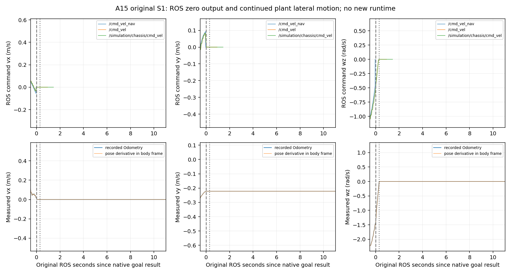

# A15：既有native停止链与仿真plant适用性审计

2026-10-05，Asia/Shanghai；研究分支基线`ce87459b`，A08/A09–A12/public v2仍冻结于`e137635e`。

后续：[A16](r4_corrected_runtime_shadow.md)已在独立目录完成修正后的三个有限shadow，未复现原post-zero持续横向漂移；fixed-yaw关键动态窗口仍无有效proposal，闭环仍不具备资格。下文保留A15当时的静态审计与原始数据边界。

## 分析前范围登记

用户“继续”后，优先回答A14发现的S1 native goal后位移，而非扩展R4输出或转动数学。只读原A13三个bag、references/events/odom、既有profile/world/底盘stub源码和固定版本上游代码。独立`experiments/r4_native_stop_audit`只包含离线decoder/analysis、README、COLCON_IGNORE及证据；不创建ROS node、publisher、预测、solver、owner或新导航链。生成物放新的`build/r4_native_stop_audit_20261005`，不覆盖A13/A14。

预登记问题：

1. 原`/cmd_vel_nav → /cmd_vel → /simulation/chassis/cmd_vel`是否发出零，逐消息value/count与native reference、stub转发是否对应；Twist无source stamp，bag clock对齐只标成recorder receipt估计。
2. native goal result、上游零、末级ROS零、watchdog与实际Odometry运动的相对时序；所有原失败/缺失保留。停止分析用原source pose，vel阈值只作说明，不作为新runtime门。
3. 原SimpleGoalChecker是否要求速度归零/是否持续检查xy；原OPEN_LOOP smoother是否反馈实际速度；这些语义分别能证明和不能证明什么。
4. 原Gazebo MecanumDrive零输入是否是wheel target而非强制world pose停住；默认物理engine、原接触friction/轮姿态是否完整表达预期方向；仅有源码/静态配置时明确因果限制。
5. 原ground-truth twist与body-frame pose差分一致性，防止把frame错误或虚构反馈当真实运动。差分只诊断，不替换原输入。
6. 保护main、R3、A08数学/接口、public v2、原dirty和全部A13/A14证据；不启用A10、不改正式停止/输出责任、不新开Gazebo场景、不重跑R3/大规模实验。

关闭方式：删除独立离线目录/不执行分析；正式runtime入口完全不触及。上游只读源码缓存放build或/tmp，不vendor到生产实现。需要的精确版本/License/URL/hash在本报告来源表登记。

## 结果

**确认A13实验world生成存在后端语义错误并完成最小前缀修正；原ROS停止链确有零输出，漂移是零ROS输出后的真实运动。静态检查PASS，物理因果/修正后runtime尚未验证；closed-loop仍NOT_ELIGIBLE。** A13/A14的真实记录保留，但它们不能再代表原始world的物理配置，也不能据此判定原profile必然存在同样漂移或模型适用性问题。

### 原停止指令已经沿既有ROS链转发

三个bag共解码2468条command：`/cmd_vel_nav`为172/91/223，`/cmd_vel`为357/194/439，`/simulation/chassis/cmd_vel`为358/195/439。前两topic逐消息value与A13 references一致；stub输出序列与输入完全相同，S0/S1各多一条watchdog zero，S2没有额外zero。未发现新的非零抢占命令，也没有R4 publisher。此处证明的是已记录ROS转发，不是物理发送ACK或正式老车输出独占。

| 原场景 | native goal observer（ROS s） | 上游永久zero recorder区间 | `/cmd_vel`及stub永久zero区间 | zero之后1s起的实测body vy中位数（m/s） |
|---|---:|---:|---:|---:|
| S0 | 18.085 | 18.054–18.055 | 18.144–18.145 | -0.024315 |
| S1 | 10.110 | 10.072–10.073 | 10.398–10.399 | -0.221742 |
| S2 | 未在20s内完成 | 无 | 无 | 不适用 |

Twist没有源stamp；区间来自bag recorder前后`/clock`的receipt，不能将它冒称生产owner send时间/lease证书。S1固定post-zero+1s窗口为source11.40..21.12s，487条Odometry，vx约8.38e-10m/s、wz约2.29e-12rad/s、vy稳定为-0.22174m/s，期间又位移2.1553m。原goal之后总位移2.43895m仍保留，两者窗口不同。S0对应92条，vy为-0.024315m/s。body-frame pose差分与reported velocity的post-zero误差P95分别约2.02e-10/2.26e-9m/s，支持实际横向运动，未发现把world速度错当body速度造成该现象。

### native goal与zero packet并不表达物理停住

当前原profile用`SimpleGoalChecker(stateful=true)`：xy进入容差后可以不再持续检查xy，速度参数不作为成功条件；同版本[上游实现](https://github.com/ros-navigation/navigation2/blob/a097086719c88f781aa59788eca29ac6ca5e56db/nav2_controller/plugins/simple_goal_checker.cpp)支持这个语义。原controller成功时有既有zero发布逻辑，bag亦记录到zero；[controller](https://github.com/ros-navigation/navigation2/blob/a097086719c88f781aa59788eca29ac6ca5e56db/nav2_controller/src/controller_server.cpp)未被改写。

原smoother为`OPEN_LOOP`，以last command推进限速，而非反馈当前实际横向滑动；已降至zero且超时后可以停止发布，[上游实现](https://github.com/ros-navigation/navigation2/blob/a097086719c88f781aa59788eca29ac6ca5e56db/nav2_velocity_smoother/src/velocity_smoother.cpp)与原记录相符。stub的既有0.5s watchdog另发zero，不能主动消除“zero后仍滑行”的plant问题。没有证据支持用新owner、安全层或新的MPPI解决本轮漂移。

### 场景重写改变了DART所需literal属性

原`prepare.py`虽保留XML namespace URI和数值，却默认序列化为`ns0`。gz-physics5.4.0的[DART源码](https://github.com/gazebosim/gz-physics/blob/a6c11b5be5267d3e1ac21f8a1eae6f9735cc2871/dartsim/src/SDFFeatures.cc)按literal `ignition:expressed_in`查attribute，不采用URI等价查找。固定镜像内同版本SDFormat实测：原world四个wheel均能查到literal属性；A13三个场景12个wheel全部查不到它，只有`ns0:expressed_in`；最小修正后的12个均恢复。安装DART plugin binary也包含该literal常量。

这会使预期在base_link表达的摩擦方向改用默认wheel frame。原wheel roll约-π/2、轴为local z，已知水平面上的静态方向投影从两组对角线（rank2）变为近似同一纵向（rank1），secondary friction系数为0；它能解释为何横向几乎不受制动。此为**配置语义缺陷确认及因果解释**，不是已证明的运行contact力/轮速证书：原bag没有Gazebo端command ACK、wheel速度或contact。默认DART来自[Physics](https://github.com/gazebosim/gz-sim/blob/b90cd2c41a193102d6951857c2d83e13f59bb64b/src/systems/physics/Physics.cc)，启动无engine override；安装physics5.4.0/DART6.12.1/SDFormat库及hash保留。

[MecanumDrive](https://github.com/gazebosim/gz-sim/blob/b90cd2c41a193102d6951857c2d83e13f59bb64b/src/systems/mecanum_drive/MecanumDrive.cc)将Twist目标经原限速映射到wheel velocity，没有将world pose强制静止；[OdometryPublisher](https://github.com/gazebosim/gz-sim/blob/b90cd2c41a193102d6951857c2d83e13f59bb64b/src/systems/odometry_publisher/OdometryPublisher.cc)来自实际model world pose及body方向差分，不是stub packet积分。未新建或替换plant。

## 定位后、修复前的最小例外登记

源world在robot model上声明`xmlns:ignition`，轮friction属性为`ignition:expressed_in="base_link"`。A13 `prepare.py`使用ElementTree重写整个world，默认将此前缀重命名为`ns0`；原三份已生成资产中为`ns0:expressed_in`。固定gz-physics5_5.4.0 DART源代码不是按URI读取，而是按literal `ignition:expressed_in`查attribute。默认wheel/link方向因此可能不同，不能继续称“生成物理完全保持”。

本轮允许仅对实验generator补充命名空间前缀登记，恢复原后端期望属性；不修改原world/参数/production代码。先用固定镜像内同版本SDFormat静态解析器检查original/A13/generated三者，并比较除了需要修复的属性前缀以外的robot物理树。新增独立静态checker只load文件/打印解析字段，不启动ROS或physics。关闭方式为撤回generator一行/停止静态目标；原A13资产与binary/bag保持。

此修正属于场景生成adapter的语义恢复，不能在没有新的运动证据时宣布横向漂移因果解决。A15静态/原bag审计范围内不启动新ROS场景；若静态确认后继续runtime验证，应先另行登记同三个小场景、独立输出与固定参数，而非覆盖旧失败。

## 实际修正、来源与保护

只在[实验prepare.py](../../experiments/r4_runtime_shadow/prepare.py)增加`ET.register_namespace`，使backend所需`ignition`前缀保留。生成器类别是场景adapter，改变的是错误的后端属性识别；A08数学、A09–A12接口、正式world/MPPI参数均不改。原robot expanded XML/numeric树与旧/修正asset都逐项相同；因此XML URI等价检查本身不能发现此类后端literal依赖，同版本解析器检查已补齐。三份修正资产仅放新build目录，旧资产不替换。

| 只读上游 | 固定版本/commit | License | 使用范围 |
|---|---|---|---|
| gz-sim | 6.18.0 / b90cd2c41a193102d6951857c2d83e13f59bb64b | Apache-2.0 | MecanumDrive/OdometryPublisher/Physics语义 |
| gz-physics | 5.4.0 / a6c11b5be5267d3e1ac21f8a1eae6f9735cc2871 | Apache-2.0 | DART SDF摩擦属性读取 |
| Nav2 | 1.1.20 / a097086719c88f781aa59788eca29ac6ca5e56db | Apache-2.0；SimpleGoalChecker为BSD-3-Clause | controller/goal/smoother停止语义 |

来源URL、各file/hash/License见[索引](../../experiments/r4_native_stop_audit/evidence/upstream_sources.json)。未vendor/修改上游代码，缓存仅在ignored build；版本对应上游语义参考，不冒称逐指令证明了Deb二进制。精确命令/关闭方式见[README](../../experiments/r4_native_stop_audit/README.md)。最初编译临时目录只读、库完整filename猜错、分析路径规范化三处执行失败已保存日志并只修运行环境/metadata；没有修改原数据救结果。

[summary](../../experiments/r4_native_stop_audit/evidence/summary.json)、[原bag命令/decoder hash](../../experiments/r4_native_stop_audit/evidence/decode_manifest.json)、[前后同版本解析](../../experiments/r4_native_stop_audit/evidence/sdf_before.tsv)、[修正解析](../../experiments/r4_native_stop_audit/evidence/sdf_after.tsv)、[源码/图/资产/二进制hash](../../experiments/r4_native_stop_audit/evidence/provenance.json)与[保留核查](../../experiments/r4_native_stop_audit/evidence/preservation.json)可复核。

## 下一步范围

A15不做新runtime，只确认并修复生成问题。由于原三个scene的物理语义确实不同，下一步可登记同样S0/S1/S2各一次20ROS秒的有限shadow复核：单独目录、同原MPPI/world数值/goal/障碍时间表、原15/40/75ms、不进入actual output，记录修正后的native停止和fixed-yaw适用性。不得覆盖A13/A14、把旧失败删除，或据静态修正宣布dynamic/closed-loop PASS。

若修正场景仍无动态窗口兼容proposal，真实转动支持仍属于新的Follow建模阶段；本轮不会删gate、改yaw或提高门限。production output接线继续后移。
