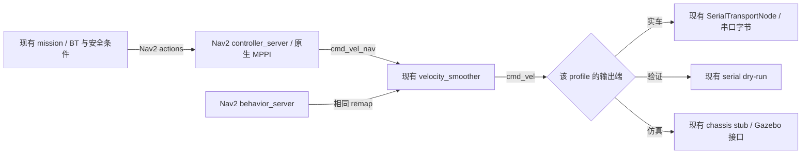
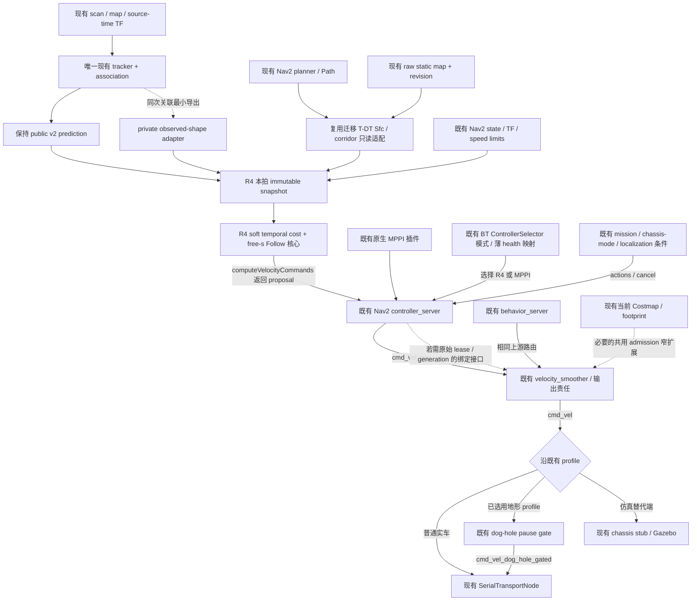

# R4 A03：全仓复用审计与最小接线边界

2026-10-04，Asia/Shanghai。审计基点：`main@d735ee12`；文档工作区：`build/r4_hws_prediction_consumption`，分支 `experiment/r4-hws-prediction-consumption`，审计前 HEAD `b95a4222`。本次仅修改文档，不新增 ROS/Nav2 运行代码、配置或实验。

**结论：R4 应成为现有 Nav2 控制器中的 prediction-consumption 提案源，继续经过既有速度输出链。A02 的 tracker、frontend、OutputArbiter 和独立输出进程保持测试 harness 身份。没有证据支持新增第二个 tracker、prediction pipeline、T-DT frontend、MPPI 或并行最终输出 owner。**

2026-10-05 的 [A06 接线前复核](r4_reuse_audit_checkpoint.md) 更新了十二项能力在 A04/A05 后的状态，并补充两个条件：普通 Phase 1/通用/仿真入口没有老车的 behavior 统一 remap，不能把老车 smoother 所有权推成全仓保证；若后续同时启用完整 T-DT，须共享 canonical Sfc provider target。A06 仅改文档，未开始 Follow 求解或 ROS/Nav2 接线。

main 中尚无动态 tracker/v2 prediction、迁移 T-DT、R2 critic/guard 和 integrity 包；这些是仓库已有、但未进入 main 的研究资产。复用它们需要限定范围的资产接入记录，不能把整个研究分支合并进正式链，也不能把“目录中存在”写成“正式运行中已使用”。

## 1. 范围、版本与证据等级

遵循 `docs/development_workflow.md`：main 保持可读可构建；研究在 experiment 分支；接口、接线、依赖和阶段计划同步记录；模块接入前记录来源、固定 commit、license 与修改范围。本次继续使用直接从 main 建立的 R4 分支，不在原研究 checkout 写文件。

| 标记 | 本次读取范围 | 能证明什么 |
|---|---|---|
| M | `main@d735ee12bd950dca0e691cdf2f2c61f35cef8ffc` 的源码、launch、配置 | 正式入口的配置/实现；不证明此刻实车运行 |
| L | `codex/dynamic-differential-risk@e680b1430db6efd8dc601d5585ee207e5f9b42a4` | 既有 T-DT 迁移、integrity、动态 clearance、可选地形 gate；不等于 main |
| D | `experiment/dynamic-surface-reveal@b5645eca` 的已提交 tracker/v2、geometry 和 R2 critic/guard | 已有实现与研究使用边界；不等于部署接受 |
| F | 冻结 R3 `04291a410f193c009e043af88e014cf420e1f68b`，只读 worktree `build/temporal_mpc_main_20261004` | 已有 Nav2 插件/selector/frontend/实验输出接线；不重跑、不修改 |
| H | A02 `b95a4222` 的 `experiments/r4_hws_prediction_consumption/` | 离线合同和数值原型；不作为生产接口/节点 |
| U | 原 checkout 十个 dirty/untracked 路径中的 member evidence 修改 | 待接受的实现参考，不能静默迁入或改写 |

额外遍历了本地 **33 个 branch heads** 的相关源码路径，并搜索 Twist/cmd_vel、publisher、guard、sanitizer、selector 和 transport。固定版本、匹配路径、SHA256、分支清单与可复核搜索范围见 [来源清单](r4_repository_reuse_sources.json)。搜索排除 vendor/test/tools/evidence 的批量内容；关键测试/历史证据另按需读取。两个用户提供的全量历史汇编无需通读，本文使用直接源码与针对性记录。

**运行证据边界：** 本次只读容器清单为空，没有启动 ROS、Nav2、Gazebo 或串口；因此没有当前 live graph 的 publisher 排他性证明。项目历史部署证据是 Humble Nav2 **1.1.20** 的 upstream launch 与库 hash（L8）；本机安装的 Jazzy launch 含不同的 collision-monitor/docking 链，不能代替项目 Humble 证据。下文“正式使用”指 main 入口已有配置；条件启用、研究试验使用和当前实车运行分别说明。

## 2. Reuse matrix

路径均相对相应固定版本的仓库根，完整 `commit:path` 和关键行号见第 7 节。类别：**直接复用**＝已有责任/算法不新建；**薄适配**＝字段/框架边界转换；**最小扩展**＝在已有实现中导出缺失信息或补充已有责任；**新增核心**＝R4 机制本身。一个能力可以包含不同类别的子项。

| R4 所需能力 | 现有源码与接口 | 正式链/研究链状态 | R4 复用决定；缺口与新增理由 |
|---|---|---|---|
| obstacle tracking / association | D1 `src/rm_dynamic_obstacle_tracking/rm_dynamic_obstacle_tracking/core.py`：`MultiObjectTracker.update`、`optimal_gated_assignment`、`cluster_point_indices`；D2 `dynamic_obstacle_tracker_node.py`：`DynamicObstacleTrackerNode`，输入 `/map`、`/local_scan` 与 source-time TF | main 无此包；已有 shadow producer，冻结 R3 的 ROS 试验也使用该 tracker 的固定副本。U1/U2/U3已有同次成员/assignment证据钩子，但未提交；H1 `tracker_core.py` 为离线副本 | **直接复用同一个 canonical tracker；最小扩展关联输出**。已提交 `TrackerUpdate` 没有 detection→track 对照，且节点聚类路径丢弃成员/原 beam 索引；应在已有 assignment/new-track 分支导出关联与成员。不要再跑 A02 tracker，不按最近质心事后猜关联，不改变 KF/匹配算法来接线。U 中的钩子仅作为待审参考 |
| prediction | D2 producer；D3/D4 `src/rm_competition_interfaces/msg/DynamicObstaclePrediction{Array,}.msg`；D5 `config/dynamic_obstacle_tracking_shadow.yaml`；D8 `model.hpp::validate/predict` | main 无公共 prediction 接线。已有 v1/v2 producer；默认 shadow 配置仍是 filtered/v1、有 decay，不能宣称默认就是 v2。冻结 R3 使用 `last_observation_cv`、无 decay/clip，试验 topic `/dynamic_obstacle_predictions`；标准默认 `/perception/dynamic_obstacles_shadow/predictions` | **直接复用 producer/public v2；薄适配消费**。选择已有 v2 模式，保持 `schema/authority/header/processing_stamp/complete/track_id/last_observation_stamp/position/velocity` 不变；控制器按绝对 stage 时刻从公开 CV anchor 推进一次。source-age 补偿是消费，不是第二个 predictor；不新增 forecast worker、未来占用 layer 或公共 v3 |
| observed shape | D6 `observed_surface_geometry.py::extract_observed_surface/propagate_nominal`；D7 `visible_box_geometry.py::fit_visible_box`；U3 `surface_member_evidence.py::SurfaceMemberEvidence`，私有 `rm_observed_surface_members/private_v1` 文件证据；H2 `observed_shape.py` | D6/D7 是离线几何；U 的文件输出不是 ROS 控制 API；main 没有生产 shape 接口；H2 是实验 raster | **复用同次 cluster/member provenance；薄适配 + 最小扩展 private shape transport；R4 observed-raster 表达属于消费核心**。v2只有 visible extent，没有 members/shape，不能从 `size` 还原已见轮廓。确需 private sidecar/typed callback，来源仍是已有唯一 tracker 的关联。不要 tail U 的证据文件充当生产输送，不从 MarkerArray 反解，不把 box fit 当全体几何证书 |
| static path / corridor frontend | M1 `old_car_2026_validation.launch.py`→upstream `planner_server/ComputePathToPose`→`nav_msgs/Path`；L1/L2/L3 `experiments/tdt_planner/rm_tdt_planner/{include/rm_tdt_planner/planner.hpp,src/planner.cpp,src/nav2_plugin.cpp}`：`prepare_grid/plan_prepared`、`TdtGlobalPlanner`；F1 `experiments/temporal_mpc/frontend/bridge.cpp`：existing YAstar/SfcSquare→anchors/`centre_bounds` | main 已有 Nav2 planner，老车 profile 为 Navfn；T-DT迁移由 `COLCON_IGNORE` 隔离，非默认；R3 bridge 在冻结离线试验使用。H3 `frontend.py` 原样复制 F 的 Python frontend，只供测试 | **直接复用现有 path 和迁移库；最小 corridor 导出适配**。T-DT `Result` 与 Nav2 plugin 目前只返回 polyline/Path，内部 Sfc 未通过公共 API 导出；R3 bridge 已证明可导出 bounds。优先在既有迁移库加只读 corridor 结果/绑定，或复用其既有桥接接口进行研究验证，不能复制 F/H frontend。R4 不要求为取得 corridor 再换一次 global planner；沿已有 Path 调用既有 Sfc 能力即可。静态证书须有 raw-static revision、path generation、frame、footprint 语义 |
| temporal dynamic cost | D8/D9 `model.hpp::predict/score`、`dynamic_obstacle_critic.cpp::DynamicObstacleCritic::score`；L9/L10 `rm_dynamic_clearance/{dynamic_clearance_node.py,core.py}`；H4 `soft_field.py` | R2 是实验 MPPI critic，非 main 默认；dynamic clearance 只发 `/navigation/dynamic_clearance_shadow`，不控制。main 原生 MPPI CostCritic 读当前 costmap，没有逐stage observed shape 消费 | **新增 R4 核心，复用输入验证/CV数学**。R2 的圆代理、collision-like penalty、MPPI固定候选，及 clearance 的 v1/固定 arrival-time 报告不能表达 HWS observed-raster stage soft cost。只新增每拍冻结 snapshot、一次 age 推进、shape field/soft residual；不要整套搬 R2 风险半径/未来硬门，不把未来 union 写入 current STVL |
| free path progress | M2 Nav2 `SimpleProgressChecker`（位移超时）与原生 MPPI `PathFollow/PathAlign/PathAngle` critics；L10 `_Polyline/_SpeedProfile`；F2 `temporal_mpc/frontend.py` 固定 cruise reference；H5 `follow.py` 与 `PreparedRoute` | main已有 progress checker/goal checker，研究已有 path 几何工具；没有被优化的自由 `s/s_dot` 控制变量 | **新增 R4 核心；复用 Path/corridor 与 goal/action**。位移 watchdog、shadow arrival-time profile、固定 wall-time reference 不等于自由路径进度。R4 仅新增 bounded Follow 的 `p(s),s_dot` 和对应 residual；goal判定仍用既有 Nav2 goal checker，不能再建 goal manager/全局 planner/Follow 终态停车责任 |
| Nav2 controller integration | M1/M3 `rm_navigation_bringup/launch/{old_car_2026_validation,navigation}.launch.py` include upstream Nav2 lifecycle/controller/action；F3 `ros2/rm_temporal_mpc_controller/src/controller.cpp::Controller : nav2_core::Controller`：`configure/activate/deactivate/cleanup/setPlan/setSpeedLimit/computeVelocityCommands` | main 正式使用 upstream controller server，默认 MPPI profile；F3 已有实验标准插件，但未进入正式 launch；其异步 proposal + 长时重验不是 R4 | **直接复用 Nav2 server/lifecycle/action；薄插件适配**。R4 core在 `computeVelocityCommands` 固定本拍输入、同步有界计算，返回 `TwistStamped` proposal，由 server发布。只借鉴 F3 的标准边界/指针生命周期，不复制 R3 worker/request/proposal流水线、native未来硬门或重写 controller server/lifecycle plumbing。配置频率、frame、速度限值必须从当前 profile读取，不能硬抄 A02 |
| current occupancy guard | M2 local STVL/costmap、原生 MPPI CostCritic 的 footprint 能力；D10/D11 `guard.hpp::check_command`、`safety_guard.cpp::SafetyGuard`；F3 `current_grid_clear`、F6 `execution_guard.py::StaticCells`；H6 `execution.py::CurrentGrid` | main有当前图与原生 controller碰撞检查；**没有已证实覆盖 B0/R4/全部行为输出的独立首个50ms admission gate**。R2独立 guard与R3实验最终 guard均含未来动态/stop-tail硬检查；F3首区间函数只服务R3、采样圆包络且假定 map frame | **直接复用当前 Costmap/footprint 几何；必要时最小共用 admission 适配**。仅提取符合当前图语义的 primitive，正确处理实际 polygon/interior/unknown、frame、age、锁顺序及执行区间；不能称 Nav2 perimeter footprint API 单独提供连续扫掠证书。whole R2/R3 guard会恢复长时动态 veto，不能加载；H6仅为测试 oracle/reference。B0与R4共同边界须落在已有控制/输出责任内，不新增独立最终 publisher |
| watchdog / lease / timeout | M2 smoother `velocity_timeout=1.0s`、20Hz；M4 `SerialTransportNode` steady-clock `cmd_vel_timeout_sec=0.2s`、100Hz写帧；M5 `ChassisInterfaceStub` watchdog0.5s；M6 chassis-mode gate0.5s；F5 selector health0.1s；D11 guard command/odom0.15s | 正式可选 smoother/serial/stub及mode有效性责任存在；F/D guard/selector是实验。H6 的75ms lease仅离线 | **直接复用现有 watchdog；配置优先，无法表达时最小 lease provenance/owner扩展**。Twist 没有 source generation/deadline；smoother连续发出 held command 会刷新串口接收时间，因此0.2s串口 timeout不等于75ms solver lease。20Hz输出与10Hz controller本身也不满足无条件75ms续租。需要严格区分上游有效提案年龄与下游接收年龄；不得仅给R4再建 OutputArbiter。详见第4节 |
| MPPI fallback | M2 `FollowPath`→`nav2_mppi_controller::MPPIController`；F4 `dual_controller_humble.yaml`、`runtime_tree.xml::ControllerSelector/FollowPath`；F5 `selector_node.py::Selector`、`selection.py::Selection` | 原生 MPPI在 main deployment profile已有；双controller/health supervisor只在冻结R3试验。没有此刻live fallback证明；H 的 `mppi offer` 未连真实 MPPI | **直接复用原生 MPPI；薄适配既有 controller-selection 模式**。R4失效→既有BT/selector切回 MPPI，再由同一个 controller server输出。修改controller ID/health映射即可，不实现MPPI、不另起MPPI output worker。selector选项变化不是当前卡住compute的即时抢占；求解线程阻塞时先由既有输出 watchdog安全退化，恢复后再切控制器，不能许诺零间隔fallback |
| final velocity command ownership / publisher | M1 group `SetRemap(cmd_vel→cmd_vel_nav)`；L8 Humble controller/behavior/smoother launch；M2 velocity_smoother：`cmd_vel_nav→cmd_vel`；L11/L12 `old_car_full_terrain_navigation.launch.py` 与 `DogHoleEntryPauseGateNode`：可选 `cmd_vel→cmd_vel_dog_hole_gated`；F7 `execution_guard_node.py` 发布cmd_vel；H6 `OutputArbiter` | main老车链设计上的末级ROS publisher为 smoother；串口是唯一所选输入的消费者。L地形gate不在main，启用时串口输入改门控话题，gate成为末级ROS输出；F7是研究替代接线，H6没有ROS publisher | **直接复用 profile 的既有唯一末级 owner；R4只提供前端proposal**。controller/behavior可共享上游 topic，但不能与末级并行争抢。没有找到main twist_mux/通用lease仲裁器；这不证明须新增owner，因为控制器选择已有Nav2接口。禁止把F7/H6并行接到main cmd_vel或绕过L gate；第3节给出逐profile所有权结论 |
| serial/chassis output | M4 `src/rm_serial_driver/src/serial_transport_node.cpp::SerialTransportNode`；M7 `include/rm_serial_driver/protocol.hpp` 与 `src/protocol.cpp::encode_*`；M8 dry-run；M5 chassis stub；M9 `rm_simulation/launch/phase1_5_gazebo.launch.py` | main已有 opt-in real serial/dry-run，launch禁止两者同时启用；stub是仿真接口，其输出 `/simulation/chassis/cmd_vel`，反馈 `/chassis/twist_raw`。本次未连硬件 | **直接复用，R4无需新增输出模块/协议**。保持ROS Twist→限幅/超时→现有协议/字节的边界与启用互斥；仿真和串口按profile择一。不要让R4另写端口、直接发底盘、创建新串口owner或擅改底盘安全flags；串口层没有原始solver lease信息，也没有直接订阅chassis E-stop作为通用速度安全门 |

## 3. 现有实际输出所有权，以及 A02 方案的修正

### 3.1 main 老车 Nav2 运行配置

M1 第383–400行把 Nav2 motion producer 的 `cmd_vel` 统一 remap 到 `cmd_vel_nav`，并包含 upstream `navigation_launch.py`；项目注明这是为了让 behavior_server 的输出也经过 smoother。L8 第218–285行记录 Humble controller→`cmd_vel_nav`、smoother输入→`cmd_vel_nav`、smoother输出→`cmd_vel`。M1 第419–441行将串口/dry-run接到 `/cmd_vel`，并在第70–73行拒绝两者同时启用。

图中的输出端按profile选择，**不是三端同时部署的授权**。标准 `navigation.launch.py` 也复用 upstream Nav2，但不同阶段/版本的行为 remap 应按最终 launch 展开复核；不能从老车明确 remap 推出所有历史入口都已获得全局排他性。ROS/DDS没有因这张图自动获得 publisher token；未来小范围接线必须核查最终话题的发布者和串口真实输入，而本次未启动运行图。

### 3.2 既有可选地形 gate 与研究 guard

L11 第123–170行在狗洞 pause启用时把串口输入从 `/cmd_vel` 改为 `/cmd_vel_dog_hole_gated`；L12 第107/134行分别发布门控输出、订阅上游命令。L12 第227–248行是透明转接或置零；它持有入口 stop/hold 状态及定位/path有效性，不是 MPPI。此时 R4与MPPI均在该 gate 上游，不能另发门控话题或直接喂串口。此资产仅在L研究分支，不应为了R4把地形gate普遍启用。

R2 `SafetyGuard` 默认 `/dynamic_test/cmd_vel_smoothed→/dynamic_test/cmd_vel_guarded`，冻结R3 `GuardNode` 使用 `temporal_mpc/smoothed_cmd_vel→cmd_vel`。这些是**替代式实验接线**；只有原 smoother被 remap 到内部输入、末级话题只有guard发布时才成立。它们不是 main 已接受的统一速度owner，整套迁入还会重新引入未来硬动态/stop-tail veto。

**修正 A02 的“独立实际输出所有者 + MPPI fallback”：** 独立于solver的故障输出责任是需求，不是新节点/新publisher的必要性证明。现有 smoother与serial有各自timer/watchdog，且 MPPI 已经在 Nav2 内。将 A02 `OutputArbiter` 升级为另一个cmd publisher，会重复 controller选择、减速/timeout、最终topic与串口权限，还可能绕过地形gate。后续改为 **R4 proposal→既有controller选择/输出owner→既有串口/仿真端**；A02独立进程probe继续只验证离线失效合同。

### 3.3 integrity 与正式安全状态的真实边界

L7 `LocalizationIntegrityNode` 明确只接受 `mode=shadow`，仅发布 `DiagnosticArray` 到 `/diagnostics`，没有cmd、TF或action控制权限。T-DT `audit_sanitizer_chain.py/run_core_sanitizers.sh` 所称 sanitizer 是 **ASan/UBSan 构建检查**，不是cmd_vel sanitizer；全仓相关搜索没有发现main通用速度sanitizer/lease mux。

M10 `CompetitionMissionNode` 通过 `/localization/global_localization_valid`、referee和 `/chassis/mode` 判断 `safetyReady()`，并取消/保持 NavigateToPose；接口还包括 `/mission/set_mode`、Spin action和mission状态。M6 `ChassisModeGateNode` 超时发布 invalid/ESTOP mode，M11 map→odom bridge拥有定位有效性与 `/localization/reset_map_to_odom`；M12 readiness只发 `/system/readiness`。这些责任应复用，不能把shadow integrity写成速度安全状态机，也不能把“mission会取消goal”写成“每个串口帧已独立检查E-stop”。

## 4. 确实缺失的表达能力与最小适配

### 4.1 同一关联的 observed shape；公开 v2 不变

公开v2无 `sequence` 字段，也无beam/member/raster。A02 dict中的sequence是实验内部字段，不可假定它存在于ROS wire。最小sidecar需由**同一个producer、同一轮assignment**产生，以 source header epoch、track_id、整数 last_observation_stamp 和 producer内的关联/重置身份绑定；额外receipt sequence/generation放private metadata或内部typed callback，不新增公共v2字段。相同source内容热改、time reset、coasting、members丢失和truncate必须显式处理。

U中已做 `cluster_detections_with_members`、`capture_assignments`、原beam索引与detection→track hook；它证明缺口可在原tracker内小范围表达。但U尚未提交，`SurfaceMemberEvidence`只是bounded JSON证据写盘，不能把文件轮询当生产sidecar。应先接受原producer的最小hook，再通过private read-only接口投影 observed raster；形状历史、全体支持和CV误差仍分别记录。producer继续保留shadow authority，R4消费它作为引导，不升级为底盘authority。

### 4.2 复用静态 frontend，不引入第三套规划器

L1 `Result` 没有corridor，L2内部使用既有 MinimumSnap/Sfc 后最终返回验证后的polyline；L3 `TdtGlobalPlanner::createPlan` 只返回NavMsgsPath。F1 已把既有YAstar/SfcSquare导出为anchors与centre_bounds，可供受限研究验证；生产应优先对同一迁移库提供只读corridor结果，而非复制bridge/frontend并长期维护第二实现。

controller的 `setPlan(Path)` 管理path generation；corridor适配在路径/静态revision变化时准备，控制拍只读冻结结果。raw-static证书与当前STVL snapshot必须分开；注意T-DT `ObstacleSeeds/Nav2Master` 的253语义和避免重复footprint inflation。main旧车local costmap为odom，F的原型假定map；不修改正式TF来迎合原型。既有T-DT C++ OSQP0.6.3/OsqpEigen0.8.1与A02 Python OSQP1.0.5也不能静默混成同一ABI/部署依赖，本次未安装或改变任何solver。

### 4.3 共用当前占用保护的接入位置仍需限定

Nav2有当前Costmap/footprint工具、MPPI CostCritic和行为server碰撞检查，但现有正式入口没有可直接声明为“B0/R4共用连续首区间gate”的实现。F3的first-interval检查和H6 oracle可作为需求参考；F3采样圆包络/固定frame及完整R3validate均不能直接升级为该gate。

拟议边界是已有controller host/末级owner中的**共用admission接口**，输入实际待发送命令与当下costmap/state，输出允许/退化及诊断；两种controller经过相同边界，必要时也覆盖behavior输出。标准Nav2 `nav2_core::Controller` 本身没有全局最终发送hook，不能声称加一个R4plugin就覆盖了MPPI/behavior。后续应先核定当前版本owner的窄扩展点；若确需minimal extension，扩展该责任而不添加并行publisher。连续性、锁顺序、成本阈值、inside footprint、unknown和地图边界须单独验收；不修改R2/R3保护后再称原样复用，也不减小机械几何。

### 4.4 75ms lease 与 MPPI fallback 是两个不同问题

| 现有责任 | 已有数值/行为 | 尚不能保证 |
|---|---|---|
| old-car controller | 10Hz；failure tolerance0.3s；既有goal/progress checker | 不经修改就产生20Hz R4有效提案/75ms续租 |
| velocity_smoother | 20Hz；速度/rate限制；input timeout1.0s | held command在原提案过期时自动失效；上游solver阻塞的75ms期限 |
| serial transport | wall timer100Hz；steady receive timeout0.2s后速度置零 | 识别仍被smoother刷新Twist的旧提案；有界物理制动证书 |
| chassis stub | 0.5s watchdog；仿真mock command/feedback置零 | 实车硬件制动/同样的lease边界 |
| R3 selector | 0.1s health；退回原生MPPI ID | 抢占卡住的controller计算线程，立即得到MPPI新命令 |

首先评估已有timeout/频率配置能否满足被明确登记的期限；**本次不改配置，也不放宽75ms观察门**。若要求原始proposal的绝对有效期限、generation撤销和timer独立退化，普通Twist无法表达其来源，允许新增最小private metadata/内部接口并让**既有末级owner**消耗它；metadata必须与速度提案原子绑定，覆盖所选MPPI/behavior路径，不能靠一个可能乱序或失联的“健康心跳”延长旧命令。goal cancel、inactive lifecycle和time reset也需撤销旧generation。

owner的窄扩展点、退化命令是否符合现有limits以及末级所发命令反馈尚未实施/证明。若确实需要owner扩展，其范围仅此缺失合同，并先给出版本/API证据；当前没有“现有架构无法仲裁”的证明，所以**不应另建final owner**。短时安全退化也不是MPPI：MPPI仍由controller server恢复正常计算后经已有selector选择；不在独立线程重新实现一个MPPI来绕开阻塞。

## 5. 拟议最小接线图

下面是审计后的设计，**不是已实现的ROS图**。实线表示复用责任/拟议输入输出；虚线表示尚缺表达、需要最小适配的边界。`R4 proposal` 首选标准 `computeVelocityCommands` 返回值，未要求新增proposal topic或异步worker。

共用admission/lease最终位于host还是owner，需要按实际Nav2版本与发送hook确定；图将发送相关责任放在owner侧，防止把R4私有校验误写成全链保护。R4 node不得另接最终topic/串口。controller selection处理算法选择，末级owner处理发送、limits与timeout，serial处理字节与自身receive timeout；这些职责不由H6统一取代。所选地形gate的stop/hold和定位条件继续优先，R4不与它抢权限。

## 6. 后续生产代码的允许范围与停止点

| 类别 | 允许的最小工作 | 不应自动迁入的 A02 / 冻结实现 |
|---|---|---|
| R4核心 | 冻结snapshot、observed-raster消费、stage-aligned soft field、free-s bounded Follow、warm状态撤销与诊断 | H1 tracker、H3 frontend、H6 OutputArbiter/CurrentGrid、fault_probe/probes、整套R3validate/worker |
| producer适配 | 原tracker同次assignment/member hook；private shape transport；public v2→内部只读投影 | 第二tracker/预测器、独立scan重聚类关联、public v3、marker反解析、U文件tailer |
| 静态适配 | 迁移库只读corridor导出/绑定、path/static revision与frame证书 | 复制YAstar/Sfc/MinimumSnap/frontend，控制拍再规划、未来union占用层 |
| Nav2适配 | 一个标准R4controller插件host，复用lifecycle/action/setPlan/setSpeedLimit；既有selector薄映射 | 第二controller server/goal manager、自制MPPI、异步worker改名“同步”、新并行cmd publisher |
| 执行合同 | 优先已有timeout/limits配置；仅缺少lease provenance/shared admission时，在既有owner责任中窄扩展 | 升级A02独立arbiter为生产输出owner、整套R2/R3未来硬guard、绕过串口/地形gate |

**接线前仍需决定/核实：** (1) canonical tracker的最小member hook接入来源，不能使用未接受dirty代码；(2) corridor导出API与静态certificate；(3) 目标Humble版本下现有owner的lease/admission窄扩展点和profile实际输出路由；(4) fallback selector与生命周期撤销合同。未完成这些具体边界前，保持运行编码暂停，不能以“ROS化A02”代替接口审阅。

以上是A03交付时的暂停点。用户随后回复“继续吧”，A04先固定具体接口并接入单producer的members最小适配，见 [A04](r4_minimal_adapter_contracts.md)。Sfc可直接调用已有公开API；lease/current-admission的原owner窄扩展仍是后续工作，A03关于不新增并行最终publisher的结论保持。

审计后下一阶段先形成上述薄适配的具体接口变更清单与小范围验证计划，沿现有owner接线；本次没有开始这些编码，也没有运行新的大规模实验。原机械body/padding、物理净空、时延观察门和R3冻结规则保持其已登记值；A02速度/几何数值不会自动覆盖main旧车profile。最终目标仍是嵌入已验证有价值的prediction-consumption逻辑，不是把离线harness全部转成ROS节点。

## 7. 源码索引与核查记录

下列索引按固定版本阅读，`L/D`中未在R4 checkout存在的路径通过git对象读取，没有复制源码。行号为对应版本的源码行；完整commit、blob/hash与搜索清单见 [JSON](r4_repository_reuse_sources.json)。本节由同一清单生成，避免把主checkout的dirty文件当固定来源。

| ID | 固定版本源码路径 | 关键行（完整命中内容见JSON） |
|---|---|---|
| M1 | [src/rm_navigation_bringup/launch/old_car_2026_validation.launch.py](/home/qihei/rm2027_navigation/build/r4_hws_prediction_consumption/src/rm_navigation_bringup/launch/old_car_2026_validation.launch.py:16) | 16, 83, 389, 391, 424, 435 |
| M2 | [src/rm_nav_config/config/nav2_old_car_2026_left_stvl.yaml](/home/qihei/rm2027_navigation/build/r4_hws_prediction_consumption/src/rm_nav_config/config/nav2_old_car_2026_left_stvl.yaml:4) | 4, 16, 26, 30, 36, 42, 47, 83 |
| M3 | [src/rm_navigation_bringup/launch/navigation.launch.py](/home/qihei/rm2027_navigation/build/r4_hws_prediction_consumption/src/rm_navigation_bringup/launch/navigation.launch.py:1) | 1 |
| M4 | [src/rm_serial_driver/src/serial_transport_node.cpp](/home/qihei/rm2027_navigation/build/r4_hws_prediction_consumption/src/rm_serial_driver/src/serial_transport_node.cpp:172) | 172, 178, 184, 185, 225, 229, 237, 253 |
| M5 | [src/rm_chassis_interface/src/chassis_interface_stub.cpp](/home/qihei/rm2027_navigation/build/r4_hws_prediction_consumption/src/rm_chassis_interface/src/chassis_interface_stub.cpp:12) | 12, 23, 24, 25, 28, 31, 32, 35 |
| M6 | [src/rm_chassis_interface/src/chassis_mode_gate_node.cpp](/home/qihei/rm2027_navigation/build/r4_hws_prediction_consumption/src/rm_chassis_interface/src/chassis_mode_gate_node.cpp:11) | 11, 27, 29 |
| M7 | [src/rm_serial_driver/include/rm_serial_driver/protocol.hpp](/home/qihei/rm2027_navigation/build/r4_hws_prediction_consumption/src/rm_serial_driver/include/rm_serial_driver/protocol.hpp:43) | 43, 83 |
| M7b | [src/rm_serial_driver/src/protocol.cpp](/home/qihei/rm2027_navigation/build/r4_hws_prediction_consumption/src/rm_serial_driver/src/protocol.cpp:1) | 1 |
| M8 | [src/rm_serial_driver/src/serial_dry_run_node.cpp](/home/qihei/rm2027_navigation/build/r4_hws_prediction_consumption/src/rm_serial_driver/src/serial_dry_run_node.cpp:19) | 19, 57, 63, 69, 85, 86, 89, 91 |
| M9 | [src/rm_simulation/launch/phase1_5_gazebo.launch.py](/home/qihei/rm2027_navigation/build/r4_hws_prediction_consumption/src/rm_simulation/launch/phase1_5_gazebo.launch.py:68) | 68, 123, 124 |
| M10 | [src/rm_competition_mission/src/competition_mission_node.cpp](/home/qihei/rm2027_navigation/build/r4_hws_prediction_consumption/src/rm_competition_mission/src/competition_mission_node.cpp:53) | 53, 125, 218, 257, 341, 359, 586 |
| M11 | [src/rm_relocalization_bridge/src/map_odom_from_global_pose.cpp](/home/qihei/rm2027_navigation/build/r4_hws_prediction_consumption/src/rm_relocalization_bridge/src/map_odom_from_global_pose.cpp:57) | 57, 95, 98 |
| M12 | [src/rm_system_monitor/rm_system_monitor/readiness_monitor.py](/home/qihei/rm2027_navigation/build/r4_hws_prediction_consumption/src/rm_system_monitor/rm_system_monitor/readiness_monitor.py:15) | 15, 61 |
| M13 | [docs/development_workflow.md](/home/qihei/rm2027_navigation/build/r4_hws_prediction_consumption/docs/development_workflow.md:112) | 112 |
| M14 | [src/rm_navigation_bringup/launch/old_car_2026_competition.launch.py](/home/qihei/rm2027_navigation/build/r4_hws_prediction_consumption/src/rm_navigation_bringup/launch/old_car_2026_competition.launch.py:1) | 1 |
| L1 | `e680b143:experiments/tdt_planner/rm_tdt_planner/include/rm_tdt_planner/planner.hpp` | 14, 25, 45, 54, 57, 67, 68, 69 |
| L2 | `e680b143:experiments/tdt_planner/rm_tdt_planner/src/planner.cpp` | 409, 453, 464, 465, 477, 489 |
| L3 | `e680b143:experiments/tdt_planner/rm_tdt_planner/src/nav2_plugin.cpp` | 4, 19, 22, 67, 87, 89, 92, 139 |
| L4 | `e680b143:experiments/tdt_planner/rm_tdt_planner/src/snapshot_guard.cpp` | 1 |
| L5 | `e680b143:experiments/tdt_planner/rm_tdt_planner/vendor/tdt_nav/MinimumSnapOsqp/sfcSquare.hpp` | 23, 29, 30, 31, 82, 93 |
| L6 | `e680b143:docs/external/tdt_nav_kit.md` | 3, 8, 9, 43, 45, 46, 48, 53 |
| L7 | `e680b143:src/rm_navigation_integrity/rm_navigation_integrity/localization_integrity_node.py` | 82, 87, 88, 89, 253, 577 |
| L8 | `e680b143:docs/tdt_migration/evidence/dynamic_failure_analysis_20260922/installed_mppi_and_command_route.txt` | 1, 2, 3, 4, 145, 224, 285, 294 |
| L9 | `e680b143:src/rm_dynamic_clearance/rm_dynamic_clearance/dynamic_clearance_node.py` | 1, 28, 40, 42, 52, 57, 132, 149 |
| L10 | `e680b143:src/rm_dynamic_clearance/rm_dynamic_clearance/core.py` | 13, 14, 15, 31, 35, 42, 48, 59 |
| L11 | `e680b143:src/rm_navigation_launch/launch/old_car_full_terrain_navigation.launch.py` | 4, 123, 139, 169, 170, 320 |
| L12 | `e680b143:src/rm_dog_hole_entry_gate/rm_dog_hole_entry_gate/node.py` | 27, 56, 57, 59, 60, 73, 75, 107 |
| L13 | `e680b143:src/rm_dog_hole_entry_gate/rm_dog_hole_entry_gate/core.py` | 18, 32, 41, 149 |
| L14 | `e680b143:experiments/tdt_planner/rm_tdt_planner/tools/audit_sanitizer_chain.py` | 1 |
| L15 | `e680b143:experiments/tdt_planner/rm_tdt_planner/tools/run_core_sanitizers.sh` | 12, 13 |
| D1 | `b5645eca:src/rm_dynamic_obstacle_tracking/rm_dynamic_obstacle_tracking/core.py` | 49, 220, 273, 374, 476, 509, 511, 676 |
| D2 | `b5645eca:src/rm_dynamic_obstacle_tracking/rm_dynamic_obstacle_tracking/dynamic_obstacle_tracker_node.py` | 47, 59, 60, 110, 114, 117, 183, 188 |
| D3 | `b5645eca:src/rm_competition_interfaces/msg/DynamicObstaclePredictionArray.msg` | 2, 4, 5, 9, 10, 14, 15, 16 |
| D4 | `b5645eca:src/rm_competition_interfaces/msg/DynamicObstaclePrediction.msg` | 5, 10, 12, 13, 14, 16, 17, 21 |
| D5 | `b5645eca:src/rm_dynamic_obstacle_tracking/config/dynamic_obstacle_tracking_shadow.yaml` | 9 |
| D6 | `b5645eca:src/rm_dynamic_obstacle_tracking/rm_dynamic_obstacle_tracking/observed_surface_geometry.py` | 20, 24, 39, 44, 45, 53, 55, 58 |
| D7 | `b5645eca:src/rm_dynamic_obstacle_tracking/rm_dynamic_obstacle_tracking/visible_box_geometry.py` | 17, 40, 52, 56, 77 |
| D8 | `b5645eca:src/rm_dynamic_obstacle_critic/include/rm_dynamic_obstacle_critic/model.hpp` | 40, 162, 164, 165, 201 |
| D9 | `b5645eca:src/rm_dynamic_obstacle_critic/src/dynamic_obstacle_critic.cpp` | 11, 105, 110, 145, 157, 186, 191 |
| D10 | `b5645eca:src/rm_dynamic_obstacle_critic/include/rm_dynamic_obstacle_critic/guard.hpp` | 5, 6, 11, 25, 30, 45, 46, 65 |
| D11 | `b5645eca:src/rm_dynamic_obstacle_critic/src/safety_guard.cpp` | 13, 17, 19, 24, 33, 103, 104 |
| D12 | `b5645eca:src/rm_dynamic_obstacle_critic/src/native_command_observer.cpp` | 11, 14 |
| F1 | [experiments/temporal_mpc/frontend/bridge.cpp](/home/qihei/rm2027_navigation/build/temporal_mpc_main_20261004/experiments/temporal_mpc/frontend/bridge.cpp:3) | 3, 25, 26, 29, 30, 32, 35, 36 |
| F2 | [experiments/temporal_mpc/temporal_mpc/frontend.py](/home/qihei/rm2027_navigation/build/temporal_mpc_main_20261004/experiments/temporal_mpc/temporal_mpc/frontend.py:15) | 15, 18, 23, 28 |
| F3 | [experiments/temporal_mpc/ros2/rm_temporal_mpc_controller/src/controller.cpp](/home/qihei/rm2027_navigation/build/temporal_mpc_main_20261004/experiments/temporal_mpc/ros2/rm_temporal_mpc_controller/src/controller.cpp:47) | 47, 49, 83, 88, 92, 97, 100, 106 |
| F4 | [experiments/temporal_mpc/integration/dual_controller_humble.yaml](/home/qihei/rm2027_navigation/build/temporal_mpc_main_20261004/experiments/temporal_mpc/integration/dual_controller_humble.yaml:26) | 26, 28, 40, 110 |
| F4b | [experiments/temporal_mpc/integration/runtime_tree.xml](/home/qihei/rm2027_navigation/build/temporal_mpc_main_20261004/experiments/temporal_mpc/integration/runtime_tree.xml:5) | 5, 7, 8 |
| F5 | [experiments/temporal_mpc/integration/selector_node.py](/home/qihei/rm2027_navigation/build/temporal_mpc_main_20261004/experiments/temporal_mpc/integration/selector_node.py:4) | 4, 16, 18, 23, 24, 25 |
| F5b | [experiments/temporal_mpc/temporal_mpc/selection.py](/home/qihei/rm2027_navigation/build/temporal_mpc_main_20261004/experiments/temporal_mpc/temporal_mpc/selection.py:5) | 5, 6, 10, 16, 17, 23, 25, 30 |
| F6 | [experiments/temporal_mpc/temporal_mpc/execution_guard.py](/home/qihei/rm2027_navigation/build/temporal_mpc_main_20261004/experiments/temporal_mpc/temporal_mpc/execution_guard.py:27) | 27, 35, 36, 37, 38, 47, 69, 81 |
| F7 | [experiments/temporal_mpc/integration/execution_guard_node.py](/home/qihei/rm2027_navigation/build/temporal_mpc_main_20261004/experiments/temporal_mpc/integration/execution_guard_node.py:22) | 22, 35, 37, 108 |
| F8 | [experiments/temporal_mpc/ros2/rm_dynamic_obstacle_tracking/rm_dynamic_obstacle_tracking/core.py](/home/qihei/rm2027_navigation/build/temporal_mpc_main_20261004/experiments/temporal_mpc/ros2/rm_dynamic_obstacle_tracking/rm_dynamic_obstacle_tracking/core.py:12) | 12, 18, 25, 33, 34, 49, 76, 220 |
| H1 | [experiments/r4_hws_prediction_consumption/r4_hws/tracker_core.py](/home/qihei/rm2027_navigation/build/r4_hws_prediction_consumption/experiments/r4_hws_prediction_consumption/r4_hws/tracker_core.py:12) | 12, 18, 25, 33, 34, 49, 79, 223 |
| H2 | [experiments/r4_hws_prediction_consumption/r4_hws/observed_shape.py](/home/qihei/rm2027_navigation/build/r4_hws_prediction_consumption/experiments/r4_hws_prediction_consumption/r4_hws/observed_shape.py:12) | 12, 52, 61, 66, 70, 72, 74, 82 |
| H3 | [experiments/r4_hws_prediction_consumption/r4_hws/frontend.py](/home/qihei/rm2027_navigation/build/r4_hws_prediction_consumption/experiments/r4_hws_prediction_consumption/r4_hws/frontend.py:15) | 15, 18, 23, 28 |
| H4 | [experiments/r4_hws_prediction_consumption/r4_hws/soft_field.py](/home/qihei/rm2027_navigation/build/r4_hws_prediction_consumption/experiments/r4_hws_prediction_consumption/r4_hws/soft_field.py:14) | 14, 18, 22, 77 |
| H5 | [experiments/r4_hws_prediction_consumption/r4_hws/follow.py](/home/qihei/rm2027_navigation/build/r4_hws_prediction_consumption/experiments/r4_hws_prediction_consumption/r4_hws/follow.py:18) | 18, 47, 71, 209 |
| H5b | [experiments/r4_hws_prediction_consumption/r4_hws/contracts.py](/home/qihei/rm2027_navigation/build/r4_hws_prediction_consumption/experiments/r4_hws_prediction_consumption/r4_hws/contracts.py:17) | 17, 41, 42, 59, 120, 134, 162, 177 |
| H6 | [experiments/r4_hws_prediction_consumption/r4_hws/execution.py](/home/qihei/rm2027_navigation/build/r4_hws_prediction_consumption/experiments/r4_hws_prediction_consumption/r4_hws/execution.py:15) | 15, 22, 76, 87, 96 |
| H7 | [experiments/r4_hws_prediction_consumption/r4_hws/consumer.py](/home/qihei/rm2027_navigation/build/r4_hws_prediction_consumption/experiments/r4_hws_prediction_consumption/r4_hws/consumer.py:15) | 15, 22, 30 |
| U1 | [src/rm_dynamic_obstacle_tracking/rm_dynamic_obstacle_tracking/core.py](/home/qihei/rm2027_navigation/src/rm_dynamic_obstacle_tracking/rm_dynamic_obstacle_tracking/core.py:55) | 55, 286, 545, 546, 547, 548, 618, 619 |
| U2 | [src/rm_dynamic_obstacle_tracking/rm_dynamic_obstacle_tracking/dynamic_obstacle_tracker_node.py](/home/qihei/rm2027_navigation/src/rm_dynamic_obstacle_tracking/rm_dynamic_obstacle_tracking/dynamic_obstacle_tracker_node.py:39) | 39, 104, 106, 352, 354, 358, 371, 374 |
| U3 | [src/rm_dynamic_obstacle_tracking/rm_dynamic_obstacle_tracking/surface_member_evidence.py](/home/qihei/rm2027_navigation/src/rm_dynamic_obstacle_tracking/rm_dynamic_obstacle_tracking/surface_member_evidence.py:1) | 1, 18, 19 |

## 8. 文档变更与保留验证

本次新增本审计和来源/验证清单，并在A01设计、A02实现/README与progress中明确撤销“新建独立实际输出所有者”的后续方向；保留历史数值结果。没有修改 `src/`、运行launch/YAML、公开v2接口或A02实验代码；不重跑46项离线测试来冒充此次运行集成验收。

验证包含：Markdown链接与源码索引存在性、固定源码SHA256、12项能力覆盖、两幅图的节点/边界检查、仅文档diff，以及main/origin-main、原checkout/head/dirty内容、冻结R3/head/clean和研究heads/tags/remotes保持核查。对大untracked `core`只核对size，未读入/删除。结果与精确保护范围写入 [来源/验证清单](r4_repository_reuse_sources.json)；最终publisher排他性、租约与物理输出仍未运行验证。

A05继续落实唯一producer下游的C++消费值库与原Sfc provider薄绑定，见 [A05](r4_consumer_library.md)；没有恢复A02 tracker/frontend/execution生产化或新增输出owner。
