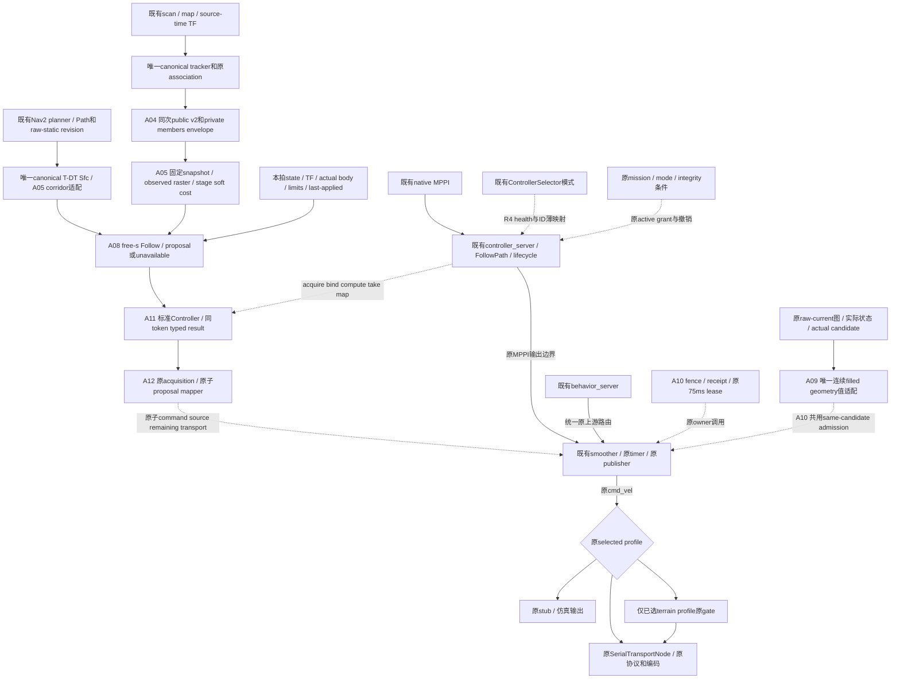

# R4 返回验收点：复用结论、最小实现与剩余接线条件

2026-10-05，Asia/Shanghai。工作分支 `experiment/r4-hws-prediction-consumption`，独立worktree `build/r4_hws_prediction_consumption`，直接基点 `main@d735ee12bd950dca0e691cdf2f2c61f35cef8ffc`。遵循 [开发规范](../development_workflow.md)，没有修改main或原研究checkout。

**结论：R4应嵌入现有导航架构，成为原controller host的prediction-consumption提案源。最小消费核心、共用值适配、可选标准Controller与源proposal mapper已通过有限验收；正式运行接线、闭环收益、真实75ms执行及MPPI fallback尚未验收。当前停在A12，保持Follow/插件默认关闭。**

没有新增第二tracker、prediction pipeline、T-DT frontend、MPPI、最终cmd publisher/owner或串口通路。A02的tracker/frontend/execution/独立arbiter仍是测试harness，没有自动升级生产身份。A09/A10 execution包是原owner可调用的被动值函数，没有速度生成、选择或发布；不是第二套导航链。

## 证据与审计范围

全仓搜索与逐项来源来自 [A03审计](r4_repository_reuse_audit.md) 和 [A06接线前复核](r4_reuse_audit_checkpoint.md)，涵盖main、已有T-DT/integrity/terrain迁移、dynamic tracking/R2与冻结R3/A02。固定源索引是 [63项源码清单](r4_repository_reuse_sources.json)，不是只搜索当前R4目录。A12重新核对固定摘要/关键行、92个受保护refs、33个分支head，以及原checkout十个dirty路径和冻结R3。

下表“正式链”表示main中的源码/launch/config；没有启动正式Nav2 graph或核实实车publisher排他性。M/L/D/F/H编号与原路径/版本详见A03第7节：M为main，L为`e680b143`迁移，D为`b5645eca` tracker/v2研究资产，F为冻结R3 `04291a41`，H为A02 `b95a4222`。表中的R4新路径在本工作分支，不代表部署接受。

## 最新十二项reuse matrix

| 能力 | 已有源码及接口/topic/class | 正式链状态 | R4选择、最小实现与必要性 |
|---|---|---|---|
| obstacle tracking / association | D1/D2：`src/rm_dynamic_obstacle_tracking/rm_dynamic_obstacle_tracking/{core.py,dynamic_obstacle_tracker_node.py}`；`MultiObjectTracker.update` / `optimal_gated_assignment`，map/scan/source-time TF。F8为冻结拷贝，H1 `tracker_core.py`为harness | main无该包；研究shadow producer存在；A04只在本分支接入 | **直接复用+最小association导出**。一次原tracker update，导出同次assignments/new-track；不新增tracker、重聚类或第二次质心关联。A04 producer源码本轮不变 |
| prediction | D2–D4：原node与`src/rm_competition_interfaces/msg/DynamicObstaclePrediction{,Array}.msg`；public `/perception/dynamic_obstacles_shadow/predictions`，既有v2 `last_observation_cv` | main未接入动态v2；研究shadow不等于正式导航使用 | **直接复用public v2+消费adapter**。两份msg逐字节保持；A04 private envelope内嵌同次public值。A05 stage-age推进是消费现有CV预测，不另起prediction pipeline |
| observed shape | D6/D7 observed/visible surface geometry，U3 `surface_member_evidence.py`未接受；A04 `observed_members.py`、`src/rm_r4_interfaces/msg/{ObservedTrackMembers,ObservedPredictionEnvelope}.msg`；private `/perception/dynamic_obstacles_shadow/observed_predictions` | main无member API；A04 private输出默认OFF；H2为实验 | **必要private薄适配+raster消费**。public v2 extent缺beam/member provenance，故同次association的原子envelope必要；不改public、不读取U evidence文件、不补隐藏完整形状或重建tracker |
| static path / corridor frontend | M1/M2既有`ComputePathToPose` / `nav_msgs/Path`、Navfn；L1–L5 `experiments/tdt_planner/rm_tdt_planner/{src/nav2_plugin.cpp,vendor/tdt_nav/MinimumSnapOsqp/sfcSquare.cpp}`，`TdtGlobalPlanner` / `SfcSquare::getCorridor`；F1 bridge | main为Navfn；完整迁移T-DT是opt-in研究；A05 corridor未被正式链调用 | **复用现有Path与唯一canonical Sfc+薄值适配**。`src/rm_r4_prediction_consumption/src/corridor.cpp::PreparedCorridor`不复制frontend；A11共享原path fingerprint。live raw-static/version仍待接。若完整T-DT同时启用，须导出共享provider target，不能叠加两次provider编译 |
| temporal dynamic cost | D8/D9 `src/rm_dynamic_obstacle_critic/{include/rm_dynamic_obstacle_critic/model.hpp,src/dynamic_obstacle_critic.cpp}`，`DynamicObstacleCritic::score`；L9/L10 `rm_dynamic_clearance`只报shadow；H4 soft field | main native MPPI CostCritic读current costmap；R2/clearance为研究 | **确需新增R4消费核心，A05/A08已有限验证**。`consumption.hpp::PredictionSnapshot/ReceiptGate/TemporalSoftField`与Follow stage residual表达observed-raster逐stage soft cost，旧圆代理/arrival-time报告不够。31×50ms、1.5s；future不写current layer、不做未来hard veto |
| free path progress | M2 `SimpleProgressChecker` / `SimpleGoalChecker`、native MPPI Path critics；L10 path/speed工具；F2固定参考；H5离线Follow | main有位移/goal watchdog，未有被优化的自由s/s_dot | **确需新增R4最小核心**。A05 progress残差+A08 `src/rm_r4_prediction_consumption/src/follow.cpp::FollowSolver`，固定yaw单次45变量/168约束QP，复用原OSQP0.6.3。已有watchdog/固定参考不表达自由进度；goal/action仍归Nav2 |
| Nav2 controller integration | M1/M3 include原server/lifecycle/FollowPath；F3 `experiments/temporal_mpc/ros2/rm_temporal_mpc_controller/src/controller.cpp`标准Controller接口；安装版`nav2_core::Controller` | main native MPPI正式配置；R3插件冻结研究 | **复用plumbing+薄插件/值mapper**。A11 `src/rm_r4_nav2_controller/src/controller.cpp::R4Controller/CycleAdapter`标准lifecycle/setPlan/compute；A12 `proposal_bridge.cpp::SourceContext/map_source_proposal`保持同拍token和原acquisition。默认OFF，实际host尚未bind/take；不复制R3 worker。非零speed limit暂unavailable |
| current occupancy guard | M2 current STVL/costmap/body与MPPI footprint；D10/D11 `guard.hpp` / `SafetyGuard`；F3 current checker、F6 `execution_guard.py`；L既有`pose_geometry::certify` | main已有各controller/behavior碰撞检查；未证实共同覆盖平滑后actual candidate | **复用原current map/body与canonical连续filled geometry+最小共用adapter**。A09 `src/rm_navigation_execution_adapters/src/current_geometry.cpp::inspect_current_command`精确body-Twist弧线和误差tube；A10 send admission。Nav2边界采样不覆盖polygon内部/连续弧线；整套D/F guard带future/stop-tail veto，不可原样复用。仅值验证，真实图/误差界未证明 |
| watchdog / lease / timeout | M2 controller10Hz、smoother20Hz/1s；M4 `serial_transport_node.cpp` steady receive0.2s；M5/M6 stub/mode0.5s；F5 selector health0.1s | main有现有timeout；无原solver source lease的原子消费链 | **直接复用timeout+缺失来源信息的最小adapter**。A10 `lease_fence.cpp::ProposalReceiptGate/admit_for_send`与A12 mapper保持acquisition+75ms；Twist及接收年龄无法表达这一点，重复smoother输出会刷新receive age。live fence/clock/transport生产与原owner发送未完成，不将值合同称已运行 |
| MPPI fallback | M2 `nav2_mppi_controller::MPPIController`；F4/F4b `dual_controller_humble.yaml` / `runtime_tree.xml::ControllerSelector/FollowPath`；F5/F5b selector/selection仅发ID | native MPPI在main已有；双controller切换只在冻结R3，R4未接 | **直接复用native MPPI+必要ID/health薄映射，尚未接线**。没有新增MPPI或worker。selector不能抢占阻塞compute，原owner到期退化与恢复后的新MPPI计算要分别验收；值调用PASS不等于无间断fallback |
| final velocity command ownership / publisher | M1 `src/rm_navigation_bringup/launch/old_car_2026_validation.launch.py`统一`cmd_vel→cmd_vel_nav`；M2 smoother；M3/Phase1/仿真入口；L11/L12 optional dog-hole gate；F7/H6独立输出仅实验 | 老车入口设计末级为smoother；generic/Phase1/sim有behavior绕行缺口；已选terrain gate是该profile末级 | **复用所选原owner，R4仅在其前提供proposal**。没有证据证明现架构无法仲裁，故不新增最终publisher。先收敛原入口路由；不得并行接A02 arbiter/R3 guard或绕过已选gate。A09/A10值函数以后由原责任调用，不另起节点 |
| serial/chassis output | M4 `src/rm_serial_driver/src/serial_transport_node.cpp::SerialTransportNode/handleCmdVel/writeFrame`，M7/M7b原protocol编码；M8 dry-run；M5 `src/rm_chassis_interface/src/chassis_interface_stub.cpp`；M6 mode；M10 mission | main已有selected serial/dry-run/stub，老车serial/dry-run互斥；本轮未连硬件 | **直接复用，无R4串口新增必要**。保留topic、限幅、字节协议与启用互斥；末端限幅/float编码后的actual command仍须与admission绑定。mode/mission action取消不是逐帧通用速度仲裁或硬件制动证明 |

## “独立输出所有者+MPPI fallback”的审计结论

该A02结构不能进入正式链。老车validation/competition入口已有controller与behavior共同经smoother的末级责任，再由既有选定serial/dry-run/stub消费；另设R4末级publisher会重复输出和权限处理。普通/Phase1/仿真入口的behavior remap缺口应在原入口修复；这不是创建新owner的依据。可选terrain gate、mission/mode与integrity也不应复制：`src/rm_navigation_integrity/.../localization_integrity_node.py`只有shadow diagnostics，sanitizer/audit工具不是输出仲裁器。

原标准Twist返回不能独自承载完整source身份。A11保留typed cycle，A12把六项来源摘要、command和remaining lease映射成单个原子值；这是最小接口补充。原controller host、smoother、最终transport实际消费这些值的接线尚未实施，不把metadata值函数当成已生效的速度安全状态机。

## 拟议最小接线图

**图是设计，不是live graph。** 实线R4值模块已有限验证，虚线为原host/owner待完成的边界；正式main仍按既有接线运行。以老车统一路由profile为基准，其他入口须先收敛原behavior路径。

B0/MPPI、R4与behaviors应在同一原owner/admission责任下验收；不存在图外的R4最终cmd topic或串口通路。完整T-DT co-deployment要共享provider target，目前没有声称两包同时部署通过。

## 已完成的有限验证

| 范围 | 本轮可支持的结论 | 不能推出的结论 |
|---|---|---|
| A04/A05 canonical输入、CDR、Sfc与stage soft field | 复用接口与冻结输入/数学合同成立，public v2保持 | 已进入正式perception/controller链 |
| A08 fixed-yaw Follow | 单次有界值求解、实际profile显式输入、与四个固定数学参考误差约9.84e-7 | 相对B0收益、任意yaw/非零speed limit、闭环稳定性或WCET |
| A09 current geometry | 13 adapter+19原provider用例；填充内部与actual Spin连续碰撞反例；404独立积分核对 | 真实sensor/future/actuator安全；仅有measured与candidate分支不保证plant落在tube内 |
| A10/A12 lease/source/admission | original acquisition→标准result→原子packet→receipt→actual candidate admission有限值调用；deadline只减不续 | 原host live授权、真实clock/transport、最终串口逐帧仍遵守75ms |
| A12最终回归 | 三包101个不同GTest、九组CTest，普通和ASan/UBSan均PASS；安装后C++17及默认OFF通过 | 完整Nav2 graph、系统sanitizer、硬实时、fallback或物理部署PASS |

完整阶段证据见 [进度](r4_hws_prediction_consumption_progress.md)、[A08](r4_follow_value_solver.md)、[A09](r4_current_geometry_adapter.md)、[A10](r4_lease_fence_adapter.md)、[A11](r4_standard_controller_adapter.md)、[A12](r4_source_proposal_bridge.md) 与 [A12摘要/保护清单](r4_source_proposal_bridge_sources.json)。未启动实车、正式Nav2/Gazebo graph、新大规模/配对实验或R3重跑；未扩大R5/R6。

## 为什么现在停，以及下一阶段的必要条件

用户离开期间授权持续开发/有限实验；返回后允许在必要结论点停止。A12已经能给出完整可审阅的复用/值调用结果，继续接输出必须先取得实际边界证据，故本次在此停止自动扩展，不因剩余额度强行继续。

下一阶段仅应做选定原profile的有限host/owner接线与故障验收：

1. 原action/mission与controller host提供真实active grant、取消/切换确认、原acquisition及同拍state/TF/path/raw-map/last-applied，不能把lifecycle或token本身当grant。main异步cancel后清本地handle、BT halt超时返回都不保证通用确认屏障。
2. 原source/receiver负责可验证的clock domain/generation、offset/drift/transport界和原子source packet消费；默认unknown拒绝。不能把本轮synthetic `verified=true`变成生产默认。
3. 在原smoother/末端发送责任中落实同actual candidate的lease/current admission，核对后续限幅/编码、timer/executor独立性及明确tracking误差界；入口routing与selected串口互斥要live检查。不增加新owner或安全FSM。
4. 用原native MPPI验收切换/超时/恢复和到期退化。15ms solver、40ms acquire总预算、400iterations、75ms original source lease不变：acquire0→solve40→owner50→expire75；下一acquire50→solve90→owner100，已有25ms正常提案间隙。main10Hz周期更不能保证75ms连续有效。不得通过解后重设deadline、重复发布或放宽TTL隐藏问题。

有限执行边界未过，不进入新闭环/B0配对或部署结论；当前也不判定R4机制已经解决RM2027动态避障。

## 保留与交付

main与origin/main固定在`d735ee12`；原checkout仍在`experiment/dynamic-documents-archive-20261004@1229583f`，十个dirty/untracked路径状态、大小与已记录摘要保持（大`core`只核对大小，未读取/删除）；冻结R3仍`04291a41`且clean。A02的26个非Markdown文件、public v2两份msg、canonical Sfc与现有provider的已登记最小补丁均保持。

本阶段变更只在独立R4分支，未push、merge或部署。历史阶段来源清单保持原时点语义，A12明确列出本阶段变更与最终检查日志hash，避免用后续值实现改写早先审计的“尚未实施”状态。
