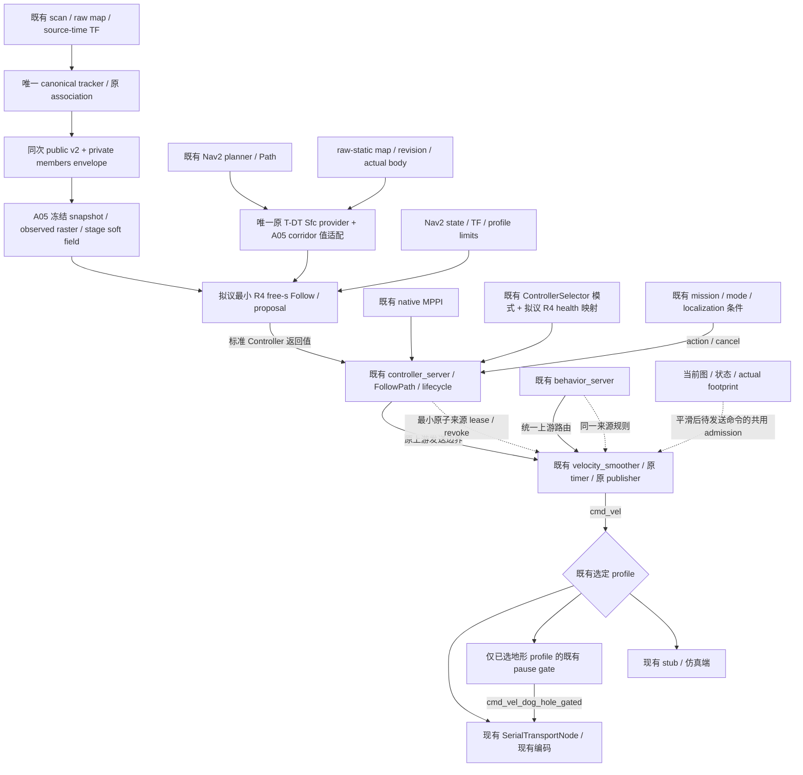

# R4 A06：接线前复用复核与输出责任收敛

2026-10-05，Asia/Shanghai。复核 `main@d735ee12`、既有迁移/研究固定版本及 R4 工作分支 `dc473636`。本轮仅补充审计文档，不新增运行时代码、solver、ROS/Nav2 接线或配置，不启动 ROS、Nav2、Gazebo、串口或新的实验。

**结论：继续沿现有 Nav2/controller/velocity_smoother/串口链提供 R4 proposal。A02 的 tracker_core、frontend、execution 不晋升为运行模块；没有依据建立第二个最终输出 owner 或 MPPI worker。** A04/A05 是工作分支中可选的 producer 适配和消费值库，尚未进入 main 的默认导航链；“已有可链接代码”与“正式链已使用”分别记录。

本次承接 [A03 全仓审计与 63 项源码索引](r4_repository_reuse_audit.md)，复核其固定来源与 33 个 branch heads，并补查 main 的导航入口、时钟语义、当前 A04/A05 调用边界及 Sfc 构建责任。逐文件摘要、检索结果与保留核对见 [A06 证据清单](r4_reuse_audit_checkpoint_sources.json)。两个全量历史汇编仍无需通读。

## 1. 十二项 reuse matrix（截至 dc473636）

M/L/D/F/H 编号对应 A03 第 7 节的固定源码；下列新增链接对应 R4 工作区。表中的“正式链”指 main 的源码/入口配置，不证明当前实车运行。没有进行 live graph 排他性检查。

| 所需能力 | 已有源码、接口/topic/service/class | 正式链使用状态 | R4 决定与最小缺口 |
|---|---|---|---|
| obstacle tracking / association | D1/D2 的 `MultiObjectTracker.update` / `optimal_gated_assignment`、`DynamicObstacleTrackerNode`，输入 map/scan/source-time TF；当前同包 [core.py](../../src/rm_dynamic_obstacle_tracking/rm_dynamic_obstacle_tracking/core.py) 的 `capture_associations` 导出原 assignment/new-track 结果 | main 无包；既有研究 producer；A04 只在 R4 分支接入、默认 shadow | **直接复用 + 已完成最小关联导出**。同一 node 每 scan 一次 tracker update。H1 `tracker_core.py` 仍是 harness；不新增 tracker、重聚类或事后质心匹配 |
| prediction | D2 producer；D3/D4 `DynamicObstaclePredictionArray/Prediction`，标准 public topic `/perception/dynamic_obstacles_shadow/predictions`；v2 为既有 `last_observation_cv` 模式 | main 未接入；原默认 shadow 配置并非无 decay 的 v2；A04 的 opt-in members 要求既有 v2 模式 | **直接复用 public v2 + 薄消费适配**。两份 `.msg` 与 D 固定源字节一致；public 输出及 private envelope 内嵌同次构造值。stage-source 平移不再起 prediction pipeline；不把 private sequence 放进 public v2 |
| observed shape | D6/D7 离线 surface/visible box；U3 文件 evidence；当前 [observed_members.py](../../src/rm_dynamic_obstacle_tracking/rm_dynamic_obstacle_tracking/observed_members.py)、[ObservedPredictionEnvelope.msg](../../src/rm_r4_interfaces/msg/ObservedPredictionEnvelope.msg)、[ObservedTrackMembers.msg](../../src/rm_r4_interfaces/msg/ObservedTrackMembers.msg)；opt-in topic `/perception/dynamic_obstacles_shadow/observed_predictions` | main 无 shape API；A04 private publisher 默认关闭；U 文件与 H2 raster 为实验 | **已完成 private 薄适配；raster 为 R4 消费核心**。public v2 的 visible extent 不能表达 members/provenance，故 private 原子 envelope 确有必要。同次 association 的端点/beam IDs 经 coasting 保存；不据 size 补全隐藏几何、不轮询 evidence 文件 |
| static path / corridor frontend | M1/M2 的 Nav2 planner `ComputePathToPose` / `nav_msgs/Path`；L1–L5 的 `TdtGlobalPlanner` / `SfcSquare::getCorridor`；F1 既有 bridge；当前 [corridor.cpp](../../src/rm_r4_prediction_consumption/src/corridor.cpp) 的 `PreparedCorridor::prepare` 直接调用原 Sfc | main 使用 Navfn；完整 T-DT 迁移为 opt-in 研究资产；A05 值适配未被正式 planner/controller 调用 | **复用现有 Path 与原 Sfc，已完成最小值适配**。原 T-DT `Result` 未导出 corridor，但 Sfc API 已公开，无需复制 frontend 或改 global planner。独立核对 raw-static/body/连续覆盖；未来同时启用完整 T-DT 时须共享 provider target，见第 4 节 |
| temporal dynamic cost | D8/D9 `DynamicObstacleCritic::score`（圆代理/MPPI）；L9/L10 dynamic clearance shadow；H4 数学参照；当前 [consumption.hpp](../../src/rm_r4_prediction_consumption/include/rm_r4_prediction_consumption/consumption.hpp) 的 `PredictionSnapshot` / `ReceiptGate` / `TemporalSoftField` | main 原生 MPPI CostCritic 读当前 costmap；R2/clearance 是研究；A05 值库未接控制链 | **R4 必要新增核心，值库已完成**。已有 critic/shadow arrival-time 接口不能表达 observed-raster 与逐 stage soft residual。只冻结、raster、单次 CV 推进与软场；不写 future-union layer、不引入未来硬 veto |
| free path progress | M2 `SimpleProgressChecker` / `SimpleGoalChecker`、MPPI Path critics；L10 path/speed 几何；F2 固定时间参考；H5 `follow.py`；当前 `PreparedCorridor::sample/project` 与 `free_progress_residual` | main 已有 goal/progress watchdog；无自由 `s/s_dot` 优化；A05 只提供残差/局部线性化，没有 Follow solver | **R4 必要新增核心，残差已完成、求解未完成**。位移 watchdog 和固定参考不是自由进度。未来仅补有界 Follow proposal；goal、action、任务结束责任复用 Nav2，不把 H5 连同 consumer/arbiter 整套迁入 |
| Nav2 controller integration | M1/M3 upstream controller_server、lifecycle、FollowPath action；F3 `Controller : nav2_core::Controller` 的 configure/activate/deactivate/cleanup/setPlan/setSpeedLimit/computeVelocityCommands | main 原生 MPPI 正式配置；R3 插件仅冻结研究；当前 R4 无 controller plugin、plugin XML 或 launch 绑定 | **复用 server/lifecycle/action + 一个薄插件适配，尚未实施**。使用标准返回 proposal；F3 的 worker/请求/重验流水线及 `.8` 速度基准不能原样套用。读取实际 profile、frame/footprint/limit，不重写 Nav2 plumbing |
| current occupancy guard | M2 当前 STVL/costmap 与 MPPI footprint cost；D10/D11 `check_command`/`SafetyGuard`；F3 `current_grid_clear`、F6 `StaticCells`；H6 `CurrentGrid` | main 有 controller/behavior 自身碰撞检查；未证实有覆盖 R4/MPPI/behavior、平滑后实际命令的共同连续首区间 gate | **复用当前 costmap/footprint primitive，必要最小共用 admission 尚未实施**。整套 D/F guard 会带入未来动态/stop-tail 硬 veto；H6 是 oracle。缺口是最终待发送命令/状态/当前图的共同边界，不是再建一个独立 guard publisher |
| watchdog / lease / timeout | M2 controller 10Hz、smoother 20Hz/1s timeout；M4 serial 100Hz/steady receive timeout 0.2s；M5 stub 0.5s；M6 mode gate 0.5s；F5 selector health 0.1s；A05 `ReceiptGate` 仅是预测身份/输入可用性 | main 有这些配置/实现；R3 selector 是研究；当前无 command source lease 的 owner 接线 | **直接复用 watchdog + 缺失来源信息的最小 owner 扩展**。Twist/接收 timeout 不能保留 solver deadline；smoother 重发可刷新 serial 接收年龄。预测 receipt generation 不是 command generation；75ms 与 10Hz 有冲突，不能宣称现配置满足或默默放宽期限 |
| MPPI fallback | M2 `nav2_mppi_controller::MPPIController`；F4/F4b 双 controller 配置、`ControllerSelector`/`FollowPath`；F5/F5b selector/selection 只发布 controller ID | 原生 MPPI 在 main 已有；运行切换模式只在冻结 R3；R4 当前无真实 fallback 接线 | **直接复用 native MPPI + selector 薄映射，尚未实施**。将 R4 health/ID 接到既有选择模式；不实现 MPPI、不起独立 fallback 输出线程。选择消息不能抢占已阻塞 compute；过期退化由现有 owner 承担，恢复后再计算 MPPI |
| final velocity command ownership / publisher | M1 统一 `cmd_vel→cmd_vel_nav` remap；Humble L8 controller/smoother 路由；M3/Phase 1/仿真入口；L11/L12 可选 dog-hole gate；F7 实验最终 guard；H6 `OutputArbiter` | 老车入口设计末级为 smoother；普通 Phase 1/通用/仿真入口存在 behavior 直达 `/cmd_vel` 的路由缺口；地形 profile 的末级为已选 gate。均未 live 验证 | **复用所选入口现有 owner；先收敛入口路由，禁止 R4 新最终 publisher**。现有多入口差异不是新增 owner 的证明。R4 标准 proposal 在 controller server 上游；A02 arbiter/F7 留在实验；不得绕过已选地形 gate。详见第 2 节 |
| serial/chassis output | M4 `SerialTransportNode::handleCmdVel/writeFrame`、M7 `encode_command`；M8 dry-run；M5 `ChassisInterfaceStub`；M6 chassis mode；M10 mission；stub `/cmd_vel→/simulation/chassis/cmd_vel` | main 有既有 transport/协议与可选仿真端；老车 serial/dry-run 互斥；未连接硬件 | **直接复用，R4 无需新增串口/底盘模块**。保留 source topic、限幅、编码与启用互斥；现有 mode/mission 是状态/action 责任，serial 未逐帧订阅 mode 作速度仲裁。不得另写端口、造新安全 FSM 或把取消 goal 宣称为硬件制动 |

## 2. 输出所有权必须按入口判定

本次补充 main 所有直接 include upstream `navigation_launch.py` 的入口，以及其 wrapper；依据源码形成路由判断，不把它当 live publisher 数量证明。目标版本沿用项目已记录的 Humble Nav2 1.1.20；不以主机 Jazzy 的不同 launch 覆盖它。

| 入口/profile | 现有路由证据 | 对 R4 的决定 |
|---|---|---|
| `old_car_2026_validation.launch.py` | 383–400 行 scoped GroupAction/SetRemap；controller/behavior 都接 smoother 上游；419–441 行 serial/dry-run 输入 `/cmd_vel`，70–73 行互斥 | 复用 smoother 的既有末级 publisher；仅在必要来源 lease/admission 边界窄扩展。仍需运行时核对 remap、lifecycle 与 publisher 排他性 |
| `old_car_2026_competition.launch.py` | 181、331–355 行 include old-car validation；mission/mode/readiness 单独启用，不新增 Twist owner | 沿相同速度链复用；保留 mission 安全条件/action 取消及启用规则，不把 R4 提案升级为 mission authority |
| `navigation.launch.py`，以及 `bag_replay.launch.py` | 298–306 行直接 include upstream，无 old-car 的 SetRemap；bag wrapper 默认 `use_nav2=false` | 在启用已记录的 Humble launch 时，controller 经 smoother，而 behavior 保留直接 `/cmd_vel` 路径。不能套用“全仓唯一 smoother owner”；先通过原入口路由收敛，仍不新增 owner |
| `phase1_bringup.launch.py`、`phase1_5_gazebo.launch.py` | 两者直接 include upstream、无统一 SetRemap；分别接 stub，Phase 1.5 stub 转发 `/simulation/chassis/cmd_vel` | 有同样的 behavior 绕过 smoother 路径。仿真接线验收也应覆盖该路径，不能只检查 R4 controller 的 publisher |
| old-car AMCL/GICP relocalization test wrapper | include old-car validation，但明确传入 `use_nav2=false` | 此入口默认没有导航速度链，不将其重定位测试当作 R4 controller/owner 验收 |
| L 的 `old_car_full_terrain_navigation.launch.py` | 既有 dog-hole gate 启用时，serial 改读 `/cmd_vel_dog_hole_gated`；gate 接 `/cmd_vel` 并转发/置零 | gate 仍为已选末级输出责任；R4/MPPI 都在其上游。它不在 main，本审计不普遍启用或迁入地形模块 |
| F7/R2 研究 guard 接线 | 替代式实验路由，有自己的最终 cmd publisher/未来硬 guard | 只作为冻结证据。不能与正式 smoother/gate 并行发布，也不能为复用而带回 R3 未来 veto |

L8 固定证据中的 upstream launch 对 controller 加 `cmd_vel→cmd_vel_nav`，对 smoother 加输入/输出 remap，对 behavior 仅给通用 TF remap。因此普通入口的绕行是源码可推导的缺口；没有启动节点证明此刻发生命令争抢。优先修改既有入口的 routing/现有发送责任，缺口不证明“现有架构无法完成仲裁”。

## 3. lease、current admission 与安全状态各自落位

| 边界 | 可复用责任 | 尚缺的表达/验收；不能使用的替代品 |
|---|---|---|
| 控制拍输入 | A05 ReceiptGate、Nav2 measured pose/velocity、TF、Path/costmap | ReceiptGate 仅冻结 prediction；完整 state/TF/plan/限值/最后输出的一拍快照未接入。不能把 perception generation 当发送 generation |
| controller/behavior → smoother | 既有发布边界与选定 controller ID | 最小原子绑定 command/source-instance/generation/sequence/input epoch/deadline/revoke；A04 已定位的 publishVelocity 会丢弃 TwistStamped stamp。独立 health topic、相同速度值/hash、旧 Twist 的 heartbeat 均不能续原 lease |
| smoother 原 timer/publisher | 既有速度/rate 限制、lifecycle、唯一所选输出责任 | 原始提案过期/撤销在该责任中失效；admission 使用平滑后的待发送命令、当前状态/地图/真实 body 与执行区间。不能只检查 solver proposal 或加载 R2/R3 的全时域硬 guard |
| mode / mission / integrity | `/chassis/mode_raw→/chassis/mode`、mission 的 safetyReady/action 取消、shadow integrity diagnostics | mode gate 不接 Twist；serial 未逐帧消费 mode；integrity 仅 shadow。复用这些状态与权限，不新增第二安全 FSM，不宣称其已覆盖每个底盘帧 |
| serial / stub | serial 的 steady receive timeout、现有协议与限幅；stub 的仿真转发/watchdog | serial 接收年龄不等于 solver 年龄；末端还会限幅/浮点编码，需核对有效 command/limits 与 admission 输入一致。stub/mode gate 用 ROS `now()` 计算 age，虽然 timer 为 wall timer，也不能称为 steady lease；sim pause/回拨不能靠该 watchdog 证明过期 |
| native MPPI 恢复 | 既有 ControllerSelector/FollowPath 模式与 native MPPI | 正常算法切换复用此接口；卡住 compute 时 selector 不提供抢占。独立 owner timer 的退化与恢复后 MPPI 新提案分别验收，不能写成无间断 fallback |

75ms proposal 有效期限、20Hz 输出采样造成的检测间隔、串口 0.2s 接收 timeout、实物减速距离是四种不同指标。10Hz 控制周期为 100ms，已超过 75ms；未来必须显式登记所选频率/预算和剩余有效期策略，不以 shadow receipt、重复发布或调宽 TTL 隐去间隔。原 owner 的 timer/executor 是否在 controller 阻塞时独立运行也须实测；本次不承诺 deadline 的硬实时保证。

## 4. T-DT 复用还有一项构建条件

当前 R4 checkout 只有一份 Sfc `.cpp/.hpp`，与 `e680b143` 字节一致。A05 `CMakeLists.txt:10–12` 直接从原 migration 位置编译 Sfc；本 checkout 没有完整 `rm_tdt_planner` 包的 CMake，故当前不是两份 frontend 或同时启用两份 provider。

但固定 L 的完整迁移 `CMakeLists.txt:12–19` 也把同一 `sfcSquare.cpp` 编进 `tdt_nav_core`。**若后续启用完整 T-DT planner，不能把当前直接编译关系原样叠加**：应由迁移库导出共享的 canonical Sfc/provider target，R4 仅链接并保留值适配。此项是已有 provider 的最小构建接口扩展，不复制 YAstar/Sfc/MinimumSnap 或 frontend。A05 的安装消费者测试未验证两包同时部署，不能据此关闭这个条件。

完整迁移的 `OsqpEigen 0.8.1 EXACT` / 已登记 native OSQP 0.6.3，与 A02 Python OSQP 1.0.5 也不能当成同一 ABI。本次没有增加或更换 solver，依赖选择仍是后续有界 Follow 核心的具体设计项。

## 5. 拟议最小接线图

这是设计图。A04/A05 已有 opt-in producer/值库；R4 solver/plugin、来源 lease、共用 admission 与 R4 selector 映射均尚未实施。图中的 owner 以老车已收敛入口为基准；普通/仿真入口需先补原路由边界，地形 gate 仅在既有 profile 已选择时使用。

没有 R4 最终 cmd topic/publisher、独立输出进程或新串口通路。public v2 仍由原 producer 发布；private envelope 只补原 wire 无法表达的成员与身份，消费端不异步拼接两条预测链。

## 6. 接线前的具体变更边界与有限验收清单

以下是后续可审阅的最小工作清单，本轮不实施：

1. **R4 消费核心**：基于 A05 值库补单次有界 Follow proposal，实际 profile 的 limits/body/cruise 显式输入，失败返回不可用结果；不导入 A02 execution/arbiter，不生成自行发送的 brake/fallback 命令。
2. **标准 Nav2 薄适配**：一个 controller 插件，现有 lifecycle/setPlan/setSpeedLimit/action；同拍输入和撤销身份明确。只复用 F3 接口模式，不复用冻结 worker/未来硬重验或其原型常量。
3. **既有输出责任**：先选定入口并核对 behavior 路由；只在原 publish/input/timer 边界添加 wire 无法表达的原子 lease/revoke 和共用 current admission。继续使用原末级 publisher，覆盖 R4/MPPI/behavior/cancel/inactive/time reset。
4. **native fallback**：复用既有 ID selector/BT 模式；有限检查算法切换、输入失效、计算超时与恢复；明确阻塞时 owner 退化与恢复后 MPPI 的区别。
5. **共同证据**：启动前列出按 profile 预期 publisher/consumer，启动后检查唯一末级 publisher、无旁路/串口互斥；核查平滑与串口限幅后的实际 command、ROS/steady 时间、map/TF 锁顺序和撤销路径。只做有限接口/故障检查；此清单不是本次已通过的测试，也不授权大规模实验或物理部署。

这份清单收敛的是 A02 中已验证有价值的消费逻辑；本轮没有继续新增运行代码。main、原研究 checkout/dirty 文件、冻结 R3 及已交付 A04/A05 源码全部保留。验证仅含源码/摘要/链接/十二项覆盖/文档 diff 与保留状态核对，不重跑已有数值测试来冒称运行接线验收。
