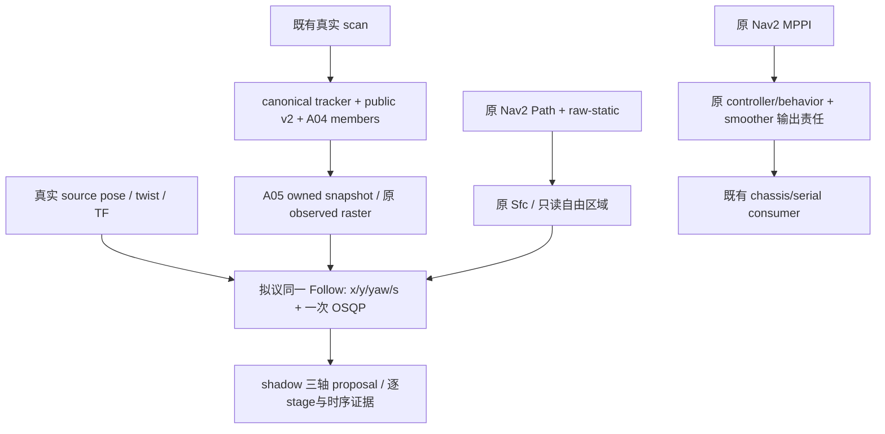

# A17：真实转动的最小消费模型范围审阅

2026-10-05 后续状态：用户已授权本审阅推荐的 A05/A08 离线数学范围，并要求遵循主线分级验证规范。
[A18 结果](r4_rotation_value_experiment.md) 将近期重点收缩为最小转动输入消费 adapter；以下审阅保留当时的范围与尚待验证条件。


2026-10-05，Asia/Shanghai。基线`0c03dbbb2cf9e18242a7dccba93dbdedb707c15c`，A08数学/A09–A12接口仍冻结`e137635e`，承接[A16](r4_corrected_runtime_shadow.md)。

## 分析前范围登记

本阶段只读当前Follow/soft field/corridor、既有execution geometry/lease、标准Nav2 adapter和原profile源码，以及A16已完成的cycle/event记录。目标是形成可审阅的转动建模方案和复用矩阵，不解除数学冻结、不编写新的运行模型、不启动ROS/Gazebo、不接实际输出、不重跑R3。

原summary只统计yaw gate，不提供忽略转动时的位移/footprint偏差与angular command slew反例。新增独立`experiments/r4_rotation_scope_audit/analyze.py`仅以标准库读取已有CSV，用闭式几何计算作敏感性诊断，输出到新的`build/r4_rotation_scope_audit_20261005`。没有Follow/solver/tracker/prediction/ROS或current-admission调用；不能演化成第二套导航链。关闭/删除这个离线目录即可移除，正式代码/配置不变。

计算明确是假设每拍实测body twist分别保持50ms/1.5s的条件敏感性，不是实际未来运动、不重新预测障碍、不重放控制、不生成proposal。分别报告goal、native导航和原S1/S2动态窗口；原数据和A16运行不变。保留主线、冻结实现、既有未提交文件与旧证据。

## 审阅结果

**源码/已有记录审阅完成；最小完整转动proposal需要审阅A05几何与A08 Follow，不能只解除一条yaw gate。A09旋转执行几何、A10三轴包和A11标准Controller有可复用能力，无需新增owner/MPPI/安全框架。** 本阶段没有实现新模型；A16 runtime输入FAILED、动态行为INCONCLUSIVE和closed-loop NOT_ELIGIBLE保持。

### 1. 当前fixed-yaw假设贯穿四处

| 位置 / 当前源码 | 当前接口与行为 | 转动消费的必要差异 |
|---|---|---|
| [follow.cpp](../../src/rm_r4_prediction_consumption/src/follow.cpp)，50–102行 | `validate`拒绝非零measured wz/last applied wz；`maps(yaw)`只构建一个R(yaw)，`rollout`全部stage yaw相同 | 保留真实source state；未来world速度、积分位置和stage yaw必须由同一个控制序列确定 |
| [consumption.cpp](../../src/rm_r4_prediction_consumption/src/consumption.cpp)，33–60、109、249–281行 | `BodyPolicy::support/digest`含当前yaw；snapshot缓存这一AABB；`TemporalSoftField::sample(xy,stage)`只接xy，`SoftSample`只有xy gradient | obstacle CV/raster不变，查询机器人支持框须按本stage yaw计算；还需对应的yaw导数/一致性表达 |
| [corridor.cpp](../../src/rm_r4_prediction_consumption/src/corridor.cpp)，123–169行 | 原Sfc输出经当前yaw支持框收缩，返回`centre_bounds`；raw-free矩形没有独立公开值 | 复用同一Sfc，保留其经raw-static检查的自由矩形；未来机器人旋转支持不能直接套用旧中心框 |
| [follow.hpp](../../src/rm_r4_prediction_consumption/include/rm_r4_prediction_consumption/follow.hpp) | `FollowState`已有measured/last-applied yaw rate；`FollowProposal.yaw_rate`已有字段，但`FollowControl`没有omega，`FollowLimits`没有angular limits；提案yaw_rate默认0 | 明确角速度控制、限值、slew、历史及逐stage语义；有一个输出字段不等于已有转动数学 |

旧值接口接受任意**静态**world yaw，不能推断支持非零yaw rate。body digest还进入snapshot policy、corridor policy和warm key，所以即使path/map不变，真实yaw变化也会触发geometry rebuild/warm reset。这是原fixed-yaw合同的结果，不能用量化yaw/隐藏版本变化修掉。

### 2. 原记录的条件几何敏感性

使用A16全部1200个goal-window记录，保持原footprint `[±0.30,±0.25]`、padding0.03；从原profile读取smoother角加/减速度2rad/s²。只计算“这条实测body twist若保持T”与“同一twist忽略转动”的几何差异，不读取任何未来样本当预测、不给原拒绝拍补proposal。

令a=omega·T，sinc(a)=sin(a)/a，cosc(a)=(1-cos(a))/a，零点取连续极限，则body坐标下位移为：

```text
held Δp = T · [sinc(a)·vx - cosc(a)·vy,
               cosc(a)·vx + sinc(a)·vy]
fixed Δp = T · [vx, vy]
world Δp = R(yaw_source) · body Δp
```

端点偏差是两个Δp的距离；支持框扩张是同footprint在连续角区间`yaw..yaw+a`的最大外包支持框与初始框的最大单侧差。解析极值检查区间端点和每个vertex旋转坐标的内部驻点，不以31个离散姿态近似连续扫角；padding不变，不加新的halo或几何膨胀参数。

| native导航窗口 | n | 假设保持1.5s的|转角|最大（rad） | 忽略转动的端点偏差 median / P95 / max（m） | 旋转支持框单侧扩张最大（m） | 50ms端点偏差最大（m） | 50ms支持框扩张最大（m） |
|---|---:|---:|---:|---:|---:|---:|
| S0 | 223 | 0.800 | 0.0464 / 0.1217 / 0.1312 | 0.0985 | 0.000147 | 0.00406 |
| S1 | 230 | 1.122 | 0.0642 / 0.3085 / 0.4230 | 0.1113 | 0.000487 | 0.00858 |
| S2 | 223 | 1.086 | 0.1019 / 0.2964 / 0.3957 | 0.1112 | 0.000454 | 0.00804 |

S1动态40拍的1.5s端点偏差median/P95/max为0.1864/0.4156/0.4230m；S2动态160拍为0.1142/0.3183/0.3957m。50ms中心积分差小不代表1.5s消费模型成立，也不代表旋转footprint的8mm扩张可忽略。这些是模型敏感性；不与0.05m static clearance作实际碰撞或安全PASS比较。

原profile首拍角命令可变幅度为2×0.05=0.10rad/s。若shadow cold angular seed明确为0，直接把measured wz抄成第一拍candidate，则native导航中125/223、162/230、191/223拍超过这个slew幅度；动态窗口为34/40、142/160。它不是已生成candidate的失败统计，也不说明MPPI非法；measured rate是实际状态，和历史command是不同证据，不能互相顶替。

在path/map/limits相同的相邻goal-window pair中，body digest变化210/389、217/388、212/389，均与exact yaw变化数相同；corridor rebuilt共221/229/223拍。未来可以拆分不可变body geometry与本拍姿态/查询几何身份，但源姿态仍必须精确绑定input digest；保留虚拟command历史不等于复用未经重新线性化的旧轨迹。

[summary](../../experiments/r4_rotation_scope_audit/evidence/summary.json)、[1200行敏感性CSV](../../experiments/r4_rotation_scope_audit/evidence/sensitivity.csv)、[21项源码与输入hash](../../experiments/r4_rotation_scope_audit/evidence/provenance.json)支持上述数值。纯计算的零转动和独立quarter-turn端点公式核对通过，没有新runtime trial。

### 3. 转动能力复用矩阵

本表是[A03全仓矩阵](r4_repository_reuse_audit.md)的转动专项补充；不把已有实验value实现写成已进入main正式链。

| 能力 | 既有来源 / 当前接口 | 正式运行状态 | 拟议处理与必要新增 |
|---|---|---|---|
| tracking / association | `src/rm_dynamic_obstacle_tracking` canonical producer | A16真实scan运行；main未迁入 | 直接复用；机器人yaw不是新增tracker的理由 |
| prediction | 原public v2/CV与A04 atomic observed envelope | A16运行；main未迁入 | public wire/预测模型保持；不增加第二pipeline |
| observed shape | A04 `ObservedTrackMembers` / A05 `ObservedRaster` | A16运行 | association、raster、stage source-age直接复用；新增只限机器人stage姿态的消费查询 |
| static path / corridor | 原Nav2 `/plan`、`/map`；canonical `SfcSquare`；A05 `PreparedCorridor` | Nav2正式组件已用，R4 wrapper在shadow用 | Sfc/frontend不复制；最小扩展保留已认证raw自由矩形及转动收缩/精确复核所需值 |
| temporal dynamic cost | A05 `translated_cells` + `TemporalSoftField::sample` | shadow值库，未进入实际控制 | 保留source anchor/CV/time grid/残差；扩展yaw查询与导数，不增cost项/权重/halo/未来hard veto |
| free path progress | A08 15 nodes / 31 stages / 单次OSQP | shadow值库，未实际控制 | 在同一Follow内扩展平面转动，s仍独立变量，不重写MPPI、不增第二solver |
| Nav2 controller | A11 `R4Controller`标准pose/twist match与返回TwistStamped | 已编译验证，A16未激活 | 现接口已经比较measured wz并返回proposal wz；未来typed值兼容需专项验证，lifecycle/plumbing不重写 |
| current occupancy geometry | [current_geometry.hpp](../../src/rm_navigation_execution_adapters/include/rm_navigation_execution_adapters/current_geometry.hpp)、`integrate_held_body_twist`、canonical `pose_geometry::certify` | A09值合同，正式链未启用 | 复用已含旋转的纯几何；50ms积分helper可按原stage调用。不得把current grid admission调用30次冒充未来动态保护 |
| watchdog / lease / timeout | A10 `ProposalPacket{vx,vy,wz}`、75ms/fence；原smoother/stub timeout | 原timeout运行；A10未激活 | 保持原起点/时限；转动不是新增lease、FSM、arbiter的理由 |
| MPPI fallback | 原Nav2 MPPI/controller selection | MPPI在A16实际控制 | 继续复用；shadow不选择、不发fallback；新模型不实现MPPI |
| final velocity owner | 原controller/behavior→smoother唯一末级责任；A12原子mapper | 原legacy链运行，lease mode未接 | 保持唯一owner；A12能保留wz数值，但当前capture仍调用fixed-yaw input fingerprint，不能宣称新模型直接兼容 |
| serial/chassis output | 原serial/stub，A16用stub | legacy链既有职责 | 不改topic/输出责任，不接硬件；未来执行许可仍待shadow通过 |

关键现有能力：[A09 current_geometry.cpp](../../src/rm_navigation_execution_adapters/src/current_geometry.cpp)第47–58行已经实现完整constant body twist的SE(2)积分，函数明确只接受≤50ms；按30个50ms stage连续调用可复用纯积分，不能把参数直接改成1.5s。其current admission只查当前图、measured-held与candidate-held两分支，不能扩成R3 future guard。canonical `pose_geometry`的连续旋转/filled polygon检查也已存在。

依赖方向可保持无环：A09纯值库不依赖A05/A08。后续A08 opt-in目标若链接既有积分helper，应明确这是纯几何符号复用，不调用lease/owner/current admission；不为抽取helper改写冻结A09。若确需移动接口/改变其行为，单独扩大审阅范围，不默许复制一个runtime积分器。

### 4. 候选范围与推荐

| 候选 | 能回答什么 | 结论 |
|---|---|---|
| 仅删gate / 将measured wz置零 / 只旋转初始XY | 只改变拒绝条件，future R/footprint/corridor仍固定 | 拒绝，不能视为诊断adapter |
| 由measured wz或MPPI reference指定整段yaw schedule，仍只求vx/vy/s | 可做“给定角运动”的条件消费分析 | 不是完整R4 proposal；缺少独立angular command/rate/history政策，不能借此进入闭环。若做，必须单列条件诊断，不能算本阶段shadow行为PASS |
| 同一Follow内SE(2)+free-s，`(vx_body,vy_body,omega,s_dot)` | 生成自身可表达的三轴proposal，真实输入与future机器人几何一致 | 推荐下一阶段的最小完整研究范围；需明确解除A05几何/A08数学相关冻结，先value/offline，再有限shadow |

不以全yaw circumscribed box替代实际shape来获得“兼容”：这会改变soft/static几何、牺牲窄通道，并可能以保守膨胀重新压死推进。没有输入错误可以用它掩盖。本审阅也不选择新角度目标成本或调权重救失败。

### 5. 拟议数学与文件边界（尚未实现）

1. **同一stage状态/控制。** 状态`(x,y,psi,s)`，15个控制node为`(vx_body,vy_body,omega,s_dot)`，每node100ms、50ms评估网格仍31点、horizon1.5s。候选60决策变量（原45），还是单个OSQP0.6.3的一次局部QP；不加外层迭代、候选portfolio或第二solver。拟议泛化现有Follow装配/工作区到显式model policy并提供版本化值接口，保留旧fixed-yaw入口/行为及baseline，不能复制follow.cpp建立另一套solver实现或把新类型按旧ABI强转给A11。每个50ms区间使用同一body twist积分，psi显式累积并在单条rollout内连续展开。初始measured状态与未来command target必须分别记录，不能将kinematic target当物理跟踪认证。A16 pose/twist/TF在同source stamp一致，但pose距acquire最大50/52/45ms，原Follow直接用这条pose作epoch初值；source一致不等于epoch同步。拟议stage0采用held-measured条件估计对齐到原acquire epoch，沿用100ms freshness上限并按≤50ms子步复用原积分；原source pose/stamp保留，估计姿态、目标epoch和假设另记且绑定input digest。不能给估计坐标伪造测量/TF stamp，也不能移动prediction anchor或刷新lease；这是条件模型，不是新定位流或实际跟踪误差界，未验证前不宣称严格同步。
2. **一次线性化与实际复核。** 以owned输入、合法cold seed或fresh虚拟warm轨迹做一次SE(2) rollout/Jacobian；world velocity为`R(psi_k)·v_body,k`，contour/lag/projection/cruise/free-s语义保持，增加其对omega的链式依赖。OSQP只接这次局部线性化，不直接塞sin/cos/max非线性。解后重新按同一SE(2)模型积分，核查角/线/进度限值和真实static约束；失败返回unavailable，不尝试第二候选。旧线性slack不能替代新模型精确复核证据。15/40/75ms与400 iterations保持；新工作量是否能满足预算尚未验证。
3. **soft query按stage yaw。** 同一个observed raster和`epoch+k·50ms`，obstacle世界CV平移不随机器人yaw旋转。机器人footprint按psi_k构造支持框，残差exp/halo/slope/plateau/max-track选择保持，新增的是`dr/dpsi`和模型版本身份。max/min vertex、nearest cell/track和AABB面切换不可导；明确活动分支/次梯度与tie诊断，在平滑区域做独立导数核查，不能暗换成新smooth cost或填补inside plateau梯度。改变机器人几何查询属于消费数学，不是改prediction pipeline。原A05先旋转未padding footprint再向world AABB四面加padding，本次敏感性严格沿用这一含义；A09则接收实际padded polygon。新模型必须明确保留的padding/support定义与两层映射，不能静默把两者互换、重复padding或把本次AABB诊断当实际polygon证书。
4. **static仍用原frontend。** 为同一Sfc wrapper保留经过raw-static检查的自由矩形值；candidate p/psi对应的支持框必须在同一自由区域内。QP按nominal姿态线性化同一矩形的四面，保留原平移reserve，只作局部近似，不拿初始yaw的centre bounds认证future rotation。拟议解后选择一个方法：每个50ms区间用原held-twist helper取得精确centre端点；两端centre范围加原A09已有的`|v|·|omega|·h²/8` chord reserve，再与连续yaw区间的解析footprint支持极值相加，核查完整包络与clearance包含于同一已认证raw-free矩形。它是保守几何复核，独立centre/shape极值可能导致unavailable，失败不做第二次solve。所有区间共享原40ms总预算，不调用末级current admission，不新增polygon checker或动态未来veto，也不只查31个端点。omega控制约束为0的旧切片应退化到原固定yaw几何；“初始measured omega为0”不等于所有未来omega被约束为0，回归时必须区分。
5. **angular limits/history。** 当前profile实际上界±1.2rad/s、smoother角rate2rad/s²应由profile读入并进入limits digest，不猜全向机器人无需限角速度。候选角slew首步50ms、后续100ms，与既有线速度历史同层级。shadow仅上一有效R4三轴虚拟proposal能作command seed；初始化/失效按已登记virtual政策处理，不能从MPPI reference或measured速度补“已施加”证据。实际执行模式日后仍须existing owner的applied证据。
6. **身份/版本。** geometry digest绑定footprint/padding/clearance，state/input digest精确绑定source yaw/wz、stamp、模型版本和本拍几何；policy/body/route缓存键必须明确区分不可变geometry和动态姿态。warm只在合法同context下shift、再从本拍姿态重新积分/线性化，source/fence/restart/clock失效照旧。新typed值不能冒用`r4_follow_input/v1`旧语义；public v2/A04 ROS wire不变，当前A09–A12私有合同保持冻结/关闭。后续typed adapter兼容必须单独做value验证，不能宣称仅因为输出含wz就兼容。

| 最小潜在修改位置 | 为什么现接口不够 | 归类 |
|---|---|---|
| A05 `consumption.hpp/cpp` | 查询缺yaw、snapshot只缓存固定支持框，soft sample缺yaw gradient | prediction-consumption数学/值接口，需解除对应冻结 |
| A05 `corridor.cpp`及其声明 | 只有当前yaw收缩后的中心框，不能表达旋转自由区域 | 原Sfc的最小只读几何扩展，不复制frontend |
| A08 `follow.hpp/cpp`，必要的optional build依赖 | 控制45维、统一R、无angular limits/history | 同一Follow SE(2)局部QP；不是新增solver |
| 原shadow caller、profile取值、seed/logger | 目前angular seed硬编码0、只读2D bounds/controls | 与新值版本对应的薄instrumentation；明确关闭开关 |
| A09–A12 / producer / MPPI / owner / serial | 已有三轴表达/旋转几何，但尚未开启且新typed兼容未验证 | 本阶段不改；不存在新增第二owner的必要性 |

**角目标政策是编码前必须明确的条件。** 原Follow没有path/goal yaw residual；Path orientation虽参与fingerprint，`PathSample`只返回xy/tangent。仅增加omega自由度不会自动满足Nav2 yaw goal。原QP还有`1e-8 I`数值正则；扩到60维会影响新增omega方向的tie-breaking，不能将它冒称已经验证的角目标策略，也不能暗增angular smoothness/yaw-tracking成本并叫“权重不变”。推荐先将新范围限制在consumption value与shadow，保留原已登记残差并明确记录角方向的数值约定；若发现角漂移/病态，照实失败，另行审阅角政策，不能调参救结果。closed-loop前必须独立解决/验证与原Nav2 yaw goal的关系。

### 6. 最小拟议接线图



CONSUME的转动扩展尚未编码；LOG没有到实际输出的边。当前实际输入链/唯一输出责任不变。日后shadow通过后，仍按A03/A07现有owner前proposal路线，不建立独立owner。

### 7. 分阶段验收与停止点

| 后续顺序 | 必须回答的问题 | 不得用来冒称通过的证据 |
|---|---|---|
| 明确调整冻结范围 | A05/A08的哪些值/数学可改；确认本报告的angular数值约定、stage0估计与static复核；旧baseline如何复现 | 一般“继续”、只改函数名字/删gate |
| 最小value模型 | omega=0的旧切片回归；同一source状态/command rollout；限值/slew；角wrap/非对称footprint；平滑区Jacobian；static连续旋转边界；失败无proposal | 输入兼容率变高、旧GTest数量、QP solved本身 |
| 只读A16记录输入诊断 | 保留真实yaw/wz、raw-static/path与public/private；三轴虚拟history连续性；新cost/free-s/geometry/residual数值 | 以实际MPPI command播种或未来实际yaw代替自主proposal；离线结果当runtime行为 |
| 新预登记有限shadow | S0/S1/S2同规模、真实转动有效proposal、明确动态提前响应/WAIT或slowdown/释放，timing/source-age分窗 | native到达后静止proposal、目标时刻代理、lease receipt代理 |
| shadow实际行为通过后 | 才审阅limited closed-loop、新typed版本与既有adapter/owner的兼容和yaw goal | 当前A17来源/几何诊断PASS |

本次source/hash、1200行统计和文档检查是审阅/诊断层证据，没有Follow新模型value PASS、runtime PASS或执行PASS。没有新ROS runtime代码、新场景、依赖下载或历史测试/R3重跑。[保留核验](../../experiments/r4_rotation_scope_audit/evidence/validation.json)确认21项本次来源、96项冻结asset、82个既有A13–A16 evidence、原checkout/main/R3/dirty与保护refs保持。

为后续在不覆盖已提交证据的情况下重现，离线script补了可选`--evidence`输出路径，并在另一独立目录复核：summary与1200行CSV逐字节相同，首次输出和当时script源码保留；最终provenance绑定当前script。此调整仅为输出instrumentation，不改变公式/输入，没有重跑A16。

当前用户约束来自[阶段指令原文来源及hash](r4_runtime_shadow_checkpoint_sources.json)，并由[阶段计划](r4_runtime_shadow_plan.md)承接：**“A08 Follow 数学行为冻结”**，以及除runtime shadow必要最小接线/日志外不修改算法。转动数学、A05几何与angular typed值超出该诊断修复范围。因此先交付此具体范围审阅，停止在修改冻结范围的决定处；不以通用“继续”默许代码实施。下一阶段建议仅解除上述A05/A08转动消费范围，先离线value验证，继续关闭实际输出，A09–A12/public v2/主线/R3保持。
