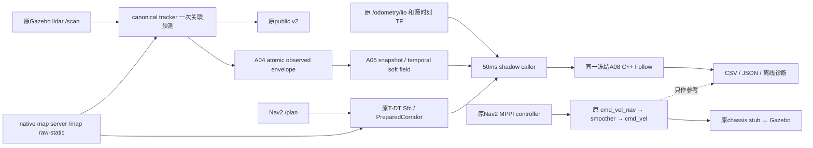
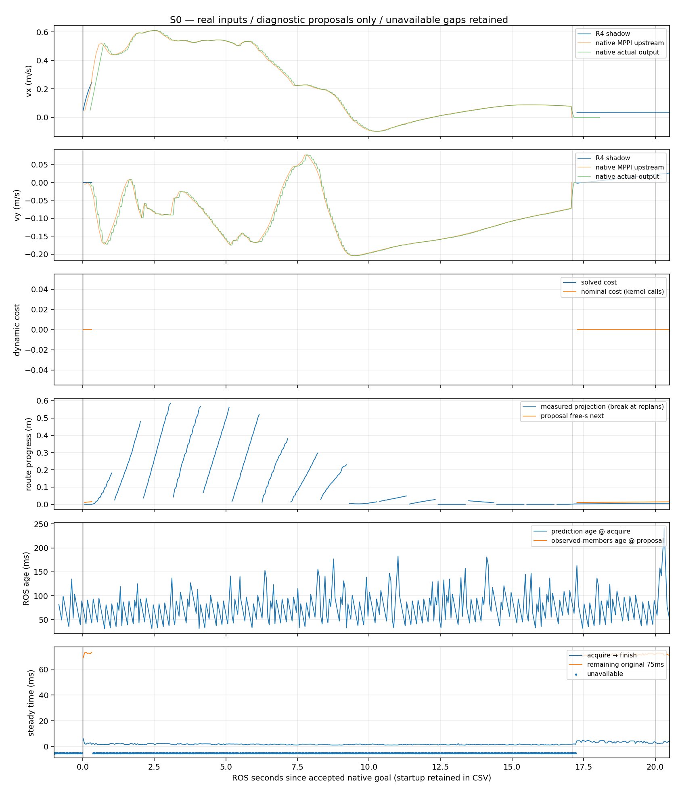
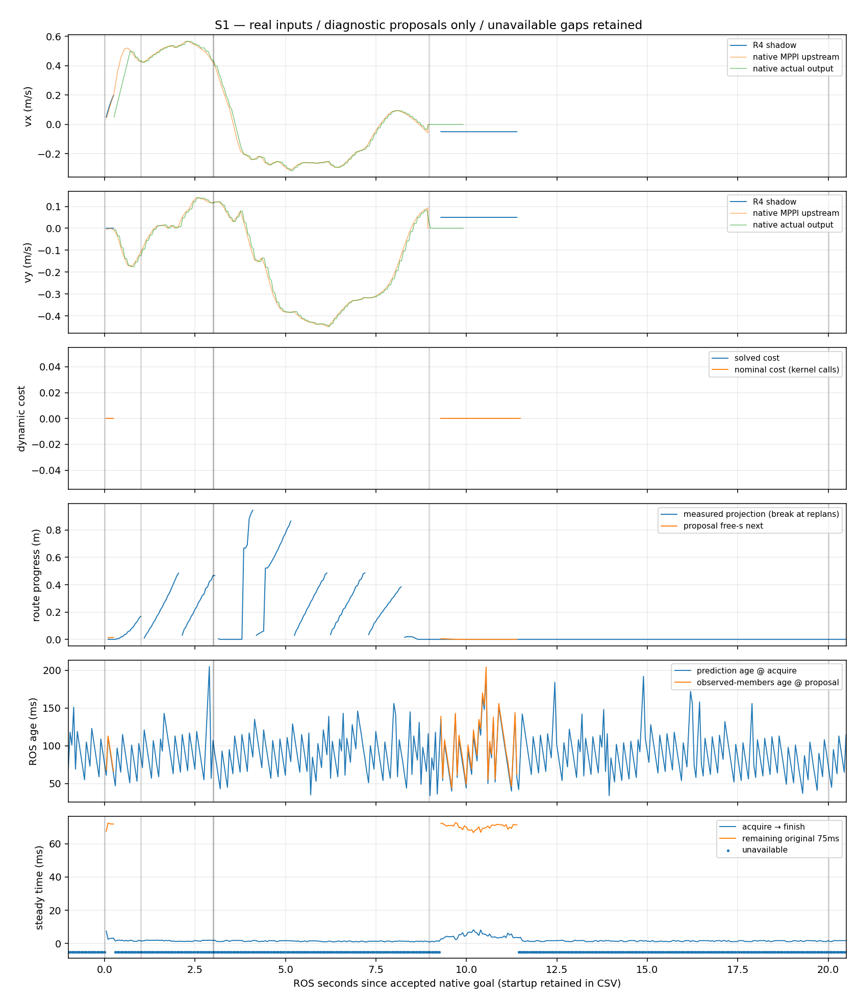
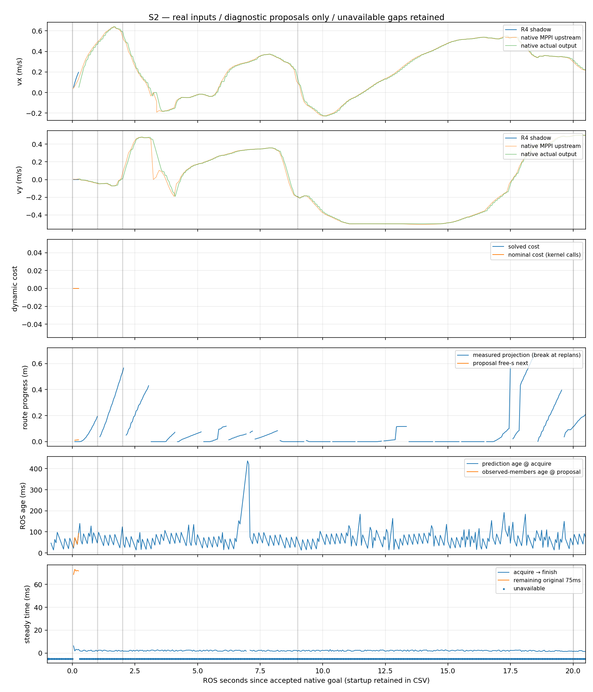

# A13 runtime shadow：实现前范围登记与运行证据

2026-10-05，Asia/Shanghai；算法/接口基线e137635e，阶段计划f138c72d。[计划](r4_runtime_shadow_plan.md)与[96项冻结资产](r4_runtime_shadow_checkpoint_sources.json)保持。

## 实现前登记

以下文件均位于独立`experiments/r4_runtime_shadow/`，不接正式main、不注册controller、不发布机器人速度、不调用A10 production enforcement：

| 文件 | 类别/现有接口缺口 | 算法影响 | 关闭方式 |
|---|---|---|---|
| CMakeLists.txt / shadow.cpp | 最薄adapter/caller；已有A08无ROS输入host。订阅原envelope、Nav2 Path、raw-static、odom、TF与参考cmd；直接链接原Follow | 原A05/A08源码和参数不改；真实state、同源TF、虚拟shadow seed明确记录 | 停独立caller；删除此实验目录/独立构建目标 |
| shadow.launch.py | launch；原sim入口world固定且没有shadow caller/raw-static map启动参数。复用原描述/定位launch、scan adapter、stub、原Nav2 navigation/lifecycle、map server与MPPI YAML | 不改既有main launch/config，不替换MPPI或输出路由 | 实验launch默认enabled=false；停其所有子进程 |
| prepare.py / scenario.py | 场景/日志instrumentation；复用既有world/model与原target bridge，空场删除原center_block；原phase1_empty只有1像素，不满足冻结API地图尺寸 | 只生成空场raw-static资产与仿真障碍时间表；不生成预测/Path/odom供算法，不复制plant/控制器 | 删除生成资产/停scenario target进程；不发布cmd_vel |
| run.sh / run_scene.py / report.py / extract.py / collect_evidence.py / README.md / COLCON_IGNORE | 隔离启动与有界测试进程监督、raw rosbag解码、只读分析、精确复现；原值测试不提供真实runtime时序证据 | 不增加solver/cost/预测或生产合同；图由原CSV生成；COLCON_IGNORE阻止默认构建发现此实验 | 仅显式执行；完整生成物留在隔离build目录，紧凑证据随Git保存 |

来源：同一仓库f138c72d/e137635e的`src/rm_simulation/worlds/phase1_omni.sdf`、`models/moving_obstacle.sdf`、`config/{ros_gz_bridge,course_dynamic_bridge}.yaml`，Apache-2.0；原Gazebo/bridge依赖intake见[既有来源登记](../external/gazebo_fortress_systems.md)。只修改生成的实验world：移除center_block；S1/S2加入已有moving_obstacle模型于x=2、初始target=-.9。机器人/传感器/物理/底盘插件保持原值。无新vendor源码。

首次三个场景统一goal=(4,0,0)，20秒ROS观察窗口，wall上限90秒；障碍在goal+1开始。S1于1–3秒从-.9横穿至+.9；S2于1–2秒到0、2–7秒停留、7–9秒离开至+.9。真实scan/tracker负责观察，不向Follow注入场景oracle。MPPI用未修改sim profile；Follow显式limits/body/rate取该profile，cruise=.4/free-s cap=.5沿用A08原测试输入，固定weights/TTL/raster/soft政策不变。

分析阈值预登记：WAIT-like为有效shadow平面速度<=.02m/s；forward为沿真实route tangent的速度>.05m/s；方向反转仅在相邻有效拍且双方轴速度绝对值>.02m/s时计数，同时报告间隔/重置。恢复需clear事件后连续3个有效forward拍；NA/输入失效不当WAIT、不当resume。统计保留全部cycles和同route窗口，定量结果不替代真实事件因果分析。

Follow call边界、原acquisition、source年龄、实际measured wz、receipt/path/body版本、虚拟shadow seed及完整proposal stages均记录；末级cmd的receipt用于离线owner phase估计，无source stamp的Twist不伪造源时间。15/40/75ms门限不改变。fixed-yaw不兼容和实际queue/age问题原样记入结果。

## 环境核查与当前状态

固定image sha256:81b325bebf2f631d2f70ca72914873e0fee6df5b87977750cac17228def171c3；Humble/Nav2 MPPI1.1.20、Gazebo6.18.0、ros_gz0.244.25。无网络、设备，源码只读，原子隔离build输出；private ROS domain/IGN partition。

首次环境检查错误使用`ignition-gazebo6`包名导致提前退出；使用实际`libignition-gazebo6`后确认存在。容器无matplotlib，图用主机已有matplotlib离线生成，不安装依赖。已有五个仿真包Release构建通过，未更改源码。

## 最终判决

**A13运行接线已完成，runtime shadow行为验收未通过：FAILED_INPUT_APPLICABILITY；动态prediction-consumption行为为INCONCLUSIVE。暂停继续production接线，不具备进入limited closed-loop的资格。** A08 fixed-yaw合同在这个原生MPPI profile的真实测量下长期不成立，关键冲突期间没有足够有效proposal。没有证明soft cost导致永久WAIT，也没有证明它能提前响应和恢复。

| 层级 | 判决 |
|---|---|
| unit/value | A12既有有限PASS保留；本阶段未重跑101项测试 |
| runtime input/applicability | FAILED；S0也不能连续有效，S1/S2关键窗口缺输出 |
| runtime dynamic behavior | INCONCLUSIVE；不是算法收益或算法失败证明 |
| limited closed-loop | NOT_EVALUATED / NOT_ELIGIBLE；未启用A09–A12 |
| deployment / hardware | NOT_EVALUATED；无实车、串口或正式入口变更 |

停止点是取得三个真实短场景证据后发现模型适用性阻塞，不是用额外框架或调参救结果。A12资产继续冻结；后续如果考虑支持真实角速度，属于新的建模/算法阶段，不能当作本阶段诊断性修复。也不能将measured wz置零、quantize yaw、改15/40/75ms或筛掉失败拍取得PASS。

## 实际最小接线



R4 caller没有速度publisher，不作为active Controller，不注册plugin/selector，不执行A10 lease/admission，不发送brake/fallback。独立CMake构建默认不被colcon发现；launch默认关闭。全部新增源码限于`experiments/r4_runtime_shadow`，无需复制A02 tracker/frontend/execution。

采用generic simulation链，而不是老车STVL入口。live `/cmd_vel`端点报告有**5个原生publisher**（composition下CLI名称UNKNOWN）；原Nav2的四个behavior命令接口与smoother是源码依据，未逐publisher识别实际发送者。R4只在subscription列表中。不能把此图宣称为正式老车输出独占验收；A06已指出generic sim与老车behavior remap不同。本阶段没有增加最终owner或并行R4输出。

状态按真实odom stamp查找map←odom TF；返回TF source stamp与pose stamp相同，不用latest TF回填。真实pose/yaw/body velocity输入原值接口。shadow虚拟seed绝不是actual applied：cold为零，后续为上一proposal，重建/失败/间隔重置。native MPPI command仅参考；measured state仍是其控制下的真实测量。

## 三个场景的结果

每场goal acceptance后20秒，400个scheduled cycles作分母；全部启动/结束拍也保存在CSV（S0/S1/S2分别520/527/521拍）。每场初始有效运行仅一次，没有配对/大规模重跑。三场ROS/steady real-time factor均约1.000。五轮启动失败另存，不计作行为场景PASS。

| goal窗口指标 | S0 空场 | S1 横穿 | S2 停留后离开 |
|---|---:|---:|---:|
| valid proposal | 62/400，15.50% | 48/400，12.00% | 5/400，1.25% |
| unavailable | 84.50% | 88.00% | 98.75% |
| native导航期间valid | 7/342 | 5/179 | 5/400；20秒内未返回goal result |
| fixed-yaw拒绝 | 338 | 180 | 393 |
| corridor拒绝 | 0 | 170 | 0 |
| QP primal infeasible | 0 | 2 | 0 |
| envelope/TTL拒绝 | 0 | 0 | 2 |
| solver状态：solved / not_run | 62 / 338 | 48 / 350，另2 infeasible | 5 / 393，另2未调用 |
| warm有效proposal | 6 | 4 | 4 |
| 有效WAIT-like（<=.02m/s） | 0 | 0 | 0 |
| 有效forward（沿当时route >.05m/s） | 6 | 47 | 4 |
| 相邻有效vx/vy方向反转 | 0 / 0 | 0 / 0 | 0 / 0 |
| 已计算dynamic cost peak | 0 | 0 | 0 |

**S0：** 原生MPPI到达goal（17.102秒），但A08在实际导航期间335/342拍fixed-yaw不兼容，不能满足“空场连续正常”的门槛。native导航期间实测|wz|median=.1112rad/s、P95=.9085，远大于冻结1e-6限制。停稳后的有效proposal不能冒称移动中Follow通过。

**S1：** canonical observed centroid在goal相对t≈0/2/3秒的y约为-.853/-.049/+.766m，实际观察到横穿；public/private各351条且内容逐值一致、receipt递增、track1持续。冲突阶段几乎无有效Follow；5个导航期间有效拍都在初始约0.046–.246秒。其后43个有效proposal在t≈9.295–11.395秒，机器人已接近/越过goal，不能当作提前响应。

S1在t=11.445/11.495秒附近两次QP返回`primal infeasible`（各40 iterations），nominal dynamic cost=0；其后有state outside certified static corridor拒绝。记录中机器人测量位置接近(4.05,-.71)，不是动态冲突时刻，不能归因于future soft cost压死路线。native goal result为8.972秒；末端状态/route适用性及仿真运动仍需另审，不能把这个原生运行当R4闭环验收。

**S2：** canonical centroid在t≈0/2/6/9/10秒的y约为-.873/-.089/-.003/+.807/+.797m，真实观测支持“进入、停留、离开”。只有初始5个有效拍（约.068–.268秒），进入/停留/离开后均不足以评价R4行为；2个envelope拒绝发生在prediction age超出冻结TTL的短窗口。没有证据证明永久WAIT，也没有恢复证据。

有效proposal的dynamic cost全为0，意味着这些有限兼容片段没有覆盖有代价的未来冲突。被输入合同拒绝的原始FollowResult默认零值不是已计算cost，分析已排除它们。不能据此宣布soft field无效或正常。

原TemporalSoftField对这些有效proposal stages的optional clearance查询均返回NA，plateau stages为0；NA不当作无穷净空或物理清空。最小predicted observed clearance字段与缺失状态保留在CSV/JSON，没有新增距离/物理oracle算法来填数。

S1脚本的“三个连续forward拍出现在clear TARGET后”机械指标为6.395秒，但同期既无已验证的动态减速/WAIT序列，route方向和native状态也已改变，因此**dynamic resume仍为NA**。clear target是场景目标事件，不是完整体物理清空证书。S0/S2该指标为NA，unavailable绝不计WAIT。

free-s stage内和相同path的相邻有效拍未发现下降，但有效片段过少，不能验收长期进度/稳定性。path revision在S0/S1/S2为17/9/20个；实际yaw使body digest在几乎每拍改变，重建使虚拟seed常从零开始，warm比例很低。这是本次shadow表达的限制，不能把小proposal速度误判为避障slowdown。图在replan处断开，避免把route-local progress拼成累计里程。

| 相邻有效proposal变化 | S0 | S1 | S2 |
|---|---:|---:|---:|
| pair数 | 60 | 46 | 4 |
| Δvx绝对值 median/P95/max m/s | .000018/.02963/.04496 | ~0/.03276/.04496 | .03645/.04407/.04496 |
| Δvy绝对值 median/P95/max m/s | .000351/.000702/.000702 | ~0/.000039/.000051 | .000042/.000050/.000050 |

这只描述兼容相邻拍，不能用零反转率为大量缺失的冲突窗口宣告稳定。

## Timing 与原始75ms离线估计

下表均为median/P95/max，单位ms。OSQP统计只包括实际进入kernel的拍（S0=62、S1=50、S2=5）；acquire→finish包含输入/corridor准备和调用，既有输入拒绝也有记录，不能当求解成功耗时。source年龄用ROS stamp差，steady只用于耗时和原deadline，两种clock不相减。

| 指标 | S0 | S1 | S2 |
|---|---:|---:|---:|
| solver区域耗时 | 1.764/2.258/2.352 | 2.204/5.023/6.096 | 2.107/2.434/2.498 |
| acquire→Follow返回（含拒绝拍） | 1.787/4.149/6.169 | 1.608/4.610/8.323 | 2.086/2.575/6.274 |
| prediction age @ acquire（全部goal拍） | 74/137/183 | 88/142/205 | 62/134.05/437 |
| prediction→valid proposal age | 73.5/123.5/167 | 94.5/155.3/204 | 59/89/93 |
| observed members→valid proposal age | NA；无障碍 | 94.5/155.3/204 | 59/89/93 |
| valid proposal剩余原75ms | 71.216/72.523/73.263 | 70.624/72.226/72.560 | 71.837/72.972/73.163 |

有效proposal剩余预算的最低值分别68.831/66.677/68.726ms。未看到15ms solver或40ms acquisition deadline失败；这不构成最坏实时保证。S2两次年龄437/相邻stale输入被既有gate拒绝，不修改TTL；source年龄与computation budget是两个问题。

离线`deadline=original_acquire_steady+75ms`，没有以finish重置。next-owner phase来自**Follow返回后下一条实际cmd_vel的receipt**，无Twist源stamp，不能宣称是发送或actuator时刻。此simulation有多native publisher；也未激活A10/A12生产验证。

| 离线75ms观测 | S0 | S1 | S2 |
|---|---:|---:|---:|
| 有next-output receipt证据 / valid | 23/62 | 18/48 | 5/5 |
| 代理next phase前未过期 | 19/23，82.61% | 15/18，83.33% | 2/5，40.00% |
| next receipt等待median/P95/max ms | 42.875/189.114/240.097 | 10.863/168.478/206.807 | 109.292/197.131/206.245 |
| 没有后续receipt的NA | 39 | 30 | 0 |

S2估计仅有最初5个proposal，尚处native开始输出的phase；S0/S1多为goal结束附近的稀疏输出。当前证据不能断言75ms结构性不可行，更不是lease PASS。需要具有持续有效输入的运动窗口才有资格评价执行期phase/expiry。

## 异常、诊断性修复与保留

| 保留run目录 | 问题 | 最小修复；未改变冻结算法 |
|---|---|---|
| S0_initial_launch_failure | rclpy nanoseconds被误当函数；原shell清理未及时停止launch子进程，未发goal | 用属性取时间；换有界process-group监督。只停止本任务测试容器，原数据保留 |
| S0_startup_failure | v2 last_observation_cv漏掉既有要求的decay=0/max_speed=0，tracker拒启动；非composition Nav2 lifecycle配置卡住 | 只补全原v2 coupled参数，原producer/CV不变；复用原生composition接线 |
| S0_missing_container_failure | 独立navigation_launch只LoadComposableNodes，未建nav2_container | 实验wrapper补上原rclcpp_components/component_container_isolated；此前“恢复默认composition”的描述不适用于此独立launch |
| S0_container_params_failure | 容器未继承原完整params，child costmap使用默认值，MPPI初始化segfault | 复用上游RewrittenYaml/ParameterFile把原配置传给容器；日志确认后续为原obstacle/inflation layers |
| S0_preactivation_goal_failure | action server已出现但lifecycle尚未active，goal过早被拒 | scenario只读查询既有navigator GetState，active后再发goal；不重写/改变lifecycle |

五轮均没有有效行为goal窗口；所有失败日志/bag/CSV/hash保留，未覆盖成成功run。观察数据包含真实source-time TF extrapolation drop，原tracker不为它回填latest；本阶段没有重写感知时间策略。外层准备的route tangent只用于记录forward方向。

分类：A类输入为主（fixed-yaw、corridor、少量TTL）；B类有2次局部QP infeasible但与动态冲突无对应证据；C类没有deadline失败，source年龄和receipt phase观察仍不完整。没有权重、形状融合、CV模型、solver、iteration limit、future hard veto或生产安全层的救场变更。

## 复现、来源与交付

[执行入口/关闭方式](../../experiments/r4_runtime_shadow/README.md)；精确运行命令保存在[provenance](../../experiments/r4_runtime_shadow/evidence/provenance.json)和各run_manifest。新增caller Release构建通过，无compiler warning；五个原profile包以固定镜像构建通过，原执行命令（镜像内、source /opt/ros/humble/setup.bash后）：

```bash
colcon --log-base /check/profile_log build \
  --base-paths src/rm_description src/rm_nav_config src/rm_localization_adapters \
               src/rm_chassis_interface src/rm_simulation \
  --build-base /check/profile_build --install-base /check/profile_install \
  --cmake-args -DCMAKE_BUILD_TYPE=Release -DBUILD_TESTING=OFF
```

环境：固定image ID如前；GCC11.4、Eigen3.4、Humble Nav2 MPPI1.1.20-1jammy.20260607.083249、ROS-GZ0.244.25、Gazebo6.18.0、相同固定OSQP0.6.3。caller实际链接冻结A12 Follow/consumer、A04 interfaces和原A08 OSQP prefix；45个实际动态库/installed launch文件的hash记录于provenance。运行基于f138c72d加逐run adapter源码hash，binary hash相同；报告脚本在采集后新增/修正，不改变已采集行为。

紧凑证据随本次Git提交：[汇总JSON](../../experiments/r4_runtime_shadow/evidence/summary.json)、[S0 cycles](../../experiments/r4_runtime_shadow/evidence/S0_cycles.csv)、[S1 cycles](../../experiments/r4_runtime_shadow/evidence/S1_cycles.csv)、[S2 cycles](../../experiments/r4_runtime_shadow/evidence/S2_cycles.csv)、[canonical observed members](../../experiments/r4_runtime_shadow/evidence/observed_members.csv)、[启动失败](../../experiments/r4_runtime_shadow/evidence/startup_failures.json)。同目录保存reference receipts、events、lease估计和图。





完整原始bag、prediction JSONL、运行日志、构建与环境记录位于`/home/qihei/rm2027_navigation/build/r4_hws_prediction_consumption/build/r4_runtime_shadow_20261005`；[raw hash索引](../../experiments/r4_runtime_shadow/evidence/raw_evidence_hashes.json)给出每个scene/失败run文件hash。public/private共1043对消息，recorded multiset逐值相同，各scene receipt严格递增。完整bag没有塞入Git，不承诺忽略build目录在另一checkout自动可得；committed cycles/observations/reference可独立审阅。

保留核查通过：96项A12冻结资产逐字节保持，public v2不变；63项审计来源、92项保护refs、33个branch heads（除R4本次推进）、原checkout分支/HEAD和十个dirty/untracked、main/origin main及冻结R3保持；未读取/删除大型untracked core。正式bringup/config/chassis/serial/mission/simulation源码与main一致，A02只作原harness，R3未重跑。

下一步只应先判断fixed-yaw切片在目标实际profile中的适用范围/是否需要独立建模阶段。现有证据支持停止继续R4生产输出接线；不足以冻结或否定整个HWS-style时间消费机制，也不足以接受动态避障。无需新增owner、tracker、solver或安全框架来掩盖该缺口。
