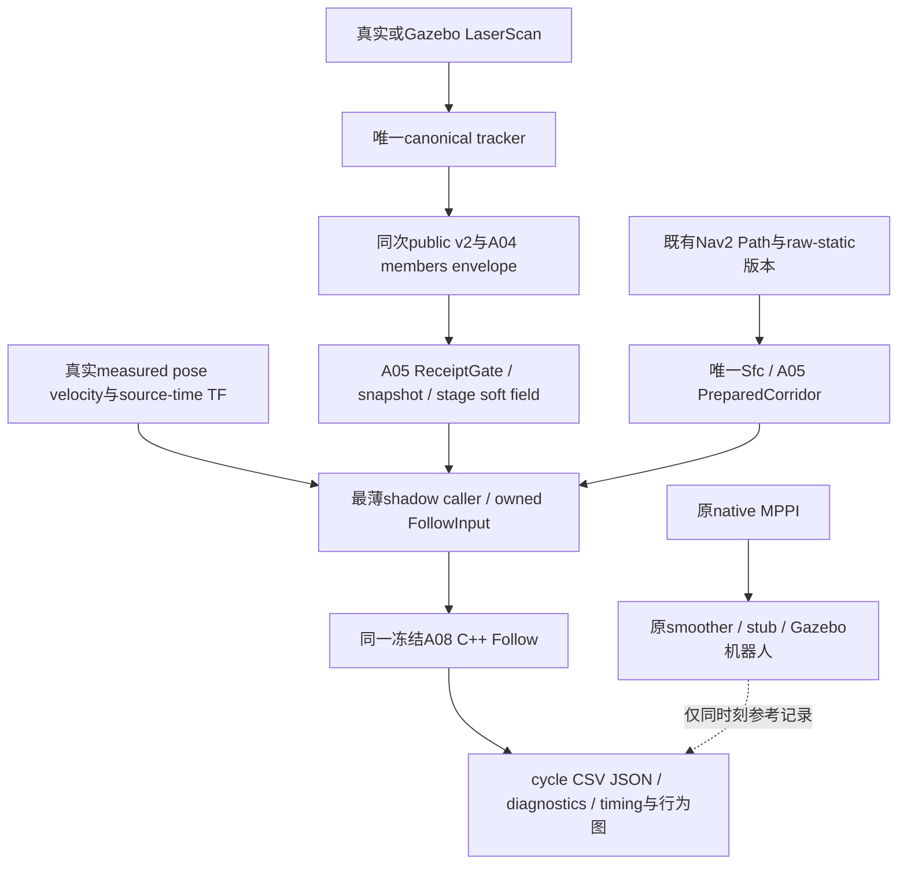

# R4 A13：近期重点调整为真实ROS runtime shadow行为验证

2026-10-05，Asia/Shanghai。用户要求继续同一`experiment/r4-hws-prediction-consumption`，固定A12基线`e137635ee8c59888ffad853d1cd9ababb8df8ea6`，停止扩展生产输出基础设施，先回答真实感知/预测/Path/TF/odom下Follow提案是否合理、稳定且具有时间意义。

**本次交付为重点调整、冻结登记和阶段计划。runtime shadow caller、启动环境和S0/S1/S2尚未实现/运行；当前只有既有unit/value PASS，runtime shadow/closed-loop/deployment均未评估。** [冻结源码与保留清单](r4_runtime_shadow_checkpoint_sources.json)记录调整前HEAD、算法/接口摘要和既有环境候选来源。

## 工作顺序与暂缓项

| 优先级 | 近期工作 | 本阶段完成条件 |
|---|---|---|
| P0 | 冻结A08数学、A09–A12接口与public v2；核对main/R3/原dirty | 已完成本次源码/状态登记；不以历史101个GTest冒充runtime结果 |
| P1 | 选定一个已有Humble/ROS仿真profile，核实native MPPI、scan/Path/raw-static/TF/odom和真实topic/frame/QoS | 发布环境与依赖hash、实际参数、精确启动命令和图；候选profile未经运行不能称就绪 |
| P2 | 只增加必要的shadow输入adapter、caller和instrumentation，直接链接同一A08 C++值库 | R4仅记录proposal；MPPI保持原控制责任；停用shadow即可完全移除其影响 |
| P3 | 首轮S0→S1→S2，每场一次短运行，保存全部cycle与异常 | 时序/行为报告可追溯到原始CSV/JSON；失败先分类，不立刻调参 |
| P4 | 判决是否有资格进入有限Gazebo闭环 | 最多判定runtime shadow行为通过；不足则不进入闭环/生产接线 |

生产grant/cancel、原owner lease enforcement、串口/平滑后admission、native fallback、完整T-DT co-deployment均后移。75ms只做离线时序模拟；其结构性间隙不作为本阶段提前否定算法的理由。

不新增安全框架、arbiter/owner、tracker/prediction pipeline、costmap/STVL、solver或动态代价项；不重新设计lease/fence、不扩展A10/A12 production contract、不改main默认导航、不让R4取得最终输出权。不做30-run配对、不重跑冻结R3，不扩大R5/R6。15ms solver、40ms原acquisition预算、400iterations、75ms source lease和A08权重/消费参数保持。

## 冻结与允许的最小接线

以`e137635e`的源码字节作为freeze基准，保留A02 tracker/frontend/execution为harness，不把它们当ROS生产来源。算法参数、预测模式与模型语义不因首次失败改变。

| 可能需要的新文件类别 | 现有接口缺口与可复用内容 | 是否改变算法 | 关闭/删除方式 |
|---|---|---|---|
| adapter / shadow caller | A08 `FollowSolver::solve(FollowInput)`已有数学与预算，但没有订阅真实ROS输入并在同拍构造owned值的caller；A11需要原host bind/take，没有已接shadow host。优先独立最薄caller链接A05/A08，不强行将A11变成active Controller | 不改Follow、ReceiptGate、Sfc、public v2或A09–A12 | 单独实验目录/构建目标与独立进程；计划默认不启动，停进程并删除实验wrapper即可 |
| instrumentation / report | FollowResult已有solver status/time、cost、slack、warm；缺跨scan→prediction→state→proposal的统一cycle证据。只记录实际stamp、版本、结果和派生指标 | 不增加代价、候选、过滤或求解调用；记录开销单独计时 | 与caller同启停；报告工具只读日志 |
| opt-in experiment launch/config | 复用既有仿真/MPPI/tracker启动接口；实验需绑定真实topic/QoS/frame、启用既有v2/A04 members，并独立启动shadow | 不改main默认launch/YAML/输出路由；实际profile作为显式值输入 | 独立实验launch/config，默认不启用；不注册R4为controller plugin/selector目标 |

这些是拟议变更范围，不是已存在的启动选项。实现每个新文件前，应登记具体缺口、类别、算法影响和移除方式。若现有接口不能运行，先保存阻塞证据；只允许必要的诊断性最小修复，并将改变源码hash的补丁单独列出，不静默改freeze。

## 环境候选与先检查的兼容性

优先核查既有`src/rm_simulation/launch/phase1_5_mppi.launch.py`及其Humble/Gazebo profile，复用`phase1_5_gazebo.launch.py`、scan adapter、`/odometry/lio`、原stub和native MPPI。`phase1_5_mppi_course.launch.py`、moving obstacle模型/target bridge可供场景复用，不照搬整个多障碍course。已有sim资料见 [MPPI验证记录](../phase1_5c_mppi_validation.md) 和 [Gazebo边界](../phase1_5_gazebo_validation.md)。

本次只读源码显示：

- 仿真profile为Omni MPPI、10Hz、smoother20Hz，限值`vx[-.5,.8] / vy±.5 / wz±1.2`、footprint`±.30/±.25`、padding`.03`；老车STVL为`vx[-.3,.5]`、footprint`±.32/±.27`、padding`.02`。不能将仿真参数冒充老车参数；Follow必须读取所选实际profile，A08冻结数学不变。
- 该仿真global/local costmap配置为obstacle+inflation，不是老车STVL，也不直接构成raw-static来源。核实既有`phase1_empty`地图/原map server是否满足所选场景；不能把current dynamic图或未来union当静态地图，也不新增一套costmap。
- 仿真scan出口为`/scan`，tracker默认`/local_scan`；必须仅做输入remap。tracker默认`prediction.anchor_mode=filtered`，A04 members要求既有`last_observation_cv`；只在实验参数启用原v2模式及members，不改变模型、不创建第二producer。
- 真正的planner Path topic、frame、发布版本及QoS必须从选定graph核实，不能把假设的topic名写成启动验证结果。
- A08固定yaw切片要求实测`|measured_yaw_rate|<=1e-6`、TF/pose同源时刻、状态年龄不超过100ms等原合同。MPPI可能旋转；不能把实测wz置零、改pose时间或改门限。首轮选择简单直线路径，并把不兼容拍全部记为输入不可用，不筛掉失败拍来提高ratio；如果兼容窗口不足，明确判为当前切片输入/模型适用性限制。

本轮没有检查容器是否已具备Gazebo运行依赖，不下载/安装或启动graph。P1先用已存在环境做最小可用性核查，再选择最容易复现的profile；环境未满足应交付明确缺口，不用离线harness数据替代真实ROS输入。

## Shadow数据流与输入语义



shadow不发布最终`/cmd_vel`、不改smoother/serial/stub输入、不成为active Controller、不触发selector或抢占MPPI；不启用A10生产lease enforcement，不生成brake/fallback command。A10/A12仅用于理解离线source预算规则，不调用它们授予真实输出权限。

每拍复制真实输入及其版本，明确同一个control epoch与原steady acquire；state/TF用源时刻，缺失/不匹配就记不可用，不用latest TF补写成旧时刻。PreparedCorridor可按真实path/static/body版本缓存；需记录生成时刻和是否重建，不制造稳定revision隐藏replan。

MPPI实际command只作同刻参考，不直接作为Follow控制输入或warm seed。A08需要的`last_applied_*`在shadow没有实物执行对应项：caller必须显式标注为**shadow虚拟上一拍提案seed**（冷启动/重置seed另记），绝不称actual-applied。使用同一接口只研究反事实proposal连续性；measured pose/velocity仍来自真实odom，不能积分shadow提案替代measured状态。该seed语义不能自动沿用到未来闭环；若因此无法得到有意义行为，应记录接口/适用性限制，不能偷偷回接MPPI command。

progress由真实测量在当前route中的投影及原Follow值接口表达，记录input progress、`controls[].progress_rate`和`stages[].progress`；不把上拍预测末端当下一拍真实状态。跨拍单调性在相同path/static/body版本窗口内评估；replan、机器人真实后退与版本切换分别标记。

## 每拍原始证据和时间定义

原始CSV/JSON至少包含以下字段，输入失败拍也写一行，并保留nullable字段和原因，不用零伪装缺失值：

| 类别 | 必记内容 |
|---|---|
| 身份/版本 | run/scene/cycle、process/build hash、receipt producer/generation/sequence/digest、track ID/association sequence、path/static/corridor/body/limits revision与digest |
| ROS/source时间 | scan/observation、prediction source及anchor、各members observation、pose、velocity、TF请求/返回source stamp、acquire ROS epoch、proposal观测/生成ROS epoch |
| 本地steady时间 | callback entry、snapshot acquire、Follow call start/finish、proposal可观察/日志封装时刻、diagnostics完成/写盘时刻；不跨进程直接减裸steady epoch |
| Follow结果 | status/reason/iterations、proposal vx/vy/wz、input/free-s/progress_rate及stages、nominal/solved dynamic cost、slack、used_warm/reset_warm及reset原因、shadow seed身份 |
| 直接诊断 | 已有`TemporalSoftField::sample`对proposal stages可取得的minimum predicted clearance、plateau/gradient；这是observed-soft代理，不是完整物体物理净空；缺proposal则标NA |
| 同刻参考 | 原MPPI上游command与原末级实际command、来源topic/接收时刻/是否有源stamp、odom；无stamp的Twist只能给receipt时刻，不伪造源时间 |

`Follow call start/finish`定义为外层`FollowSolver::solve`调用边界，包含输入验证/装配/数值求解/重验；内部OSQP/setup区间继续用原`solver_seconds`，不能将两者混名。proposal generation采用shadow真正可观察到返回值并形成记录的边界，注明区别于内部构造点。诊断查询/写盘开销另外记录，不能归入原solver时间或从source年龄中隐去。

派生指标：`observation_age_at_acquire`（每track及min/max）、`prediction_age_at_acquire`、`state_age_at_acquire`、`velocity_age_at_acquire`、`acquire_to_solve_finish`、`observation_to_proposal_age`、`prediction_to_proposal_age`。ROS年龄只能用同clock/domain对应ROS stamp相减；计算耗时用本地steady。记录`/clock`、real-time factor、暂停/回拨与queue delay；跨reset窗口不拼接统计。

离线75ms规则：

```text
deadline_steady = original_acquire_steady + 75ms
remaining_75ms_budget_at_proposal = deadline_steady - proposal_observed_steady
estimated_next_owner_phase = 从实际原owner发令receipt序列估计下一phase，并注明估计/误差
would_expire_before_next_owner_send = estimated_next_owner_send >= deadline_steady
```

remaining保留负值；没有owner phase证据则NA，不造timer相位。已知20Hz只能给粗周期参考，不能当实际next-send保证。这个模拟不启用生产lease、不刷新deadline、不用于拒绝MPPI输出；回答“proposal有多旧、75ms实际是否结构性不可行”，不宣布lease PASS。

## 三个首轮场景与行为分析

首轮每场一次短运行；失败重试只能用于验证已记录的诊断性修复，并保留原run，不升级成配对统计。启动前固定场景坐标/时间表、goal/route、run时长、固定参数、日志schema、WAIT/forward/reversal阈值和统计方法；登记这些分析阈值不改变算法，不能看结果后选阈值。S1/S2需包含障碍清空后的完整观察窗口。

| 场景 | 设置与首要问题 | 重点证据 |
|---|---|---|
| S0 空场 | 无动态障碍的简单直线导航，MPPI控制 | proposal连续/方向一致、free-s正常推进、无无故WAIT/左右振荡，unavailable原因及兼容拍比例 |
| S1 横穿 | 一个真实仿真障碍从规划路径前方横穿 | 正常推进→未来冲突→提前slowdown/侧移/WAIT→释放→RESUME；必须确认真实scan和tracker观察到了它 |
| S2 停留再离开 | 同一障碍先移动/确认、停在路径上，再离开 | 暂等/slowdown后恢复还是长期WAIT；是否把时间冲突错误变成永久空间封锁 |

scene obstacle pose/运动时间表只能标记事件与辅助根因，不替代canonical tracker预测供Follow消费。MPPI可能绕行、重规划或提前改变measured状态；必须把这些变化与R4响应一起画出，不把“MPPI带机器人越过冲突”冒称R4自身闭环恢复。

每场输出cycles、attempted solve/valid proposal/输入不可用/solver unavailable比例，solve time median/P95/max，source→proposal及prediction→proposal年龄统计，simulated 75ms ratio及NA占比，vx/vy跨帧delta、direction reversal次数、WAIT-like拍数、resume事件与clear后恢复时长、同route的progress轨迹及dynamic-cost peak。全部scheduled cycles作总分母，另报兼容输入子集；不把input failure混称solver failure。

简单图至少覆盖`vx_R4_shadow / vy_R4_shadow / MPPI_actual / dynamic_cost / free_s / prediction_age`，同时标注障碍进入/停留/clear、unavailable和path/producer reset。原始证据优先，时序图不能替代CSV/JSON。

## 失败分类、判决和之后的边界

首次异常先保存原始数据和参数/hash，按输入A、求解/消费B、runtime时序C分类：

- A：members不稳定、ID/restart、age/TF/odom/fixed-yaw不兼容、corridor/static/frame或profile错误。
- B：plateau/梯度无方向、free-s卡死或失控、高频左右反转、clear后不恢复、soft cost压死推进。
- C：callback/executor排队、solve jitter、source→proposal普遍过旧、75ms剩余稀少。75ms问题单独报告，不能直接推成B类算法失败。

仅诊断性最小修复；不改dynamic weights、不增加solver/portfolio/halo/新动态项/future hard veto，不恢复R2/R3 guard，不改prediction模型或observed历史融合。不能通过新增复杂层得到“基本行为PASS”。

只有S0正常，S1明确提前响应，S1/S2能够wait/slowdown后恢复，没有高频反转/大量失效，时间年龄仍有实际意义且没有必须重写架构的缺陷时，才可写：

> R4 prediction-consumption core passes runtime shadow behavioral validation; eligible for limited closed-loop Gazebo validation.

这只是进入下一阶段的资格，不自动启动下一阶段，也不叫deployment PASS。输入/时间不足则明确NOT_EVALUATED/INCONCLUSIVE；稳定停死、不恢复、振荡、大量unavailable或需要复杂救场时暂停production接线并给冻结R4建议。101个既有GTest不支持shadow PASS，75ms不连续也不能单独支持算法失败。

shadow通过后另开有限阶段，先1–2个Gazebo闭环场景，再启用既有A09–A12接线到原owner，验收active grant/cancel/switch、expiry、native MPPI fallback、actual command/footprint/contact/measured odom及release/resume；仍不做30-run。

## 本阶段最终交付与本次状态

最终需要：shadow接线说明、精确且已执行的启动命令、环境/commit/dependency hash、原始cycle evidence、timing summary、S0/S1/S2行为报告、异常与修复记录、是否可进入有限闭环的明确判决和Git commit。unit/value、runtime shadow、closed-loop、deployment四级分开记录，本阶段最多前两级。

本次完成计划和冻结核对，未新增runtime源码、未运行场景、未重跑数值测试。当前shadow结果为**NOT_EVALUATED**；下一项具体工作为P1环境/input可用性检查与P2最小caller预登记。此前A12的生产接线清单保留为后续条件，不再作为shadow行为验证的前置阻塞。
