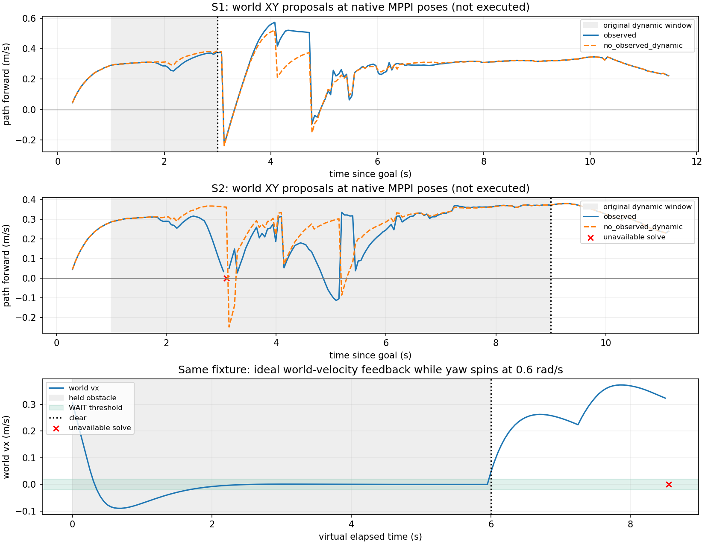
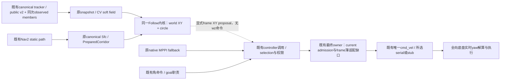

# A21：Frame semantics 审阅与 world-XY consumption

2026-10-06，Asia/Shanghai。Research，运行时 HEAD/基线 `a1910a0a` 加本阶段本地改动；同分支提交后可由实验入口复现。按用户提供的新车事实，停止 A20 angular transition、自由角速度优化和旋转 MPC。

## 最小 frame audit（实现前）

| 问题 | 当前源码事实 | 研究处理 |
| --- | --- | --- |
| A08/A19 vx/vy frame | FollowControl/Proposal 字段名 body_velocity；follow.cpp maps(yaw) 用 R(yaw)，cold_seed 用 Rᵀ 转 path tangent | 原实现是 base_link XY，不是世界系 XY。A19 是这一参数化的条件候选 |
| 未来 XY | p_k = p_start + sum(dt*R(model_yaw)*v_body)，future model_yaw 固定 | body-held 模型随未来 yaw 改变；world-held v 则是 p_k = p_start + sum(dt*v_world)，没有未来 yaw 项 |
| 当前输出转换 | Nav2 controller 返回 body Twist，smoother 逐轴处理，serial/stub 直接传 vx/vy/wz；chassis/topic contract 定义 base_link | 当前 legacy 链没有实时 world→body 入口。新车实时解算能力是用户给定系统事实，当前仓库不据此冒充已有接线。离线 world proposal 不进入此链 |
| wz 责任 | 既有 native MPPI/behavior 产生 angular.z，smoother 和所选 transport 转发；XY/wz 有独立字段，scale_velocities=false | 全向底盘可同时旋转和平移。Research world-XY proposal 不包含 wz，不发零、不夺取角责任，raw measured/history wz 保留但不作零条件 |
| 还需 yaw 的项 | 当前 body measurement→world measurement 需 source-time yaw；原 polygon support、body-axis limits 和输出 conversion 涉及 yaw | world-XY rollout/free-s/observed-world CV/soft cost 不必依赖 future yaw。保守圆取消 support 的方向依赖；body limits、实时输出转换与物理跟踪留 Integration |
| 云台雷达 | TF contract 为 map→odom→base→gimbal→MID360，source-time dynamic TF；canonical odom twist 是 base_link | 云台角度/fake 正方向属于感知坐标转换。本研究沿既有记录的 map observed-members，不建立新的云台/预测管线，也不混同底盘 wz |

A20 的条件几何计算对原 body-held 模型有效，但将其提升为 HWS/world-XY eligibility 的必要条件不成立。
新车 world XY 可独立规划；缺少 legacy 输出适配是 Integration 缺口，不能成为等待角速度归零的算法门。

## 最小实验预登记

使用同一 45 变量 Follow/OSQP、原 observed-raster/CV、原 Sfc、原残差/权重/15/40/75ms。
新增显式 world-XY 值包装，同一内核在 world frame 装配；前拍 world proposal 只作虚拟 XY slew seed，
与原 measured body/source/history 分开。raw 非零 wz 保留，不优化、不预测或发出 angular command。
source XY 按 source-time yaw 转换的 measured world velocity 推至 epoch，不依赖 future wz。

保守圆用原 S1/S2 记录机械矩形的外接半径 hypot(0.30,0.25)+0.03=0.420512m，
包含原 padding；static clearance 仍0.05m。不是新车八边形尺寸标定，不用变小 footprint 救结果。
圆的 static rectangle support yaw-invariant；soft field 使用 raster-cell 的圆形 Minkowski dilation。
数值速度/率界沿用原值，解释为 Research world-axis bounds，不冒称任意 yaw 下的实际 body actuator 认证。

最小判定：原 S1/S2 native navigation 全窗口与200拍动态窗口，paired no-observed-dynamic ablation
只清离线副本的 tracks，不改变 canonical producer/public wire；比较 coverage、提前响应、
WAIT/slowdown、clear后 RESUME、振荡、求解时间。另复用同一合成 hold→clear，保留非零 raw/last wz。
无新 Gazebo/ROS publisher/输出 owner；当前 replay 仍是实测来源下的 counterfactual 值诊断。
Go：world/circle 输入有覆盖与可辨消费响应；Modify：具体输入/求解/平台/恢复失败；Stop：缺乏消费价值。
结果与追加判定如下。

### 首轮后追加的两个可判定问题（参数不变）

- S2 cycle144 在400迭代返回 solved inaccurate（2.846ms），严格规则下无提案；仅在该拍 reset_warm，保留 preceding XY、原输入/约束/容差，检验是否是移位局部 seed 的问题。结果单独保存，不覆盖首轮失败，也不默认为上线重试策略。
- held-source probe 连续给定相同位置/0.35m/s实测速度，而虚拟提案已后退，不能据此认定实际 WAIT。追加同一 observed fixture 的90拍理想 world-velocity feedback（30拍持障、60拍clear），用实际前拍提案积分虚拟位置/速度并投影原path；对照只删消费tracks。测试 plant不升级为运行导航或MPPI baseline。circle维持既有fixture的 hypot(.32,.27)+.02=0.438688m，未换小几何。记录机械净空仅作离线已知矩形oracle，不进solver。

短 feedback 结果仍后退，追加同一 fixture 的120拍持障（6s，对应原S2动态窗口长度量级）与60拍clear，参数/几何/solver不变；只回答最后20拍是否稳定WAIT、持障方向反转和clear恢复，不建立运行状态机。

## 源码定位与复用矩阵

| 边界 | 本地源码 / 接口 | 本阶段处理 |
| --- | --- | --- |
| 原速度参数化 | `src/rm_r4_prediction_consumption/include/rm_r4_prediction_consumption/follow.hpp` 的 FollowState/FollowControl/FollowProposal；`src/follow.cpp` 的 maps/rollout/cold_seed | 原 body XY 接口与 gate 保留；WorldFollowInput/Proposal 明确 world frame，无 angular 字段；共用原45变量、168约束内核，不另写MPC |
| 原 source-time 状态 | `experiments/r4_runtime_shadow/shadow.cpp` source-time lookupTransform(map, odom) + transform*pose + tf2::getYaw；Odometry child_frame=base_link，twist原样记录 | source body v 仅以 source-time yaw 转 world；raw yaw/wz/时间/历史全部保留。≤100ms source→epoch 是常世界速度外推假设，不冒称实际轨迹积分 |
| shape/prediction | `src/rm_r4_prediction_consumption/src/consumption.cpp` PredictionSnapshot/ReceiptGate/TemporalSoftField；A14 replay.cpp 的原bag decoder | 原public v2、成员hook、raster与单次CV不变；circle只变消费支持，不建立第二pipeline。无动态消融只删离线副本tracks |
| static/frontend | `src/rm_r4_prediction_consumption/src/corridor.cpp` PreparedCorridor→既有 canonical SfcSquare provider（A05来源登记） | 直接复用原路径、Sfc和静态认证；circle保守侵蚀，不补路径、不复制frontend |
| 当前 controller | `src/rm_r4_nav2_controller/src/controller.cpp` computeVelocityCommands 的 body Twist映射；原Humble controller_server computeAndPublishVelocity | 不改生命周期/ControllerSelector/GoalChecker；既有接口不能直接接受WorldFollowProposal，后续只在现有调用点适配，不把map XY塞入base_link Twist |
| smoother / 最终ROS输出 | 原Humble `nav2_velocity_smoother/src/velocity_smoother.cpp` smootherTimer/applyConstraints；`src/rm_navigation_bringup/launch/old_car_2026_validation.launch.py` cmd_vel→cmd_vel_nav remap；相同Humble cache `/tmp/r4_nav2_owner_readonly_a097086` | 原逐轴限幅/率，不做坐标变换。scale_velocities=false时无因wz耦合XY的数学条件；所有权/通用profile例外沿A06，不推广为全仓唯一 live graph证书 |
| transport | `src/rm_serial_driver/src/serial_transport_node.cpp` handleCmdVel/writeFrame；`serial_dry_run_node.cpp`；`src/rm_chassis_interface/src/chassis_interface_stub.cpp` handleCommand | clamp并编码/转发vx/vy/wz，没有实时yaw旋转。新车world解算能力按用户事实成立，但当前协议/运行接线尚未表达；既有选中transport继续唯一输出，无新增owner |
| TF / 雷达 | `docs/contracts/tf_contract_2027.md`、`topic_contract_2027.md`、`chassis_contract_2027.md`；canonical lio_adapter/gimbal adapter | source-time TF统一观测到map；不以底盘wz替代云台角，不改TF owner |

十二项完整能力复用/正式状态仍见 [A06 reuse matrix](r4_reuse_audit_checkpoint.md)；本轮没有新增tracker、producer、frontend、MPPI、watchdog、串口或并行publisher。

## 有限结果

输入为原A16 corrected S1/S2导航窗口，共453拍；native MPPI实际控制，原B0两场均SUCCESS。
本轮R4 proposal未执行，虚拟前拍world XY只作slew seed；最近original actual_output **receipt代理**作为原始历史证据，不是physical applied/send grant，也不成为虚拟命令seed。
每场开头5拍缺少输出receipt代理，明确NA，不伪造零历史或计作WAIT。

| 指标 | S1 observed / 无动态消费 | S2 observed / 无动态消费 |
| --- | --- | --- |
| 原导航窗口coverage | 225/230 / 225/230（可组成原始证据的225拍全解出） | 217/223 / 218/223（可组成证据的218拍中1失败） |
| 原动态窗口coverage | 40/40 / 40/40 | 159/160 / 160/160 |
| 预测引起forward下降≥0.05m/s，当前观测净空仍正 | 0拍（最大下降0.0452m/s） | 38拍；首拍goal+2.644s（motion+1.644s） |
| 动态窗口 WAIT / forward<0.05m/s | 0/0 / 0/0 | 0/11 / 0/7 |
| clear后首个连续3拍forward>0.05m/s | 0.374s / 0.374s | 0.044s / 0.044s |
| 动态窗口vx/vy/forward反转（±0.02死区） | 0/2/0 / 0/2/0 | 4/3/2 / 2/5/4 |
| observed solver中位/p95/max | 1.108/1.457/2.709ms | 1.146/1.939/2.846ms |
| observed acquire→result最大 | 4.591ms | 3.336ms |

442个有效observed提案中441个保留非零history wz、442个保留非零measured wz。world-only条件不要求上一应用wz为零。
原路径在S1/S2各更新11/10次，两种条件都有方向反转；不能从这些native-pose counterfactual序列推导实际R4闭环振荡。
clear后的值表示**可用前进提案**，原S1/S2没有形成WAIT，因此不冒称这两个runtime记录已经证明WAIT→RESUME状态转换。
observed有效提案没有future observed-support重叠；该净空是带raster/motion-error的观测模型值，不是全物体/物理安全证书，也没有成为未来硬veto。

### yaw独立性与反馈判定

合成clear/hold/cross与60拍held-source hold→clear全部有效；配对改变yaw、measured/history wz，保持世界XY相同：解差最大2.23e−16，world rollout误差最大2.23e−16，raw source不变。原4个固定入口probe控制/状态差均0。
held-source输入不是运动反馈，其持障后退不能证明稳定WAIT；因此追加理想 world-velocity ZOH反馈，保持同一fixture与原权重/约束。

- 6s持障120拍：87拍速度<0.02m/s，最后20拍最大1.331e−5m/s；先减速、一次正→负backoff后稳定WAIT，没有重复方向翻转。raw yaw按0.6rad/s自转。
- 持障最小机械oracle净空0.206535m、0重叠；相同短持障的无动态消费对照最小−0.195384m、12个采样重叠。它是**理想测试plant的消融对照，不是STVL+MPPI**。
- clear后50ms起连续3拍forward>0.05m/s，无新planner、等待FSM或角度归零条件。
- 后续到达阶段仍失败：observed短/长feedback分别cycle81/171，无动态feedback cycle42，在x≈0.68m首次返回solved inaccurate并停止轨迹；没有捏造fallback/goal成功。共同的无动态失败提示既有QP路径末端数值问题，具体原因尚未证明。
- 首8个feedback拍future soft支持有重叠，但实际虚拟plant当下净空保持正；不删失败、也不新增future整段硬veto。

### 单拍初值诊断

原S2 cycle144达到400迭代、solved inaccurate，非超时。只将该拍reset_warm=true、保留preceding world seed(−0.043490,0.096701)、原raw source/历史/限幅/容差：80迭代solved，约0.964ms。
但cold初值的nominal/solved动态代价变成28.163/23.017，future净空−0.288m、13个plateau stage；原失败不能因此涂成安全成功，也不能盲目新增cold-retry策略。
原解覆盖、失败与诊断分开保存。旧首轮CSV的seed_reset列实际标识warm reset，补充诊断已拆成seed_reset/reset_warm并记录实际seed；initial/native_valid列是A08 fixed shadow值，**不是native MPPI是否完成**。

## 判决与下一步

**Go：保留world-XY/circle的最小prediction-consumption适配；Stop：A20 angular transition路线；Modify：继续Research，不进入运行输出Integration。**
这轮否定“非零上一wz天然阻止消费”的前提，证明原观测预测能产生提前响应、稳定等待与清障恢复；未证明R4优于正式STVL+MPPI或完成真实闭环导航。
下一最小判定仅针对同一反馈中的无动态路径末端失败：固定约束/几何/15ms预算，定位移位warm/路径末端局部线性化与QP数值条件，保留当前动态响应；避免用放宽容差、接受inaccurate或新增输出fallback掩盖。随后才考虑同一S1/S2的薄shadow调用或受控闭环价值比较。
不建设新的角MPC、状态机、lease/owner设施，不自动将这些experiments代码ROS化。

## 拟议最小接线（尚未实施）

虚线是待验证的接入，不是当前live graph。world→body必须在原执行责任内使用实时yaw，或由**明确world语义**的现有transport/下位机profile承担；不能将world值发送到当前base_link合同，不能仅以一次旧yaw转换冒充全旋转期间world-held保证。R4只提供XY，wz继续由既有角/goal责任产生；最终cmd ownership与MPPI选择沿A06/A07复用，当前占用和时效责任不得因圆形简化而消失。
这些是Integration问题，本阶段不更改协议、main、正式Nav2配置、A09–A12或硬件输出。

[实验入口、必要逐行数据与复现](../../experiments/r4_world_xy/README.md)。环境沿用Humble1.1.20/GCC11.4/Eigen3.4/OSQP0.6.3与既有本地镜像，无新增依赖下载或大型运行实验。最终可选库与实验入口构建通过；最后一次172拍反馈核对raw source全部原样保留，失败拍身份与原长持障一致。必要证据CSV列宽与本阶段diff检查通过；未运行全仓或旧suite。全部留本地，不push；保留原checkout与无关dirty改动。
