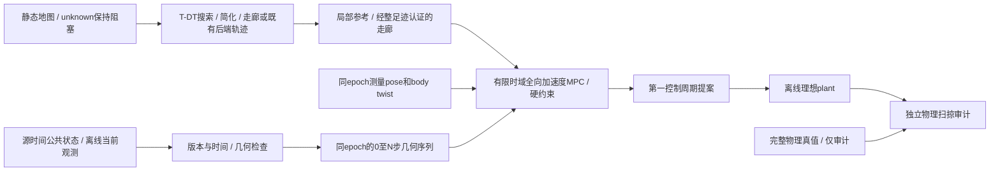

# Temporal MPC：独立最小研究架构

2026-10-04，Asia/Shanghai。状态：用户要求 **Research Frozen / Not Accepted for Deployment**；
[冻结记录](temporal_mpc_freeze_20261004.md)。保留T-DT问题压缩＋实时QP，不继续实现或运行新试次。
旧SLSQP仅保留为失败对照，第10节及最新进度记录是当前实施边界。
本轮由用户新请求授权，不恢复旧 R1/R2、一个月计划或自动续跑安排。
实现位于直接从 main 创建的独立 `experiment/temporal-mpc-main-20261004` 分支及
`experiments/temporal_mpc/`，正式 main、历史冻结研究和既有未提交开发保留。

## 1. 问题、当前审计和研究边界

要验证的是：相同有效预测能否在直接受约束的时间域控制中产生安全进展、
减速、等待和重新通行。算法名称不能替代几何支持、预测有效性或最终命令验收。

| 对象 | 当前源码/连接 | 本轮处理 |
|---|---|---|
| 正式基线 B0 | `rm_nav_config/config/nav2_old_car_2026_left_stvl.yaml`；STVL当前点云 marking/clearing/decay，标准 Nav2 MPPI | 保留；不是所有启动 profile 都使用 STVL。真正A/B须读回实际参数/ROS图 |
| tracker | `rm_dynamic_obstacle_tracking/core.py` 和 node；静态地图剔除、Euclidean cluster、gated greedy/KF、tentative/confirmed/coasting；lost删除 | 复用公共消息，不复制检测器；既有 dirty 成员证据不纳入新实现 |
| predictor | 公开 xy/vxy/size 与源时间；`prediction[]` 是显示路径，v1可能衰减/裁剪 | 从公开状态重算CV；不消费 markers/diagnostic 或私有滤波字段 |
| R1 预测占用层 | 当前及历史审计未找到可构建加载的 future occupancy Nav2 layer | 保留历史分析，标记未实现，不能虚构R1实测对照 |
| R2 | native `DynamicObstacleCritic`、原生 MPPI、smoother、guard | 已有 visible 接触 / nominal 任务失败；原试次是 ObstacleLayer，不冒充STVL对照 |
| 旧V1 | `codex/dynamic-differential-risk` 下 `experiments/dynamic_prediction_v1` | 原生时间critic旧路线；冻结证据保留，不与R1占用层混称 |
| T-DT / timed reference | 历史 `rm_tdt_planner` 和 annotated path / dynamic-clearance shadow | 不是当前可运行 timed-reference→MPPI闭环，不假设第三路线已经完成 |
| 几何和oracle | 公共几何契约；机械足迹配置；既有独立实际扫掠审计 | 保持 unknown 含义；本轮另有独立标量polygon oracle，后续Gazebo复用原oracle |

审计基点 `03d5dfa64b3d66efb9a90bb993da065e9c73ff94`；main
`d735ee12bd950dca0e691cdf2f2c61f35cef8ffc`。审计历史记录为 `03d5dfa:docs/dynamic_navigation/hws_migration_audit_20261003.md`；
[几何契约只读副本](../../experiments/temporal_mpc/reference_inputs/dynamic_obstacle_geometry_contract_2027.md)及
[开发规范](../development_workflow.md)。合同、运行profile优先于历史报告。

## 2. HWS 源码审查与复用决定

来源 [Polyacetone/HWSentryNav26](https://github.com/Polyacetone/HWSentryNav26)，
pin `f5f941288197e14c867d711a4c4cd85bfd7a3194`，MIT，Copyright 2025 Polyacetone。
本轮从原工作区已缓存的 `build/hws_audit/upstream_main` 读取固定源码，并核对上游链接。
没有导入HWS代码、子模块或运行依赖；本地实现独立编写。

| 上游实现（固定pin） | 实际机制 | 决定 |
|---|---|---|
| [object_tracker.cpp](https://github.com/Polyacetone/HWSentryNav26/blob/f5f941288197e14c867d711a4c4cd85bfd7a3194/map_server/src/object_tracker.cpp) | raster morphology/connected components、Hungarian、4D CV KF、连续hits、旧局部形状衰减融合 | 参考观测形状与生命周期思想；当前tracker和接口直接复用，不复制上游前端 |
| [prediction_cost_map_renderer.cpp](https://github.com/Polyacetone/HWSentryNav26/blob/f5f941288197e14c867d711a4c4cd85bfd7a3194/map_server/src/prediction_cost_map_renderer.cpp) | 当前/未来图分别渲染；平移局部轮廓；衰减速度积分；静态保底 | 参考分时刻表达；原型直接存几何序列，不建立第二套costmap管线 |
| [obstacle_semantics.cpp](https://github.com/Polyacetone/HWSentryNav26/blob/f5f941288197e14c867d711a4c4cd85bfd7a3194/nav_executor/src/common/environment/obstacle_semantics.cpp) | planner作未来空间max并集；follower保留时间图 | 控制不作未来并集；并集仅作为离线负对照 |
| [follow_problem.cpp](https://github.com/Polyacetone/HWSentryNav26/blob/f5f941288197e14c867d711a4c4cd85bfd7a3194/nav_executor/src/path_executor/mpc/follow_problem.cpp) | stage k选 floor(k·0.05/0.1) 帧，超出取末帧；障碍为采样栅格软残差 | 参考时间消费；改为明确绝对epoch、有效期和硬几何约束，不夹持末帧外推 |
| [lpv_model.cpp](https://github.com/Polyacetone/HWSentryNav26/blob/f5f941288197e14c867d711a4c4cd85bfd7a3194/nav_executor/src/path_executor/mpc/lpv_model.cpp) | 纵向速度/角速度、隐藏LPV状态和命令变化率，无全向vy | 必须重写为四全向轮模型，不能直接移植 |
| [mpc_solver.cpp](https://github.com/Polyacetone/HWSentryNav26/blob/f5f941288197e14c867d711a4c4cd85bfd7a3194/nav_executor/src/path_executor/mpc/mpc_solver.cpp)及fddp_solver.hpp | warm start、rollout、受限控制、失败/stop处理、辅助反馈 | 参考求解生命周期；第一轮用现有SciPy SLSQP验证可行性，不引入整套FDDP/FSM |

HWS用回调steady-clock间隔更新KF、cloud preprocessing使用latest TF；相对选帧
不能证明端到端源时间对齐。公开源码闭环完整不是同条件效果证据。

## 3. 状态、控制和离散动力学



状态 `z=[x,y,yaw,vx,vy,wz]`，位置在同一固定世界frame，速度在base_link。
控制 `u=[ax,ay,alpha]` 是机体系速度导数；不是直接称为世界加速度。

每个dt内用中点积分：

```
v_next = v + dt * a
yaw_mid = yaw + 0.5*dt*wz + 0.125*dt²*alpha
xy_next = xy + dt * R(yaw_mid) * (vxy + 0.5*dt*axy)
yaw_next = yaw + dt*wz + 0.5*dt²*alpha
command = [vx_next, vy_next, wz_next]
```

初版dt=0.1s，horizon=1.5s；5个等长acceleration blocks降维。
扫查0.5/1.0/1.5/2.0s时重新建立完整网格，不截断障碍序列后称对齐。
限速 `vx∈[-0.5,0.8], |vy|≤0.5, |wz|≤1.2`，分轴
`|ax|,|ay|≤1m/s², |alpha|≤2rad/s²`。这些为本次离线实验固定上限，
不是正式main参数，也未实车辨识。正式STVL MPPI的vx_max=0.5、vx_min=-0.3
保持；未来同场景A/B必须另行登记统一限速，不能比较不同限速的成绩。

自身完整机械投影半长/半宽0.325/0.300m，规划padding=0.03m，
约束足迹0.355/0.330m；独立oracle使用未padding的完整机械矩形并要求
净空≥0.05m。原始SDF base-only与机械包络分别登记，不偷缩自身几何。

## 4. 预测契约与时间对齐

适配目标仍为原 `DynamicObstaclePredictionArray`。main本身没有tracker/这两个消息；
本轮只将冻结 `b5645eca` 的core、两个.msg和几何契约作为只读离线参考放在
`reference_inputs/`，逐文件哈希见其provenance.json；没有导入旧路线ROS包或改
main的接口生成/启动。公开消息的实际DDS接入仍属于M2/M3门。
离线adapter是消费者内部值对象，不新增公共ROS消息或读tracker私有类。
必须验证schema、shadow_only授权、map frame、complete/count/ID、finite值、
源/观测年龄、dt/steps、状态及尺寸/速度范围。处理时间不替代source stamp。
v2的position已推进到array源时刻，不能重复加coasting年龄。

预测序列有 `evaluation_epoch`、`relative_times=[0,dt,...,Ndt]` 和
`centers[i]=position(source)+velocity*(evaluation-source+relative_times[i])`。
机器人输入必须已在同一evaluation_epoch；原型拒绝混frame/混epoch，
不偷偷用latest pose。未来Nav2 adapter负责源时间pose推进、一次有年龄上限的
map↔odom平面变换、twist旋转、输出延迟和定位跳变处理。

| 输入情况 | 原型策略 |
|---|---|
| 新鲜confirmed/coasting，受限已知运动夹具 | CV全网格；coasting从array stamp起算，另检查last observation age |
| tentative | 当前占用静止延续，明确current-only假设；不伪造可信速度 |
| velocity reliability未知 | 公共消息没有confidence/covariance，不能按虚构概率降权；运行接受尚未建立 |
| stale/future/invalid/incomplete/错schema/frame/坏新消息 | 拒绝新快照，不保留旧预测；仅产生受加速度约束的制动提案并标记无安全认证 |
| lost/完全失流 | 不把缺失当free；独立运行接入前必须由当前地图和上层故障策略处理 |

完整新鲜空数组只表达tracker列表为空，不证明没有未检出物体。

## 5. 两种几何及静态环境

- `observed_polygon`：当前实际观测点凸包，随锚点平移。离线夹具显式提供
  观测点；隐藏部分保持未认证。既有v1/v2只有size，没有实际轮廓，adapter
  只能叫`visible_extent_proxy`，不把平滑extent冒充observed polygon。
- `nominal_diameter`：以观测锚点为圆心，使用完整名义直径D作半径。
  缺少物体中心时不能用D/2；D=1.6970562748477143m来自原条件手册代理，
  不宣称适用于全部真实2027目标。名义模式仍无未来误差支持证书。

第一组已知CV夹具可提供完整当前polygon，专门隔离控制可行性；后续近面
观测和突然停止/反向夹具负责揭露几何/预测失败，全部保留。
旧SLSQP静态输入是显式凸多边形与有限可行区域；当前QP消费认证走廊，
静态raw map只进入T-DT前端。没有地图的unknown→free转换。
原M1没有在线raw costmap检查；继续轮原生Nav2边界已实现整足迹内部cell/unknown/地图外检查，真实Gazebo输入门仍待验证。

## 6. 旧SLSQP对照：优化、硬约束和输出选择

直接shooting优化acceleration blocks；只执行第一段，再从新测量状态求解。
objective包含逐时reference位置/航向误差、速度、加速度、相邻控制差、
dynamic/static soft clearance及terminal误差。轨迹由加速度积分生成，
没有优化后再做SG或混合候选的步骤。

硬约束独立于成本权重：全过程速度/加速度范围、当前与全部未来时刻padded
足迹净空、有限环境边界、terminal速度=0。相邻时间点加入相对最大位移的
半步reserve，防止只检查离散端点漏过穿越；该充分条件仅针对声明的CV和
中点运动模型，不能覆盖未知急转/执行滞后。terminal停止使可行解包含完整
模型内刹停路径，不能证明horizon之后接近中的障碍不会撞上静止机器人。

warm start与从参考路径生成的seed均进入同一优化/约束检查。求解结果必须
finite、约束通过并在配置deadline内；即使SLSQP返回成功也独立重算。
失败、不可行或超时选择受加速度限制的制动提案，保留reason；若制动路径
也不通过则标记`unsafe_brake`，零命令不叫安全结果。原型没有ROS命令发布。

## 7. Nav2双控制器与运行时fallback边界

最终部署结构必须在同一个Controller Server同时加载`FollowPathMPPI`和
`FollowPathTemporalMPC`。单个server持有唯一速度发布权；两插件只返回提案，
不各自发布cmd_vel。修改正式配置二选一不能满足本设计。

实验内部BT使用每次tick执行的`ControllerSelector`，输出selected_controller
传给FollowPath的controller_id。可靠+transient_local topic由一个选择监督器
发布。已核对[Humble 1.1.20 Controller Server](https://github.com/ros-navigation/navigation2/blob/1.1.20/nav2_controller/src/controller_server.cpp)、
[FollowPath action](https://github.com/ros-navigation/navigation2/blob/1.1.20/nav2_behavior_tree/plugins/action/follow_path_action.cpp)和
[ControllerSelector](https://github.com/ros-navigation/navigation2/blob/1.1.20/nav2_behavior_tree/plugins/action/controller_selector_node.cpp)：
FollowPath运行期间controller_id变更会更新动作目标；server接受pending goal后
选择新插件并setPlan。Selector必须处在会持续tick的ReactiveSequence中，不能
放在只执行一次的普通Sequence内。由此设计可保留上层Mission、Planner和
NavigateToPose接口，并在同一目标执行期间双向切换，无需重新编译或改配置。
继续轮已在项目Humble 1.1.20镜像实测原生BT/action preemption；工程链路通过，实际tracker/Gazebo物理门另计。

[集成示例](../../experiments/temporal_mpc/integration/README.md)包含双插件参数片段、
BT子树和ROS选择监督器。默认MPPI；明确请求且健康新鲜才允许选择MPC。
MPC timeout/infeasible、预测失效、健康100ms失流请求MPPI；恢复健康不自动
弹回MPC，避免来回切换。双向选择/故障保持政策有离线测试。

2026-10-04继续授权后，新增隔离可加载原生Controller、类型明确的异步worker
提案协议、完整profile和BT。正式src/配置仍不变；T-DT完整迁移不删除。
原生侧实现生命周期/setPlan/speedLimit、测量输入、零等待TF、raw-grid内部cell /
unknown和执行区间验证，Nav2保留goal checker。profile仅验证map帧固定航向子域；
历史odom/v1输入缺失authority及同步TF/odom，真实接入尚未通过。
速度限制会对违反新限制的提案制动并请求MPPI，QP还未自适应速度限制。
详见[实现与运行限制](../../experiments/temporal_mpc/integration/README.md)。

QP失败时先将上一条控制序列移位、从新测量状态重积分，并用新预测、当前
静态走廊、全量tracks及终态重新验收；计划改变/epoch断续/失效输入禁止复用。
复用不可行则返回受加速度限制的制动提案；制动也不可认证时明确标记
uncertified_brake。每种失败同时请求MPPI，交接完成前持续提供有界提案，
不以solver异常直接中断输出。模型内刹停不能阻止迎面物体后续撞上静止车。
Nav2 controller_id切换属于BT/action协调，MPC插件不能自行改变server当前ID。

离线plant计算期间暂停；实际机器人继续运动。Python预算/OSQP time_limit只
能限制求解和拒绝迟到结果，不能保证OS调度、DDS、costmap锁或系统调用的硬
实时上界。M2必须测量全负载输入→输出延迟、硬件响应和外部wall watchdog；
M3须实测双插件加载、MPPI→MPC→MPPI、故障注入后的命令连续性和唯一命令权威。

## 8. 测试矩阵、指标、退出门和里程碑

先固定单横穿CV场景，起点/目标、自身/障碍几何、限速/加速度、安全oracle
和随机性；本轮优化确定性，不用oracle真值选择控制参数。离线基线
`current_only`和`future_union`仅是机制对照，均不是B0/R1/R2的实测替身。
保留原Gazebo横穿 `A=0.9m,T=8s,goal=(5.6,0),phase=2s` 作为后续同plant
注册场景；解析正弦目标不能当有joint PD的真实Gazebo轨迹。

矩阵包括静止、低/高速横穿、迎面、突然停止、突然反向、短遮挡、窄道横穿、
等待后通行和离开后重开放；比较观测/名义模式并扫查四个horizon。
实际最小场景没有收益之前不扩展检测器或换复杂solver。

记录：模型目标到达（ROS action success离线为null）、独立碰撞及minimum
physical clearance、完成/等待时间、平均速度/距离/绕行、recovery（离线null）、
solver失败、deadline miss、process CPU时间、vx/vy/wz max/RMS、加速度、
jerk/delta-u和可行/不可行周期。false_block只有同条件B0安全成功见证才成立；
当前离线不能判定B0相关false_block_count/duration，置null，另记录停滞。

接受需要目标成功、无接触、机械净空≥0.05m和实际控制deadline/约束同时过门。
近面或CV失配失败不降低安全门，不靠反复权重调整隐藏失败。
首次闭环比较B0与MPC（相同实际tracker输入/oracle/plant）；R2可恢复为对照，
R1和timed-reference路线须先证明已实现再列实测组。

M0：审计/设计；M1：离线core、契约/物理约束测试、固定夹具及独立oracle；
M2：实际源时间回放和Gazebo shadow输入/预算门；M3：独立Nav2 plugin与统一
B0/R2配对闭环；M4：仅有稳定净收益才扩大工况和实车响应辨识。
原轮M0/M1已完成；用户“继续进行”授权后独立完成M3工程切片，M2真实tracker/Gazebo及M3配对B0物理门、M4仍未完成。

同场景MPC明显改善才继续；复杂度/CPU增加却无收益则冻结；大量碰撞、
false block、optimizer failure或振荡先归因geometry/prediction/feasibility。
任何正式定位/TF/串口高优先级问题出现即优先处理主线。

## 9. 分支来源修正与最小迁入范围

用户补充要求从正式主线分出。初始空实验分支从文档归档HEAD创建，随后改为
从 `main@d735ee12bd950dca0e691cdf2f2c61f35cef8ffc` 创建独立worktree。
没有merge/cherry-pick任何旧研究提交。迁入白名单仅本次新原型/文档/证据，
及上面登记的四个离线参考文件和第10节逐文件登记的T-DT前端库；src、正式配置、运行profile、TF和消息生成
相对main无改动。原工作区既有dirty开发保留。旧归档仍暂停。

## 10. 用户补充后的实时QP版本：当前实施

职责为`static map → 已迁移T-DT/NEU前后端 → simplified reference/corridor →
Temporal MPC → 未来1–2s动态控制`。MPC不读原始静态地图、不做A*、不选静态
绕行拓扑。迁移好的MinimumSnap后端仍保留；可消费其几何轨迹。最小切片实际
复用冻结T-DT的YAstar、collision-aware Douglas-Peucker和SfcSquare，不为了
MPC删除或改写现有规划器。选择性导入[来源清单](../../experiments/temporal_mpc/frontend/provenance.json)
与MIT许可；桥接在控制周期外处理map原点、保守整足迹膨胀和走廊。

SfcSquare的offset约定与YAstar不同；桥接以零原点局部坐标调用并显式平移。
复核器直接对raw occupied/unknown cell检查整个矩形走廊能容纳padded
完整足迹，失败拒绝。只在矩形hull仍通过同一raw-map证书时合并相邻局部
squares。拓扑和走廊计算在静态快照改变时执行，不计入MPC求解器但单独计时。
每周期参考在当前包含测量位置的一个认证区域内推进；等待时不会被时间表
强制推进到另一个走廊。真实rolling costmap变化必须使旧证书失效，属于M2。

实时core为固定yaw、wz=0的全向平移子域：body ax/ay → world x/y及body vx/vy。
保留0.65×0.60m物理足迹、0.03m padding、原速度/加速度与0.05m物理安全门。
需要转动的路径/测量wz非零直接请求MPPI；不宣称第一阶段已实现完整yaw MPC。
世界位置是输入body加速度的线性函数，精确condense为30个决策量。

| 约束 | 已实现固定值 |
|---|---|
| 控制周期 | 0.05s / 20Hz |
| model节点 | 15，dt=0.1s |
| horizon | 1.5s；配置允许1–2s，0.5s只属于旧消融 |
| 几何验收网格 | 0.05s，含相对运动半步reserve |
| solver | OSQP 1.0.5，一个QP/周期，一个局部分离面选择，不做多次非线性收敛 |
| 时间/迭代 | solver≤15ms，整个core预算40ms，最多400迭代，迟到解拒绝 |
| 动态障碍 | QP最多4个相关track，公开输入最多64，输出验收仍检查全部 |
| warm start | 移位上一周期控制、从新状态重积分，primal warm start；本版不复用factorization |
| terminal | body平移速度=0；输出是下一控制周期末body速度提案 |

每个ti的约束只对O(ti)。在warm/braking轨迹附近选择一个支持平面，使用完整
矩形支持函数和目标polygon/circle支持函数构成凸QP半空间；不查询未来并集。
objective为局部reference、terminal误差、速度、加速度及相邻控制变化。
静态cost通过认证走廊压缩为centre bounds；动态碰撞依靠硬约束和全量独立
重验，不用权重掩盖。相关障碍超过4个就请求MPPI，不截断后声称安全。
允许达到迭代上限的次优解，但只有finite、全部硬约束及terminal通过才执行。

OSQP只安装到本次临时实验Python目录，不改系统ROS或main依赖。
[依赖来源](../../experiments/temporal_mpc/dependency_intake.json)、
[官方solver设置](https://osqp.org/docs/interfaces/solver_settings.html)和
[Python接口](https://osqp.org/docs/interfaces/python.html)记录版本/许可及预算设置。
旧SLSQP的0.5s开发预算不是当前实时方案。本版的5,659周期P95约7.6ms、
最大14.8ms仅是当前主机离线计时；25试次有2次迎面接触，不能授权部署。


## 11. 继续轮：异步问题与原生执行重验

QP在独立进程求解；Controller Server不等待solver，plugin只消费有限提案。
状态请求、提案和计划采用实验独立类型；规范公开预测保持原消息定义，main
canonical接口包只在隔离overlay选择性加两条冻结预测msg。引入身份见
[ros2/intake.json](../../experiments/temporal_mpc/ros2/intake.json)，没有更改正式消息生成。

对M1模型的两个工程修正都有原始失败日志：ROS调度抖动用真实elapsed移位warm
inputs；QP数值残差先做执行器/停止投影，再以原margin完整重验。DDS新扫描
可能先于旧状态callback到达，4帧有界历史选择source<=request epoch，异常
receipt立刻清空；不回填新扫描到过去。Nav2实际保持速度，原生层对新速度
预留剩余horizon停止能力并全量重验，防止沿用ramp终态。最后一段clamp处理
浮点极限，不减小足迹或放宽terminal tolerance。

地图变化/计划变化让旧提案失效；静态走廊只由已规划路径通过T-DT SfcSquare
生成，supplied-path模式不搜索。static-map内容/时间revision变更必须重新取得证书。
原生全未来动态约束基于最新公开CV；当前raw costmap只验证正在执行的保持
速度区间，避免把当前动态占用错误要求为整个未来区间静态不动。

原生检查10ms、worker40ms/solver15ms均为预算/迟到拒绝；不是操作系统硬实时。
当前costmap try-lock与零等待TF避免原生shadow锁反转；仍需实际负载和独立wall
watchdog验证。健康ready只是本周期工程条件，不授予比赛部署资格。

## 实际Gazebo阶段边界补充（2026-10-04后续）

[真实输入与配对结果](temporal_mpc_gazebo_results_20261004.md)已完成输入CDR/源epoch TF、
标准T-DT路径action、实际STVL端点、测量odom、双控制器与BT交接的隔离仿真。
固定仿真map原点用唯一static map->odom，lio_adapter仍持有odom->base；oracle位姿
是单独话题，不接TF/预测/controller。主线包复用，tracker只选择性引入未改代码。

v2 tentative允许一次漏检时观察epoch<array epoch，当前position已推进，消费不
第二次coast。confirmed仍要求同源，coasting仍要求旧源，观察TTL等检查不变。
物理完整机械包络（含球形轮）和Contact独立；仅采样净空诊断，不声称连续响应证书。

阶段状态：M2真实输入成立、M3实际MPC短暂参与和交接成立；两组物理接受失败，
候选不进入部署冻结。正式src/默认MPPI保持。静态course可外侧绕行，控制不搜索。

## 执行模型与共同回退保护继续轮

[运行前登记](temporal_mpc_execution_registration_20261004.md)：实时QP/原生重验统一
固定yaw速度ZOH，每50ms一次；15个100ms目标差决策、全部预算及安全几何不变。
旧SLSQP/机械oracle证据不重算。所有形状重验使用全局速度采样reserve。
重验可行的previous/brake在执行回调可返回当次，同时请求BT交接；shadow也能提前交接，
不保证每次都实际经历previous段。旧安全verdict从不复用。
原生健康携带确切epoch/初态/重验状态/步号/约束/track/余量，接收先后不冒充因果。

T-DT SfcSquare maxRange=6m在控制周期外扩展静态可行空间；raw map完整足迹证书
仍是进入门，不修改vendor、不由MPC全局搜索。开放路径中心y约[-2.44,2.39]。
实验链为ControllerServer→VelocitySmoother→共同ExecutionGuard→/cmd_vel→主线stub。
共用保护只限命令差与检查1.5s制动尾，最新公共v2与原始静态地图是输入；无oracle。
不取代native当次STVL检查，不保证所有未跟踪动态物体或连续底盘误差有界。
保护异常/输入失流保持有限输出；无法认证的减速不叫安全停车。主线默认未接入。
新增实验topic `/temporal_mpc/smoothed_cmd_vel`、`/temporal_mpc/execution_health`；
`test_guard_fault`仅隔离测试。标准Mission/Planner/NavigateToPose及双插件IDs不变。

## 侧向参考与生产节拍继续轮

[登记](temporal_mpc_lateral_registration_20261004.md)和[新论文对照](temporal_mpc_literature_review_20261004.md)。
单QP前增加一个局部侧向偏好：当前公共几何与局部路径方向投影相交、位于前方6m
以内时，在当前认证矩形中选较近的可容纳侧向目标并锁定方向。目标使用障碍
包络radius＋padded足迹外接半径＋margin＋采样reserve＋.12m偏好buffer；这是
偏好初始化，不是新增安全证书。距离目标侧向水平不足.08m前暂停纵向参考推进，
随后沿原静态路径方向通过，障碍完全在后方后恢复原参考。只有已有矩形空间能
容纳完整目标才采用；原QP速度/停止/全部几何和native重验决定最终可行性。
它不搜索静态拓扑，不超过1.5s预测合同，不是T-MPC++多同伦优化器。

共同保护在地图回调建立阻塞方格中心cKDTree；每个状态先取一个方格距离上界，
枚举该距离＋半格对角线以内的全部中心，再精确计算点到方格距离。因此结果与
全图穷举一致，地图边界/unknown不变。构建索引在周期外；周期内对剩余track逐个
检查deadline，迟到立即继续限差制动并取消模型认证。单个调用/OS调度不可抢占，
预算仍是迟到拒绝，不能写成硬执行时间界。

健康新增producer_start/output整数monotonic epoch、生产开始/发布间隔、到输出CPU
及墙钟耗时。nominal_expected/lateness/missed_slots是本地50ms参考栅格，非rclpy
TimerInfo，也不是DDS接收时延；CPU测量截止输出后的诊断构造前，不含诊断发布。
每实际run增加启动前二进制/dependency/CPU affinity身份文件，镜像身份另记。
`solver_diagnostic.local_reference_mode/track`为求解完成后的偏好状态；失败reset会
清除偏好，不能凭该字段推断失败前具体同伦类。

侧向参考四轮物理采集之后，原生执行投影改为velocity_and_stop/v2：新状态重锚
后将每个下一速度投影到固定vx[-.5,.8]/vy[-.5,.5]与剩余停止区间交集，随后
仍以全量硬几何和当前raw STVL重验。不是允许速度超限的容差。健康新增
`reanchor_projection`用于历史版本重放；缺字段保持旧投影。新投影已做模型/ROS
工程验证，本轮物理配对使用的是旧投影，见[结果](temporal_mpc_lateral_results_20261004.md)。

随后完成v2独立物理配对，见[结果与模型占用诊断](temporal_mpc_projection_results_20261004.md)。
控制实现未再改动；横穿/迎面持续MPC参与后因未来净空veto回退，动态接受仍false。
新增只读`gazebo/audit_model_occupancy.py`以原公共v2、实际目标/容差及确切native epoch
检查当前目标容差区和认证截面；source采样不重复coast，没有oracle输入。固定yaw
模型的采样目标排除不等于连续或真实任务不可行，正宽度当前截面也不是时域轨迹。
几何检查样本必须有明确constraint，不能仅凭input健康残留step。worker目前未记录
确切消费的prediction identity，因此暂不唯一分解预测更新与测量重锚的余量损失。

## 有限候选与确切输入继续轮

[登记](temporal_mpc_candidates_registration_20261004.md)、[结果](temporal_mpc_candidates_results_20261004.md)。
worker的strategy=single（默认）/portfolio只在实验profile选择；双Nav2插件IDs与BT
runtime选择接口不变。portfolio最多左右/等待三个局部参考，首个完整重验可行优化
解即停止，每项130迭代/5ms、合计390/15ms、worker40ms；独立warm start与原
previous/brake/MPPI链保留。内部另收紧.03m动态规划buffer，原生/保护几何门不变。

桥接可选corridor_range[1,12]（legacy6，open_long10）只在周期外扩展T-DT SFC，
vendor/raw-cell完整足迹证书保持。open_long map240×200、origin(-1,-5)、目标8.5m，
原legacy及机械/actor配置保留。MPC不获得静态全局搜索职责。

solver_diagnostic新增v2_inputs schema，携带实际消费source/observation epoch、
generation/map、初态/走廊、source age、偏好前后、逐项候选与qp.solve耗时。
invalid输入字段明确null，不能当作有效消费证据。只读2×2审计固定native epoch，
分开标记实际和shadow拒绝，不反填缺失或过期数据；公共预测消息语义不变。

raw /tf_static独立记录采用可靠transient-local depth100，并在启动前要求原始
记录含map→odom和base_link→sim_lidar_link。它不更改TF发布/所有权或控制输入。
修复前迎面失败门完整保留，不能用单独TF listener的成功查找代替raw证据链。

六有效试次任务均取消，目标模型已开放但有限候选仍未稳定通过；迎面portfolio
由状态请求合同拒绝、QP未运行，下一阶段需判定时刻与队列证据。动态接受false。

## Worker时序与提案老化继续轮

[登记](temporal_mpc_timing_registration_20261004.md)、[结果](temporal_mpc_timing_results_20261004.md)。
实验String `/temporal_mpc/worker_timing`分别记录request/frontend/prediction回调，
含callback_id、原始请求有限字段、signed ROS clock判定、solver/publish/body monotonic。
duplicate/no causal/silent保留独立disposition，不覆盖有效solver身份。
solver_diagnostic以timing_callback_id关联，native health包含真实request publish
前后时刻、ROS clock及proposal receipt。StateRequest与公开消息wire不变。

原map/非未来/age≤100ms条件保持，future/stale/frame分别报错；非法stamp
诊断使用nullable epoch，避免catch后重解析而丢失诊断，不允许非法控制输入。
Humble executor只有msg参数，DDS metadata明确不可用，不能将system timestamp
与ROS/steady混减。同主机monotonic只支持总interval，不能唯一分配DDS/排队原因。
timing自身发布在callback_body测量之外，worker40ms核心门位置保持。

只读提案老化工具检查不同epoch/相对网格、移位与速度/停止投影，完整实际slack
复算保留。未修停止尾的轨迹可能终速非零，只作反事实，不能执行或替代安全门。
新迎面一次配对全部请求current，MPC短暂通过后新测量重锚未来净空拒绝；最终
接收连续性未通过，不回填旧模糊时钟失败，动态接受false。QP/native validate、
静态T-DT职责和双插件runtime回退保留。
