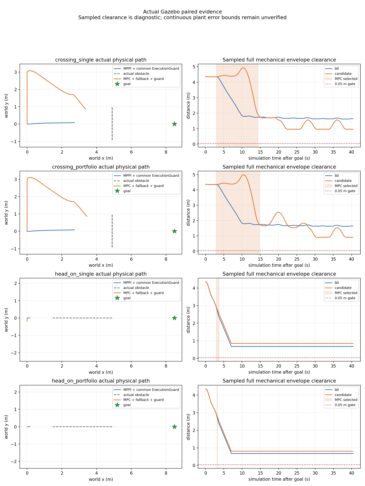

# 目标开放场景：单候选与有限候选对照

2026-10-04，起点c2029010，[预登记及采集修正](temporal_mpc_candidates_registration_20261004.md)。
分支experiment/temporal-mpc-main-20261004仍直接派生main@d735ee12。

## 结果

目标移至(8.5,0)、静态空间拓宽后，六个有效试次的记录模型都允许目标位置区域，
但MPPI、single MPC、portfolio MPC仍全部在40s窗口取消。横穿两个MPC分别
228/229、237/238次实际执行检查通过；迎面分别15/15、1/2，随后回退MPPI。
有限候选没有形成稳定通过或净收益证据，动态接受false、部署冻结false。

本轮完成有限候选、共享实时预算、确切输入诊断与拒绝分解。T-DT继续负责静态
路径/认证走廊；MPC只处理1.5s局部时域，不读取raw map或搜索静态拓扑。正式src、
默认MPPI和上层Mission/Planner/NavigateToPose保持；双Nav2插件及运行时双向切换保留。

## 工程变化及检查

single保持一个QP，规划buffer=0。portfolio首个完整重验可行优化解即返回，最多
尝试左右两个固定侧偏好和当前位置等待参考；已选侧优先，每候选独立warm start。
每个QP最多130迭代/5ms，合计390迭代/15ms，完整worker仍40ms；迟到拒绝，
无优化解仍新输入重验previous feasible→有限制动→请求MPPI。额外.03m规划buffer
只收紧内部动态门，native/共同保护的原完整D、足迹、margin、reserve和TTL不变。
这不是T-MPC++、Scenario或CBF实现，不构成全局最优或概率安全保证。

实际portfolio最大尝试3项，横穿迭代max380、迎面390；QP调用累计墙钟max
4.281/4.245ms，完整worker max36.844/37.439ms，全部可行输出共享预算观察门通过。
横穿628个可行优化提案中left577/right51，迎面26个均right；等待参考实际被尝试，
没有成为可行优化输出。失败时chosen_candidate可能指回退来源，不能当作优化胜出。
这些计数包括shadow提案，只有上面的执行次数表示原生实际参与。

116项控制/候选/场景测试在主机和Humble各通过，另2项输入分解测试在两环境通过。
首次主机113通过/3失败、修正后输出均保留；两项是合法制动/等待断言问题，一项
揭示T-DT原range6仍限制侧向空间。桥接增加有界range[1,12]，open_long用10、
legacy默认6，vendor文件hash全部保持。实际frontend给中心矩形
[-.389999986,10.3900003]×[-4.44000006,4.39000034]，完整raw-cell认证保持。

真实Humble Nav2工程fixture通过14类故障、MPPI↔MPC、SpeedLimit回退/恢复、
worker SIGKILL后原生有限制动、唯一命令发布者等工程门。活跃命令gap max54.248ms，
native max.208ms。完整fixture包含action间空窗，整体gap214.710ms不能写成连续控制。
该fixture用合成预测/ZOH测试plant，独立于下列Gazebo物理接受。

## 固定物理对照

open_long map240×200、.05m、origin(-1,-5)，sim10s相同目标、40s窗口。
主线机械模型/扫描/tracker/TF/STVL、actor运动与原legacy相同；改变地图/目标属于新
任务条件，不能和旧窄场景相减声称收益。每场B0→single→portfolio各一次新禁网容器；
两个候选共享同一B0，不作为两份独立重复。MPPI内部噪声seed未锁定。

| 场景/策略 | 终态 | 正Contact消息 | 完整机械采样净空min | MPC通过/执行 | 最终cmd接收gap max |
|---|---|---:|---:|---:|---:|
| 横穿B0 | 取消=5 | 0 | 1.621529m | 0/0 | 67.877ms |
| 横穿single | 取消=5 | 0 | .963321m | 228/229 | 65.303ms |
| 横穿portfolio | 取消=5 | 0 | .908365m | 237/238 | 61.487ms |
| 迎面B0_02 | 取消=5 | 0 | .675851m | 0/0 | **81.572ms** |
| 迎面single_02 | 取消=5 | 0 | .850000m | 15/15 | 71.970ms |
| 迎面portfolio_02 | 取消=5 | 0 | .807846m | 1/2 | 68.573ms |

横穿B0、迎面B0/single的中间ControllerServer接收gap分别76.918、87.163、85.663ms，
超过75ms观察门。最终输出的迎面B0也失败。六轮保护生产发布间隔max54.363ms，
nominal missed slots=0；生产与独立订阅接收分别记录，不能唯一归因于DDS或调度。
零正Contact与50Hz净空不替代连续plant误差/速度界或检测支持；大量uncertified_brake
仍不是安全停车证书。没有成功B0见证，false_block=null。

## 目标开放与拒绝分解

六轮目标后有效公共采样数依次608/612/611/610/610/611，没有样本排除目标点或
整个.15m位置容差区。目标点slack最小1.607507m，减去.15m仍为正；在记录时刻、
固定yaw=0和当前完整D模型下，整个位置容差圆盘有余量。原生1597个几何epoch
也没有目标排除。只证明这些采样的当前模型，不证明连续未来轨迹或真实物体形状。
因此本轮任务失败不能继续解释成旧(5.6,0)目标被完整D模型恒常覆盖。

输入分解固定同一个native evaluation/proposal epoch，在完整原生ZOH重锚模型中
替换记录的worker/native初态及旧/新公共预测，四种组合都独立检查。旧状态替换
是模型反事实，不是传播后的真实plant；不补造过期输入，不把组合当实际执行。
下表是记录的首个拒绝track/step余量，单位mm：

| 拒绝 | 旧状态/旧预测 | 旧状态/新预测 | 新状态/旧预测 | 新状态/新预测 |
|---|---:|---:|---:|---:|
| 横穿single实际，24.401s，step30 | -.308 | -.308 | -.308 | -.308 |
| 横穿portfolio实际，24.781s，step30 | 9.511 | -2.661 | 9.511 | -2.661 |
| 迎面single shadow，13.725s，step30 | 12.425 | -.640 | 2.112 | -11.119 |

横穿single的worker/native预测源同为24.355s、测量状态基本相同，worker原提案
时刻动态min=10.552mm；19ms后移到执行时刻并重锚/投影/延长停止尾，余量变负。
此例不是新预测包或新测量状态造成的损失，但本轮没有进一步分解时间推进与停止投影。
横穿portfolio worker源24.685→native24.751s，测量状态基本相同；执行时刻换新预测
即可失去约12.172mm。原worker时刻动态min43.005mm，.03m规划buffer仍未避免拒绝。
迎面single在15次实际通过后由shadow检查触发回退：公共更新使旧状态组合变负，
新状态替换还降低余量。四组合不是可加的唯一因果分配。

迎面portfolio第二次实际调用是input拒绝，不是动态净空拒绝。对应worker提案理由
为state request stale/frame、input_validated=false、QP not_run，耗时.0869ms。
记录request frame确为map，独立订阅receipt距request epoch约6ms；没有记录worker
用于判定的本地clock时刻，无法区分其过期/未来判断或clock回调顺序。不能称作
solver timeout或三候选不可行。此时原生有限制动、选择回MPPI，输出继续。

六轮102,290条CDR/JSON一致、4,562个源TF重放可查；6,433个共同保护精确输入、
1,597个原生状态及输入join、92个动态拒绝余量均匹配，无缺失输入。分解保留两次
实际动态拒绝和90次shadow检查，后者单独标记。worker完整周期max37.439ms，
实际native max.226ms、保护tick到输出max6.194ms；原40/10/10ms观察门通过。
worker计时截止提案发布前，solver_s单指qp.solve，不包含诊断构造/发布或调度等待，
不据此声称硬实时。

## 采集失败与证据保留

head_on_b0_01实际完成但raw记录仅收到map→odom的静态消息，遗漏激光静态边；
16,721条CDR仍匹配，760个源TF重放全部失败。进入门false，single_01被runner
启动门拦截，portfolio_01未启动。它作为输入证据失败保留，不进入有效配对。
原raw静态订阅depth1不足以可靠保留多writer回放；只改为depth100，并在固定
启动阶段要求记录到两条必要静态边。真实DDS两writer各一次历史发布/late join
回归通过后，按补登记完成head_on_02三轮。没有补写TF或按性能挑选基线。

同场三轮控制源码和配置逐字节一致，全部七轮启动前二进制/dependency一致。
跨横穿/修复迎面源快照仅record_run.py与新增verify_static_capture.py不同，算法保持。
迎面B0_02在取消后的进程清理出现scene_node退出段错误，调用端诊断单独保留；
完整记录及后续CDR核对完成。首次离线审计环境失误、执行检查扩展到shadow的
旧输出、一次误选工程fixture事件格式的只读审计失败均保留。物理数据不覆盖。
采集后仅修正画图读取goal和扩展只读审计，未再改控制行为或重跑性能试次。

[完整manifest](evidence/temporal_mpc_candidates_20261004/manifest.json)归档全部七轮原始
记录无损gzip、工程fixture、源快照、实际二进制、初始失败测试、日志/审计/图及进入门。
[完整性检查](temporal_mpc_candidates_integrity_20261004.json)和
[空白检查范围](temporal_mpc_candidates_whitespace_20261004.json)记录最终核验。
归档314文件（不含manifest）、57,771,830字节；16份完整JSONL解压后219,743行
全部解析及摘要核对通过。源码/文档空白检查通过，68条原始日志空白诊断保留。
原dirty文件、main及冻结研究refs保持；不推送、合并或冻结部署候选。

下一阶段先记录worker判定clock/回调开始/结束和原始request身份，分离输入排队与
QP开销；再登记包含提案年龄与完整停止尾的余量检查。几何未知支持与运动残差仍
需独立留出整试次校准，不以调小D、放宽负余量或自动重新选MPC制造成功。
