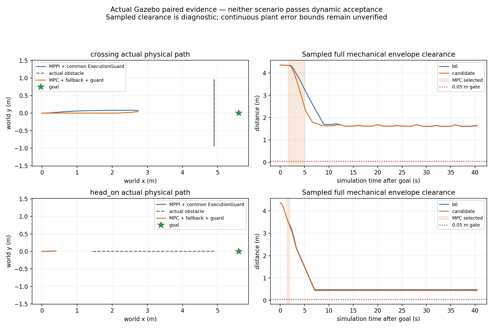

# Temporal MPC 执行重验、静态走廊与回退保护结果

2026-10-04，起点280056ef，仍在直接从main@d735ee12派生的
`experiment/temporal-mpc-main-20261004`。正式src、默认MPPI、旧研究工作区和冻结ref保持。
本轮完成执行模型统一、约束诊断、认证走廊扩展、共用保护和新物理配对。
**动态接受=false，共同保护的严格连续性门也未全部通过，不冻结部署候选。**

[运行前登记及失败修正](temporal_mpc_execution_registration_20261004.md)、
[配对汇总](evidence/temporal_mpc_execution_20261004/paired_summary.json)、
[完整证据清单](evidence/temporal_mpc_execution_20261004/manifest.json)。

## 改动和职责

实时QP与原生重验共同采用固定yaw、50ms保持速度目标的模型。15个100ms目标差
决策展开30个执行节点；旧SLSQP/机械oracle模型及既有失败证据不改。
目标差限1m/s²，不能把它说成物理瞬态加速度认证；上一轮实测约1.94m/s²仍保留。
两端的采样reserve都用同一全局速度上限，不缩足迹、padding、margin、nominal D或TTL。
QP15ms/core40ms/400iterations、原生10ms、20Hz/1.5s、4相关/64全量track仍保持。

原生健康记录exact evaluation/proposal/prediction epoch、初态/检查态、步号、约束、
track、slack。重锚仍使用新测量和最新预测，停止修正后全部重新验。
不再仅因fallback_requested丢弃model_feasible提案：执行回调允许重验后当次返回
previous/brake并请求MPPI交接；shadow也能提前请求交接，因此并不承诺每次都实际
执行一次previous段。不可行/过期提案仍原生有限减速，没有等待worker。

T-DT YAstar、简化路径和SfcSquare仍在控制周期外提供路径/静态问题压缩。
SFC maxRange由2m到6m，开放路径中心y从约±.94扩到[-2.44,2.39]m；所有矩形
继续用raw-cell检查完整padding足迹。course仍能从外侧找到|y|max1.75m路径，
0.8m窄通道捷径仍拒绝；course动态运行未开展。vendor未改，MPC不全局搜索。

实验公共命令链为ControllerServer→VelocitySmoother→ExecutionGuard→/cmd_vel→主线stub。
两插件仍同时加载、默认MPPI、通过原标准BT/controller_id切换；上层action不改。
保护层只允许限命令差通过或减速，检查最新公共v2与原始静态地图下1.5s完整制动尾；
不优化、不找路、不消费oracle、不替代原生当前STVL检查。state age增加保守位移reserve。
异常/失流仍返回有限输出；模型制动无法认证时明确uncertified。
最终publisher改为ExecutionGuard，新增实验输入/健康topic见架构及README；正式launch未接入。

## 固定物理配对

每场景一对有效试次，sim10s目标、40s任务窗，两方共同保护；世界/profile/tracker/
bridge逐字节一致。四次启动前源码快照中，影响控制行为的源码也相同。
清理脚本与后加只读审计/测试文件差异单列。MPPI内部noise seed未锁，不能声称统计净收益。
本次B0名为**MPPI+共同保护**；上一轮未保护B0仍单独保留，不能混称。

| 场景/策略 | 任务终态 | 正机器人接触消息 | 采样完整机械净空min | 扫掠诊断下界 | MPC实际通过周期 | 最终cmd最大接收间隔 |
|---|---|---:|---:|---:|---:|---:|
| 横穿 B0+保护 | 40s取消=5 | 0 | 1.60840m | 1.55340m | 0 | 62.376ms |
| 横穿 MPC+回退+保护 | 40s取消=5 | 0 | 1.61885m | 1.56385m | 66/66 | 70.592ms |
| 迎面 B0+保护 | 40s取消=5 | 0 | .47830m | .42330m | 0 | **88.093ms** |
| 迎面 MPC+回退+保护 | 40s取消=5 | 0 | .44352m | .38852m | 9/9 | **77.022ms** |

四轮均没有记录到正接触消息，也均没有成功到达。两种策略在共同保护下出现停滞，
不能把停车、较大净空或没有正Contact消息当成有效避障/连续安全成功。
迎面两方最终cmd均超过75ms观察门，B0中间controller cmd也为76.290ms。
完整机械oracle仍独立于tracker，50Hz、最大20ms采样缺口；扣5.5m/s的.055m reserve
仍仅是诊断，point-speed/连续plant误差界尚未认证。false_block=null，没有安全成功B0见证。

## 重验拒绝已经定位

横穿实际选中MPC sim11.631–15.029s；回退附近shadow在evaluation15.025s、
proposal14.993s、prediction14.983s检查第27步、track1时，动态净空slack=
**-.0003347296m**。迎面MPC sim11.334–11.929s；shadow在evaluation11.928s、
proposal11.913s、prediction11.881s第29步、track1的slack=**-.0099516281m**。
两次执行回调本身全部通过，shadow在下一周期前触发了交接，不能把它误写成实际
执行回调失败。latest prediction和新测量重锚后的轨迹不再满足模型净空，veto保留。

精确输入重放4,298个共同保护周期、518个原生ZOH状态、131个动态拒绝数值，
全部匹配；原生状态误差最大1.34e-15量级。它证明记录/模型一致性，不证明连续plant安全。
不同DDS订阅的健康接收相对选择偏移为横穿+0.243ms、迎面-.929ms；因果故障切换
延迟字段保持null，不把接收顺序当因果时延。

因此“扩大走廊/统一模型”已经实现，但没有解决侧向运动选择与异步更新的可行余量。
本輪直线路径仍主要沿x分离面制动；这是后续局部避障初始化需要检验的方向，
不是已经证明的唯一停滞原因。

## 实时性、故障与记录完整性

候选横穿/迎面原生P95=.156/.141ms，max=.201/.142ms；可行worker周期
P95=18.767/17.066ms、max=21.568/18.600ms。共同保护整tick到输出P95在四轮为
5.188–6.525ms、max7.621ms，core及记录tick数逐条匹配且无接收tick跳号。
这不覆盖调度/DDS间隔门，不能据计算时长宣称实时性全部通过。

91项测试主机及固定Humble均通过、无skip，8包Humble构建成功。pytest6的pythonpath
配置警告保留，显式PYTHONPATH有效。四轮反序列化16,761/17,048/16,774/16,816条
CDR与JSON无差异；762/762/763/760条预测的canonical源TF重放全部可查。
即时可用与回放可用仍分别记录，oracle未进入TF或控制输入。

更新的原生Nav2 fixture通过14类故障、双向BT交接、SpeedLimit拒绝/恢复、worker
SIGKILL后独立减速、唯一endpoint及活跃输出门：241条命令，活跃gap max65.620ms，
原生P95=.171ms/max=.185ms。人为cancel到另一直接会话的总体gap212.844ms单列，
不算活跃中断，也不冒充目标到达。这仍是合成输入工程检查。

共同保护fixture8类异常（exception、NaN、cmd/odom/prediction失流、complete=false、
未来odom、非平面odom）均在注入前实际vx>.35后减速到零并恢复；然而严格总门
**all_pass=false**：cmd失流阶段接收gap136.625ms，生产侧该次tick到输出88.097ms，
触发guard deadline并继续有限减速，随后有一周期测量/目标差不一致也拒绝认证。
该轮主机有只读配对审计/绘图并发；没有调度profiling，不能确定唯一原因，不能
据“其他负载”删除失败。独立wall watchdog、生产侧调度证据和最坏负载门仍未完成。

启动/测试失败均保留：crossing_b0诊断numpy.bool_序列化退出；crossing_mpc_01因
同容器遗留Gazebo sim65s clock被进入门拒绝（goal=null）；guard_faults_01误把
certified_brake当输入未退化；guard_faults_02测试脚本文本替换造成SyntaxError。
修复前完整源码/记录/日志不覆写，guard_faults_03的真实间隔失败也不重跑挑最好。
run.sh现用独立process group清理launch后代，每物理试次另用新容器。退出阶段
偶发context invalid日志和Matplotlib临时cache提示原样保留，不掩盖运行问题。

## 阶段处理

保留检查点和完整证据，拒绝部署冻结；不推送、不改默认、不合并旧方案。
下一步应在T-DT认证走廊内验证局部侧向参考/分离面初始化，并对新测量和预测更新
消耗的余量建立保守提案界，保持短horizon、预算和全量重验。同时压缩或原生化
共同保护检查，记录生产侧节拍并补独立wall watchdog/负载分层；不得放宽75ms、
安全几何或以这次无接触超时替代安全成功配对。
