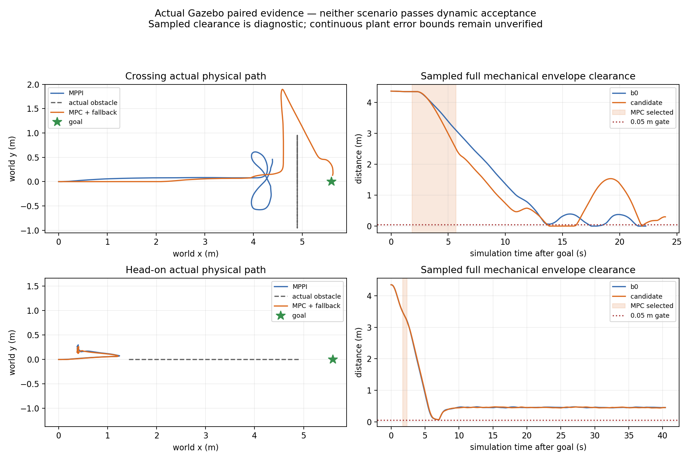

# Temporal MPC 实际输入、Gazebo 配对与阶段结论

2026-10-04。继续工作仍在 `experiment/temporal-mpc-main-20261004`，直接基于
main@d735ee12；没有合并前三个研究分支。正式src、默认MPPI、硬件与Mission接口不改。
本轮完成真实激光/tracker/TF/测量odom/物理pose输入、实际MPC控制与BT回退、两组
固定配置的物理配对。**动态验收仍失败，不冻结为部署候选。**

[运行前登记及修正顺序](temporal_mpc_gazebo_registration_20261004.md)、
[完整配对汇总](evidence/temporal_mpc_gazebo_20261004/paired_summary.json)、
[证据清单与哈希](evidence/temporal_mpc_gazebo_20261004/manifest.json)。

## 真实输入与职责

主线底盘/激光/物理SDF，Gazebo Fortress、固定Humble1.1.20镜像，软件渲染；
无host network、设备或串口。实际15Hz LaserScan，经冻结b5645eca tracker生成
完整v2 `shadow_only` 预测；0.1s×15节点、不衰减、不截速，源时间整数ns。
tracker的9个选择性文件哈希未变，参数与导入边界独立登记。

canonical定位仍由主线GT odom→lio_adapter→`/odometry/lio`与odom→base TF产生。
它是仿真定位，不是实车LIO或轮端测量。地图原点明确固定，因此实验用唯一static
map→odom替代动态identity占位stub；没有桥接Gazebo位姿到`/tf`。
物理PosePublisher model+link只进入oracle话题，完整3D机械外包体投影包含四个
r=.075m球形轮子，不能拿tracker可见框替代。机械xy外包体0.65×0.60m。

静态地图→T-DT YAstar/简化路径/SfcSquare→Path/corridor在控制周期外处理，
仍通过标准ComputePathToPose/NavigateToPose接口。worker只消费既有路径构造走廊，
不做全局搜索。STVL仅使用实际扫描端点PointCloud2，header/TF保持源时间；
两控制器同用当前STVL、静态层、足迹和速度限制。VelocitySmoother输出`/cmd_vel`，
Controller Server是`/nav2/cmd_vel`唯一观察到的endpoint，两插件同时加载。

最终两对SDF、Nav2 profile、tracker、bridge配置**逐字节一致**，目标sim10s发送。
每场景只运行一对；MPPI内部随机噪声seed未锁定。结果是探索性单次配对，不能
据到达差异声称统计净收益。这个固定yaw/20Hz受控B0也不代表旧车正式调优基线。

## 输入和执行进入门

shadow05有623条完整预测；独立反序列化检查7430条CDR与记录JSON完全一致，
只回放canonical `/tf`、`/tf_static`，623/623源epoch TF可插值查询，无oracle参与。
四轮最终配对预测分别489/515/763/763条，全部公共消费与源TF回放通过。
即时记录器曾有少量TF查询失败，后续回放结果单列，不能把后到数据当即时可用。

修复消费者对tentative一次漏检的错误拒绝：冻结tracker在tentative_max_misses=1时
保留tentative状态和旧观察时间；其公开position已推进到array epoch。Python与
native允许该合法旧观察，仍按当前占用处理，不再推进第二遍，仍保留0.4s观察age、
confirmed同源、coasting旧源、future/重复/预算/速度等所有检查；tracker本身未改。

calibration02无障碍脉冲验证vx=.4、vy=.3、两者组合、vx=-.3的稳定体速度，
误差<1e-4，全程|wz|max=3.20e-9；goal前1s的49条测量通过原模型门。
此联合门只准许开始实验，运行中仍实时重验和回退。
**实测瞬态ax/ay约1.94m/s²，超过模型1m/s²**：命令斜坡通过，不能因此声称
下位机连续响应已校准。ZOH、模型爬升、测量/预测误差全程界仍待量化。

## 物理配对结果

接触数是物理传感器消息数，不是独立碰撞次数。候选列指MPC+MPPI回退整体策略。

| 场景/策略 | Nav2终态 | 真实机器人接触消息 | MPC原生通过周期 | 采样完整净空min | 扫掠诊断下界 | 接受 |
|---|---|---:|---:|---:|---:|---|
| 横穿 B0 MPPI | aborted=6 | 720 | 0 | 0 | -0.055m | false |
| 横穿 MPC+回退 | succeeded=4 | 706 | 69/70 | 0 | -0.055m | false |
| 迎面 B0 MPPI | 40s超时后cancelled=5 | 0 | 0 | 0.06479m | 0.00979m | false |
| 迎面 MPC+回退 | 40s超时后cancelled=5 | 0 | 5/6 | 0.06646m | 0.01146m | false |

横穿MPC在sim11.831–15.686s选中，首次物理接触在23.842s，已经回退MPPI；
没有将回退后的到达算作纯MPC成功。迎面MPC只短暂参与，随后停滞，不能成为有效
动态闭环。双方没有安全成功B0见证，false_block保持null。

oracle同源model/link位姿50Hz、最大缺口20ms。完整机械外包体投影距离与Contact
数据独立计算；扫掠下界扣5.5m/s诊断point-speed reserve，但该上界及连续plant
误差未认证，所以它是诊断，不是安全证书。迎面Contact话题无正接触消息并不能
单独证明绝无接触；任务超时及净空门已经失败。不改变足迹、margin或名义D来过门。

## 实时性与回退

候选横穿native原生计算P95=0.149ms/max=0.300ms；迎面P95=0.131ms/max=0.132ms。
可行worker周期P95分别18.025/16.855ms，最大20.514/19.065ms，包含组装/求解/验收，
不是纯solver时间。原15ms solver、40ms core、10ms native、400iterations、20Hz、
1.5s/15节点、4相关/64总track上限保留，无需等每周期完全收敛。

两轮均实际完成MPPI→MPC→MPPI，selector日志为degraded/fallback requested。
回退附近原生拒绝是`reanchored trajectory rejected`，worker仍可能给出feasible；
说明模型可行与新测量重验不同，原生门正确保留了veto。哪条约束拒绝还需细分。
记录器在选择后0.096/0.210ms才收到相邻executed拒绝，这是不同DDS订阅的接收
顺序，不能将其写成因果故障延迟。该字段保持null，附近拒绝作为相关证据单列。

最终`/cmd_vel`候选最大接收间隔横穿60.872ms、迎面68.946ms，均<75ms观察门；
迎面中间`/nav2/cmd_vel`max78.706ms超门，B0中间91.500ms、最终82.743ms超门。
VelocitySmoother在本轮候选中覆盖了中间间隔，但不声称硬实时或无DDS丢失。
14类故障和worker SIGKILL的因果制动证据仍引用前一M3工程轮，不拿自然场景替代它。

## 静态规划和失败记录

完整course只完成前端/走廊检查，没有声称跑了动态course。固定外接圆使0.8m
通道捷径不通过；T-DT仍能从侧面找到路径，|y|max=1.75m，并独立认证全足迹。
这修正了“外接圆容不下通道就无静态路线”的初始判断，保留规划迁移，不把搜索交给MPC。
开放横穿路径的中心走廊y约±0.94m，而默认名义D=1.697m；这会压缩动态侧向
可行性，但不能在没有重验的情况下认定它是唯一失败原因。

所有启动和调试失败保留：shadow01可执行名错误；shadow02缺v2关闭display衰减/截速；
shadow03单线程前端阻塞20ms动作ack；shadow04/calibration01/head_on01生成SDF时
将`ignition:expressed_in`前缀改为ns0，破坏摩擦参考系读取，横移实测0。这些运动
比较撤回，不能归咎主线底盘。修正literal namespace后横移恢复，并测试整棵robot
SDF树除新增只读PosePublisher外与main完全相同。旧Contact topic位置错误造成
零消息，属于采集缺失；最终按镜像官方sensor/contact/topic修正。
退出时偶发rclpy context invalid traceback也原样保存，均发生在主动清理阶段；
不掩盖启动错误。早期调试没有启动源码快照，完整生成配置/CDR/log保留，不冒充
全源码可复现；四轮正式配对启动前源码tar与二进制hash均已固定。

## 阶段处理与下一步

85项测试在主机和固定Humble均通过、0跳过；Humble pytest6的pythonpath配置警告
保留，显式PYTHONPATH有效。完整CDR、源TF重放、配对同配置检查和机械oracle通过
记录完整性验证，但物理失败依旧。保存研究检查点，拒绝部署冻结，不推送或改默认。

下一阶段先细化native重验拒绝的约束和采用同一执行模型的误差界，再由T-DT前端
扩大/更新静态认证走廊的侧向余量，保持控制周期外工作。需要独立验证MPPI回退
路径的实际净空与减速保护，避免接管后继续发生接触；之后重新登记安全B0与候选
配对。不得用这次候选到达、低计算时间或短暂MPC参与替代安全/任务有效性。
