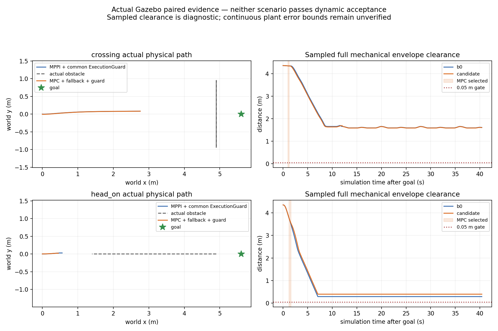

# 侧向参考、生产节拍与速度重锚结果

独立main派生分支，起点0e8d41e5。[先登记](temporal_mpc_lateral_registration_20261004.md)，
旧试次/主线/正式src/原工作区dirty和冻结研究均保留。没有推送、合并或部署冻结。

## 结论

已加入T-DT认证矩形内的局部侧向参考和等价静态格索引；增加生产端节拍/CPU记录。
合成ZOH闭环能绕行并回到原参考，但四次实际Gazebo配对全部40s取消。两场MPC均
因新状态重锚后未来vy超限迅速回退，不能声称侧向参考已解决真实动态避障。
采集完成后修正原生速度投影，98项主机/Humble测试与单独Nav2故障检查通过；
**v2投影没有新的物理试次**，动态接受仍false。

合成完整D工具的goal_reached仅表示位置进入.2m范围，当时vy仍约-.33m/s；
不代表停稳或Nav2 action成功，不能替代上述物理结果。

用户新聊天中的论文线索已逐项核验，见[研究价值与实施优先级](temporal_mpc_literature_review_20261004.md)。
尤其不能把表面锚点几何未知与未来运动误差混成同一个协方差，也不能把每个
infeasible都解释为拓扑局部最优：本轮有确切的执行速度边界反例。

## 固定版本物理配对（投影v1）

每场景仅一对，新容器、sim10s目标、40s窗口，共同保护。四份实际启动前源码
快照的所有控制行为输入相同；四份启动前frontend/native二进制hash也相同。
每场景world/profile/tracker/bridge逐字节一致，MPPI内部noise seed仍未锁定。
不据单次结果声称统计收益，不混称旧的未保护MPPI基线。

| 场景/策略 | action终态 | 正机器人Contact消息 | 50Hz完整机械净空min | MPC通过/执行检查 | 最终cmd接收gap max |
|---|---|---:|---:|---:|---:|
| 横穿 MPPI+保护 | 40s取消=5 | 0 | 1.596190m | 0 | 64.265ms |
| 横穿 MPC+回退+保护 | 40s取消=5 | 0 | 1.590139m | 2/3 | 68.721ms |
| 迎面 MPPI+保护 | 40s取消=5 | 0 | .290937m | 0 | 61.358ms |
| 迎面 MPC+回退+保护 | 40s取消=5 | 0 | .397840m | 1/2 | **78.296ms** |

横穿B0中间ControllerServer接收gap **82.885ms**也超过75ms观察门；其最终保护
输出仍持续。全部没有成功到达。完整机械oracle每20ms配对一次，无缺口；扣除
.055m point-speed诊断reserve仍仅是诊断，连续plant误差/速度界未认证。没有安全
成功B0见证，false_block=null，无正Contact消息不等于连续安全证明。

## 执行拒绝定位和随后修正

横穿MPC选择sim10.983–11.265s：实际执行第3次检查，evaluation11.262、
proposal11.229、prediction11.221s，初态vy=-.04999985696；第10步未来
vy=-.50201795188，速度slack=-.00201795188m/s。迎面实际第2次检查，
evaluation11.601、proposal11.553、prediction11.551s，第11步
vy=.50168169376，速度slack=-.00168169376m/s。这是**提案未来模型**超限，
不是已执行物理速度达到该值；当次拒绝后输出有限制动并交接MPPI。

原先重锚后只投影剩余停止能力。四轮采集结束后新增
`bounded_stopping_acceleration`：投影到固定速度界与剩余停止区间交集，再限目标差，
完整未来几何、速度、停止和当前STVL硬检查仍在。健康标记
`reanchor_projection=velocity_and_stop/v2`；ZOH动力学模型未变。审计按字段分别
重放v1/v2，缺字段的历史记录使用原投影，旧结果不改写。

抽取横穿确切健康、提案和公共预测，编译实际C++ helper重放：v2最低vy=-.5，
31个状态与独立Python计算误差max5.56e-17，全部记录公共几何、走廊、目标差和
terminal停止通过。v1完整假设继续积分最低vy=-.5169996仅作重放诊断，实际检查
早在第10步拒绝。这项检查不含新的plant/即时TF/STVL执行，不是物理修正成功。

## 生产节拍与工程检查

四轮保护tick到输出max5.537–6.305ms，生产开始间隔max51.262–51.399ms，
生产发布间隔max53.603–54.209ms，没有nominal missed slot。迎面候选接收gap
78.296ms与其生产发布max53.603ms单列；不能把接收gap当核心计算耗时，不能
据不同订阅顺序分配唯一因果。75ms接收观察门仍判失败，不删除或重跑挑最好。
nominal expected是本地50ms参考栅格，非rclpy TimerInfo；CPU字段截止诊断构造前，
不是线程纯CPU或完整诊断发布成本。索引和deadline检查也不授予硬实时保证。

98项测试最终在主机与固定Humble全通过、无skip；Humble pytest6仍有pythonpath
配置警告，显式PYTHONPATH生效。阻塞方格索引在90组随机轨迹、稀疏/稠密/边界/
unknown地图上与独立穷举数值等价；deadline中途退出保持有限减速。原生投影
单包Humble重新构建成功，不改系统/正式包/solver依赖。

共同保护8类故障fixture全部通过：380条实际命令，接收gap max52.787ms，生产
发布max52.733ms，tick到输出max3.493ms，nominal missed slot=0。每例先运动
再注入异常/失流，减速到零并恢复。旧136.625ms失败保留；本轮代码已改变，
这是独立新试次，不是同实现重复挑最好，也没有完成最坏负载或进程死亡watchdog门。

v1与v2各一次独立Nav2 fixture，均通过14类故障、双向BT controller selector、
SpeedLimit及worker SIGKILL后的有限制动。v2活跃命令gap max56.738ms，native
P95=.184ms/max=.290ms；仍是合成输入工程验证。SIGKILL及退出context invalid
日志原样保留，不作为运行中异常删除记录。

四轮CDR共67,180条与JSON一致；3,041条预测canonical源TF重放均可查。
4,287个保护精确输入重放、424个原生ZOH状态与36个动态拒绝数值检查均匹配，
没有缺失输入。只证明记录/模型一致性，回放可用不替代即时可用。
最初横穿B0的并行只读审计先于CDR/TF文件完成，产生临时false进入门；保留
`audit_before_capture.json`，待其依赖完成后顺序生成正式审计及true进入门。物理
试次没有重跑。合成工具首次JSON bool类型序列化失败与测试辅助参考错误也保存。

## 下一轮

先给v2投影另登记匹配源码和二进制的双方物理配对，继续逐项区分执行边界、
几何/走廊不足、预测更新和局部初始化失败。之后尝试共同总预算内有限左右/等待
候选，记录每类候选是否可行；再用留出整试次校准锚点几何与运动残差，设计实验
不确定性合同。当前单QP侧向偏好不是T-MPC++，ExecutionGuard不是CBF安全滤波器。
保持两个Nav2插件、默认MPPI、规划前后端和上层action；不给当前版本比赛部署资格。
