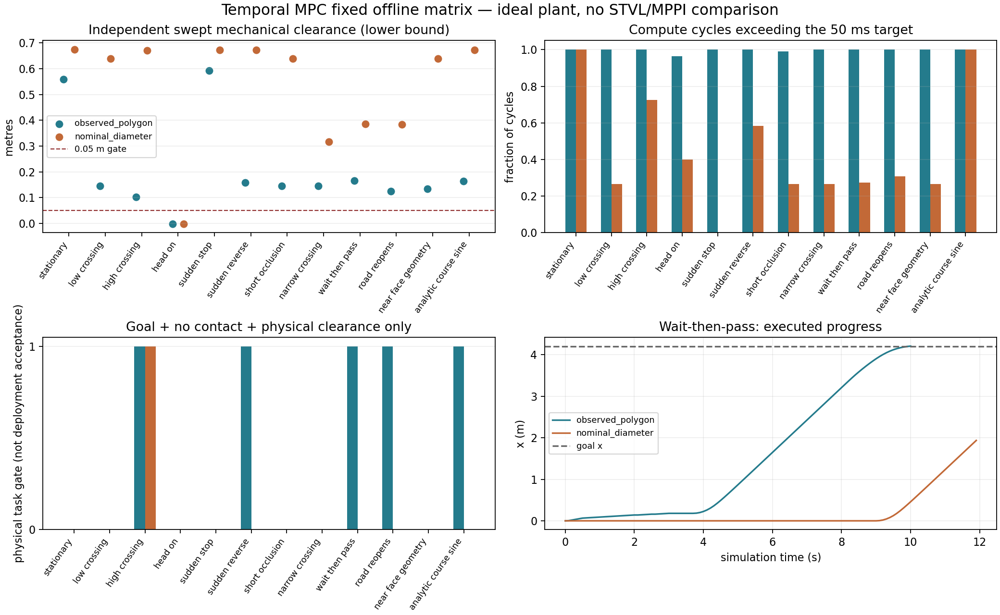
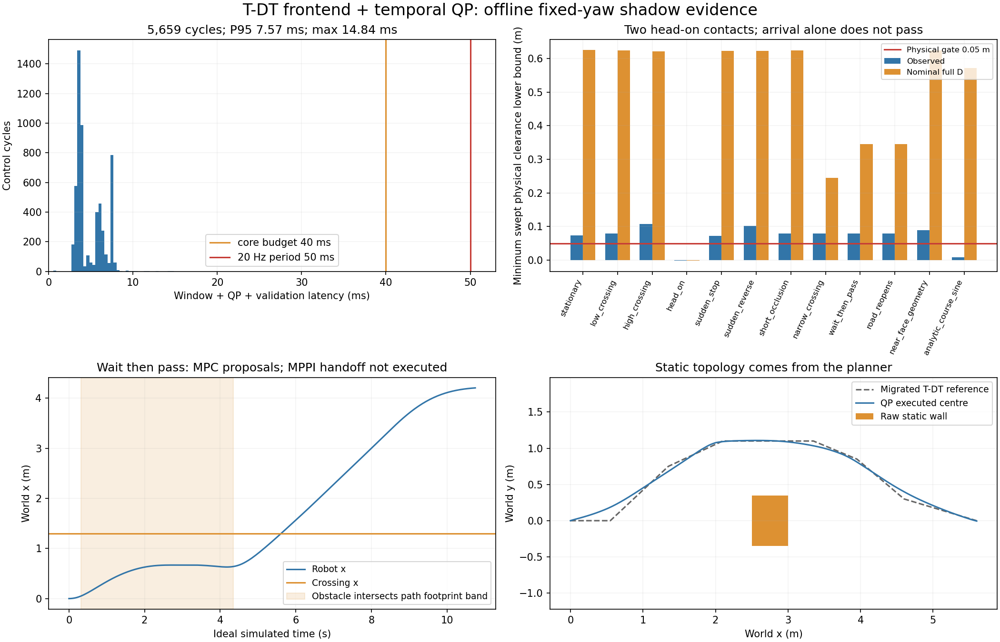

# Temporal MPC 进度与结果

2026-10-04，Asia/Shanghai。工程状态：审计、架构、离线原型和验证完成。
**候选状态：M1离线切片及M3双插件工程链路已完成；M2真实输入/Gazebo、
M3配对物理门仍未完成，不进入部署。旧SLSQP与迎面接触失败保留。**

## 分支与保留边界

最终分支 `experiment/temporal-mpc-main-20261004` **直接从main分出**，基点
`d735ee12bd950dca0e691cdf2f2c61f35cef8ffc`。没有merge/cherry-pick旧研究提交。
初始从文档归档HEAD创建的空分支已删除，原工作区恢复原归档分支。
本次迁入仅新原型/文档/证据、四个白名单离线参考及登记的T-DT前端库；相对main没有src、正式
参数/启动、TF或消息生成改动。已有十个dirty/untracked路径摘要/大小和main/旧
research/冻结tag均保持。证明见[分支来源](evidence/temporal_mpc_20261004/branch_provenance.json)、
[状态保留](evidence/temporal_mpc_20261004/preservation_check.json)及
[参考文件清单](../../experiments/temporal_mpc/reference_inputs/provenance.json)。

## 第0轮：现有能力及HWS审计

- hypothesis：现有公开状态足以隔离时间消费机制，但不能认证完整物体/未来支持。
- change：逐模块读tracker/消息、native critic/guard、STVL/MPPI配置、历史T-DT与HWS固定源码；设计四全向轮acceleration MPC。
- result：R1未来占用层和timed-reference闭环没有可运行实现证据；R2失败试次不是STVL公平对照。HWS纵向LPV/FDDP不能直接搬到四全向轮。
- evidence：[架构](temporal_mpc_architecture.md)、[上游文件哈希](temporal_mpc_upstream_audit.json)。
- conclusion：复用公开契约和已有tracker测试参考；不导入HWS代码或旧运行包。
- next step：仅做已知当前形状/速度的受限离线核心。

## 第1轮：核心实现与契约门

- hypothesis：同epoch的显式相对时间序列、整足迹硬约束、受限全向模型和停止终态，可以避免仅靠软权重隐藏模型碰撞。
- change：建立SLSQP direct shooting、两种几何、完整source-age检查、warm start、deadline拒绝、制动提案和独立scalar polygon swept oracle。
- result：最终 **57/57测试通过**，覆盖源时间、coasting、不完整/失流/错误帧、真实项目tracker输出适配、全向积分、足迹内部cell、伪成功/NaN输出、完整制动与证据篡改。
- evidence：[测试XML](evidence/temporal_mpc_20261004/final_tests.xml)、[原型及复现命令](../../experiments/temporal_mpc/README.md)。
- conclusion：接口/数值约束验证通过；这些测试不证明真实预测正确或控制实时可用。
- next step：执行预登记矩阵并独立回放。

## 第2轮：失败保留与制动修正

- hypothesis：必须用实际执行的整周期提案核验模型，不能只相信solver feasible标志。
- change：开发smoke两次发现NumPy bool报告序列化问题，修正类型并增加逐周期文件证据；独立回放随后发现制动在collision_dt归零、执行却保持完整dt的错误。
- result：首轮31个试次全部保留到`pre_fix/`，接受判断作废。修正为control_dt生成制动后重复到collision grid，增加小速度不反向/整周期command一致性测试；所有参数、几何、权重与oracle不变。
- evidence：[原轮拒绝记录](evidence/temporal_mpc_20261004/pre_fix/replay_failure.json)、[预登记修正](temporal_mpc_experiment_registration.md)、`pre_fix/`与两个development smoke目录。
- conclusion：这是实际实现/执行不一致；不是权重或足迹修调。源码快照保留两轮身份。
- next step：全部重跑并拒绝使用旧轮成功计数。

## 第3轮：修正后固定矩阵

12场景×2几何，24个试次；另3个消费机制试次和4个horizon试次，共 **31个修正后试次**。
每个试次有manifest、固定配置、完整指标和逐周期实际提案。开发预算0.5s，
另记录20Hz目标50ms门；离线plant按固定模拟dt推进，计算时不继续运动。

| 几何 | 物理任务门通过 | 接触试次 | 50ms超期周期 | 0.5s超期周期 | 周期数 |
|---|---:|---:|---:|---:|---:|
| 观测polygon/受控完整当前形状 | 5/12 | 1 | 1244 | 430 | 1247 |
| 近面锚点+名义完整D圆 | 1/12 | 1 | 627 | 265 | 1400 |

物理任务门只包含到达、无接触和机械净空≥0.05m；不是部署接受。两种几何
均在迎面试次接触。没有一个主矩阵试次同时通过物理任务与严格50ms期限门。
大多数有运动价值的试次P95接近0.5s；deadline分支依赖主机，不能宣称跨主机
逐位复现。模型内可行制动也不能阻止障碍在之后撞向静止机器人。

| 场景 | 观测：到达 / 最小净空下界m | 名义：到达 / 最小净空下界m |
|---|---|---|
| stationary | 否 / 0.558452 | 否 / 0.675000 |
| low_crossing | 否 / 0.146212 | 否 / 0.639629 |
| high_crossing | 是 / 0.103216 | 是 / 0.670950 |
| head_on | 否 / -0.002000（接触） | 否 / -0.002000（接触） |
| sudden_stop | 否 / 0.592717 | 否 / 0.673000 |
| sudden_reverse | 是 / 0.157817 | 否 / 0.672947 |
| short_occlusion | 否 / 0.146212 | 否 / 0.639629 |
| narrow_crossing | 否 / 0.146212 | 否 / 0.317439 |
| wait_then_pass | 是 / 0.165326 | 否 / 0.385754 |
| road_reopens | 是 / 0.125416 | 否 / 0.383766 |
| near_face_geometry | 否 / 0.133273 | 否 / 0.639629 |
| analytic_course_sine | 是 / 0.163509 | 否 / 0.671409 |

### 时间消费与horizon诊断

同一wait_then_pass、观测模式、相同oracle：

| 消费机制 | 到达时间s | 等待s | 最小净空下界m |
|---|---:|---:|---:|
| current_only | 11.2 | 3.6 | 0.388483 |
| future_union | 未到达 | 12.0 | 0.398500 |
| temporal | 10.1 | 2.2 | 0.165326 |

temporal比该current_only消融提前1.1s，但后者不是STVL/MPPI；future_union
停滞也不能按B0定义称为false_block。全部消融均有50ms超期，不能作为部署收益。

| horizon s | 到达时间s | 等待s | 最小净空下界m |
|---|---:|---:|---:|
| 0.5 | 未到达 | 2.4 | 0.068362 |
| 1.0 | 9.7 | 2.4 | 0.115887 |
| 1.5 | 10.1 | 2.2 | 0.165326 |
| 2.0 | 11.9 | 4.2 | 0.378550 |

horizon越长并非越好：本夹具1.0s最快、2.0s更长等待。停止终态和有限时域
的可行性也限制速度/进展；不能只调权重解释0.5s失败。

### 独立核验与指标边界

[主矩阵回放](evidence/temporal_mpc_20261004/matrix_replay.json)、
[消融回放](evidence/temporal_mpc_20261004/ablation_replay.json)、
[horizon回放](evidence/temporal_mpc_20261004/horizons_replay.json)
重算全部实际整周期命令、plant状态、机械扫掠、接触、净空、等待/距离和deadline
汇总；合计3417周期通过。证据篡改负对照被测试拒绝。回放证明执行标签与报告
一致，不认证未记录的优化全时域或真实感知。
[源码校验](evidence/temporal_mpc_20261004/source_hash_check.json)
确认当时fixed tar快照、matrix manifest及核心逐文件一致。最终新增接口与EOF格式修整见第4轮源码身份记录，运行快照保留原字节。

所有请求指标在各试次JSON中保留。ROS action success、recovery及B0定义的
false_block_count/duration为null，因没有真实Nav2 action/配对STVL成功见证。
CPU记录进程计算需求，不代表完整机器人工作负载。平均速度/jerk来自理想plant；
detour是执行路程超出已走起终点直线距离的部分。观测模式多数输入是控制
可行性隔离用的完整当前polygon；不能冒充真实激光前端已验证。

## 旧SLSQP结论与停止决定

- hypothesis：时间对齐的优化会稳定比现有方案更好。
- result：单夹具可减速/等待后通行，但静止绕障和多种场景停滞、迎面接触、实时期限失败，且没有同条件B0/R2闭环对照。
- conclusion：当前实现**未证明稳定、可部署净收益**；冻结该原型的进一步集成，不建立自动续跑，不修改正式导航。不能据此否定所有MPC，也不能说MPC优于MPPI。
- next step：继续保留正式基线；若重新启动研究，先隔离局部求解拓扑/预算、完整输入支持和实际执行时间，有限修正后重新注册同场景门，再考虑Gazebo shadow与Nav2 plugin。不能直接扩展整套HWS或反复换solver/调尺寸。

## 第4轮：根据用户补充调整职责与实时约束

- hypothesis：静态路径拓扑由已迁移规划前后端压缩后，单次小QP可在20Hz期限内处理局部动态避障；失败不能直接中断控制提案。
- change：选择性复用冻结T-DT YAstar/路径简化/SfcSquare，独立认证raw静态map中的走廊；MPC不读raw map或全局搜索。实现固定yaw的全向平移QP、15节点/1.5s、15ms solver/40ms core预算、最多400迭代/4相关障碍、warm start和全量track重验。加入旧序列新输入重验→有界制动→MPPI请求；双向选择监督政策/BT与双插件设计示例。
- result：70项最终测试全部通过。25试次/5,659周期控制耗时P50=3.82ms、P95=7.57ms、最大14.84ms，40ms及50ms超限均0；迭代未超过400。5试次同时通过任务、0.05m净空和20Hz门，2个迎面试次接触。单独静态绕行正确消费T-DT路径，控制核没有静态拓扑搜索。
- evidence：[完整汇总](evidence/temporal_mpc_realtime_20261004/summary.json)、[5,659周期独立回放](evidence/temporal_mpc_realtime_20261004/independent_replay.json)、[测试](evidence/temporal_mpc_realtime_20261004/tests.xml)、[实际源码身份](evidence/temporal_mpc_realtime_20261004/source_identity.json)、[T-DT来源](../../experiments/temporal_mpc/frontend/provenance.json)、[实现/复现](../../experiments/temporal_mpc/README.md)。
- conclusion：证明了受限模型的实时工程切片与规划器分层，未证明比同条件STVL/MPPI更好，也未证明可靠部署。保留原MPPI、冻结旧SLSQP进一步集成；新QP不扩大到实车或默认控制器。
- next step：先取得M2真实输入、全负载wall延迟/执行模型证据；确认物理支持后再做M3固定Humble Nav2双插件/运行时交接与配对B0。迎面无逃逸/预测误差、完整名义包络的保守停滞和solver拒绝需单独归因，不能继续靠调足迹、降低门或堆复杂NMPC。

### 逐场景实测结果（QP shadow）

| 场景 | 观测到达/净空下界m | 名义到达/净空下界m |
|---|---|---|
| stationary | 否 / 0.073564 | 否 / 0.625000 |
| low_crossing | 否 / 0.078575 | 否 / 0.623686 |
| high_crossing | 是 / 0.107117 | 否 / 0.620950 |
| head_on | 否 / -0.002000（接触） | 否 / -0.002000（接触） |
| sudden_stop | 否 / 0.071561 | 否 / 0.623000 |
| sudden_reverse | 是 / 0.101945 | 否 / 0.622950 |
| short_occlusion | 否 / 0.078564 | 否 / 0.623686 |
| narrow_crossing | 否 / 0.078575 | 否 / 0.245361 |
| wait_then_pass | 是 / 0.079578 | 否 / 0.344862 |
| road_reopens | 是 / 0.079558 | 否 / 0.344834 |
| near_face_geometry | 否 / 0.088572 | 否 / 0.623686 |
| analytic_course_sine | 是 / 0.008087 | 否 / 0.571816 |

另外，`static_map_detour`到达11.55s，最小净空下界0.378380m。
通过综合门的动态场景为high_crossing、sudden_reverse、wait_then_pass及
road_reopens；解析正弦虽然到达，净空下界只有0.008087m，未通过0.05m门。
近面/名义输入仍无真实几何和未来误差支持证书。物理map包含已知边界cell条带，
T-DT使用更保守的整足迹外接圆走廊；本轮改变问题分层，不能将与旧SLSQP差异
解释为纯solver A/B收益。

2,937周期请求MPPI回退，1,732周期只有uncertified_brake提案，不能把这些周期
称作安全停止。runner继续shadow执行MPC提案，**没有执行MPPI交接**；因此迎面
碰撞结果描述独立MPC core，没有测试完整回退策略。原生Nav2 action/recovery/
B0 false_block保持null，actual handoff计数为0，部署接受为false。

### 实时范围、故障证据与切换完成度

新预算从第一阶段设计进入：单QP、有限节点/障碍/迭代、迟到结果拒绝。所有
QP结果都重算足迹/终态；max-iteration次优解只有通过验收才使用。大量旧可行
序列复用/求解拒绝仍说明局部分离面和严格验收的可靠性有待改善，速度快不
代表每周期都得到优化解。故障政策测试注入solver异常/timeout、新障碍、
stale预测、不同plan/epoch/yaw子域，检查有界输出与拒绝沿用旧安全结论。

T-DT桥接首次origin约定错误的Eigen断言、yaw拒绝时旧序列复用错误及修复
见[开发记录](evidence/temporal_mpc_realtime_20261004/development_findings.json)。
运行源码逐文件保存在tar，所有manifest hash匹配；随后两个新增回归测试、桥接parser/原始map字节输入边界加固及5文件EOF格式修整明确列为
post-run differences。QP/预测/oracle/runner字节未变，dynamics/fixtures仅移除
末尾多余空行，没有修改算法来重写结果。

本机离线20Hz预算通过，50Hz尚未验证；模拟计算时暂停，真实系统延迟、
ROS/TF/costmap/CPU负载及下位机响应尚未计入，因此没有硬实时认证。
第4轮当时主机ROS是Jazzy，尚未运行Humble双插件集成；第5轮已在隔离镜像实测。此前完成运行时选择政策、
监督器代码、双插件和ReactiveSequence示例、固定Humble源码审计；尚未完成
TemporalMPC Nav2二进制、真实消息接入、DDS/BT action preemption和唯一命令
publisher的闭环实测。这些进入门没有冒充已完成。

最终staged whitespace检查：自有代码/文档通过；vendor的21项历史空白问题
保持原字节和来源哈希，单独留存检查输出，不修改冻结源码以掩盖来源。

## 第5轮：继续授权后的 Humble 双插件工程实测

- hypothesis：异步QP与原生接受边界能让solver故障不阻塞Controller Server，并通过原生BT在同一上层目标内切换。
- change：实现可加载 `rm_temporal_mpc::Controller`、独立有界提案消息、异步worker、完整双插件profile/ReactiveSequence。外部规划路径只构造T-DT SFC；增加source/map/plan/current raw-grid及全量动态重验。ROS jitter、DDS跨回调源顺序、数值投影和ZOH终态差异按原门修正，记录开发失败。
- result：固定Humble1.1.20镜像实际加载两插件，MPPI→MPC→MPPI、14类因果故障回退、SpeedLimit拒绝/恢复、worker被SIGKILL后的独立制动、唯一publisher与活跃控制连续性通过。75项测试在主机及Humble均通过、0跳过；Humble pytest6对pythonpath配置有1条无害警告，实际通过显式PYTHONPATH运行。
- evidence：[最终运行汇总](evidence/temporal_mpc_nav2_20261004/final/summary.json)、[记录流复核](evidence/temporal_mpc_nav2_20261004/recorded_stream_audit.json)、[Humble测试](evidence/temporal_mpc_nav2_20261004/tests_humble.xml)、[实现/复现与限制](../../experiments/temporal_mpc/integration/README.md)、[失败归因](evidence/temporal_mpc_nav2_20261004/development_findings.json)。
- conclusion：从“设计片段/切换请求”推进到真实Nav2/BT/action/DDS工程链路。仍没有实际tracker/Gazebo安全成功或同条件STVL/MPPI净收益，不能用这轮覆盖原迎面接触。
- next step：新采集包含完整authority/v2/源epoch TF/测量odom的真实tracker输入；验证墙钟延迟与下位机响应/外部watchdog，再注册同plant的B0/MPC配对物理门。map帧固定yaw、标准SpeedLimit下MPC退化和监督器失活行为见实现限制。

最终run07有242条实际速度输出，Controller Server唯一endpoint GID；活跃
会话最大间隔54.741ms（75ms连续性门），原生计算P95=0.210ms/max=0.245ms，
worker周期P95=6.817ms。一般无效预测/不可行回退约44–57ms，solver失流/timeout
约145–156ms，prediction失流约406ms（source-age门400ms）；不声称硬实时。
人为cancel到直接FollowPath的两个会话间总体最大间隔195.010ms保留为指标，
不能误判为活跃任务输出中断。NavigateToPose结果status=5是人为取消，不是到达。

14故障为solver silent、timeout、infeasible、exception、NaN、complete=false、
错误frame/schema、预测失流、authority缺失、未来epoch、重复ID、超track预算、
新障碍。每例要求注入前实际MPC计算且持续选中，之后发生新的MPPI选择/退化
健康并继续有命令。部分例由BT及时接手，没有观测到原生制动；不伪造该计数。
另直接FollowPath保持MPC，终止worker进程后有界制动到零，单独证明原生输出边界。

run01配置零方差造成MPPI NaN；run02因果门漏洞撤销；run03发现DDS transient
unknown node name；run04取消空档门定义错误；run05稳定选中暴露ZOH终态偏差；
run06工程通过；run07是最终helper/SpeedLimit版本。全部原日志/失败汇总保存。
原生terminal剩余停止约束和每条修正后的轨迹均重新验，不改足迹、margin或
terminal tolerance。costmap shadow try-lock修复锁顺序风险，限制检查10ms。

M2历史输入审计：[787条真实捕获预测](evidence/temporal_mpc_nav2_20261004/public_input_audit.json)
全部odom/v1，source单调、receive-source记录延迟7–55ms，缺authority且没有
同步ROS测量odom/source TF。Gazebo pose真值不能替代这些缺项；明确拒绝改名
或补造authority/v2用于控制。本轮动态故障输入仍是合成消息，物理接受=false。

分支仍从main@d735ee12直接派生，继续提交接在M1之后，不接旧研究分支。
规范接口包只在实验overlay增加冻结公开预测msg，正式src/TF/默认配置不改。
二进制/源码快照、依赖wheel/tag/commit/许可、原工作区保留记录存于本轮证据。

## 2026-10-04 后续：真实输入与Gazebo固定配对检查点

- hypothesis：已有路径前端和异步QP能在实际激光/tracker/测量odom下运行，并通过原生重验及BT退化保持输出。
- change：选择性引入未修改b5645eca tracker；隔离main物理SDF/定位适配器；记录完整CDR/源TF/物理pose/Contact；以T-DT标准路径action供参考与认证走廊，加入真实扫描STVL、公共VelocitySmoother；修复合法tentative一次漏检旧epoch消费。
- result：真实公共输入及canonical源TF重放通过；实际MPC在横穿69/70、迎面5/6次原生计算通过，双向选择和回退发生。候选最终cmd间隔max60.872/68.946ms；迎面中间controller cmd78.706ms超75ms观察门。85项测试主机/Humble都通过、无skip。
- evidence：[本轮完整结果](temporal_mpc_gazebo_results_20261004.md)、[配对与实时汇总](evidence/temporal_mpc_gazebo_20261004/paired_summary.json)、[源消息/配置/源码快照与hash](evidence/temporal_mpc_gazebo_20261004/manifest.json)、[仿真复现](../../experiments/temporal_mpc/gazebo/README.md)。
- conclusion：输入/执行/交接从合成fixture推进到实际Gazebo；**动态接受仍false**。横穿B0 aborted、候选到达但双方真实接触；迎面双方40s取消。保持false_block=null，不冻结部署候选，不改正式默认MPPI。
- next step：细化native新测量重验拒绝和执行误差界、T-DT静态走廊侧向余量、回退策略净空/减速保护，再注册安全B0与候选配对。完整course仅静态前端通过（拒绝窄通道捷径、外侧绕行），没有动态course成功。

生成器ns0命名错误导致的shadow04/calibration01/head_on01运动比较全部撤回并保留；
不是主线底盘失败。修复后实际全向脉冲稳定响应通过，但实际瞬态accel约1.94，
模型1.0的连续响应界尚未认证。source/TF回放完整与模型可行都不等于物理安全。
四轮最终配对每场景SDF/profile/tracker/bridge逐字节一致；单次、MPPI随机seed未锁定，
不得根据候选到达或无接触超时声称统计净收益。

## 2026-10-04 后续：执行模型、走廊与共同回退保护检查点

- hypothesis：统一实际held-velocity模型、拓宽已认证静态空间和共同制动保护，可定位原生veto并检查回退后物理接近行为。
- change：QP/native使用50ms ZOH；固定预算/几何保留；T-DT SFC maxRange 2→6m，raw-cell完整证书保留；新增共同保护，最新公共预测+完整制动尾+原始静态地图、限命令差、ROS异常连续减速。具体模型证书不等于连续物理安全。
- result：91项测试主机/Humble通过；4,298个保护周期、518原生状态、131动态拒绝精确重放匹配；4轮真实预测/CDR/源TF门通过。候选实际MPC横穿66、迎面9周期，之后由shadow动态净空slack -.335/-9.952mm触发回退。四轮无正接触消息但全部40s取消，迎面最终cmd gap88.093/77.022ms超75ms门。
- evidence：[登记](temporal_mpc_execution_registration_20261004.md)、[完整结果与限制](temporal_mpc_execution_results_20261004.md)、[配对汇总](evidence/temporal_mpc_execution_20261004/paired_summary.json)、[完整证据](evidence/temporal_mpc_execution_20261004/manifest.json)。
- conclusion：核心链路/可观测性推进，动态接受仍false；新B0为MPPI+共同保护，不混称原未保护B0。8类保护故障减速/恢复成立但gap136.625ms使总门false，保留且不重跑挑最好。原生Nav214类故障/worker SIGKILL与活跃输出门另通过。
- next step：认证走廊内局部侧向参考/分离面初始化、异步测量/预测变化的保守余量、共同保护的最坏负载/生产节拍/独立wall watchdog。保留默认MPPI和独立main分支，不冻结部署。

## 2026-10-04 后续：侧向参考、生产节拍与速度投影

- hypothesis：认证矩形内提前侧移能改善局部初始化，等价格索引与生产端记录能区分计算和接收间隔。
- change：加入侧向方向偏好＋有界可达seed，仍单QP/原硬约束；共同保护精确cKDTree方格查询和中途deadline，新增producer/CPU节拍与启动前binary身份。物理采集后另修正原生重锚的固定速度/停止区间投影，标记v2，旧v1审计保持。
- result：98项最终主机/Humble测试通过；四物理配对全40s取消、无正Contact消息，MPC分别2/3和1/2检查通过，因未来vy超过±.5拒绝。迎面候选接收gap78.296ms超75ms而生产发布max53.603ms；两类证据分开。8类保护故障新版本全部通过；v2原生14类工程故障和真实失败提案编译重放通过，但无v2物理效果证据。
- evidence：[登记](temporal_mpc_lateral_registration_20261004.md)、[结果](temporal_mpc_lateral_results_20261004.md)、[新聊天论文核验](temporal_mpc_literature_review_20261004.md)、[完整证据](evidence/temporal_mpc_lateral_20261004/manifest.json)。
- conclusion：定位了真实执行边界缺陷，并改进保护可观测性；动态接受仍false。不把几何未知等同运动covariance，也不把每次拒绝归因于预测或局部最优。四轮实际启动前行为源码和二进制均一致，后续v2单列。
- next step：新登记v2物理双方配对与失败分类，然后有共同总预算的左右/等待候选；以完整留出试次校准不确定性，再考虑Scenario/Chance与相同表示MPPI对照。
