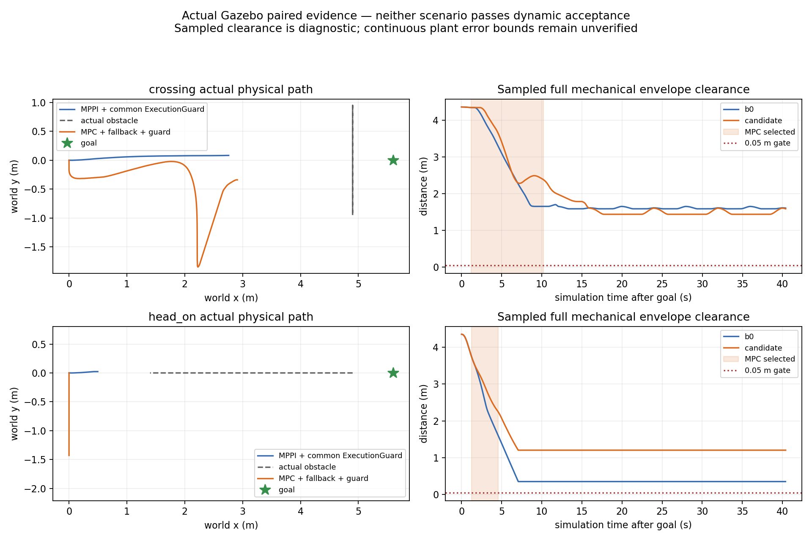

# v2速度重锚投影物理复验与模型占用诊断

2026-10-04，起点e31030b1，[先登记](temporal_mpc_projection_registration_20261004.md)。
独立分支仍直接从main@d735ee12派生。本轮冻结控制行为，新增工具仅作采集后的只读审计。

## 结果

v2在两次实际MPC试验中没有再次产生旧的未来vy超限拒绝。横穿持续选中约9.036s，
175/176次原生执行检查通过；迎面约3.333s，62/63次通过。两者随后均因未来动态
净空不足回退MPPI，未完成通过并回原路径。四轮均40s取消、没有正机器人Contact
消息，动态接受仍false。不能根据单次试次把参与时长改善写成统计收益或部署资格。

新增诊断发现：横穿目标(5.6,0)及固定yaw=0下的0.15m位置容差区，在双方所有
目标后的有效公共预测采样时刻都被当前完整D模型排除。因此横穿的任务失败不能
只归因于局部优化。迎面目标仅在早期部分采样被排除，后期目标开放仍未到达，
需要另外处理局部提案/停止尾和异步执行重验。

## 固定物理配对

四轮各使用新隔离Humble容器，无网络/设备；sim10s发送相同NavigateToPose目标，
40s窗口。四份启动前快照的119个文件内容相同，frontend/native二进制身份相同，
每对world/nav2/tracker/bridge逐字节一致。实际健康均标记velocity_and_stop/v2。
源TF/CDR审计完成后再生成基线进入门，候选随后启动；没有调参或重复挑最好。

| 场景/策略 | action终态 | 正Contact消息 | 完整机械采样净空min | MPC通过/执行 | 最终cmd接收gap max |
|---|---|---:|---:|---:|---:|
| 横穿 MPPI+共同保护 | 40s取消=5 | 0 | 1.591696m | 0/0 | 74.779ms |
| 横穿 MPC+回退+共同保护 | 40s取消=5 | 0 | 1.441794m | 175/176 | 74.921ms |
| 迎面 MPPI+共同保护 | 40s取消=5 | 0 | .353152m | 0/0 | **86.961ms** |
| 迎面 MPC+回退+共同保护 | 40s取消=5 | 0 | 1.205338m | 62/63 | **80.478ms** |

迎面B0中间ControllerServer接收gap也达89.869ms。两场迎面最终输出超过75ms
观察门；全部结果保留。MPPI内部噪声seed未锁定，重复数=1，没有安全成功B0
见证，false_block=null。零Contact消息与50Hz净空只作物理诊断，连续plant误差/
速度界未认证；保护中大量uncertified_brake也不能称作安全停车。

## 实际执行拒绝

横穿：evaluation20.202、proposal20.172、prediction20.131s，第176次执行检查，
第27步track1动态净空slack=-.003330680344m。初态(2.215995,-1.737599)，
未来检查点(2.632334,-1.581912)，当次拒绝并有限减速；选择于20.208s回MPPI。

迎面：evaluation14.565、proposal14.526、prediction14.521s，第63次执行检查，
第29步track1动态净空slack=-.000559651293m。初态(-.000250,-1.364901)，
未来检查点(-.165015,-1.126142)，当次拒绝；选择于14.568s回MPPI。

这些是完整未来模型的拒绝，不能解释为物理机器人已经碰撞。原生重锚后始终
保留速度/停止投影及全部几何检查，没有放宽负slack。记录订阅顺序不测量唯一
因果延迟。worker诊断尚未携带其确切使用的prediction source identity，因此本轮
没有把剩余拒绝唯一归因于“预测更新”或“新测量状态”；需补该身份才能分解。

## 当前模型是否允许目标

只读工具[audit_model_occupancy.py](../../experiments/temporal_mpc/gazebo/audit_model_occupancy.py)
消费原公共v2输入，不读取oracle或actor未来目标。源采样在source epoch求当前占用，
原生采样使用健康记录中的evaluation/prediction epoch，不重复推进coasting锚点。
使用原完整D=1.6970562748477143、padded足迹半长(.355,.330)、margin.02和原采样
reserve；不改变控制几何。目标及xy容差从实际goal/config读取，诊断固定yaw=0。

令g为目标处“圆锚点到完整矩形距离−D−margin−采样reserve”。平移矩形的距离
函数为1-Lipschitz；若g+.15<0，同一采样时刻整个位置容差圆盘都被该track排除。
这只是当前模型在记录时刻的结论，不证明真实完整物体几何、未采样时间或全任务
连续不可行；也不把yaw_goal_tolerance范围内所有方向当作已检查。

| 记录 | 目标后有效源采样 | 排除目标点 | 排除整位置容差区 | 容差区slack上界max |
|---|---:|---:|---:|---:|
| 横穿B0 | 610 | 610 | 610 | -.770321m |
| 横穿MPC | 612 | 612 | 612 | -.742691m |
| 迎面B0 | 612 | 37 | 32 | 2.481940m |
| 迎面MPC | 611 | 37 | 32 | 2.390692m |

横穿候选458个确切原生几何检查epoch也全部排除整位置容差区，上界max=-.723444m。
不能把D直接减半：公开位置仍是近表面观测锚点，没有完整物体中心/外形证书。
表面几何未知也不能用运动协方差或complete标志替代。

工具同时解析当前认证矩形的连续横向截面，对全量track取阻塞区间并集，并比较
原局部偏好的目标是否容纳。当前截面有正宽度只证明该时刻有空间，不证明整个
1.5s轨迹可行，也不重建侧向锁定历史。横穿/迎面候选postsolve诊断有167/18次
corridor_insufficient、494/691次primal infeasible；失败会reset偏好，这些计数均
不能作为“静态走廊无路”或“模型已证不可行”的证明。

首版只读筛选仅看step非负，纳入少量携带旧步号的input拒绝健康；修正为还须
明确几何/速度检查constraint。四份初版完整输出以initial_step_filter后缀保留，
正式几何样本数与独立原生重放一致，目标结论未变，物理试次没有重跑。

## 核验与实时范围

68,159条CDR与JSON一致，3,048条预测的canonical源TF重放全部可查。4,291个
共同保护精确输入重放、818个原生ZOH状态与45个动态拒绝数值检查均匹配，无
缺失输入。回放证明记录/模型一致，不替代实际即时TF可用或真实检测支持。

worker整周期耗时最大30.798ms，实际native执行检查最大.195ms，保护tick到输出
最大6.546ms；原40/10/10ms预算观察门通过。保护生产开始间隔max51.663ms、
发布间隔max54.251ms，nominal missed slot=0。两场迎面接收gap仍失败，生产/接收
分别保留，不能据序号分配调度或DDS的唯一原因，也没有硬实时保证。

新增只读工具4项测试在主机与Humble通过：独立全量几何对照、目标点与容差区
区别、偏好不足与硬空间区别、源/native epoch与stale及旧步号负对照。此前98项
控制测试和v2故障fixture证据保持，本轮没有改控制实现或重复构建。Humble旧pytest
仍有pythonpath配置警告，显式PYTHONPATH生效，各版测试输出均保留。

[完整证据manifest](evidence/temporal_mpc_projection_20261004/manifest.json)包含四轮
原始记录无损gzip、源快照、实际二进制身份、镜像信息、审计/进入门/日志/图及初版
诊断。旧失败证据不覆盖；主线、正式src、原dirty和冻结研究refs均通过保留核对。
归档共157文件、31,120,229字节；12份完整记录流解压后128,317行JSON及全部
摘要核对通过，见[完整性检查](temporal_mpc_projection_integrity_20261004.json)。
源码/文档空白检查通过；原始Nav2日志的末尾空白原样保存，见[检查范围](temporal_mpc_projection_whitespace_20261004.json)。

## 下一阶段

先把模型目标可达性列为对照场景准入：保留本轮任务失败，另登记在原完整D/足迹/
margin下目标容差区可开放且有侧向空间的场景，不能用缩几何制造成功。补worker
实际输入身份及重锚余量分解，再在共同总预算内比较有限左右/等待候选。
真实几何支持与未来运动残差分别用留出整试次校准，再设计实验不确定性接口。
保留T-DT静态拓扑/走廊、20Hz短时控制、双Nav2插件与MPPI回退，上层action和
正式默认MPPI保持；本轮不冻结部署候选。
