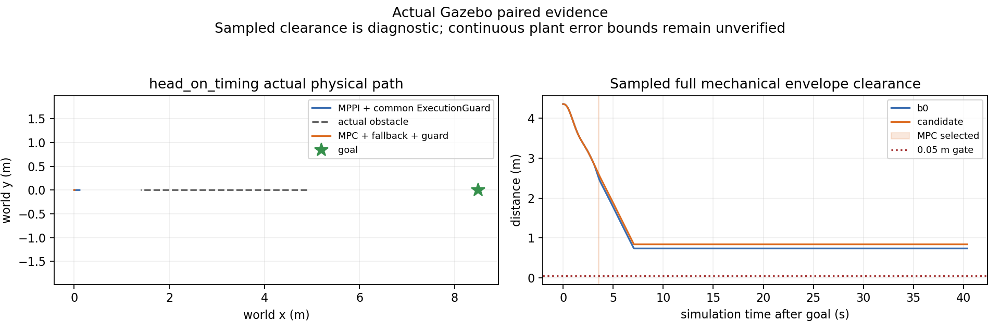

# Worker时序与提案老化诊断结果

2026-10-04，接续ca89b527；[预登记](temporal_mpc_timing_registration_20261004.md)。
本轮补齐请求发布、worker判定、求解、提案接收的身份与时钟证据，并对旧提案做
只读老化分解。新迎面对照没有重现请求时间拒绝，却再次在新状态重锚后发生
未来净空拒绝。两组均40s取消，候选最终命令接收间隔95.474ms超过75ms观察门。
**动态接受与部署冻结仍false，正式默认MPPI保持。**

## 实现和职责边界

新增实验String topic `/temporal_mpc/worker_timing`，schema为
`temporal_mpc_worker_timing/v1`。request/frontend/prediction回调各有唯一callback_id；
duplicate、no causal snapshot和故障silent也记录，不把没有运行QP的回调冒充solver
输出。原solver_diagnostic增加timing_callback_id，原生health增加实际请求publish
前后monotonic、publish时ROS clock、request epoch及proposal接收monotonic。
原StateRequest、Proposal及公共预测wire格式不改。

worker保持原来的map frame、非未来、age≤100ms门，拒绝原因拆成future/stale/frame。
原始请求13个字段记录有限值，非法值明确null。另修复非法stamp异常后的诊断
重复解析：现在保留nullable epoch，不再在catch之后再次解析而中断诊断；不接纳
非法输入。QP、有限候选、TTL、几何、原生validate及重锚/停止尾、共同保护与
selector行为不改。T-DT仍在控制周期外提供静态路径/认证走廊，MPC只做短时局部
控制；双插件IDs及上层NavigateToPose接口保持。

安装的Humble rclpy executor只向subscription callback传一个msg，没有可用的
MessageInfo，因此DDS source/received时间明确null，未伪造。跨进程monotonic仅
在同一Linux主机/容器比较；ROS clock用于输入age。publish开始到callback包含
传输、executor排队及clock回调顺序，不能唯一拆成各自时延。callback_body截止
timing序列化/发布之前；40ms core门仍截止proposal发布之前，两个指标分别报告。

## 工程验证

主机和Humble均通过128项完整测试，再通过最后新增的2项时序join审计测试；
无skip。Humble旧pytest对pythonpath配置有一条警告，运行使用显式PYTHONPATH。
原生插件构建成功；受控ROS clock的实际DDS/worker检查8项全部通过，覆盖错误
frame、未来2ms、超过100ms一纳秒、恰好100ms、duplicate、silent、no causal
snapshot，以及真实T-DT+QP的完整发布时序。该fixture使用空预测，是合同工程检查。

真实Humble Nav2/BT的原14类故障门、MPPI↔MPC切换、SpeedLimit恢复、worker
SIGKILL后独立制动、唯一publisher及有界输出全部通过。活跃输出最大间隔56.302ms，
native compute max0.234ms。跨action会话总体间隔187.285ms保留，不能算活跃任务
连续性。部分故障由selector先接手，不能声称每例实际执行了原生制动。

## 一次新迎面配对

输出目录`build/temporal_mpc_timing_20261004`；B0→portfolio各一个全新禁网容器，
双方都strategy=portfolio以匹配shadow负载。open_long、goal(8.5,0)、sim10s发目标、
40s取消、完整D=1.697056m及全部预算/几何保持。先完成B0的CDR、源TF、目标前
状态及原校准联合进入门，再启动MPC；运行期间没有并发重审计。无调参或重复挑选。

| 观察项 | MPPI＋共同保护 | MPC＋MPPI回退＋共同保护 |
|---|---:|---:|
| action结果 | 取消/40s | 取消/40s |
| 正Contact消息 | 0 | 0 |
| 采样完整机械包络最小净空 | 0.737290m | 0.840517m |
| 诊断sweep下界 | 0.682290m | 0.785517m |
| 实际MPC计算通过/次数 | 0 | 1/1 |
| 最终命令接收最大间隔 | 69.219ms | **95.474ms** |
| Controller命令接收最大间隔 | **82.702ms** | 64.697ms |
| 共同保护实际发布最大间隔 | 53.879ms | 53.586ms |
| worker core最大耗时 | **51.904ms** | 39.687ms |

B0的一个worker shadow周期触发40ms截止拒绝，保留该失败；候选没有这个拒绝。
所有已优化候选共享预算观察门通过，最多3项、390迭代，solver调用合计最大
3.823/5.553ms。共同保护tick到输出max5.365/5.658ms，nominal missed slots均0。
实际发布节拍、命令接收间隔和core耗时属于不同指标，不据此声称硬实时。
候选95.474ms接收空档附近保护生产仍每约50ms发布，但命令无生产序号，不能唯一
区分传输丢失、延迟与采集调度，更不能称执行端已连续。

两个run的源码逐文件、启动前实际binary/dependencies及SDF/Nav2/tracker/bridge
配置一致。新native hash为`147ae6bc66ff90511098bdc8d464cfbf82012cf72b88f929377345511b558973`；
frontend仍为`daa5069041ebb22075f6e7ef94271940a8397e295f40a5378dcf37a55d7e587a`。
当前模型在612+610个目标后源采样及32+19个确切native几何epoch均未排除目标
位置容差区；这不证明连续时域路线可行。采样零Contact和正净空也不是连续安全证书。
MPPI内部随机seed未固定，单次物理差异不能作为统计净收益。

## 请求与提案时序

| 观察项 | B0 shadow worker | portfolio worker |
|---|---:|---:|
| 请求callback/与producer精确join | 1000/1000 | 998/998 |
| 严格时钟分类current | 1000 | 998 |
| 本地请求signed age最大值 | 13ms | 16ms |
| publish开始→callback P95/max | 0.812/13.729ms | 0.946/16.818ms |
| proposal发布→native接收已join数量 | 997 | 995 |
| 已join提案接收P95/max | 0.283/0.818ms | 0.279/0.492ms |
| callback body最大值 | 52.383ms | 39.981ms |
| 周期外frontend body最大值 | 173.682ms | 439.626ms |

共1,998次请求分类、原始测量字段和solver身份核对无错误；1,992次提案接收join。
没有可join的6项不补造，也不据此断言DDS丢包。双方各2项请求区间与记录的
frontend回调重叠，重叠只解释已知阻塞的一部分；QoS深度1与采集覆盖不允许从
observer数量差推算完整队列时延。本轮future/stale/frame均0，不能反推旧迎面
portfolio那次模糊`state request stale/frame`的真实原因已确定或已修复。

候选sim13.518s选中MPC，13.569s回MPPI，实际执行1个通过周期。sim13.565s
shadow检查的是proposal13.515s、旧source13.465s、新source13.531s；终态step30
slack=-14.953267mm。对应请求是current，QP曾运行，不能归因本轮时间合同拒绝。
health在observer的接收比selector晚0.102ms，作为相关事件保留，不伪造因果切换时延。

在同一native评估epoch的2×2重验中，旧测量＋旧预测为+56.979820mm，旧测量＋
新预测为+54.727613mm，新测量＋旧预测为-12.701103mm，实际二者更新为
-14.953267mm。新测量delta约vx+0.049288m/s、vy-0.003609m/s。该反事实显示
本次余量主要对新测量重锚敏感；它不是传播后的plant，也不是唯一可加原因。

## 提案年龄与停止尾

新只读`audit_proposal_age.py`对旧4个run的63个动态记录及新2个run的29个记录
全部精确复算实际slack，无错误。保留以下不同检查：原worker epoch/轨迹；相同
旧初态和控制网格但推进公共模型到native epoch；移位而不修停止尾；完整native
移位/速度与停止投影；实际新测量与新预测。相对网格仍1.5s，不补过期输入。

旧横穿single的代表性实际拒绝（proposal age19ms）：原worker余量+10.552437mm，
推进模型而保持原相对控制为+6.881221mm，移位不修停止尾为-0.463964mm，完整
投影为-0.308216mm，实际值相同。原始移位终速19mm/s不满足停止，不是可执行
替代方案；停止投影略改善余量，这次主要损失在控制移位。

旧横穿portfolio（age50ms）从原worker+43.004946mm，经旧输入完整native移位
为+9.510960mm，再由新预测变为实际-2.661158mm。新迎面候选（age50ms）从
原worker+88.960764mm，经模型推进+64.049321mm、未修停止尾移位+56.440530mm、
完整旧输入投影+56.979820mm，最后新输入为-14.953267mm。未投影移位终速50mm/s，
仍不可作为控制提案。不能将这些不同epoch/反事实差额写成独立可加因果分解。

## 证据、保留与后续边界

新物理记录共36,961条CDR及1,522条源TF核对通过；2,143个共同保护周期、51个
native状态及worker输入join、29个动态余量重放全部匹配。旧数据分解有独立
输入hash/谱系，旧失败和历史证据不覆盖。完整JSONL无损gzip、所有原始日志、
工程fixture、初次/最终测试、预启动源码和实际二进制保存于
[manifest](evidence/temporal_mpc_timing_20261004/manifest.json)，
[独立完整性复核](temporal_mpc_timing_integrity_20261004.json)。140文件＋manifest，
22,143,632bytes（不含manifest）、8条完整JSONL.gz流共68,032行，hash/gzip/JSON
及历史输入谱系全部通过。
源码/文档空白检查通过；原始日志的27项空白/EOF问题单独保存在
[空白复核](temporal_mpc_timing_whitespace_20261004.json)，原日志不修饰。
完整采集和子进程清理阶段保留rclpy context失效的RCLError traceback，含候选
worker在shutdown后发布timing的异常；不改已冻结运行实现或重跑物理试次。

独立分支仍直接从main@d735ee12派生，正式src无diff；原工作区dirty文件、原分支
和冻结refs均核对保留。没有push、merge或部署。

下一阶段优先处理新测量重锚下的执行误差余量与共同输出最坏负载，而不是盲目
放宽时钟门、缩小几何或增加候选数量。需要独立标定短时响应/误差包络并注册
新配对；时钟拒绝只有在新的确切证据出现后才讨论有界等待。Scenario/Chance
仍需真实分布及几何支持校准，本轮不提供这些资格。
