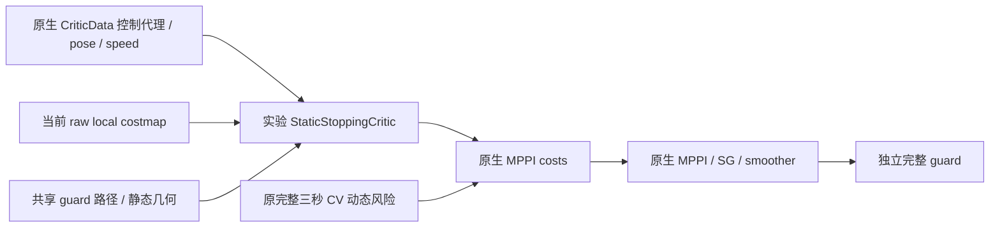
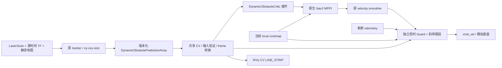

# CV DynamicObstacleCritic 第一版

本页保留第一版模型定义；后续诊断与实验遵循
[第二阶段计划](stage2_plan.md)，结果保存在[进度记录](stage2_progress.md)。
guard 诊断新增源时间戳、测量/提案速度、拒绝响应分支、未来 pose、reserve
和第一个拒绝的 raw cell；这些字段描述该次消费检查，不代表 MPPI 最终候选。

`experiment/static-stopping-critic` 在 `91d7eda` 之后另行增加静态刹停目标，
没有并回 feature 或 main。它从原生 CriticData 读取候选控制代理和测量
pose/twist，通过共享guard静态检查向原生MPPI costs增加0/10000成本：

该静态critic不发布TF、目标或底盘命令，也不依赖tracker内部。
SG/smoother发生在评分之后，所以候选代理不是最终命令安全证书。
完整假设、失败试次、性能优化和回滚见
[静态停止实验](static_stopping_experiment.md)。

后续独立 `experiment/map-uncertainty-stopping` 只在停止critic当前地图
检查中增加可选规划预留（默认0），新配置选择0.11m。独立guard原判据和
TF所有权不变。观察器记录源时间扫描供离线核对，运行模型不读真值。
其依据、边界和验收见[地图不确定性实验](map_uncertainty_experiment.md)。

地图硬预留对照任务失败后，`experiment/soft-map-clearance` 单独验证沿
提案停止路径累计的连续预留成本，原reserve/raw203硬目标及运行guard
保留。可选nearest查询仅用于该规划目标，默认guard witness仍是原顺序
的第一个拒绝单元。详见[连续间隙实验](soft_map_clearance_experiment.md)。

`experiment/visible-box-geometry` 在tracker包内增加未接入node的纯几何
观测原型与离线审计。点成员/射线索引保留不改变原质心聚类；中心与全
几何仅为条件拟合，无返回/遮挡/单面/混合点簇仍有拒绝或失败，公开v1
继续表示可见质心/extent。运行critic不依赖此原型或tracker内部类；TF
唯一所有者与source-time契约不变。见[几何实验](visible_box_geometry_experiment.md)。

该功能只存在于从 main 创建的 feature 分支，默认关闭。正式比赛启动和参数文件不加载它。当前兼容和验证目标为现有固定 Humble 镜像的 Nav2 MPPI 1.1.20。

## 输入、坐标和时间

只使用原 `rm_competition_interfaces/DynamicObstaclePredictionArray`，不引入第二套 tracker 公共数据结构。源 header.stamp 是扫描/状态时间，position/velocity/size 均为 `map` 平面的米和米/秒；last_observation_stamp 是最近真实观测。`processing_stamp` 只用于诊断，不能替代源时间。

| 边界 | topic/type | frame / 意义 |
|---|---|---|
| tracker输入 | `/scan` sensor_msgs/LaserScan；`/map` nav_msgs/OccupancyGrid | 仿真 scan sensor frame 经源时间 TF 转 map；实车可用原 `/local_scan` |
| 动态状态 | `/perception/dynamic_obstacles_shadow/predictions` DynamicObstaclePredictionArray | schema v1 / authority shadow_only，固定 map 世界 frame。试验消费者显式接受 shadow 消息，不代表 tracker 获比赛授权 |
| 当前环境 | `/local_costmap/costmap_raw` nav2_msgs/Costmap | odom，原 0..255 raw cost，不使用未来轨迹烘焙地图 |
| MPPI内部评分 | 原 `CriticData.trajectories` 与 `costs` | local_costmap global_frame=odom；无 wrapper、无 upstream patch |
| 平滑后提案 | `/dynamic_test/cmd_vel_smoothed` geometry_msgs/Twist | base_link body-frame twist，仅 experimental Nav2 范围 remap |
| guard pose/speed | `/odometry/lio` nav_msgs/Odometry | odom / child=base_link；新鲜源时间和真实测量速度 |
| guard输出 | 默认 `/dynamic_test/cmd_vel_guarded` Twist；显式仿真 launch输出 `/cmd_vel` | 最后安全层；Nav2和recovery输出先经过原 smoother，底盘只订阅 guard输出 |
| 可视化/日志 | `/dynamic_critic/predictions` MarkerArray；`/dynamic_critic/diagnostics`, `/dynamic_guard/diagnostics` DiagnosticArray | CV未来轨迹以 odom 显示；原 tracker markers 仍以 map 显示 |

map 和 odom 是世界平面坐标；允许它们之间使用**最新且有年龄上限的平面定位修正**，默认 `max_tf_age=0.1s`；静态 TF stamp=0 不受动态年龄限制。所有预测先在 map 外推，再用同一个修正变换到当次 rollout 的 odom frame；速度方向由同一旋转正确处理。没有每个未来步不同 TF，没有对缺失 TF 的无限等待。错误/过期/未来/非平面修正失败并制动。该模型要求两世界坐标间修正在一次评分/短安全窗内可视为固定；定位跳变仍需既有比赛完整性安全门，不能把此插件当作定位防护。输入 `input_frame` 可配置为另一个明确的世界平面 frame，不接受含时变本体运动的 sensor/body frame。

默认源消息、最近观测 timeout 各0.4s，确认/短暂coasting轨迹均消费；tentative仅由当前 costmap处理。完整性、总数、ID重复、finite xy/vxy/size、大小/速度界、观测时间、非单调源时间、同 ID 位置跳变均验证。新坏消息覆盖旧缓存，不能继续沿用旧速度；critic 设置 MPPI fail_flag，guard输出零。新鲜完整空数组表示 tracker当前无可靠动态目标，仍执行普通 costmap检查；停更空数组也会过期。原接口没有 covariance/confidence，第一版没有人为制造概率字段。

## 预测时域和 cost

物体 i 在源时间 s 的估计为 p_i、v_i。评价时刻 n，年龄 a=n-s。第 k 个积分后 rollout 状态对应 `t_k=(k+1)*model_dt`，所以

`p_i(k) = T_map_to_odom [p_i + v_i (a + (k+1) dt)]`。

Humble原生 rollout第一列已经积分 dt，不是 t=0，故索引+1；当前 pose单独由guard在 t=0检查。第一版30×0.1s，完整3s。初始化核对 YAML prediction_horizon=MPPI time_steps×model_dt，score再次核对实际 tensor列数/dt和消息网格，任何不一致失败，绝不截成旧1s。tracker显示配置也设30×0.1、衰减tau=0；critic不会使用可能来自旧衰减模型的prediction[]，总是重算 CV。源年龄另计，最长外推为3s+≤0.4s，不允许无限外推。

使用 costmap真实 padded凸多边形 P_j(k)。障碍半径 `r_i=max(minimum_obstacle_radius, hypot(size_x,size_y)/2)`，默认minimum=0.36m。点在机器人多边形外时 clearance为最近边距离减radius；点在内则负最近边距离减radius。时间步clearance d_jk为全部confirmed/coasting障碍的最小值。

设影响距离 R=0.4m、额外安全裕量 m=0.02m、碰撞比例 λ=10000、weight w=1：

`phi(d)=w * [max(0,(R-d)/R)^2 + λ * max(0,(m-d)/m)^2]`

`C_dynamic(j) = dt * sum_k phi(d_jk)`。

这是两个连续平方 hinge。d≥R为零；接近时渐增；越过安全裕量后快速增长；实际 padded接触d=0时每秒密度至少约10000。无一票硬相交打平、无概率包络、无CA、无candidate rerank。其它七 critic和原采样/正则/温度/加权/SG保持原值，动态cost直接加到原数据 costs。

实验继承main padded footprint=body矩形每轴±0.03m，再要求动态clearance>0.02m；正式验收始终独立计算实际本体≥0.05m、padded>0，而不是拿此半径模型替代真实几何。可见簇不是完整物体中心/尺寸，0.36m默认下限仅为本仿真箱体量级先验，不能证明所有遮挡情形或真实障碍均被包住。

## 独立安全层

guard每50Hz对最新平滑命令作有限时域模拟：先将新鲜odometry在测量twist模型下推进到当前评价时间；检查两个响应分支：已测运动在response_delay后减速到零，提案命令保持horizon=0.5s后减速到零。每分支使用精确平面body twist积分，线减速1m/s²、角减速2rad/s²，模拟dt=0.02s；**检查完整刹停尾段**，不会把刹停截在0.5s。满步相对运动距离作采样间隔reserve，当前t=0也检查。max_simulation_steps=512限制计算预算，所需完整尾段超出预算时直接brake，不截短后判safe。

同一公共 CV、障碍消息验证、frame转换和 polygon-circle 几何供 critic/guard使用。guard另外检查 raw costmap所有相交/邻近cell（包括多边形内部），raw≥203、255 unknown或地图外均阻止通过。命令越原bounds（vx[-.5,.8], |vy|≤.5, |wz|≤1.2）、非平面/非finite、数据过期或wall watchdog均输出零。使用wall timer和消息到达wall年龄，ROS时钟停住仍会制动。

guard仅pass/brake，不找路径、缩放命令或选择candidate。两个响应分支不等于所有底盘瞬态的包络；减速能力/延迟、定位误差、未来CV准确度和执行者接受零命令都须硬件确认。零命令不是物理瞬停，因此保留测量动量的刹停检查和独立实际物理真值验收。当前costmap消息必须是fresh full raw map；该实验profile提高发布率5→10Hz用于独立guard数据新鲜性，正式main原文件未动。

## 诊断解释与原研究关系

critic日志中的minimum clearance/TTC属于**动态cost最低的rollout**，不是MPPI综合分首选，也不是加权/滤波后实际输出。dynamic_cost_min/max为该batch的新增贡献范围。guard诊断检查的是实际最终提案。两者不混称控制证明。预测markers只是可视化，绝不写未来路径到costmap。

旧研究 late cycle40 有三秒、实测首速度和SG历史下的零控制安全见证而原300条全不安全，仍为历史 sampler覆盖失败证据；新代码没有采集完整raw控制/SG历史，因此新闭环不能仅凭停顿就归因sampler或optimizer。新guard零命令测试是短时模型测试，不冒称取代旧三秒native见证。原研究证据通过封存tag完整可恢复，不需移入新产品包。
