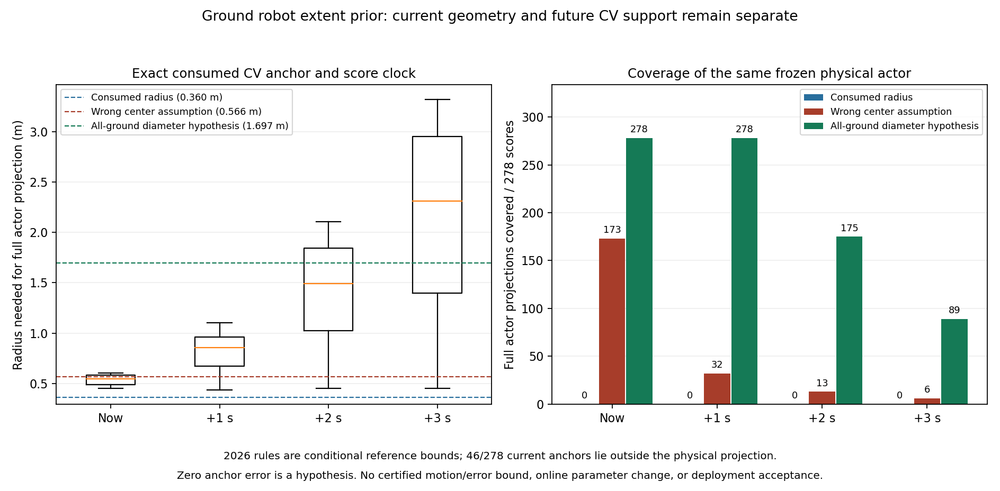

# 全部地面机器人尺寸先验：离线契约实验登记

2026-10-02，用户明确覆盖全部地面机器人，并提供2026 V2.0.0制作
规范作参考。继精确Dynamic消费/原生SG/三秒条件证据后，下一阶段使用
独立`experiment/ground-robot-extent-prior`分支。先离线审计，无在线参数
或公共ROS接口变更；与当前消费证据试次不混合调参。

## 固定问题与数学边界

手册§2.4/S94/S96/S98/S113明确收纳和任意机械状态的伸展尺寸不同，
并包含裁判系统及支架。步骤见[源文件审查](robot_extent_manual_review.md)。
步兵/哨兵平面L/W≤0.8m，英雄≤1.2m；工程可选1.2×1.2m矩形条款或
直径1.5m球体条款。若只知道目标属于这四类2026规则下的机器人，
完整机械投影的直径上界可取`hypot(1.2,1.2)`≈1.697056m，能涵盖
工程球体分支。该上界不依赖规则矩形以外的真实形状或未知朝向。

已知矩形几何中心才可使用半对角线。对任意确属于该物体凸包的锚点q，
任意投影点p与q距离≤直径D（凸组合和三角不等式）；不规则形状也满足。
对任意测量锚点q若另有到该凸包距离的可信上界e，则半径D+e才提供
当前包络。滤波可见质心不是已知矩形中心，也未自然满足e=0。

这项界限是**2026规范条件**，不自动证明2027规则、所有实际目标合规、
分类正确、抓取物/外载物也包含在机械尺寸内、完整物体已被扫描或已知
运动界限。空中机器人、飞镖、场地设备、非机器人不在先验范围；不能
将validation `max_extent`或`max_speed`当成真实物理尺寸/速度认证。

## 运行前登记

1. 用独立纯几何工具表示来源/目标类别/球体或矩形条款/锚点含义/
   明确测量偏移界。未知类别仅能在已限定全部四类目标条件下用最大
   直径，分类信息不能来自仿真SDF真值注入在线。
2. 对旋转的任意不规则点集、凸包锚点、非中心表面锚点、超出凸包的
   测量点和非finite/负误差界，使用独立标量计算检验直径包络；保留
   半对角线放在表面点导致漏覆盖的反例。
3. 针对已冻结的9f73d72实际消费trace，只做离线假设对照：现有radius、
   0.8m规则的半对角线（明确为错误中心假设负对照）、全部地面机器人
   直径包络。锚点误差按明确假设给出，不用真值挑选online参数。
4. 保持同一消费字段、CV速度、source_age、score时刻和map/odom修正，
   审计scoreclock+0/1/2/3s完整物理支持。真值仅离线给支持/锚点误差
   标签。分别报告当前几何和未来CV失败，不能以半径变大抵消未验证的
   最大速度、旋转、变形、换向或隐藏尺寸契约。
5. 若得出有帮助的当前尺寸条件，先文档化公共接口中position/size/
   uncertainty的物理含义与unknown退化，再讨论显式在线profile；本阶段
   不改tracker、critic、sampler/optimizer/SG、guard、TF或main，不恢复
   CA/ranking，也不降低固定验收门。

保留全部源/参数/规则文件身份、完整结果、反例、失败和可复算脚本。
此登记不将先验提升为物理执行安全证书。

## 实现、固定数据与结果

920ce39先登记；离线配置`ground_robot_extent_prior_offline.yaml`包含四类
目标、2026来源身份、工程两种尺寸条款和排除范围。纯几何工具
`robot_extent_prior.py`要求调用者明确给出锚点到物体凸包的误差界e，
没有默认e=0、未知目标自动套用或在线订阅。未知类别只在列明四类
范围内取最大D。8项测试通过，包含seed=20261002的5000组旋转不规则
点集/凸组合锚点/显式偏移，以及半对角线漏覆盖、非法误差/范围、尺寸
溢出的反例；1e-13仅为几何单元测试浮点舍入余量，不改物理验收门。

分析引用9f73d72实际消费试次的冻结manifest
`5d3385ec5edf33ad8cdd7aebce3359304bc6a9c7b01224b674a757499fb654cd`，
保留全部348次score与实际时钟/age；278次可按原1m规则离线关联
actor，70次无可用目标。以下是同一真值箱体完整投影的覆盖数：

| 离线假设 | score当前 | +1s | +2s | +3s |
|---|---:|---:|---:|---:|
| 原实际消费radius=0.36m | 0/278 | 0/278 | 0/278 | 0/278 |
| 错误的800mm矩形中心半对角线≈0.565685m | 173/278 | 32/278 | 13/278 | 6/278 |
| 全部地面机器人D≈1.697056m，明确假设e=0 | 278/278 | 278/278 | 175/278 | 89/278 |

最大所需半径在当前/1/2/3s分别为0.606277/1.103596/2.105239/
3.321785m；D假设在3s的最大支持缺口仍为1.624729m。当前覆盖改善
不能证明CV换向/转动误差被规范上界约束，也不能借这一箱体的真值
挑选在线半径或运动界限。

46/278个**已按实际source_age外推至scoreclock的CV锚点**位于当时
actor投影之外，最大距离0.012314m。这是本夹具的离线经验标签，
不是扫描源时刻的质心误差认证或可以上线的e。即使大圆在这些样本
覆盖了完整物体，e=0的数学前提仍未成立；滤波、年龄外推、遮挡、
关联错误各自的界限仍未知。



## 归档与独立复算

独立25文件归档`stage2_evidence/ground_robot_extent_prior/`含冻结源码、
配置、结果、图示、环境/反例测试日志，引用原物理和手册审查manifest。
首次绘图的Matplotlib 3.6.3不支持`tick_labels`错误保留，改用本机支持
的`labels`后最终图已完整视觉核验。active历史CV审计只增加显式可选
几何输出；默认报告SHA仍为
`16831aa4a3739ef5bbab9ff120827653db4f477b96e51c48370fcbfcbcb64f25`。

```bash
python3 -B src/rm_dynamic_obstacle_critic/tools/replay_ground_extent_prior.py \
  docs/dynamic_obstacle_critic/stage2_evidence/ground_robot_extent_prior \
  /tmp/ground_extent_prior_replay_new
```

重执行8项几何测试通过；报告、PNG、SVG和历史默认CV报告共4项
逐字节复算一致。独立verification保存在
`stage2_evidence/ground_robot_extent_prior_replay/`；原25文件manifest不变。
该阶段无运行节点/算法/参数/TF/公共消息变更，main及research封存保持。
原物理试次的任务、raw203和末尾snapshot年龄FAILED，以及综合三秒
见证NOT ESTABLISHED均保留。下一阶段需要先明确公共输入中可见簇、
完整机械包络、锚点误差和未来运动界的不同含义及unknown退化条件。
