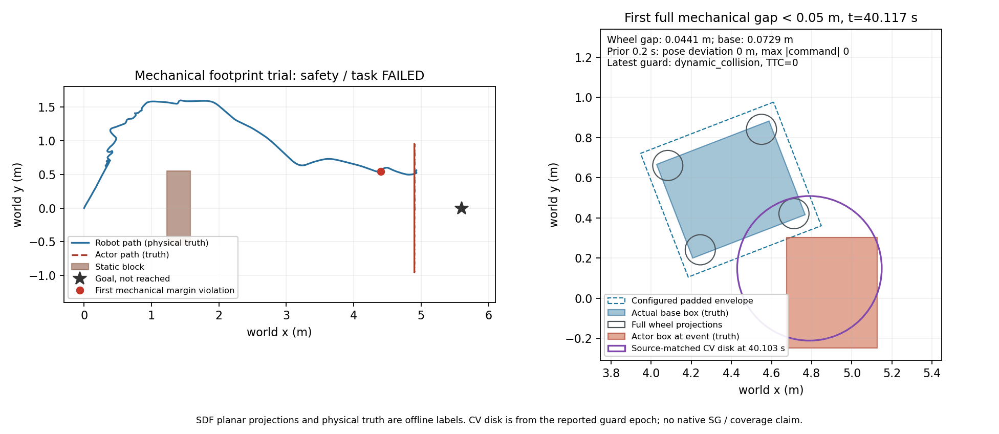

# 仿真机械足迹契约实验

2026-10-02 从 `b92cbe0` 建立 `experiment/mechanical-footprint-contract`。
原因是已冻结SDF的4个轮sphere投影达到x±0.325、y±0.300m，当前
padded足迹x±0.330、y±0.280m没有包住全部轮投影。性能试次中轮子投影
先于base门失败；不是调整阈值或将guard改作避让控制器。

## 执行前的单项变更

新Nav2 profile只把local/global未padding足迹改为完整仿真碰撞投影的
轴向包络矩形x±0.325、y±0.300m。保留原0.03m padding。配套新guard
配置使用x±0.355、y±0.330m；与Nav2实际padded足迹一致。独立验证包络
包含base box及四个完整circle，不能以只检查circle中心代替边界。
旧profile和默认guard参数文件保持；新配置必须在显式实验中选择。

原7个critic参数、完整30×0.1s CV、静态连续目标、sampler、optimizer、
SG、smoother、raw203、unknown/outside、制动/响应参数和时间门不变。
新profile可能改变inflation的inscribed radius及通行能力，是与真实plant
模型一致的几何对照，不宣称控制行为等价。plant尺寸来自已知仿真车体
设计，不从actor真值或未来轨迹注入perception/controller。

只在隔离launch新增guard参数文件选择；默认仍指向旧guard.yaml，只有
enabled=true才运行。试次工具冻结**实际所选**guard文件并记录来源/hash，
不再把未加载的默认文件误当作运行输入。TF唯一所有者、所有topic以及
guard独立pass/brake权限不变；main/feature/旧研究冻结节点保持。

## 独立验收几何

base真实box来自冻结SDF，不能把放大的Nav2配置矩形称作实际base body。
padded门继续检查实际配置的规划/guard包络；另外明确要求完整机械
投影并集的真实gap>=0.05m。二者分别报告。检查脚本仍只离线读取物理
真值，接受SDF的已知plant几何；不是三维engine contact或硬件证书。

保持原目标(5.6,0)、8s周期、相位、35s窗口及3.5s尾段。目标成功、正推进、
完整机械body>=0.05m、padded>0、raw203、输出边界容差5e-5均须满足；
CPU超时和source-age退化照常报告。先核对全部投影支持和配置仅几何
差异、旧审计输出兼容，再运行实际DDS与完整物理试次，保留失败。

观测几何原型仍是离线实验；动态物体未知隐藏尺寸不因自身足迹修复而
获得证书。完整原生候选/SG/最终输出见证仍需收集，不恢复旧混合路线。

## 预运行结果

12项物理几何/解析审计测试通过；完整circle支持检查通过。深层YAML
差异仅local/global两条footprint与guard一条footprint，其他控制及时间
参数保持。实际guard通过GetParameters回读完整所选YAML（加隔离测试
端点/world覆盖），逐值相等；7个实际DDS场景通过。已有镜像离线构建
完成，critic/guard二进制hash仍为b075f94c…/a0d9d0ef…，未改C++或upstream。

旧soft和performance各3份报告语义精确一致，4个PNG/SVG逐字节一致；
原manifest无变化。私有副本新增机械门的probe仍判FAILED，实际base
报告与原精确一致，机械dynamic下界-0.011675m，static下界0.424653m。
该probe只验证审计契约，不是新运行试次或替换旧policy。

初次测试用double集合精确比较0.30+0.03与字面0.33，因1ulp失败；改为
1e-12几何比较，未改线上几何。历史接触报告也揭示顶点遍历顺序使gap
有约2e-17m差异；SDF base解析保持旧clockwise顺序后精确复现。初版
失败XML和测试源码仍留在预运行archive。不会以小浮点差异解释接触。

完整源码、配置、回读参数、DDS及复现脚本保存于
`stage2_evidence/mechanical_footprint_preflight/`。物理试次将在预运行节点
冻结后按上述原policy执行，最终所有门仍需独立审计。

## e3f9b4a 完整物理对照

17.940s启动，52.942s请求取消，保留至56.442s。执行/接线PASS，guard
仍为唯一`/cmd_vel`发布者；目标未到，推进4.928579m，算法整体**FAILED**。
46个运行源文件与e3f9b4a逐文件hash一致；实际选用新guard YAML已冻结。
原native controller/critics与本包critic/guard二进制均与性能试次完全相同。

| 门 / 观测 | 结果 |
|---|---:|
| 实际base动态sample / 插值下界 | 0.022236 / 0.015990m，FAIL |
| 完整机械投影动态sample / 插值下界 | 0 / -0.007206m，FAIL |
| 完整机械投影静态插值下界 | 0.513486m |
| padded动态sample / 插值下界 | 0 / -0.007429m，FAIL |
| raw203违规 | 716/2265，全部fresh同frame，FAIL |
| 最终命令 / bounds违规 | 1925 / 0 |
| 静态critic 1Hz评分中位 / 最大 | 45.030318 / 95.274940ms |
| 整链controller deadline警告 | 43 |

这不是固定随机库的配对因果性能试验；更大自身几何会改变通行域、
inflation半径及地图检查工作量。不能将原13→43警告单独归因某行代码。
34个评分采样批次中11个因共同测量路径全拒绝，20个有不同soft成本，
代理通过数中位147.5；仍不是实际SG/最终输出的coverage证明。

首次机械margin失败在40.117s：后左轮gap0.044073m、base0.072898m。
此前0.2s的12条物理pose完全相同，10条最终命令均0；最新40.103s的
guard已dynamic_collision/TTC0、测量速度0、输出0。40.185s该轮投影
零距，base仍0.031183m；此前命令全0、pose最大变化4.90mm。
首次base<5cm为40.151s，同样此前pose/命令0。包络已包含车轮，但进入
停止位置后的外物侵入问题仍在；guard作为pass/brake没有独立避让权。



当前公共状态431个可用样本在0/1/2/3s完整box覆盖均0/431，源center误差
中位0.223062m、最大0.388727m，3s误差中位1.209583m、最大2.926081m。
首次机械失败时源匹配disk也未覆盖box，但guard已判断风险，不能将此
缺陷说成唯一接触原因。未把truth或模型原型放入在线接口。

活动窗口guard：6 watchdog、1047 clear、137 static、561 dynamic；尾段
117 watchdog、42 clear、8 static、7 dynamic。没有收到goal取消确认的
独立证书。145个static拒绝全部源map匹配、回核无不符；112提案分支、
33测量分支，其中112次当前足迹本来clear。地图在2次完全静止pose上
引入raw违规；不能据此推断某条scan的精确消费或高斯噪声单因。

579条扫描按source-time对齐，5条world/odom严格一致性跳过，158个预期
box缺失finite返回、237个无预期box的finite返回均保留。数据不支持把
所有+inf永久解释为空。旧几何原型继续冻结为离线失败模型。

新gzip archive、14个冻结auditor/复现工具、完整模型/机械/静态/raw/任务
报告与图见 `stage2_evidence/gazebo_mechanical_footprint/`。11份报告和
2个PNG/SVG在私有副本由压缩原始数据逐字节重建：

```bash
python3 -B src/rm_dynamic_obstacle_critic/tools/replay_mechanical_trial.py \
  docs/dynamic_obstacle_critic/stage2_evidence/gazebo_mechanical_footprint \
  /tmp/mechanical-footprint-replay
```

该配置只修复已知self-plant包含契约，尚不能并入main/feature或用于
硬件。后续应采集进入危险停止位置之前的原生候选与输出证据，先明确
动态隐藏几何输入边界；不以此次失败恢复CA/sampler/ranking混合路线。
