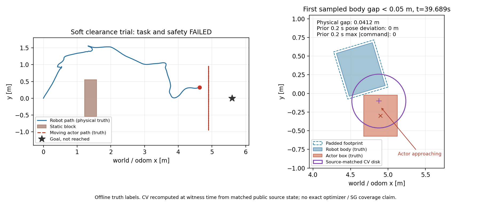

# 连续目标对照后的动态近场失败复盘

本页记录 `234f896` 的单次固定场景失败，不是正式验收、采样覆盖归因或
某一根因的最终结论。全部source-time数据和独立auditor可恢复。

## 已确认的实际接触

新试次推进4.638371m，已进入动态近场，但未到目标。实际body/sample最小
距离0，padded/sample也为0；两项安全门及目标门失败。独立raw203审计
2265个新鲜同frame样本，有755次违规。输出1934条最终命令，越界0。
静态body插值下界0.454572m、padded/static0.424556m，静态几何门通过。
这里body是main的0.60×0.50m矩形（与SDF base_collision XY一致），padded
是其既有padding；不是全机械车轮投影并集或Gazebo三维contact消息。
本轮已在该矩形层失败，后续仍须补齐完整机械碰撞几何的独立审计。

补充SDF投影并集审计已包含base box和4个车轮sphere；动态采样最小值仍0，
首次低于5cm和接触仍由base box触发。全碰撞投影轴向边界为x±.325、
y±.300，既有padded边界x±.330、y±.280未覆盖车轮y支撑。此独立审计
没有改动线上footprint或旧报告；7项离线射线/时间/圆-box解析测试通过。
投影及线性插值仍不等于三维engine contact消息或硬件几何证书。

首次采样body<0.05m发生在39.689s，gap=0.041180m。此前0.2s内12条
真值姿态完全相同，10条最终命令均为0。39.682s的guard诊断已为
dynamic_collision、TTC=0、测量速度0，最终输出0。首次采样body接触为
39.757s；此前命令仍全0，后期物理姿态开始变化。该记录不能用“guard
没有发布停止”解释，也不能据接触后的测量速度反推此前有运动命令。

左图是完整物理轨迹；右图在39.689s真值姿态上，用匹配源消息重算当时
CV disk。真值和模型是不同标签，均只用于离线核对，不进入运行控制。
图及数值可由归档auditor重新生成。

guard是pass/brake层，没有规避控制权；静止位置仍可能被移动物体进入。
因此必须检查**进入该停止位置之前**的规划、状态模型、预测与执行时序，
不能把发布零命令当作动态场景的完整安全证书，也不能让guard兼任planner。

## 模型和输入事实

39.682s诊断匹配到source39.601s、confirmed track2、complete=true，源年龄
及最近观测年龄0.081s，符合当前时间门。对应模型中心(4.877750,-0.106745)、
半径0.36m，实际actor中心误差0.199138m，未覆盖完整box。
这时模型本身已经报告碰撞风险，不能把未覆盖box当作唯一接触原因。

全活动窗口471个匹配confirmed/fresh-coast样本，源center误差中位数
0.233436m、最大0.382961m；当前及1/2/3s disk对完整物理box覆盖均为0/471。
3s center误差中位数1.176944m、最大2.956003m。可见参考点、extent和CV
换向误差仍不能被理解为完整物体支持。真值标签不能注入线上修正这些误差。

新源时间扫描审计接受578条扫描，5条严格world/odom插值一致性跳过。
静态角度内部残差标准差0.010411m，动目标内部0.010936m；所有边界异常、
139条预期box无finite返回及239条无预期box的finite返回完整保留。
其范围、可见性和异步渲染限制不能消失在“高斯噪声”假设中。

## 目标与时间事实

23个停止critic采样批次中19个具有不同连续预留成本，说明共同初态
预留不会总使新增成本打平。通过代理数量中位数242/300，2个批次因当前
原raw测量路径拒绝而全拒绝。以上均不是完整安全控制或最终SG输出的
coverage证据；目前仍缺该版本完整控制序列及精确SG历史。

评分用时中位数53.533705ms、最大93.896106ms。虽然1Hz样本未超过100ms，
完整日志有31次10Hz控制超时，必须以整链为准。活动窗口215次watchdog、
398次动态拒绝、64次静态拒绝、15次stale observation；尾段另计116次
watchdog、15次动态及3次静态拒绝。原CV及MPPI参数和安全门均未降低。

## 后续顺序与边界

1. 以此次接近与停止时间线为依据，查明进入危险停止位置前的有效观测、
   当前物体支持、候选代理和最终输出差别。没有完整三秒/实测速度/SG
   安全控制见证之前，不恢复旧sampler、CA或ranking路线。
2. 在tracker包中先做离线可见面/遮挡/角分辨率/噪声观测模型实验，定义
   何时能支持物体中心与完整几何。单一可见面无法无先验确定隐藏尺寸；
   不改写v1可见质心/可见extent的语义，不在线读取物理真值。
3. 连续静态目标的CPU代价也须修复。性能实验保持成本/硬判据，与几何
   或预测行为改动分开，保留本次失败和超时证据。
4. 从冻结SDF核对全机械碰撞支持。车轮sphere的XY投影超出base矩形；
   不把当前base footprint报告当作完整机械或实车安全证书。

TF仍由原链唯一所有者发布，tracker使用scan源时间变换，critic/guard
只消费世界修正；所有新审计均离线、无命令/目标/TF发布。
结果保存在 `stage2_evidence/gazebo_soft_map_clearance/`。main、feature和
原研究归档不变，连续目标尚不能合入正式配置。

## 等价性能后续试次（独立记录）

2bde116只减少静态几何中不能改进最小值的hypot，完整原生成本对照精确
一致。新试次推进4.967290m、评分中位35.507955ms、controller超时13次，
仍FAILED。base样本最小0.008134m（不宣称base零距），padded零距；后右
轮独立投影先于base门进入5cm并出现投影接触。轮子首次门之前实际pose
和命令均0，后续投影接触前命令0但pose已有3.54mm变化。完整事件和
新图见[性能实验](soft_clearance_performance_experiment.md)，旧报告保持原样。
机械足迹的运行契约与进入停止位置前的候选/最终输出仍须继续修复核对。

## 完整自身包络后续试次

e3f9b4a的新planning/guard足迹已包含四轮全投影，原门不变。新单次
物理试次仍FAILED：base样本最小0.022236m，轮投影和padded零距，目标
未到，raw203716/2265违规。40.117s轮margin失败时base仍0.072898m，
此前pose/命令全0，guard已dynamic_collision/TTC0。修复自身模型包含
关系并未消除进入危险停止位置后的外物侵入；不能让guard兼任planner。
新图、源时间/机械门/时间退化和复现工具见
[机械足迹对照](mechanical_footprint_experiment.md)。旧报告和policy未覆盖。
