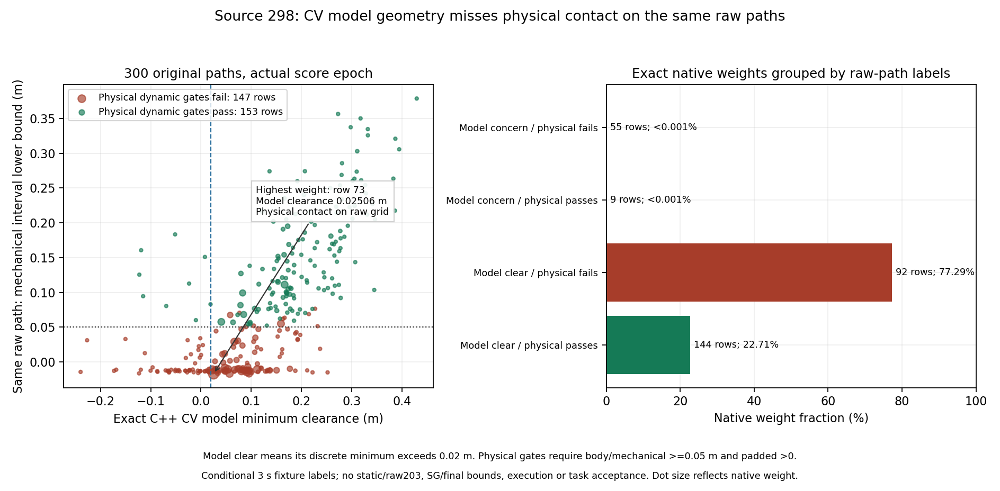

# 原始rollout与实际Dynamic目标：离线审计登记

2026-10-02，从e50b5ee建立`experiment/raw-rollout-objective-audit`。
前序已明确可见簇/完整尺寸/锚点误差的边界；geometry contract只文档化
现有v1含义，不扩展结构或改控制。继续保持全部地面机器人目标范围。

## 审计前固定的问题

前序source298有39/300单条约束/SG安全推进反事实，但成本来自不同
的原始rollout，不能把这些标签直接归因原Dynamic评分。现在只读取
同一source298的实际300×30原始x/y/yaw、已精确复算的Dynamic
double risk/minimum_clearance/TTC、native权重和真实actor标签，检查
原目标对同一路径的动态几何判断。此周期由前序固定规则选出，在看到
本阶段raw标签前锁定，不重新挑最有利周期。

1. 必须先验证原1685文件manifest、消费/native全量精确join、原300
   风险/after位型和实际SG/权重证据身份；保持原300原始路径/首速度。
2. 主标签时间按**实际scoreclock+(k+1)dt**，机器人初值仍是捕获的
   source pose，保留pose源时刻早于score的事实。另报告pose源epoch
   对齐的敏感性，不把任一选择升级为真实执行时刻认证。
3. 每条原始路径覆盖完整3s，初值单列；actor/robot在原0.1s轨迹点
   与完整真值时间并集线性插值，计算实际base、完整机械、padded的
   动态距离及运动间隔lower bound。复用独立几何工具，真值只离线。
4. 对照实际C++CV圆模型的最低clearance>0.02m与物理动态margin
   base/机械≥0.05m、padded>0；保存全部300逐行结果、对应成本/权重、
   highest-weight row，不能以新二值标签替换连续cost或重新排名。
5. 本阶段集中动态几何，明确不做raw203、静态、完整SG序列/最终
   输出边界、执行/目标的安全认证；原post-SG反事实与weighted输出
   证据分开保留。不能仅凭一周期宣布sampler/optimizer负责。
6. 独立几何fixture回归/报告/图示重执行、冻结源码和全部失败；不改
   在线radius/CV/参数、upstream/采样/SG/guard、TF或验收门。

若原始路径的CV模型与完整actor支持不一致，先定位感知/预测假设
缺口；若CV模型在raw路径合理，也需要另检查加权与SG输出同时间的
风险才能研究objective/optimizer。不得跳过现有全trace年龄FAILED、
任务/raw203 FAILED和综合见证NOT ESTABLISHED。

## 固定source298的结果

96bbf4c登记后，重新检查原1685文件manifest和88文件条件见证manifest，
完整348次消费/native join与104400个risk/after位型再由冻结原始数据
复算；完整native权重/SG输出链通过原精确审计。未调用新控制器或
改变任何runtime ELF。只取原300×30原始x/y/yaw，不把post-SG路径
写回raw路径；SDK见证仅提供已核对的初始yaw上下文。

实际scoreclock=48.004s，pose源epoch=47.980s，相差24ms；主标签
3.0000000447s覆盖208个时间点，最大间隔17ms。模型discrete minimum
clearance>0.02m的236条路径，对应完整动态几何条件如下：

| 实际CV模型 | 同一路径物理动态门 | 行数 | 原生权重占比 |
|---|---|---:|---:|
| ≤0.02m，模型有margin concern | 失败 | 55 | <0.001% |
| ≤0.02m，模型有margin concern | 通过 | 9 | <0.001% |
| >0.02m | 失败 | 92 | 约77.29% |
| >0.02m | 通过 | 144 | 约22.71% |

物理门要求实际base及全机械动态lower bound≥0.05m、native padded
动态lower bound>0，含源pose初值与完整插值间隔。不同门不能直接
解释为同一个二值分类器的混淆矩阵。为排除仅因margin阈值/插值reserve
不同而失败，另外保存原30点**真实padded接触**：共131条，其中76条
在CV模型仍>0.02m，获约72.54%权重。这76条和对应权重在pose源epoch
敏感性对照中相同。对齐至pose源时刻，模型clear/物理失败88条，物理
动态通过157条；不能以这4条差异修正实际评分时间或全trace速度门。

最高权重row73（0.05700063705444336）实际Dynamic double risk
0.8915022691153789，模型minimum clearance=0.02506411349235682m，
TTC=null。相同原始路径在完整3s中body/全机械/native padded距离均
出现0；两种epoch标签一致。主对齐的首次padded接触在第27点，
future=2.7000000402s、truth_epoch=50.7040000402s；此点scalar base
间距0.075921m、全机械0.049018m、padded0，已低于机械门，后续base
也接触。该路径是条件反事实，不是实际guard后机器人执行的轨迹；
原试次全物理间距通过而任务/raw203失败的结论保持。



## 独立验证与工程边界

四项既有独立几何回归通过，含5000标量/向量多边形与圆形对照及密集
采样的间隔lower bound检查。另对两种epoch各9000个原始网格姿态
用独立标量插值、多边形和轮圈距离复算：最大差5.551115e-17m，接触
分类完全一致。2e-12仅为标量/向量数值比较量，不降低0.05m、padded>0
或原bounds/raw203门。将row73真实padded网格距离0改为0.1m的负
probe被标量核验以contact mismatch拒绝，不生成通过报告。

34文件独立归档`stage2_evidence/raw_rollout_objective/`（约1.92MB）
包含完整300行两epoch标签、标量证据、依赖闭包源码、图示、原始probe
及日志；初版图中文字超出左面板，视觉复查修正后旧图仍保留。
独立复算运行：

```bash
python3 -B src/rm_dynamic_obstacle_critic/tools/replay_raw_rollout_objective.py \
  docs/dynamic_obstacle_critic/stage2_evidence/raw_rollout_objective \
  /tmp/raw_rollout_objective_replay_new
```

私有目录重执行4项几何回归通过，analysis/scalar/PNG/SVG共4项逐
字节一致；篡改接触的负probe再次拒绝。独立6文件verification位于
`stage2_evidence/raw_rollout_objective_replay/`，原34文件manifest保持
`ddbab89c2904d031f2a5f2fb1efd0d84b34faa3e03df8e50c5fd4534be161e95`。

原始CV评分算式已逐位验证；本阶段证据表明，在明确的fixture/时间/
线性插值条件下，其输入几何/预测支持漏掉同一路径真实动态接触。
可见簇尺寸/锚点偏差与未来CV换向误差尚未单独归因，不据此调整总成本
权重或恢复采样/ranking。后续先检验实际聚合/SG路径的同时间CV风险，
再决定可收敛的几何/预测支持修复。static/raw203、SG/最终边界、真实
执行及目标门未在本阶段重认证；原全trace年龄FAILED、任务/raw203
FAILED和综合见证NOT ESTABLISHED保留，main/research封存不变。
