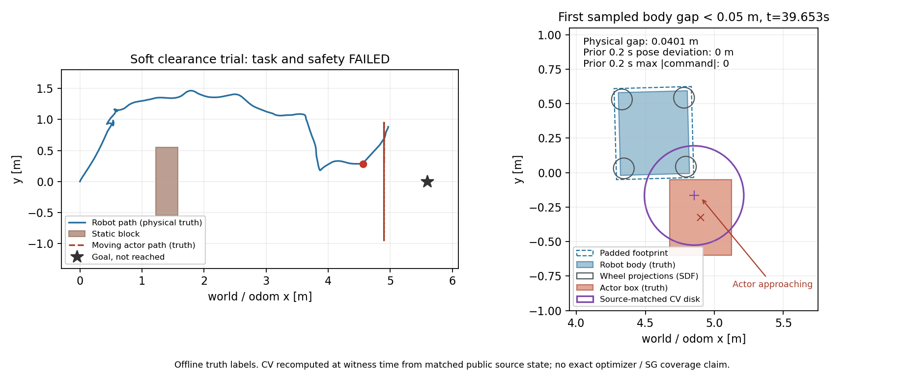

# 连续静态目标的等价性能实验

2026-10-02 从几何离线节点 `5b5f654` 建立
`experiment/soft-clearance-performance`。tracker几何原型仍未接入ROS node；
本项仅处理连续目标CPU开销，运行行为仍使用 `234f896` 的原soft profile。
已有31次控制deadline警告与近场接触失败继续保留。

## 执行前声明

`polygon_box_distance` 对每对顶点/边求投影残差并调用 `std::hypot`。
当前最小距离为d时，残差的L∞范数已经≥d的项不可能改进最小值，可
跳过该项hypot。其余项继续使用完全相同的投影算式与std::hypot，保留
原遍历顺序。polygon-box、circle、map边界、reserve+1e-9、203/255规则、
nearest/first-rejection、guard两条响应路径与成本积分都不改公式。
先只优化polygon-box内部最小值归约；不同时加入候选缓存、合并hard/
nearest遍历、换平方距离或更改观测/预测语义。

在边界、旋转、远近、凸足迹及固定seed随机几何上，与冻结 `2622371`
原实现比较**逐值精确double**及完整map witness；不仅比较容差或bool。
然后用同一原生plugin基准程序分别载入已冻结旧库和新库：固定300×30
输入、同一clipping/初始cost、同一map/pose/速度/参数，比较完整float成本
向量并记录计时。原生采样器、optimizer和SG保持原库。

基准候选是预登记合成输入，不是历史MPPI候选，也不是full3s安全控制
或sampler coverage证据。微基准时间不代替整链控制deadline。若等价
验证通过，再以原17.94s相位/8s运动周期/35s目标窗口/3.5s尾段运行单次
完整物理对照；body>=0.05m、padded>0、raw203、边界容差5e-5、目标成功
和3s CV时域不降低。仍按所有门判断，不把性能改善称为避障成功。

配置、源码/二进制身份、完整成本向量、测试结果、失败及manifest独立
归档。TF唯一所有者不变，没有新增消息、控制权限、运行依赖或真值输入。
回滚到 `5b5f654` 恢复优化前源码；main/feature/旧研究冻结节点不移动。

## 等价预运行结果

Release（-O3 -DNDEBUG）构建通过；17项模型/几何及9项原生plugin测试
实际重跑通过，7个实际guard DDS场景通过。colcon总计65还包括上轮
37项tracker和2个CTest包装，不能把65全部宣称为本轮新测试。
50,000组固定seed距离均为精确double相等；2,000个空/稀疏/密集、旋转/
边界/极大reserve地图，每个检查first与nearest，4,000个完整witness
逐字段精确相等。正距离nearest、clear及outside都有实际覆盖。

同一benchmark ELF分别加载 `/out/soft_perf_before/` 的原库和 `/out/install/`
的新库，实际路径由 `/proc/self/maps` 记录，不以环境变量推定加载成功。
原库SHA256与 `234f896` 物理试次完全相同。固定seed712824、300×30、
std(.2,.2,.4)、前进mean .35、同一padded footprint(.33,.28)、地图mask、
pose、实测速度、默认/硬预留/连续模式以及原初始cost；包括显式clipping/
escape/wait/approach，每组7次计时且先warmup。全部72组、21,600个float
成本在旧/新/旧三次运行逐值精确相等，组内重跑也确定。

| 完整组集合 | 用时旧A / 新 / 旧B（ms） | 旧均值 / 新 |
|---|---:|---:|
| 全部72组 | 6154.966 / 4739.624 / 6157.177 | 1.299 |
| 全部24组soft | 4089.193 / 3026.234 / 4087.329 | 1.351 |
| soft非空mask全部12组 | 2743.084 / 1934.445 / 2738.419 | 1.417 |

soft累计用时降低约25.98%；两次旧库soft总用时差约0.046%。完整组与
逐组时间、全部成本向量保留，不按某个最有利fixture宣布整链收益。
原生MPPI controller/critics库SHA256与既有版本一致。guard新二进制
使用同一等价几何优化，没有新增TF/控制权限或接受域。

预运行证据和精确源码见 `stage2_evidence/soft_clearance_performance_preflight/`。
比较器可从三份JSONL恢复所有成本差异和计时组。正式body/padded/raw203/
目标门仍继承上次FAILED，须另做完整物理对照，不能据微基准改写旧验收。

## 固定policy整链对照（2bde116）：仍FAILED

安装的guard/critic SHA256与预运行一致，原生MPPI两库身份不变。
源文件均匹配运行节点2bde116；SDF在启动前冻结。源时间、TF链、唯一
命令发布者和所有参数保持。17.94s发目标，52.942s请求取消，56.442s结束；
goal status为空，不能当作到达或取消已确认。

| 检查 | 结果 |
|---|---|
| 推进 | 4.967290m，未到目标 |
| base body动态采样最小距离 | **0.008134m**，未达0.05m；样本中未出现base box零距离 |
| base body条件线性插值下界 | -0.002923m，不构成连续安全证明 |
| padded动态采样最小 / 下界 | **0 / -0.011780m** |
| 静态body / padded插值下界 | 0.449624 / 0.419564m |
| raw203 | **636 / 2265**违规，所有样本都有新鲜同frame地图 |
| 最终命令 | 1925条，原边界越界0 |
| 停止critic 1Hz样本 | 27个，中位35.507955ms，最大86.374631ms |
| 完整controller deadline警告 | **13**，尚未消除 |

相对于上一单次试次，评分样本中位从53.533705ms下降，整链警告31→13；
这与微基准一致，但两次物理轨迹不同，不能凭单次闭环数据作精确因果
收益或宣称整链达标。17/27批次有不同连续成本，6个批次因原测量raw
路径不安全而共同拒绝；不是sampler coverage失败证据。
活动窗口guard仅3次watchdog，尾段115次；另有活动窗口555次动态拒绝、
32次静态拒绝、15次stale observation。静态32个witness全都匹配源map，
26次提案/6次测量，单元/距离回核不符0；26次拒绝时当前足迹仍raw-clear。

### 完整机械投影与停止时间线

机械平面投影首次<5cm发生39.619s，rear_right wheel gap0.042832m；
此时base box gap0.064530m仍满足5cm。此前0.2s内12条真值姿态相同、
10条最终命令全0，guard已为dynamic_collision。首次wheel投影零距离
发生39.687s，此时base box gap0.021236m；此前10条命令仍0，body-based
pose travel最大0.003541m，不能称为整个窗口完全静止。该记录是独立
SDF平面投影，**不是engine三维contact消息**，也不改写base box报告。

base box首次<5cm是39.653s，gap0.040064m，此前pose和命令均保持0。
最新可用guard39.634s的TTC=0、测量速度0、最终输出0；source39.535s
confirmed track2、complete=true，年龄0.099s。对应CV center
(4.852918,-0.175516)、radius0.36m，完整actor box未覆盖，中心误差0.170325m。
模型已报告风险，不能把几何缺口当作唯一原因，或把发布停止当作安全证明。

图在39.653s的body门见证上同时显示SDF轮子投影；更早的机械门时间另存
mechanical_contact_audit。新增 `--mechanical-events` 只补充离线事件，不
改变默认body chronology；旧试次和新试次的默认body报告均逐值复核相等。
`plot_contact_witness.py --mechanical` 为可选离线绘图，图已检查，未新增ROS依赖。

481个可匹配confirmed/fresh-coast消息，当前及1/2/3s完整actor支持均
0/481；source center误差中位0.234251m、3s误差中位1.323620m。
源时间扫描审计接受577、严格world/odom一致性缺口7；静态/actor角度
内部残差std为0.010585/0.010425m，全部148个预期返回缺失及195个无预期
box的finite返回保留。原型无返回假设仍缺线上依据。

完整raw日志、10项基础报告、机械时间线、source/binary/installed/scene
身份、auditor快照和manifest保存为
`stage2_evidence/gazebo_soft_clearance_performance/`。所有报告从gzip原始
数据复现，PNG/SVG用明确的--mechanical参数复现。7项离线解析测试通过。
评分优化可以继续作为隔离实验节点，**整体正式安全与任务验收仍FAILED**。
下一项需核对完整机械足迹的运行契约，并取得进入危险停止位置前的原生
候选、SG和最终输出证据；不降低guard门，不恢复旧sampler/CA/ranking。
