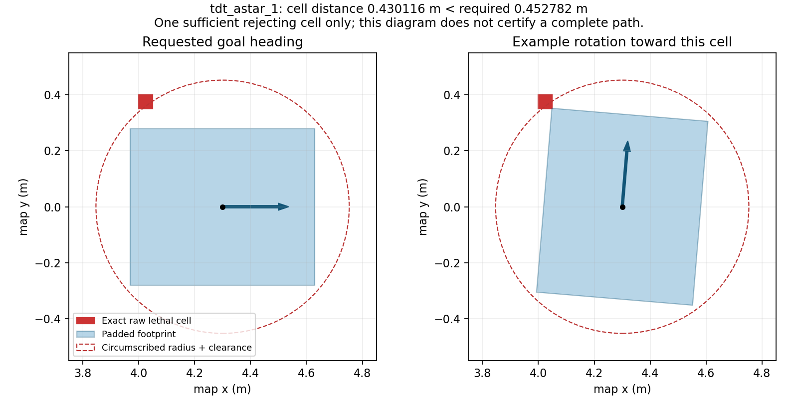

# P2B endpoint_witness_v1：精确端点证据与实际验证

状态：**诊断实现及验证完成；两组 T-DT 均到点，但有恢复，P2B 静态门仍未通过。**
执行日期为 2026-09-15（Asia/Shanghai），中断后在 2026-09-16 完成哈希复核、
离线轨迹图和归档。本轮没有重跑已完成的试次。

## 版本、范围与保存

- 开发基线 `e3b2754`；测试与仿真源码提交
  `25a5a40310afb137845a311a3c38c116b60fab40`，分支 `experiment/tdt-planner-phase2`。
- 由开发者完成实现与验证。工作树、依赖、构建和原始日志均在
  `/home/wpie/worktrees/rm2027_tdt_phase2`；不依赖 `/tmp`。
- 镜像 `rm2027_navigation:humble`，ID
  `sha256:7e864ca17d5329df021ca7be828391491a0c83229b390cdfafac98f41cad1172`。
  无网络、无设备、UID 1000、ROS domain 174、localhost only；未使用实车。
- 四份 profile 与原生成器一致。目标 `(4.3,0,0)`、MPPI、BT、footprint、padding、
  clearance、0.05 m 车体间隙、零恢复门均未改变。
- v2 166 份、此前 sanitizer 保留集 238 份、v4 272 份、v5 438 份和现场三个
  配置/launch 文件全部核对未变。这些集合可能重叠，不相加为独立文件总数。
- 原始目录 `build/tdt_p2b/runs/endpoint_witness_v1`，仅计划两个 T-DT 诊断首例；
  不重跑历史基线，也不将它们填入本系列。两个首例静态失败后均未跑 2–5。
- 汇总 `aggregate_20260915T055011Z.json`，SHA256
  `9b27ad4177540e35fcb76a3a83d6ff80b2a0196702c02ccca03689b72579e3b7`：
  `consistent_and_audited=true`，`complete_20_trial_matrix=false`，
  `all_recorded_static_checks_pass=false`，`accepted_for_deployment=false`。
  2/20 有效、18 项缺失是本次诊断范围，不能表示完成了四组静态比较。
- 原始文件和导出文件由 [manifest.json](manifest.json) 记录。汇总生成后的两张
  轨迹图单独纳入 manifest，旧汇总未覆盖重写。未 push、merge 或部署。

## 实现与检查

[设计与命令](../../p2b_endpoint_witness.md)描述 `endpoint_witness_v1` JSON：在原
碰撞分支中记录一个足以解释拒收的 raw 格子，不重复读取实时地图，不改变谓词。
独立 Python 审计用点到闭 AABB 的距离核对 core 与插件请求，拒绝损坏或缺失证据。
每个被拒端点只记录首个命中格，不声称记录最近格或完整 snapshot。

| 实际操作 | 退出码 | 结果 |
| --- | --- | --- |
| 初次构建 | 0 | 6 个仿真包及实验包构建通过 |
| 初次完整 check | 8 | 58/59；新增测试误用距离 oracle 默认 0.25 m 截断值；[首次失败日志](tests_initial_failure.txt) |
| 修正新测试调用后 build/check | 0 / 0 | 59/59：core 33 + plugin 4 + tools 18 + ROS 4；[build](build.txt)、[tests](tests.txt) |
| profiles | 0 | 四配置哈希不变；[profiles](profiles.txt) |
| 独立 sanitizer | 0 | 统一链审计、单独 solver lifetime、33/33 core 全通过；[审计](sanitizer_chain_audit.json)、[核心日志](sanitizer_core_tests.txt) |
| A* / QP 首例 | 1 / 1 | 记录有效，action 成功，因恢复未通过静态门 |
| 两组精确证据 audit | 0 / 0 | 3/3、9/9 拒收记录全部重算一致，无缺失 |
| summarize | 1 | 已写可审计部分汇总；退出 1 对应矩阵不完整 |

新测试的修正是显式传入 1.0 m 统计上限，比较仍使用 1e-12 精度；没有改规划器
安全阈值或原有验收断言。独立 sanitizer 目录为
`build/tdt_p2b/sanitizer_runs/chain_20260915T054457Z.zdGLhq`，源码 HEAD 已是
`25a5a40`，不存在上一轮 pre-commit 标识歧义。未发现 ASan/UBSan/LSan 报告。
常规检查日志位于 `build/tdt_p2b/endpoint_witness_logs/`，首次失败日志保留。

## 两组实际结果

| 指标 | T-DT A* 首例 | T-DT A*+QP 首例 |
| --- | --- | --- |
| preflight status / 往返 wall ms | 6 / 22.805 | 4 / 46.735 |
| 导航 action status | 4 | 4 |
| 有效证据 / 静态门 | true / false | true / false |
| 恢复次数 | 5 | 10 |
| 最终位置误差 m | 0.143168 | 0.088114 |
| 最终 yaw 误差 rad | 0.052059 | 0.157184 |
| 车体采样最小间隙 m | 0.164540 | 0.143122 |
| 线性位姿插值车体下界 m | 0.163443 | 0.130756 |
| padded footprint 采样间隙 m | 0.125408 | 0.100845 |
| cross-track RMS m | 0.023790 | 0.058026 |
| 精确端点拒收 / 更新拒收 | 3 / 2 | 9 / 0 |
| 仿真 / wall 秒 | 16.538 / 19.430 | 30.774 / 34.462 |

两组到点、朝向、采样/插值几何和新鲜停止命令门均通过，**只有 no_recovery=false**。
A* 的两条 snapshot 更新拒收分别在仿真时间 6.020 s、9.723 s，第一条对应
preflight 失败；既有 observer 随后仍发送 NavigateToPose，行为未更改。
这只能证明日志观测到拒收，不能替代所有并发更新场景的安全验证。

本轮只新增诊断，没有改变导航行为。与 v5 的失败终态不同，不能把本次到点或恢复
次数较少归因为性能/算法修复，更不能从各一次样本推出可靠性提升。
2–5 次仍停止，未为凑满矩阵重试。

## 已确定的几何原因

[ A* 精确审计](tdt_astar_1_witness_audit.json)与
[QP 精确审计](tdt_qp_1_witness_audit.json)中共 12 条记录均为：

- 本次请求起点通过原检查，固定目标 `(4.3,0)` 被拒。
- 足以触发拒收的是 cost=254 的非边界格，其世界闭方格约为
  `[4.00,4.05] × [0.35,0.40]` 或 `[4.00,4.05] × [-0.40,-0.35]`。
- 目标到闭格距离 `hypot(0.25,0.35) = 0.430116263 m`；要求为
  `0.432781708 + 0.02 = 0.452781708 m`（另有 1e-7 数值保护）。
  差约 **0.022665445 m**，所以原碰撞判断正确拒收该 snapshot 下的目标。

这些是**实际规划输入中的闭格证据**，不是前后两帧发布 OccupancyGrid 的推测。
它确定了这 12 条端点拒收的直接原因，但不解释所有恢复，也未追溯致命格形成的
全部传感器/更新细节。不能把几何冲突归为 QP 求解器错误或当前设备算力不足。

姿态分析见 [A*](tdt_astar_1_contract_analysis.json)、
[QP](tdt_qp_1_contract_analysis.json)及下图。对于记录的单格，目标 yaw=0 时 padded
矩形与该格相距约 0.07 m；将同一矩形旋转到约 1.48743 rad（北侧格示例）会与它接触。
因此，单一朝向能容纳矩形不等于当前无约束旋转的圆模型可行。此处也不证明矩形
在完整 costmap 中可行，更不代表实物碰撞；理想仿真墙与栅格闭方格是不同几何输入。

只要某次 snapshot 的目标圆已碰撞，保留同一几何约束并增加 A* 搜索或 QP 优化，
无法得到包含该精确终点的合法路径。当前应处理终点几何合同，不应取消终点检查、
缩半径、悄悄平移目标或将恢复计数排除出验收。

## 人工复核与边界

已查看两组[实际 A* 轨迹](tdt_astar_1_trajectory.png)、
[实际 QP 轨迹](tdt_qp_1_trajectory.png)：均绕南侧墙体到达目标附近，QP 在终点附近
有更明显的位姿变化。历史 plan 叠加最后地图只供观察，不能视为同一 snapshot 的
碰撞证明。两组 fixture spawn 标记存在，记录 pose gap<=0.0400001 s、scan gap
0.067 s、odom gap<=0.0200001 s，无时钟倒退；新增图不改变原始 JSONL。

本次未重新执行全运行期 TF owner 审计，v5 的 TF 图仅保留为历史证据；未运行
移动障碍、完整 LIO/双 STVL/MPPI 负载或实车。未测全系统 CPU 峰值，不作性能
淘汰结论。2026-09-16 只读确认本系列没有遗留运行容器。

2026-09-15 最后的附加轨迹绘图操作被自动审批服务因额度限制拒绝；当时两个
仿真均已完成，代码、JSONL、汇总和端点几何图均在 /home。2026-09-16 用户要求继续
后，先检查文件确实不存在，再新增轨迹图和本报告；未覆盖旧输出。

## 下一开发项

精确拒收证据这一项已完成。下一步先做**离线姿态相关终点连接的可行性与约束
设计**，保留原始目标和完整 footprint；详见
[终点合同设计](../../p2b_terminal_contract_design.md)。该设计尚未接入 Nav2/MPPI。
在控制器执行边界明确前，当前圆模型和失败拒收继续保留，不能宣布 P2B 通过。
规划迁移到可部署候选的工程阶段估计仍约 55%，不是成功率或剩余工时比例。
