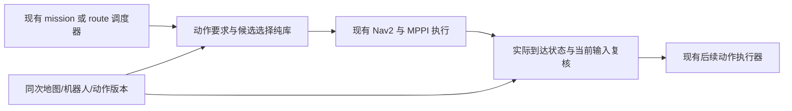

# P2B：由后续动作定义终端可行性与自动选点

> 2026-09-21 状态更新：**暂缓实现 terminal selector。** 新车八边形参考模型下，当前
> nominal goal 的普通停车和静态完整 Spin 均可行；先处理剩余 snapshot 拒收/恢复。
> 本设计保留为后续通用能力，不用于补偿旧车型几何造成的 endpoint 假阴性。
> 详见 [新车几何审查与真实回传](p2b_new_car_geometry_review.md)。

2026-09-16，设计基线 `9f943c3`。**本文件是新阶段设计；选择器、动作 provider、
运行时终点合同均未实现。** 已冻结的 [航向 A/B](evidence/heading_follow_20260916/validation_20260916.md)
保持原样。本轮只审查现有代码、给出接口/算法/验收决策，不修改规划器、控制器或部署配置。

## 1. 决策与依据

采用统一选择流程，动作本身提供约束：

`nominal goal + next action + map + robot geometry → 合法终端状态集合 → 可达候选 → 执行交接`。

上层不为每个点手填 type/tolerance/spin_safe。动作名称来自已经调度的动作，
几何条件由对应动作适配器生成。通用算法不内嵌巡逻/狗洞/堡垒分支。
普通导航默认没有固定终点 yaw；旧 PoseStamped 精确目标接口仍保留其原有语义，
不能悄悄把所有现有调用都改为 XY-only。

优先级固定：碰撞安全、后续动作可执行是硬条件，不能用其他分数抵消；
在还满足到达路径可执行的候选中，先最小化离 nominal 的 XY 距离，再比较路径长度、
安全间隙、到达时转角，最后用稳定候选 ID 打破相等。不引入加权总分。

[航向实验](evidence/heading_follow_20260916/aggregate_final.json)只说明控制器朝向偏好
不能改变被当前圆模型拒收的目标；不证明所有恢复都有同一个原因。
本设计不把那个失败改记为成功，也不直接修改历史 0.15 m / 0.20 rad 到点门。

## 2. 已有实现审查与复用边界

| 当前实现 | 可复用部分 | 本机制仍缺少的部分 |
| --- | --- | --- |
| [mission](../../src/rm_competition_mission/src/competition_mission_node.cpp) 的 SelectPatrolWithSpin、sendGoal、sendSpin | 单一任务发目标者；导航成功后调标准 Spin；generation、取消和重试上限 | 目前成功回调直接置 spin_pending，未证明实际停点允许完整旋转 |
| [狗洞 route](../../src/rm_dog_hole_entry_gate/rm_dog_hole_entry_gate/route.py) / [orchestrator](../../src/rm_dog_hole_entry_gate/rm_dog_hole_entry_gate/route_orchestrator_node.py) | map 绑定、公共/内部 Nav2 action 分层、取消传播、stop→exit→原目标 | stop_pose/exit_pose 仍固定；自动入口状态与连续可达证明不存在 |
| [狗洞 gate](../../src/rm_dog_hole_entry_gate/rm_dog_hole_entry_gate/core.py) | 既有 approach/committed 状态和局部停止边界 | 0.5 s 刹车等待、5 s hold 只是旧车变形 ACK 的替身，不能当真实执行条件 |
| [path annotations](../../src/rm_path_annotations/README.md)、[AnnotatedPath](../../src/rm_competition_interfaces/msg/AnnotatedPath.msg) | map/region/path 的版本绑定，no_spin、forbidden、走廊语义 | 当前 shadow 注释不是动作可执行证书，已有 heading_tolerance 不能冒充自动推导 |
| [dynamic clearance](../../src/rm_dynamic_clearance/README.md) | CLEAR/BLOCKED/UNKNOWN、时效及路径版本边界 | shadow_only 无准入权；不能直接将其 CLEAR 当作执行授权 |
| [pose_geometry](../../experiments/tdt_planner/rm_tdt_planner/include/rm_tdt_planner/pose_geometry.hpp) | 不可变 raw 输入、凸 padded footprint、显式长旋转、连续区间认证、三态结果 | 仅线性中心/线性 yaw 边；无选点、全局可达、动态安全、控制器误差包络 |
| [T-DT plugin](../../experiments/tdt_planner/rm_tdt_planner/src/nav2_plugin.cpp) | 圆模型、同次快照端点 witness、地图/footprint 改变拒收 | SE(2) 终端连接与集合到点合同尚未接入 |

在当前分支的 mission、dog-hole、path-annotation 和 competition-interface 范围内，
未发现堡垒占领执行器或合法终态 provider。不是认定其他分支永远没有；实现前需再查。
本轮已读文件及 SHA 见 [复用审计](evidence/terminal_selection_design_20260916/reuse_audit.json)。
旧 [精确端点合同设计](p2b_terminal_contract_design.md) 保留为历史；其中的精确目标
假设不能直接用于本机制，已实现的离线几何子集继续复用。

## 3. 终端状态与动作条件

终端状态不仅是位姿：`s = (x,y,yaw,vx,vy,wz,robot_mode)`，还需一个绑定输入版本的
实际状态估计及误差界。离线第一版只处理静止平面几何；不得将它标为 READY。

设 `F_nav` 为 footprint 安全且满足普通导航结束条件的状态集合；
`F_a` 为下一动作可从该状态开始并按其执行合同完成所需前置几何/运动条件的集合。
选择域为 `F_nav ∩ F_a ∩ 可达状态 ∩ 任务允许域`。未知条件留为未知，不能默认通过。

| 后续动作 | 自动产生的约束 | 不能省略的条件 |
| --- | --- | --- |
| 普通导航完成 | 最终完整 footprint 安全；yaw 不固定；可靠停止/保持 | yaw 自由不是任意旋转都安全，也不授权越过任务区域 |
| 原地 Spin | 固定中心完整一周的 footprint 扫掠可行；平移已停止；允许 Spin 的语义区域 | 实际旋转轴、漂移/停止距离、速度上限与动态障碍条件；高速能力不能从静态几何推断 |
| 穿狗洞 | 在入口可停车/变形；模式切换扫掠；存在至出口的安全走廊轨迹 | 已绑定入口/出口/走廊几何、尺寸/高度、模式 ACK、速度和制动界；不靠单个入口 yaw 或点在 polygon 内证明 |
| 堡垒占领 | 占领动作定义的支撑、覆盖、停留与退出等必要几何条件 | 当前没有已核实条件，返回 Unsupported；不能把中心落在二维区域内当作完成占领 |

平面地图不能自动补出通道高度、机构变形或占领动作规则。这些是场地/机器人/动作
自身的数据，不是每个目标一套经验容差。缺失时输出缺失项，不猜测或自动降级为普通导航。
任务中暂时无后续动作时由调度器显式派生“普通导航完成”，不是未知动作的兜底。

### 完整 Spin 的重要几何结论

对包含旋转中心的凸 footprint，令最大顶点半径为 R。完整原地旋转的扫掠集合恰为
半径 R 的圆盘：footprint 位于该圆盘内，而中心到最远顶点的线段随旋转覆盖整个圆盘。
因此，在固定中心、固定形状的二维静态模型下，圆盘不是普通导航的姿态保守近似，
而是完整 Spin 所需的实际扫掠集合。非中心旋转、形变或漂移须重新建模。

本实验 padded 矩形半边长 0.33/0.28 m，R≈0.432782 m，加原 clearance 0.02 m 后
需 0.452782 m。既有 goal witness 的闭格距离≈0.430116 m：该位置不能被认证为满足
当前模型的完整 Spin 状态，即使 yaw=0 的矩形停放可行。普通导航和 Spin 应因此选择
不同的可行集合，而非缩小 footprint。

[合成双闭格算例](evidence/terminal_selection_design_20260916/geometric_example.json)
只解释这一差别，不使用发布地图冒充完整规划 snapshot，也不推荐其中坐标供实车使用。

## 4. 纯接口草案（不是已发布 ROS 消息）

```text
TerminalRequest
  request_id, generation, frame
  nominal_xy
  next_action: 已调度动作及资源引用/版本（不是 waypoint 标签）
  task_domain: 与地图绑定的任务允许区域或场地范围
  snapshot, robot_geometry, capability_model
  evaluation_scope: StaticGeometry 或 Execution（不可隐式升级）
  start_state: 规划可达性所需当前状态

ActionRequirements = provider.derive(next_action, geometry, capabilities, semantic_map)
CandidateCheck = provider.evaluate(candidate_state, snapshot, ActionRequirements)
ReachabilityCheck = planner_adapter.connect(start_state, candidate_state, same_snapshot)
Selection = selector.select(request, provider, planner_adapter)
Admission = provider.revalidate(actual_arrival_state, current_inputs, Selection)
```

`task_domain` 由场地边界和动作对象区域派生，普通导航可用既有被授权场地。
它不是每点半径。只有局部滚动 costmap 时，域限制为已覆盖部分且必须标记不完整；
若任务区域含义未知，不擅自把全图都当作可以替代原任务的地点。

`CandidateCheck` 分别返回 geometry/action/capability 的 Certified、Rejected 或 Unknown，
记录 witness 与缺失条件；Unsupported 单列。`ReachabilityCheck` 必须包含已认证路径或
明确拒收/未知原因，优化失败/超时不等于证明全空间无路。
离线 StaticGeometry 只在其声明的静态几何/路径模型内选择；可报告该范围的有限集合
最近性，capability 与整体 candidate_validity 仍为 Unknown，执行准入必须为 NotEvaluated。
Execution 范围下任何必需条件 Unknown 都不能被筛选器当作满足。
`Selection` 不用一个 success 布尔混合三类结论：

- candidate_validity：候选是否满足当前所需的全部条件；离线可仅证明 geometry。
- selection_status：NearestInRepresentedSet / Incomplete / NoCandidateInRepresentedSet /
  InvalidInput / Unsupported；连续空间最近性另需界证明，默认不声明。
- execution_admission：NotEvaluated / Ready / Rejected / Unknown / Stale，规划阶段默认 NotEvaluated。

必须附带 nominal、selected、位移、选点原因、评价序列、域覆盖、分辨率、未决数，
同次 raw 地图字节/尺寸/原点/分辨率 SHA、footprint/安全规则 SHA、map/region/action
版本、请求 generation、路径 revision、构建提交。ROS 时间用于新鲜度，工作预算用
单调时钟；时间回退或版本不匹配不得沿用 READY。日志不能只保留最优点。

## 5. 不用固定搜索半径的候选与排序

1. 校验坐标、有限值、动作/地图/几何版本、允许域和输入覆盖。目标在域外不静默
   截断到边界；输入无有效地图或必要动作条件缺失，直接报告。
2. 优先检查 nominal XY 的合法朝向。普通导航按到达路径选择安全 yaw；Spin 的
   完整扫掠与起始 yaw 无关。后续再开发连续 yaw 区间证明，不能用少量角度失败
   就认定 nominal 的全部姿态不可行。
3. 在有限的已知允许域中，对空间块维护到 nominal 的距离下界，最近优先展开；
   遇到障碍按几何约束拒收，遇到未知/未观测/预算不足保留未决，不当成 free。
   不设置固定巡逻半径，也不固定只试前 K 个点。由区域边界、地图覆盖和计算预算
   限定搜索，三者在结果里分别报告。
4. 第一版离线使用明确的有限候选集：nominal 加地图格中心，朝向由动作解析条件及
   分辨率生成，逐候选复用 pose_geometry；姿态几何通过后再检查到达连接。
   普通停放先枚举明确的 yaw 候选，再检查各自到达路径，避免先知道到达路径才
   能选 yaw 的循环依赖；代表姿态与候选集版本一并记录。
   例如取 `0 < Δyaw ≤ π` 且 `2 R sin(Δyaw/2) ≤ resolution/2`，这是离散误差尺度，
   不是传感器误差界或准许碰撞的容差；每个候选仍独立做完整 footprint 检查。
   该版本只承诺有限集合中的选择，不宣称覆盖所有连续安全姿态。
5. 在声明的 evaluation_scope 内，只有候选安全、动作条件满足且路径认证通过才排序。
   排序键为 `(XY距离, 路径长度m, -认证间隙下界m, 到达转角rad, 稳定ID)`，逐项
   比较，无调权重。次级项不能使更远的点超过更近的点；浮点无法可靠区分时
   使用区间细化/报告未决，不暗设“距离近似相同”的软权重。
6. 当比当前候选更近的全部已表示候选都已评价或有可靠拒收证据，且同距离的
   次级排序也完成，才能报告 NearestInRepresentedSet。存在更近/同距未决候选，
   即使有安全 incumbent 也须报告 Incomplete，第一版不给运行授权。
   分块剪枝只可使用全块约束或距离界，不能拿一个采样点的碰撞删掉整个块。

严格不接触会形成开集，连续空间的“最近合法点”甚至可能只有距离下确界而没有
取得最小值的点。因此不承诺无穷精度全局最近；细化版应给距离上下界和已认证候选，
有限预算中止保留 gap。离散未找到、局部地图耗尽、时间耗尽均不能叫作全场景不可行。

到达连接是必要条件：隔墙的近点不能因为终态安全就被采用。当前圆规划器拒绝
一条路线，只能说明当前执行栈无法认证该候选；不证明矩形 SE(2) 空间无路。
后续动作与导航需使用同一版本的输入；全局静态存在路径也不证明未来动态时刻畅通。

## 6. 到达集合、控制与动作交接

规划端应输出状态集合/约束而非只输出一个姿态。`nav_msgs/Path` 可保留一条参考路径
及选定代表 yaw，但 orientation 的软代价不能充当姿态约束。
当前 SimpleGoalChecker 配置的 0.15 m / 0.20 rad 只是旧到点规则，不是测量误差界，
更不是整个允许到达区域都安全的证明。

未来共享的终态合同必须由规划、控制到点检查、动作启动检查共同使用：



决策点只计算、不发速度。mission/route 各 profile 的 action 所有权维持单一链路，
不再套一个争抢 `/navigate_to_pose` 的公共服务器；狗洞 profile 中复用现有公共→内部
Nav2 边界。未来新增 goal-checker 或 sidecar 消费者须单列接口变更与接入验收，
本设计没有修改 topic/action/msg，也没有将 shadow 输出升级成控制权。

建议交接状态：Requested → Evaluating → Selected → Navigating → ArrivalCheck →
ActionReady → ActionExecuting。任何阶段 action/request generation 改变先作废旧选择。
导航 SUCCEEDED 只触发 ArrivalCheck，不直接授权下一动作；取消回调延迟到达也不能
触发旧动作。保持旧任务的取消/失败上限，不以终点重选构造无限恢复循环。

ArrivalCheck 至少要求：当前输入有效、实际 `(pose,twist,mode)` 落在合法终态集合内，
估计误差与停车/执行初段的扫掠包络也在安全域内。选定点安全不代表实际偏离位置安全。
对普通导航不要求无意义的固定 yaw；对 Spin，原地轴周围整个旋转包络必须安全；
对狗洞，检查实际模式、入口条件及既有准入/承诺边界。

不能通过 `yaw_goal_tolerance=π` 全局绕过姿态控制，不能把输出 quaternion 设为无效值。
若先采用原 Nav2 goal-checker 的兼容试验，仍要选具体 yaw 并按旧门到点；这只是受限
兼容候选，不能宣称完成了 yaw 自由的终态集合合同。原圆规划器继续拒绝的姿态候选
先保持离线；只有控制器路径、停止/偏差包络合同完备才可引入 SE(2) 末端连接。

## 7. 持续更新与安全余量

- raw master 254/255 与边界按闭格占用；253 继续中心禁入，不重复膨胀。不要把
  PreparedGrid 当 raw 地图。地图原点改变、重置、footprint 变化也使旧证书失效。
- 初版沿用当前完整 snapshot 不一致即拒收的语义，不在终点工作中顺便放宽它。
  地图不断更新可能导致无法交接；按缺失/过期证据返回，不凭历史空闲快照执行。
- 静态 sweep 只针对快照。高速 Spin 持续时间可能超过动态预测覆盖，必须有当前
  执行栈的持续监控及可安全制动的已验证能力；短时 shadow CLEAR 不覆盖整次 Spin。
- 普通 preemptible 阶段交接失败请求已有执行者取消/保持；已进入狗洞 committed
  段则遵守既有承诺通行与紧急规则。选择器不擅自在洞内停车，不发布另一股 cmd_vel。
- 保留实际 footprint、原 padding 0.03 m、clearance 0.02 m 和实测车体 0.05 m 门。
  三者不是任意形状都能简单相加的参数；必须分别记录使用的形状及物理间隙下界。
  数值 guard 只用于保守计算，不能拿来抵扣安全距离。

允许的参数来自几何尺寸、地图分辨率、动作目标区域、速度/制动能力、观测误差/延迟
及输入新鲜度。预算/最大细化深度是计算资源限制，耗尽返回 Unknown，不影响安全门。
现有速度/时效/噪声界需引用已验证来源；不能用地图分辨率推导定位误差。
例如 `v τ + v²/(2 a_brake)` 只在延迟和最小制动能力已验证时才可用于停车位移界；
缺少这些数据时只能交付离线几何结论，不能凭公式设一个经验安全系数宣称可高速执行。

## 8. 开发顺序与当前交付

1. **本轮完成：设计及复用审查。** 冻结 heading 125 份证据再次核对；无新的闭环结果。
2. **下一实现：离线、test-only 的普通停放/完整 Spin 可行性 + 有限候选选择。**
   合成完整 raw 地图；复用 pose_geometry；先分别报告几何和选择结果，执行准入固定
   NotEvaluated。加入拒收/未知/最近性边界用例；不接入 mission/Nav2，也不扩展狗洞/占领。
   可达性适配器先复用原圆模型的已认证路径；未实现 SE(2) 连接保持 Unknown。
3. **随后：精确完整 raw snapshot 回放与规划可达性。** 导出成功和拒收请求的同次
   输入，不从当前只有 witness 的日志重建一张虚假的全自由地图。
4. **再后：状态集合到点、实际状态交接与单一执行权接入。** 配置/接口独立实验；
   先无硬件状态机/故障注入，再低速静态仿真。先验证完整 Spin 的端点选择；
   普通姿态相关连接必须另过 MPPI 执行合同门，不与朝向 A/B 合并统计。
5. 狗洞/占领 provider 在动作几何与执行能力输入齐备后分别推进；高速 Spin、
   动态障碍和实车保持独立后续验收，不开启新的定位/MPC/UWB/因子图开发。

详细预期与停止条件见 [验收计划](p2b_terminal_selection_validation_plan.md)。
**设计检查不计入 87/87 或 56/56 的新通过数，不改变 P2B 尚未通过的状态。**
